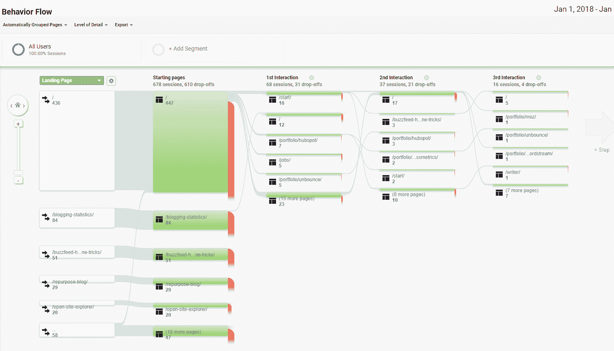
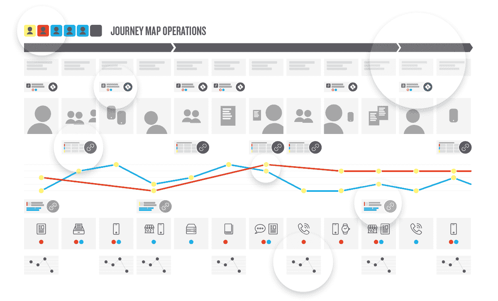
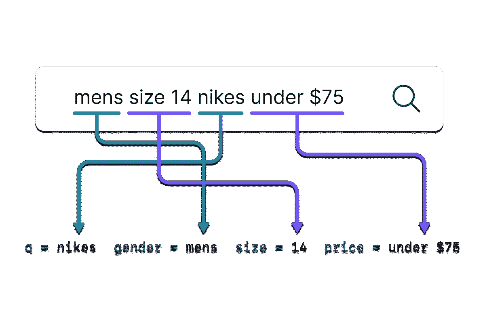

# 提高电子商务转化率的 12 个技巧

> 原文：<https://www.algolia.com/blog/ecommerce/12-tips-to-increase-ecommerce-conversion-rates/>

网上零售是。然而，平均电子商务转换率仍然徘徊在 2-3% 左右，竞争比以往任何时候都更加激烈——从夫妻店直运商到资金雄厚的大型零售商——网站访问者很有可能会放弃你的商店而选择竞争对手。

你平均有 [15 秒](https://www.makerobos.com/topic/ask-an-expert/15-seconds-rule-to-engage-website-visitors) 的时间在客户离开你的电子商务网站之前留住他们。 [大约 30%](https://cxl.com/blog/convert-visitors-improving-internal-site-search/#:~:text=According%20to%20Econsultancy%2C%20up%20to,average%20non%E2%80%93site%20search%20visitor.) 的访问者会使用你的搜索栏找到他们要找的东西，其余的会浏览你的网站。

游客不能购买他们找不到的产品。你可能正好有买家想要的东西，但是他们可能拼错了或者不知道该找哪一类。或者他们只是不知道他们要找的东西的确切名称或描述。

*   如何尽快找到合适的产品？

*   如何针对多个品类和产品线优化用户旅程？

*   面对成百上千的产品，您从哪里开始？

*   在有限的资源和有限的时间内，你能完成多少？

## **现场搜索和发现进行转化率优化**

在本指南中，我们将主要关注两件提高现场电子商务转化率的事情: **搜索** 和 **发现** 。当有人登陆你的网站后，这是关键的几秒钟。

通过 **搜索** ，我们指的是你网站上的搜索框。当用户在查询中键入“queen*matress*fitted bed sheet sale”([50%的查询](https://www.wordstream.com/blog/ws/2019/02/07/google-search-statistics) 有三个或更多的关键字，并且在 [之间的某个地方，10-25%的搜索](https://linguistics.stackexchange.com/questions/35732/what-percentage-of-words-or-queries-are-misspelled-in-search-queries) 被拼错)时，他们会得到好的结果吗？

**发现** 指用户如何按类别或集合浏览网站。你应该先展示最畅销、最高价还是特价商品？畅销商品缺货怎么办？个性化从何而来？智能分类和排序对于访问者是转变还是反弹有很大的影响。

搜索和发现是一枚硬币的两面。支持智能搜索的技术也可以支持智能分类。

让我们来深入了解一下。

## **电商转化率定义**

转化率简单来说就是你的网站上买东西的访问者的百分比。如果你的网站有 100 个访客，有一个人买了东西，你的转化率是 1%。

根据 BigCommerce， [跨行业平均转化率](https://www.bigcommerce.com/blog/conversion-rate-optimization/) 为 1 ~ 2%，2%应该是基准线目标。

虽然本文将重点关注访问者登陆您的网站后的现场漏斗中间转化优化，但请记住，还有场外因素，如广告、季节性、竞争对手活动、广泛的消费者趋势、推荐营销等。，可以在不增加交易率的情况下增加网站的访问量。

*Google Analytics via on*[*客户旅程映射*](https://www.shopify.com/enterprise/customer-journey-map-ecommerce)

## **网上买家的用户旅程**

一个访问者来到你的网站。现在发生了什么？

现场搜索和发现从了解用户旅程开始，帮助您发现改善搜索和产品发现体验的机会。这里有一些方法可以让你深入了解客户的旅程:

*   热图和游客回放

### **分析学**

无论你是在使用谷歌分析还是其他分析工具，这都是一个很好的起点。打开 GA 中的行为下拉列表，分析您站点的以下统计:

*   *访问与站点搜索* ， *，%搜索退出，以及%搜索改进* 报告:大量的站点搜索意味着用户依赖你的搜索栏来完成工作。那很好。然而，如果这三个指标都很高，这可能意味着用户找不到他们想要的东西。这是你网站搜索质量的一个危险信号。

*   *目标完成* 报告 *:* 简单明了地告诉我们，网站搜索是否有助于推动目标完成。如果你的搜索框做得很好，让它更突出，以鼓励更多的访问者搜索。( [来源](https://moz.com/blog/5-actionable-analytics-reports-for-internal-site-search) )

*   *行为流报告* :寻找行为之间的落点和共性之类的趋势——网站访客登陆哪些页面，接下来会去哪里？你可以划分不同的用户类型(例如，新用户和老用户)来发现人们是如何访问你的网站的。

### **热图和访客回放工具**

像[hot jar](https://www.hotjar.com/)或[full story](https://www.fullstory.com/)这样的热点映射和访客回放产品可以向你展示人们如何浏览你的网站，何时放弃网站，他们如何与产品页面互动，他们在每个页面上滚动多远，以及他们点击了什么。

人们是直接去搜索栏还是点击他们看到的第一张产品图片？一次旅行不会揭示太多，但通过几十或几百次记录，你会开始看到趋势并发现需要改进的地方。

### **用户旅程映射**

*形象经由* [*苦旅*](https://www.journeymapoperations.com/)

了解访客行为和决策的综合方法是构建用户旅程图。旅行地图从用户开始，而不是你的网站。定义一个人物角色(例如，两个孩子的 45 岁母亲),并从用户决定寻找产品的那一刻起一直跟踪到购买。

进行旅程规划练习的一大优势是，您的整个团队都参与进来，共同构建见解，并作为一个团队掌控旅程。作为一个团队，你会发现不足和机会，然后优先考虑和计划目标和关键交付物，以弥补任何不足。

关于旅程地图的内容足够填满多本指南。如果您有兴趣了解更多信息，请查看[Shopify](https://www.shopify.com/enterprise/customer-journey-map-ecommerce)和[Qualtrics](https://www.qualtrics.com/uk/experience-management/customer/ecommerce-customer-journey/)关于电子商务旅程地图的文章。

### **神秘顾客**

神秘购物者以改善实体店运营而闻名，但他们也可以受雇进行在线商务评估。你可以雇佣在线神秘购物者来完成一项任务，比如“访问网站，以低于 25 美元的价格购买最好的园艺用品”，并收集他们的体验反馈。

雇佣神秘顾客是一个完整的行业。与专门的神秘购物公司合作的优势是他们在打造购物体验和收集可操作情报方面的深厚知识和专业技能。

然而，如果你已经知道该问什么以及如何设计问题，你甚至可以去 usertesting.com 直接雇人，听听购物者在浏览网页时在做什么。

无论你选择使用分析、热图和访客回放、旅行地图、神秘购物者，还是以上所有方式，你都会有一些好主意，知道应该关注哪些方面来改善产品发现体验。

## **改善电子商务现场搜索和发现的 12 种方法**

## [T14<path fill-rule="evenodd" d="M4 9h1v1H4c-1.5 0-3-1.69-3-3.5S2.55 3 4 3h4c1.45 0 3 1.69 3 3.5 0 1.41-.91 2.72-2 3.25V8.59c.58-.45 1-1.27 1-2.09C10 5.22 8.98 4 8 4H4c-.98 0-2 1.22-2 2.5S3 9 4 9zm9-3h-1v1h1c1 0 2 1.22 2 2.5S13.98 12 13 12H9c-.98 0-2-1.22-2-2.5 0-.83.42-1.64 1-2.09V6.25c-1.09.53-2 1.84-2 3.25C6 11.31 7.55 13 9 13h4c1.45 0 3-1.69 3-3.5S14.5 6 13 6z">T16</path>](#)

以下是一些通过激活机器学习、动态刻面、即时索引等功能来改善访客体验的方法，以提供更好、更智能的结果，实现更一致的转换。

### **使用 AI 获得高质量结果**

在 2019 年和 2022 年，“面具”意味着完全不同的东西。在新冠肺炎之前，搜索“面膜”的买家可能是在寻找化妆产品。随着疫情的出现，这一切都变了。

为每个可能的排列手动调整目录是不切实际的。商家需要自动化来根据消费者行为的变化实时调整结果。这里的关键是机器学习。

机器学习提高了你的电子商务商店根据用户搜索 *和购买* 的内容自动调整搜索结果的能力。

一个智能的搜索引擎应该知道用户何时转换(注册、加入购物车、购买或其他)来为将来的查询和页面浏览增加类似的结果。

*机器学习* 已经不是什么稀罕物了。是必备的，尤其是很多产品的网店。搜索引擎可以使用 *强化学习* 对搜索结果和用户行为进行评分，以随着时间的推移自动改进结果。

(如果你正在寻找机器学习的解决方案，有一点需要注意，人工智能或人工智能这两个术语可以与机器学习互换使用。)

### **实现更好的过滤器和刻面**

研究从 [尼尔森和](https://www.nngroup.com/articles/state-ecommerce-search/) 诺曼已经证实了分面搜索的必要性；当用户面对太多的选择时，他们会忽略他们正在寻找的产品，而去别的地方。方面已经成为网上购物的一个组成部分，可以更快地过滤结果。

允许你的客户根据价格、颜色、评分或其他因素过滤结果是至关重要的——尤其是对于拥有成百上千种产品的网站。您的电子商务搜索和发现平台应该支持搜索结果中的搜索方面和过滤器 *和集合页面上的* ，以帮助客户缩小结果范围，找到他们真正需要的东西。

搜索面和过滤器有什么区别？简而言之:

*   **过滤器** 通常不会随着搜索的不同而改变

*   **刻面** 根据搜索结果中产品的属性而变化

创建丰富的过滤器和方面可能看起来很难，但幸运的是，现代搜索解决方案将使指定和实现它们的任务在几分钟内完成。根据您使用的工具，过滤器和方面可以根据您的产品属性自动生成。

同样值得注意的是，过滤器和方面不仅在搜索结果页面上有用，它们还可以用于类别和收藏页面，以快速缩小结果范围。

### **连接实时数据搜索成功**

点击率(CTR)等参与度指标为微调结果提供了一些价值，但签约、注册或销售等转化指标最终为企业提供了更多价值。

当你将搜索结果与转化率联系起来，并加入机器学习时，你就可以建立一个正反馈循环，从而获得成功。

如果一个访问者搜索一个项目，点击一个产品结果，并购买它，你的搜索解决方案应该建立“啊哈”连接，以自动优先排序相似的搜索结果。

它也可以在分类页面上工作；如果客户不断购买顶部的第三个项目，集合可以重新排列页面上项目的优先级。

### **通过即时索引和更新获得结果**

当您直接在 CMS 中或通过产品库存管理系统(PIM)向您的在线商店添加或编辑产品时，更新定价、更改库存等。，它应该会立即反映在您的搜索索引中。

不幸的是，对于许多搜索引擎来说，这些日常变化可能需要 24 小时或更长时间才能更新。这太长了，可能会伤害转换。

许多解决方案宣传接近实时或快速的索引，但通常这意味着只有 *初始* 索引是快速的(取决于您的目录大小，这可能需要几秒或几分钟)。找到一个提供快速产品信息索引的解决方案。它还应该为产品目录的添加、编辑、更新、删除等提供快速更新功能。，所以你永远不会失去一个机会。

### **提升类目和收藏建议**

你想把最畅销、最受欢迎的商品推到你的分类或收藏页面的顶端。通常，类别和收藏可以按价格、评级、受欢迎程度和其他过滤器进行排序。

这太棒了，但更好的是能够根据商业标准智能地推广产品的规则。

一些例子:

*   您可能想要创建智能规则，按照最畅销、最高评级和特价商品来显示收藏

*   为每位顾客设定个性化产品的规则(更多个性化信息见下文)

*   热门内容也一直在变化，因此规则可以具体到为“过去 7 天该类别中最畅销的项目”排列列表的优先级

### **用于发现的商品销售**

实体店零售商可以设立展示区，鼓励潜在顾客往购物车里添加更多商品。这些商家有很好的机会进行销售或增加订单价值，因为买家可以看到大量的产品选择。

对于电子商务来说，这要复杂得多。如果买家想买返校背包，你如何让他们了解铅笔、活页夹甚至童鞋？

对于大多数在线企业来说，搜索营销很难。传统上，这需要大量的手动工作或一个使用数据科学的工程师团队来发现推广相关产品或显示“您可能也感兴趣”的最佳时间。

好消息是，你可以使用现代的现场搜索解决方案来提高转化率，而不需要投资一个全职的搜索工程团队。使用数据，较新的电子商务平台可以智能地将相关商品插入搜索结果，以提供销售体验。可以根据以这种方式推广产品

*   个性化:过去的购买历史、性别、年龄等。

*   有相似购买习惯的顾客

*   基于类似的竞争对手产品

*   或您指定的其他数据和规则

### **融入实时库存系统**

不要让你的客户因为缺货而放弃你的网站，或者卖给他们一件你无法完成的商品。推荐让他们保持参与的选项。

低库存或脱销商品可以自动降级或从搜索结果或收藏页面中隐藏。

相反，高库存或补货商品可以在搜索结果或收藏页面中增加。这两种情况都需要一个可以连接到库存管理系统的搜索和发现系统。您应该能够根据库存水平设置规则来包含/排除或增加/隐藏项目。

### **个性化并提升内容可见性**

如果你知道顾客过去曾购买过耐克鞋，在他们下次光顾时，你可以推荐更多的耐克产品。个性化的使用可以极大地改善用户体验和转化率。

BigCommerce 发现个性化可以降低 20-30%的跳出率。(典型的零售网站跳出率约为 30-55%)

内置个性化功能和/或连接到 [第三方个性化解决方案](https://dazeinfo.com/2020/10/20/ecommerce-personalisation-success/) 应该是您的必备技术。个性化为单个访问者创建上下文配置文件，以便您可以提供自定义的相关搜索结果和显示内容。基于用户偏好、位置、性别、过去购买历史、产品类别等对结果进行个性化设置。

### **【使用自然语言处理】**

[研究显示](https://www.wordstream.com/blog/ws/2019/02/07/google-search-statistics) 三分之一的搜索包含 4+或更多关键词。在站点搜索的上下文中，NLP 是分析查询以推断结构和含义的过程。在这种情况下，结构指的是高度定义的信息，例如类别或数字。它还可以表示事物之间的关系。常见的例子包括大小、颜色、地点、名称、时间、实体和意图，但还有更多。

如果用户键入“低轮廓床垫床单”或“大号床垫床单”，您的搜索引擎需要解析这些信息以返回高质量的结果。电子商务网站使用 NLP 会影响你的品牌认知、用户体验和转化率。

### **错别字容忍和自动补全**

对于电子商务搜索来说，一个不可见且经常被忽视的 UI 元素是如何处理打字错误和拼写错误。某处 [之间 20-30%的搜索词](https://dl.acm.org/doi/abs/10.1145/1963405.1963425) 可能包含一个拼写错误！

有几种不同的方法来处理错别字和拼写错误。一个好的网站搜索和发现工具会给你提供选择，包括添加“你的意思是？”搜索结果页面中的结果和/或允许输入错误的自动完成。

对某些味道使用错别字容错是一种最佳实践。不要失去那些认为你不卖“bakcpacks”或“addidas”的顾客。

### **页面加载时间**

[亚马逊向](https://www.gigaspaces.com/blog/amazon-found-every-100ms-of-latency-cost-them-1-in-sales/) 展示了返回结果中仅仅 0.001 秒的差异就意味着巨大的损失。您的搜索工具或搜索提供商的加载时间应该以毫秒为单位。

### **A/B 测试提升搜索**

对于一个给定的查询，如果你改变了搜索结果会怎样？你的点击率、转化率、销售额或用户满意度会更好还是更差？A/B 测试可以用数据帮助回答这个问题。

测试可以在任何东西上进行，从产品术语，到你的数据如何被索引，到搜索结果的设计。一个现代的搜索解决方案应该允许搜索 A/B 测试，并根据你建立的任何标准，就什么样的搜索算法帮助你的公司改善其底线结果提供指导。

## **增加电子商务转化率的奖励提示**

我们已经讨论了搜索和发现，但让我们来看看其他一些改善购物者体验的现场机会。这里有一些关于网站可用性和用户体验的额外提示。

### **结账流程**

减少结账过程中的摩擦可以提高转化率。这包括 UX 的变化，如隐藏结帐页面上的附加字段，除非客户需要它们，例如，如果送货地址和帐单地址相同，就没有必要同时显示它们。结账(无双关语) [其他提示](https://rejoiner.com/resources/10-customer-delighting-checkout-usability-techniques/) 摘自 Rejoiner 关于改善结账顾客体验的文章。

### **购物车报废**

以平均 [近 70%的购物车废弃率](https://baymard.com/lists/cart-abandonment-rate) ，难怪商家要花时间优化他们的购物车 UX。关于58%的时间，网购者仅仅是浏览，但那另外 42%应该是为了成功而优化。例如，同一项研究显示，20%的购物者因为设计相关的问题而放弃购物车。这方面的改进，如为客户提供查看订单总成本的方式或提前显示信用卡支付选项，可以积极提高销售额和转换率，并避免可怕的废弃购物车。

### 文案

提供最低的价格、最快的运输或最好的客户服务肯定能提高转化率，但你的竞争对手也能做到。为了脱颖而出，考虑你的产品描述。Moz 解释了公司如何通过更好的文案 使转化率翻倍。更好的产品文案可以增加你的产品的情调和紧迫感，帮助你的公司脱颖而出。

### **移动友好型客户体验**

桌面用户以 [更高的速率](https://www.broadbandsearch.net/blog/mobile-desktop-internet-usage-statistics#post-navigation-2) 进行转换，但是移动用户以 [大约相同的速率](https://www.salecycle.com/blog/stats-en-us/why-are-mobile-conversion-rates-lower-than-desktop/) 向他们的购物车添加商品。如今，在线零售网站的移动流量高达50%。我们上面推荐的所有搜索和发现改进——设置规则、网站速度、即时索引等。—将适用于移动设备和台式机，但零售商需要特别注意为移动设备打造出色的 UX。

### **社交证明和社交媒体**

[人们想买别人喜欢的产品](https://neilpatel.com/blog/ecommerce-conversion-hacks/):92%的潜在买家 [在考虑购买时阅读顾客评论](https://www.bigcommerce.com/blog/customer-testimonials/) 和评价。让顾客评论更加可见，添加带计数器的社交分享按钮，甚至 [显示实时购买](https://actionfeed.co/) 都可以帮助提高转化率。

### **文档索引**

易贝研究 [发表了一篇论文](https://citeseerx.ist.psu.edu/viewdoc/download?doi=10.1.1.648.6208&rep=rep1&type=pdf) 显示“视觉形象是向网上购物者传达关键信息并影响他们选择的强大渠道。”除了在你的产品页面上包括更多的图片(和/或产品视频)之外，研究人员还发现使用更大的照片可以让潜在客户更容易地检查产品的细节。这反过来增加了人们购买该产品的可能性。( [来源](https://www.pixelz.com/blog/more-product-images-lead-to-more-sales) )

### **CTAs**

您在产品和登录页面上的行动号召(CTA)很重要。某些短语——立即购买、免费加入、加入购物车——已被证明比其他短语更有效。大多数零售商已经在使用这些短语了。但是也有其他因素可以改善你的 CTA，包括移动优化、颜色、页面位置等等。查看 [GrowCode 的完整文章](https://www.growcode.com/blog/call-to-action-cta/) 了解更多想法。

### **SEO**

在帮助数以百计的客户安装搜索工具后，我们了解到的最清楚的一点是，大多数网站搜索工具并没有以最佳方式工作，主要是因为元信息不足或网站结构定义不佳。你所做的改善站内搜索的工作也是你需要做好搜索引擎优化(SEO)来吸引访问者访问你的网站。优化的网站结构、元标签、标题、规范等。，对站内搜索和网络搜索引擎都有帮助。整本书都在讲述如何通过搜索引擎优化来为你的网站吸引新客户，但是要想成为一本好的入门书，可以看看 Ahref 的 [电子商务搜索引擎优化指南](https://ahrefs.com/blog/ecommerce-seo/) 。

## **结论**

大多数电子商务平台，如 Shopify、Magento、WooCommerce 和 BigCommerce，都有非常好的设计，用于管理支付、库存和退货的良好工具，以及与大量其他系统的集成。

由于各种原因，‍But 帮助访问者找到他们想要的东西仍然非常困难，尤其是对于有很多产品、类别和收藏的网站。好消息是，新的电子商务搜索和发现平台可以有所帮助。特别是，机器学习的进步使得智能交付产品结果以及自动订购和提升产品以提高转化率变得更加容易。