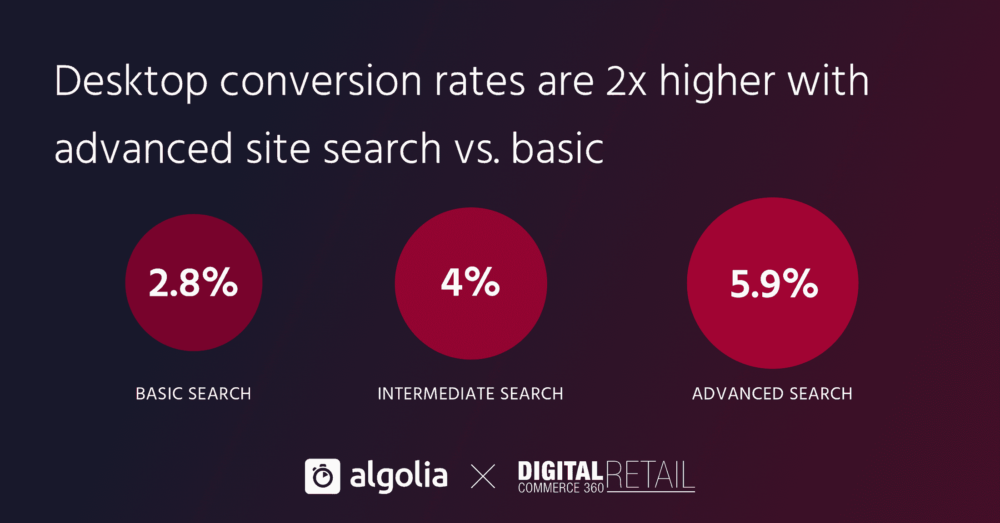
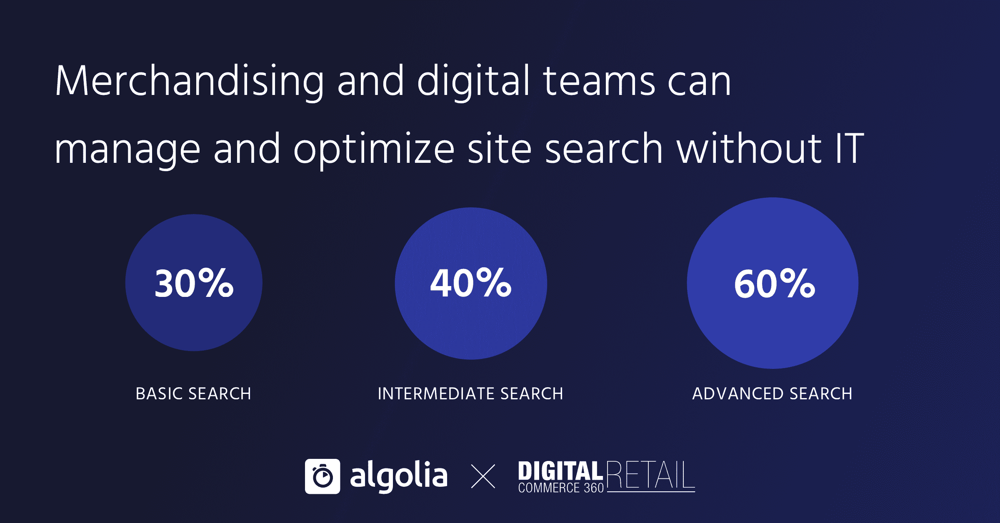

# 网站搜索关键绩效指标的主要发现—2020 年数字商务 360 度调查—Algolia 博客

> 原文：<https://www.algolia.com/blog/ecommerce/2020-survey-site-search-kpis/>

我们第二次与 Digital Commerce 360 合作，调查零售商关于网站搜索对收入和关键绩效指标(如转换率)的影响(上次调查的结果是[此处是](https://resources.algolia.com/reports-2/internet-retailer-survey-kpis-site-search))。

我们要求 108 名受访者将他们的搜索分为高级、中级或初级。当调查结果出来时，最有趣的发现就是围绕着这种分裂。

## 网站搜索提高转化率——如果做对了

我们都知道网站搜索是电子商务购物之旅的重要组成部分。正如我们的一位客户所说:

> 搜索是第一印象的重要指标。关键是要为你的客户提供他们想要的服务。
> 
> —Nicholas Maupin，安德玛全球电子商务产品经理

但今年的调查显示，拥有基本网站搜索的零售公司可能会失去有价值的客户，而高级网站搜索如果做得好，会增加转化率和收入。

也许最惊人的结果是，投资于高级搜索功能的零售商的转化率提高了 50%:

## 这一切都始于 KPI

虽然只有 14%的受访者投资于高级搜索，但他们也是最擅长将人员、策略和专用资源投入到网站搜索中的人，也是获益最多的人。

以下是调查中让高级零售商脱颖而出的一些要点:

*   为商业利益相关者提供管理网站搜索的工具和资源。最了解消费者行为的团队成员获得了监控和优化网站搜索所需的工具，而不是要求忙碌的 IT 团队做出改变。

*   投资于网站搜索功能和策略。最有效的网站搜索体验不仅仅是速度和相关性，它还包括个性化、过滤和分析等功能。
*   定义有意义的站点搜索 KPI。毫不奇怪，拥有高级网站搜索能力的企业最有可能已经确定了他们想要遵循的指标:高度发达的电子商务 KPI 包括那些衡量网站搜索的指标

要了解更多关于零售商如何通过搜索使转化率翻倍的信息，请阅读完整报告:[网站搜索:正确操作时的高转化率投资](https://resources.algolia.com/webinars/how-retailers-double-their-conversions-with-search)。