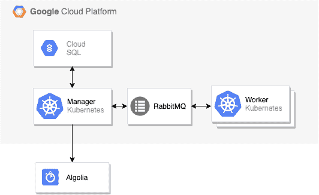
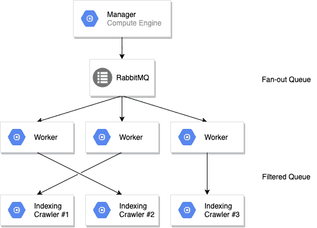
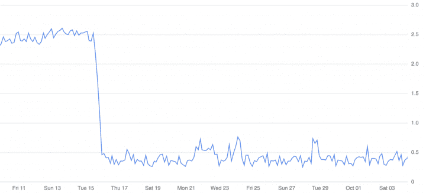
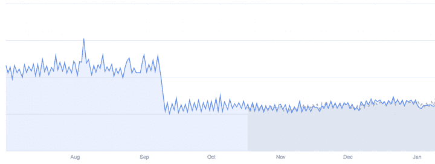
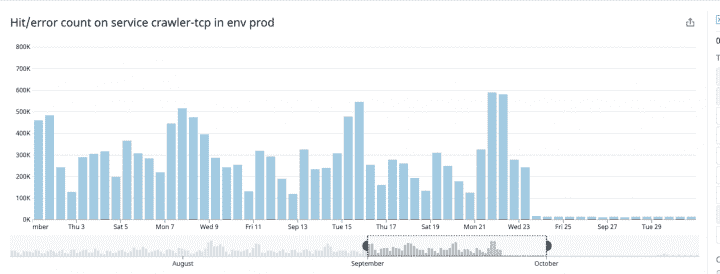
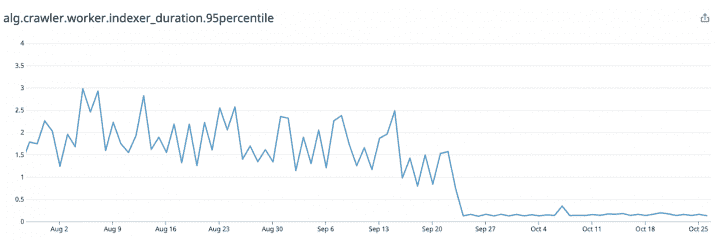
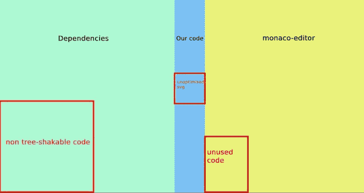
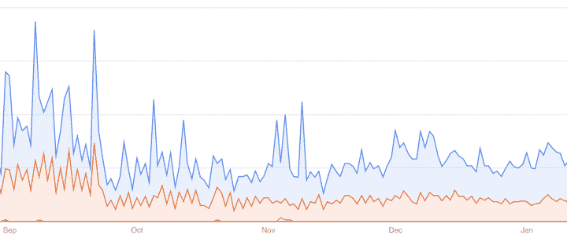
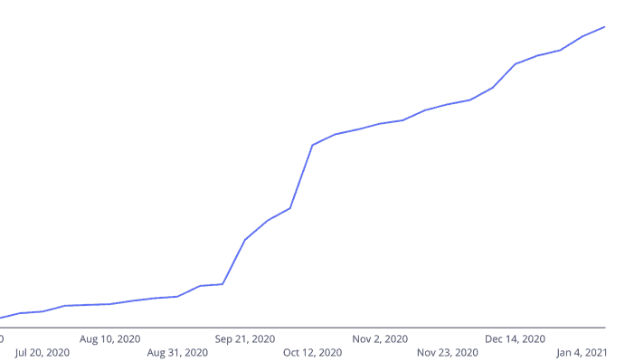

# 30 天将我们的爬虫性能提高 50 %|

> 原文：<https://www.algolia.com/blog/engineering/30-days-to-improve-our-crawler-performance-by-50-percent/>

高性能应用程序的速度与其最慢的组件一样快。这在依赖第三方 API 组件的并行分布式系统中尤其具有挑战性。虽然外部组件可能很快，但组合它们需要仔细的设计、实验和测试，以避免不必要的低效。要实现最低限度的快速性能，但最具竞争力的产品需要远远超过最低限度。

然而，不管一个软件过程有多好，总会有另一个客户带着一个独特的用例出现——你会发现还有更多事情要做。这种情况发生在我们的 Crawler 中，这是一种使用并行和分布式计算架构来抓取大量网站的产品，在运行中提取和构建信息，使每个网站都可以搜索。

这篇文章是关于我们如何分析和改造我们的应用程序爬虫的内部，寻找瓶颈，最小化资源，简化任务等等，以优化这个复杂的并行和分布式软件的处理。

## [](#technical-overview)技术概述

在深入研究之前，先快速浏览一下我们的技术堆栈。

后端完全由 **NodeJS 和**Typescript 提供动力，托管在**【GKE】**(Google Kubernetes 引擎) **云 SQL** 。我们使用 memorystore 进行存储，使用 RabbitMQ 进行队列。

在开始之前，我们使用的是 1 VCPU 和 4GB 内存的小型 N1 机器，主要是因为主要的计算是由我们的工作人员完成的，这些工作人员非常轻便并且可以水平扩展。



Simplified view of our infrastructure

如你所见，这是一个相当标准的架构，由一个经理来安排工作，工作人员的数量随着负载的增加而增加。因为这个基础设施的所有其他部分都是由谷歌管理的，我们认为我们的大多数问题都会出现在管理器中，这是一个 SPOF(单点故障)。

### [](#the-crawler-as-a-distributed-system)将爬虫视为分布式系统

自 2 年多前成立以来，我们的定制爬虫已经成长了很多。从 localhost MVP，到 Heroku，然后是一个[挑战性的 GKE 迁移](https://www.algolia.com/blog/engineering/challenging-migration-heroku-google-kubernetes-engine/)，爬虫的能力已经扩展，我们已经看到企业客户的稳定增长。

一夜之间增长 2 倍并不容易:高度并行的代码和基础设施带来了巨大的挑战。但是也有很多优化的方法。

## [](#identifying-potential-bottlenecks-with-a-stress-test)通过压力测试识别潜在瓶颈

管理一个爬虫不是一件简单的任务。该过程严重依赖于移动和脆弱的组件、队列、数据库存储、网络本身、水平扩展、web 标准等。为了帮助我们完成这项正在进行的任务，我们正在使用数据狗和 GKE 密切监控我们系统的所有部分。一切都是用防御性编程和任何事情都可能在任何给定时间失败的思想构建的。当网络变得不可靠时，或者当我们在后端执行用户定义的 JavaScript 代码时，这被证明是非常有用的。    因此，我们借此机会实施了 **端到端基准测试** ，以便我们能够发现新的罪魁祸首，突出潜在的瓶颈，并规划未来的改进。

为了做到这一点，我们使用了我们的暂存环境，并编写了一个脚本来在很短的时间内创建和触发几千个爬虫。虽然这个数字起初可能看起来不高，但每个爬虫实际上可以同时发现、获取、提取和 索引 **数百万个 URL。**

## [](#failing-fast)衰快

因为我们对这些新功能相当乐观，所以我们一开始就没有计划失败。这当然意味着一切很快就会失败。

我们在开始时学到了非常好的东西，并且很好地提醒我们，偷工减料可能会在多年后伤害到你:我们的 Kubernetes 集群是手动创建的，因此我们的试运行和生产出现了相当大的差异，无论是有意的(为了节省成本)还是无意的。  第一次测试失败，因为集群无法扩展并承担我们当前生产中的负载。所以第一批几乎没用。  然而，这被证明是同步我们的配置并将 Terraform 放回我们的路线图中的好时机。Terraform 有助于编排复杂的基础设施并随意复制，对 Kubernetes 尤其有用，使它成为我们(以及管理一系列服务的每个人)真正的游戏规则改变者。

## [](#failing-hard)不成材难

尽管开局不利，但我们仍然对基础设施的整体稳定性充满信心。但事实证明，这一过程中失败的地方更多。虽然这可能伤害了我们开发人员的感情，但这是最好的。以下是我们失败的原因、我们学到的东西以及我们改进筹码的地方。

### **减少 RabbitMQ 中的队列占用量**

我们集中使用 RabbitMQ 在我们的多区域集群中传输我们的工作。工作人员订阅单个扇出队列，该队列对作业进行负载平衡，GKE 使用这些指标根据负载自动扩展我们的集群。没什么特别的，但它工作得很好，我们对这个非常强大的软件有十足的信心。

然而，当在这些工作器中获取和提取页面时，作业也被发送回不同的索引服务，该服务将作业推送到我们的监控堆栈，并最终到达 Algolia。这个索引步骤是按爬虫分开的，这意味着我们有 N 个客户的 N 个队列。



通过这种设置，我们可以根据负载来扩展工作线程(CPU 最密集的任务),但在这一步之后独立控制每个爬虫，这样我们就可以计算全局范围，而不需要共享内存(例如，索引的全局速率限制、最大 URL、有效负载验证)。

我们几乎不知道大量的空队列会对 RabbitMQ 产生巨大的影响。 **所有队列都在消耗大量内存和 CPU——即使在空闲时** 。在基准测试期间，我们很快达到了一个不合适的上限，这是我们以前认为无法达到的。

幸运的是，我们想到了一个解决方案:使用带有 [**内置 TTL 特性** 的短命队列。](https://www.rabbitmq.com/ttl.html#queue-ttl) 然而，随之而来的第二个问题是:队列配置在创建后不能修改，这个问题在生产中给我们造成了很大的打击，因为在开发过程中，我们总是从头开始重新创建整个队列。  删除旧队列可能需要相当长的时间，因为我们开发人员的目标是聪明地偷懒，我们找到了一个完美的天真解决方案，并将 **爬虫版本放在队列名称** 中。  这样，我们现在每次部署都是从一个“全新的”环境开始，RabbitMQ 只需在几分钟后自动处理旧队列。



The drop in CPU consumption after the TTL was applied.

解决方案:

*   使用非常短的实时队列(15 分钟),即使我们知道我们每天都要处理事情
*   版本队列名，这样你就可以随时丢弃并从头开始重新创建一切

### [](#improving-cost-and-resources-usage-in-kubernetes)**提高 Kubernetes 的成本和资源使用率**

Kubernetes 是一个需要掌握的非常复杂的系统，在爬虫团队中，我们不是基础设施专家。当我们在大约 2 年前进行迁移以实现更好的自动扩展时，我们主要关注的是在保持成本可接受的情况下简单地让事情运转起来。 在进行这些基准测试时，我们意识到小型机器并不适合所有情况。

成本不会线性增加，也就是说，机器越大，成本越低。Kubernetes 总是使用少量的 CPU 和内存，因此****机器越大，占用空间** 就越小。** 

 **总的来说，在迁移之后，我们 **降低了我们的基础成本****浪费了更少的 CPU** **并提高了我们的性能** 仅仅通过改变一些需求。

解决方案:

*   我们迁移到 [E2 高 cpu 成本优化机器](https://cloud.google.com/compute/docs/machine-types) ，没有硬盘
*   我们更改了所有资源要求，以允许 Kubernetes 玩更好的俄罗斯方块游戏(注意:默认情况下，Kubernetes 调度程序不会尝试填满 100%的节点)



Total RAM consumption with a 50% improvement

### **无服务器和可扩展性**

在应用了相同的配置后， **第二个基准测试也很快失败了** 因为我们没有正确地考虑规模。  在 Kubernetes 中，即使你现在“无服务器”，你仍然被捆绑在一个水平扩展策略、磁盘扩展策略、CPU 扩展策略等上..并不是所有的东西都会神奇地扩展，成本通常会随着扩展而扩展——你可能会依赖像 Postgres 或 Redis 这样的托管服务，它们还没有配置为承担巨大的负载。

这意味着配置一切，使其具有更好的最小值、更宽松的最大值、基于托管服务负载的自动扩展，以及无处不在的高可用性(区域或地区性)。

在我们的设置中，这意味着:

*   缩放我们的 [工人用 Datadog 度量](https://www.datadoghq.com/blog/autoscale-kubernetes-datadog/) (本例中为 RabbitMQ 度量)
*   允许我们的 [HPA](https://kubernetes.io/docs/tasks/run-application/horizontal-pod-autoscale/) (水平 Pod 自动缩放器)中有数百名工人，而不是只有几十名(有一个最大值有助于控制成本)
*   在我们位于 GCP 的 [Postgresql 上自动扩展并激活高可用性](https://cloud.google.com/sql/docs/postgres/high-availability)
*   激活我们的[存储库](https://cloud.google.com/memorystore/docs/redis/pricing)上的 HA

尽管 99%的时间负载都是“正常”的，高可用性、区域复制和基准测试——你需要确保你能够处理大峰值——加起来就是初始成本。

在 GCP，这意味着每个月要多花几百美元，如果你有 1:1 分期付款，这个数字还要翻倍。因此，对一切进行良好的测试和配置可能会花费很多，但这是最终让客户满意所要付出的隐性代价。

### [](#decreasing-dns-latency-and-errors-94-perf-increase)**减少 DNS 延迟和错误> 94%的性能提升**

在你遇到问题 之前被 **高度忽视的东西，就是 DNS 栈。通常这是一些不需要进一步优化的低层次的东西。但是一旦你关心网络和** **大规模高性能** 你就会遇到大麻烦。

一旦基础设施得到纠正，基准开始运行，我们就开始监控 Datadog 仪表板中的一切，我们注意到 DNS 问题 **增加** 。在一个非常强大的环境中，GCP 让我们感到非常惊讶，对网站的简单调用都失败了，更糟糕的是，我们的 Algolia 调用也失败了。

错误隐晦，一点帮助都没有，像*【connect EADDRNOTAVAIL 95 . 211 . 230 . 144:443】【getaddrinfo enot found 8j 0 ky 6j 9 fn-1 . algolianet . com】【连接超时】* 。  显然，我们知道 Algolia 已经启动并运行，我们试图在本地重现这个问题，但由于我们个人电脑的限制，这几乎是不可能的。  这些错误只在高负载时出现，在正常使用情况下我们无法重现。

如前所述，这是一个普遍被忽视的话题，所以我们以前自然没有太关注它。但是很明显，我们的 HTTP 堆栈没有得到适当的优化。

经过大量的时间调查我们终于发现了几个不同的问题**:**

 ****第一个修复是通过在所有 HTTP 调用中始终使用`{ family: 4 }`来强制 IPv4** 解析。这个简单的修复极大地提高了我们的解决时间和成功率。

```
http.get({ family: 4, ... }, cb);
```

第二个更大的修正是在整个系统中使用一个共享的 HTTP 代理，只打开一个 TCP 池。这意味着将代理传递给 algoliasearch 客户端，以便进行简单的获取。

```
// agent.ts
export const httpsAgent = new https.Agent({
  keepAlive: true,
  timeout: 60000,
  maxFreeSockets: 2000,
  scheduling: 'fifo',
});

// algolia.ts
import algoliasearch from 'algoliasearch';
import { httpsAgent } from '../http/agent';

export const requester = createNodeHttpRequester({
  httpsAgent,
});
const client = algoliasearch(appId, apiKey, {
    requester,
});
```

关于 Kubernetes 中的 Alpine 映像的**最终修正**是简单地**改变需要它的部署/状态集上的 dnsConfig** 选项。

```
apiVersion: apps/v1
kind: StatefulSet
metadata:
  name: crawler
spec:
  replicas: 1
  template:
      dnsConfig:
        options:
          - name: ndots
            value: '1'
```

在部署了所有这些修补程序后，系统从每天 90 万个 TCP 连接减少到每天仅 1.2 万个。 **少浪费 99%的 CPU，少浪费时间，少浪费金钱。**



TCP connections requested per day

更令人惊讶的是，我们看到索引记录时到达 Algolia 的时间大幅减少， **从平均每次调用 1.5 秒减少到稳定的 0.1 秒**—**性能提升高达 94%。对于我们认为已经足够快的东西来说，这已经很不错了。**



Average duration to saveObjects call to Algolia.

解决方案:

*   重用 HTTP 代理
*   强制 IP v4 解析

## [](#other-improvements)其他改进

### [](#docker-images-size-and-build-time-improvement)**Docker 图片尺寸和构建时间改进**

当我们构建 Docker 映像时，我们通常会与 Docker 文件进行充分的斗争，以避免过度优化，尤其是在构建时间很长的情况下。然而，有很多问题，特别是层、基本映像、文件系统快照等。在这一点上值得研究。

我们在回顾中注意到两件事:

*   我们的形象太大了
*   我们的图像没有正确使用缓存

为什么要在意太慢或者太大的图像？嗯，图像大小增加了 Kubernetes 的产卵时间，因为优化的图像加载更快，所以启动更快。这也意味着更快地构建和推出补丁。所以双赢。T17


为了改善这一点，我们没有复制整个 WORKDIR，而是使用了只先复制 package.json 的简单技巧，安装 deps，然后复制其余的，这样 Docker 就可以在什么都没有改变的情况下缓存 node_modules 文件夹。我们的流程是每周升级一次依赖项，这意味着构建可以在剩下的日子里使用缓存。

```
FROM node:14.15.1-alpine AS base
ENV NODE_ENV production

# Install dependencies
# python make and g++ are needed for native deps
RUN apk add --no-cache bash python make g++

# Setup the app WORKDIR
WORKDIR /app/crawler

# Copy and install dependencies separately from the app's code
# To leverage Docker's cache when no dependency has change
COPY package.json yarn.lock ./
COPY pkg/crawler-manager/package.json pkg/crawler-manager/package.json
[...]

# Install dev dependencies
RUN yarn install --production=false --frozen-lockfile --ignore-optional

# This the rest of the code, no cache at this point
COPY . /app/crawler
```

现在映像仍然太大，因为它包含了构建最终映像所需的所有 node_modules(例如，Typescript、webpack、babel…)，此时 **大约 600mb** 。在 Kubernetes 中创建的每个工人都在绘制这个大图像，因此极大地增加了启动时间。

由于采用了 **多级构建，我们将尺寸缩小了>5 倍。** 在最后加上这个简单的加法，图像 **现在只有大约 100mb** (仍然很大，但是好得多)。

```
FROM node:14.15.1-alpine AS base
ENV NODE_ENV production

# Install dependencies
# python make and g++ are needed for native deps
RUN apk add --no-cache bash python make g++

# Setup the app WORKDIR
WORKDIR /app/crawler

# Copy and install dependencies separately from the app's code
# To leverage Docker's cache when no dependency has change
COPY package.json yarn.lock ./

# Install dev dependencies
RUN yarn install --production=false --frozen-lockfile --ignore-optional

# This the rest of the code, no cache at this point
COPY . /app/crawler

# Build and keep only prod dependencies
RUN true \
  && yarn build \
  && yarn install --production=true --frozen-lockfile --ignore-optional

# Final Image
FROM node:14.15.1-alpine as web
USER node
WORKDIR /app/crawler
COPY --from=base --chown=node:node /app/crawler /app/crawler
EXPOSE 8000
```

### [](#front-end-bundle-size)**前端捆绑尺寸**

你可能认为大规模的性能只涉及到改进后端代码，但是一个缓慢的用户界面在用户心目中意味着一个缓慢的产品。对我们来说，更多的客户预期意味着为更多的人提供静态文件，这意味着大量的捆绑包，这意味着大量的加载时间、糟糕的 UX 和大量的带宽成本。  因此，虽然后端性能是我们的主要关注点，但我们也借此机会开发了前端产品包。关于如何启用树抖动和优化 webpack 捆绑包有很多细节，所以我将简单总结一下我们所做的工作。

多亏了`[web pack-bundle-analyzer](https://www.npmjs.com/package/webpack-bundle-analyzer)`你可以很快拥有你的 Javascript 代码的地图，并找到应该在那里或不在那里的东西。我们发现我们的代码是包大小的 10%,有十几个页面和数百个组件。然而，我们的主要依赖项:React.js、Monaco Editor(也就是 vscode editor)、React Feather、Prettier(与 Monaco 结合使用)等构成了有效负载的主要部分，并不是所有的东西都经过了正确的树抖动和优化。



以下是我们的建议:

*   SVG 会占据相当大的空间；仅仅通过正确压缩它们，我们就节省了将近 500kb
*   " module ":ts config . JSON 中的" esnext "需要启用树抖动
*   有些封装不是树摇动的，但是您可以使用`NormalModuleReplacementPlugin`或`null-loader` 轻松丢弃该部分
*   当你不能减少你的包的大小时，Webpack 块肯定会有所帮助
*   如果使用 nginx，`gzip:on`不足以启用 gzip 压缩，还需要指定`gzip_types`

经过几次调整，我们从 7.6MB (1.8MB gzipped)压缩到 5.9MB (1.2MB gzipped)，因此大小减少了 33%。



Bandwidth cost, with sharp drop at the end of September

## [](#conclusion)结论

我们的爬虫一直以稳定性第一、性能第二为宗旨，因为 **我们相信人们更需要一个可靠的工具** 而不是一个快速失效的工具。然而，我们错过了许多轻松的性能胜利，这些胜利从来没有成为我们的首要任务，因为事情只是在工作。

拥有一个新项目和新方向有助于将这些主题放回路线图中，也有助于我们为我们的产品构建更美好的未来。



Number of running crawlers with Netlify spike at the start of October

我们现在不仅更有信心，而且自修复以来，我们已经增加了我们的负载，我们有信心在未来一年内实现 10 倍的增长——这是由我们增强的技能和对任何并行和分布式系统的特定需求的理解以及实现 50%性能提升的成功推动的。****