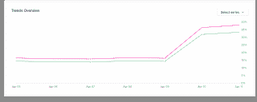
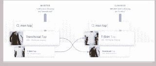
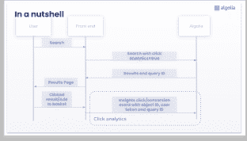
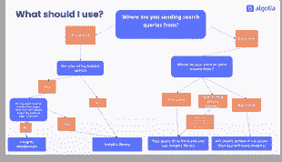

# 增加网站搜索分析点击的 5 个理由(和代码)

> 原文：<https://www.algolia.com/blog/product/5-reasons-to-add-clicks-to-site-search-analytics-and-code-to-do-it/>

用*点击*(和转换事件)捕捉用户行为和意图不应该是事后的想法。你在网上的成功取决于你以直接和即时的方式跟踪和回应用户的能力。这种直接性提供了关于他们意图的无价 **洞察力** 。除了打电话问他们，你最好的选择是将点击分析整合到你的网站搜索分析中。

正如您将在下文中看到的，通过网站搜索分析以及点击和转化数据获得的洞察力构成了更高级和更具竞争力的搜索功能的基础，这些功能让您能够利用您的搜索工具获得乐趣和利润。

好处:实现出奇的简单:在本文中，我们包括了所需的**单行代码**。

## [](#site-search-analytics-click-analytics-and-the-insights-api-why-you-should-read-this-article)站点搜索分析，点击分析，洞察 API:为什么你应该阅读这篇文章

*   了解 **网站搜索分析** 和 **点击分析**的区别
*   了解点击分析对于动态相关性、A/B 测试、推荐和个性化的必要性
*   了解使用我们的 [Insights API](https://www.algolia.com/doc/api-client/methods/insights/) 实现点击分析有多简单

## [](#comparing-site-search-analytics-with-click-analytics)比较网站搜索分析和点击分析

[网站搜索分析](https://www.algolia.com/blog/product/internal-site-search-analysis/) 提供关于用户搜索内容和最常用术语的见解。但是 [搜索分析](https://moz.com/blog/5-actionable-analytics-reports-for-internal-site-search) 对于你的网站来说只是故事的一部分；它错过了用户旅程的很大一部分。

[点击分析](https://www.algolia.com/doc/guides/getting-analytics/search-analytics/advanced-analytics/) 从那里拿起并告诉你你的用户做了什么 *在* 之后他们执行搜索——他们是否点击或查看项目，以及他们是否转换。

## [](#what-is-click-analytics)什么是点击分析？

点击分析 **收集用户搜索时查看和点击的详细数据** ，让您准确了解他们的产品兴趣和行为。在这方面，它类似于[Google Analytics](https://www.lovesdata.com/blog/site-search-setup)，但其用途也不同于 [GA](https://www.foregroundweb.com/google-analytics-site-search-tracking/) 。

点击分析对提高你的 [网站搜索](https://support.google.com/analytics/answer/1012264?hl=en) 至关重要，因为它给你 **关于你的目录的洞察力** ，这是你根本无法通过任何其他方式获得的。它会根据用户购买、添加到购物车、收听或观看的内容生成 **转换率** 。与转换分析一起，它提供并实现了 ML/AI 驱动的功能，如 [个性化](https://www.algolia.com/doc/guides/personalization/what-is-personalization/) ， [A/B 测试](https://www.algolia.com/doc/guides/ab-testing/what-is-ab-testing/) ， [动态重新排名](https://www.algolia.com/doc/guides/algolia-ai/re-ranking/) ，所有这些都使您能够产生与[](https://www.algolia.com/blog/ecommerce/advanced-search-experience-for-e-commerce/)不相上下的消费级搜索体验

**使用 Insights API，您只需一行代码就能实现所有这些。**

## [](#top-5-reasons-to-add-click-analytics-to-your-site-search-analytics)添加点击分析到你的网站搜索分析的 5 大理由

在深入技术细节之前，让我们看看点击分析提供了什么。可以:

### [](#1-view-trends-over-time)1。查看一段时间内的趋势

实现点击分析可以让你 [保持对指标](https://www.algolia.com/doc/guides/sending-events/guides/plan/) 的跟踪，包括点击率(CTR)、转化率、无点击率，所有这些都揭示了用户意图。



*   **高** [**点击率**](https://www.algolia.com/doc/guides/sending-events/guides/plan/) 意味着一个条目被点击的搜索百分比高。它表明客户参与度。

*   **高****[**转换率**](https://www.algolia.com/doc/guides/sending-events/guides/plan/) 意味着某个项目被转换的搜索百分比很高。这表明，用户可以找到他们正在寻找的，他们想转换。**

 ***   ****高** [**无点击率**](https://www.algolia.com/doc/guides/getting-analytics/search-analytics/understand-reports/) 意味着没有产生点击的查询百分比高。它表明，项目可能不再是趋势，或在市场上获得较少的牵引力。**

 **这些指标衡量了你当前的表现，并帮助你迭代和改进你的搜索解决方案。随着网站搜索分析的持续流动，加上点击和转换，当你改变相关性设置时，你会看到这些指标如何随着时间的推移而增长。

### 2。融入“群众的智慧”(有一点人工智能的帮助)

[](https://www.algolia.com/doc/guides/algolia-ai/re-ranking/)——一种基于最近点击调整结果顺序的功能——是点击分析如何直接影响用户搜索和发现体验的显著例子。此功能会对用户最近的行为做出响应，并将您的最佳表现项目推至用户结果的顶部。

例如，如果一个项目出乎意料地出现趋势，动态重新排名会抓住该趋势，并将该项目的位置提升到顶部。流行艺术家的新电影和音乐一发布就自动被送到顶端。季节性和突发性的时尚趋势也得到推动。



### [](#3-enable-a-personalized-search-experience)3。实现个性化搜索体验

当您将 [用户特定信息](https://www.algolia.com/doc/guides/personalization/personalizing-results/) 添加到您的点击和转换事件中时，您可以利用您的分析数据来实现个性化:这是一种广泛使用的功能，可以根据用户对特定方面或类别的个人偏好来提升产品。个性化将特定于用户的上下文添加到查询中，并使转换更有可能。

### [](#4-improve-search-results-and-locate-problem-queries)4。改进搜索结果并定位问题查询

每次查询的点击率和转换率有助于您找到表现不佳的查询。通过 [深入了解您的点击分析](https://www.algolia.com/doc/guides/managing-results/optimize-search-results/improve-relevance-with-analytics/) ，包括点击 *位置* ，您可以准确了解您的用户如何与他们的搜索结果进行交互。这些数据在 Algolia 的仪表板上很容易查看，应该可以帮助您分析特定的查询并优化相关性，或者创建 [规则](https://www.algolia.com/doc/guides/managing-results/rules/rules-overview/) 来提高它们的性能。

### [](#5-test-how-users-interact-with-optimizations)5。测试用户如何与优化互动

除了衡量特定查询的成功，您还可以更改引擎中的设置，并衡量其对整体成功的影响。Algolia 处理一个 [A/B 测试](https://www.algolia.com/doc/guides/ab-testing/what-is-ab-testing/) 的所有变量切换。你要做的就是设置好你想改变什么，改变多久。

持续测试您的相关性可以微调您的解决方案设置，并确保直观的相关性和 个性化策略。

## [](#click-analytics-and-the-insights-api-free-to-use-costly-not-to-use)点击分析和洞察 API:免费使用，昂贵不使用

网站搜索分析和点击分析不是成本与收益的问题。点击分析是免费的。我们的 Insights API 公开了一组简单的方法来捕捉用户的点击；就时间和资源而言，成本可以忽略不计。而且，正如您将看到的，实现起来非常简单。

上述五项关键优势非常巨大，使得点击分析成为每个搜索解决方案的必要组成部分。从用户那里获得关于他们的行为、兴趣和期望的直接而准确的反馈有助于你衡量你的搜索解决方案的成功并提高客户保持率。

## 如何使用 Insights API 实施点击分析【技术🤓]

提前了解实现给定组件的复杂性(或者在这种情况下，简单性)总是有用的。

所以你会很高兴地知道，有了点击分析，你只需要采取一个行动:发送用户 **事件** 到 Algolia。

您可以发送这些事件:

*   点击
*   转换
*   刻面选择
*   页面或产品浏览量

一旦你开始发送这些事件，Algolia 就会完成剩下的工作。

点击分析是关于收集关键用户事件以建立用户活动数据库，然后分析和综合这些数据以得出关于用户行为、需求和偏好的准确见解。

当你有大量的流量时，在很短的时间内，你的分析数据将产生前面讨论过的好处。

### 如何发送事件？我们的 Insights API 的快速概述

很简单，Algolia 需要用户旅程中缺失的部分:当用户从搜索中得到结果时，他们做了什么。

第一步是告诉 Algolia 你将在用户执行查询后发送事件。如下图所示， [Algolia 为每一组结果返回一个`queryID`](https://www.algolia.com/doc/guides/sending-events/guides/queryid/) ，您可以使用它将查询与后续的点击事件关联起来。该图概述了当用户执行查询、查看结果、单击项目并将项目放入购物篮时发生的情况。



要轻松地将这些信息发送到 Algolia，您有许多选择(API 客户端或前端库)。最重要的部分是决定哪一个最适合您的技术堆栈。

### [](#which-library-or-api-do-you-use-to-send-events)你用哪个库或者 API 来发送事件？

Algolia 让发送事件变得尽可能简单，您选择的路线将取决于您的技术能力和您想要做的事情。



您可以根据您是否使用 [即时搜索](https://www.algolia.com/doc/guides/building-search-ui/what-is-instantsearch/js/) 以及您希望从前端还是后端发送事件来决定:

1.  你在前端使用即时搜索
    *   *新增！* 在搜索结果页面使用 [洞察中间件进行事件](https://www.algolia.com/doc/guides/building-search-ui/going-further/send-insights-events/js/#creating-the-insights-middleware) (需要 InstantSearch.js v4.8.3)
    *   使用 [Insights 客户端库处理事件](https://www.algolia.com/doc/guides/sending-events/getting-started/) 和任何其他需要事件的页面，如结账或意愿列表页面，
    *   注意: 我们有普通 JavaScript、React、Angular、Vue、iOS 和 Android 的即时搜索版本。
2.  你是 *不是* 在你的前端使用即时搜索，但是你想从前端发送事件。
3.  你是 *不是* 使用 InstantSearch，你有一个后端实现，你想从前端发送事件
4.  你是 *不是* 使用 InstantSearch，你有一个后端实现，你想从后端发送事件

我们建议您使用 [Algolia 的即时搜索库](https://www.algolia.com/doc/guides/building-search-ui/what-is-instantsearch/js/) ，让即时搜索管理对我们的[Insights API](https://www.algolia.com/doc/api-client/methods/insights/)的调用。也就是说，Insights API 非常简单，只需要一个调用就可以创建点击事件。

## [](#ok-let%e2%80%99s-see-the-code-one-minute-read)好了，我们来看代码(一分钟读完)

那么我们的洞察库是什么样的呢？它如何使实现变得更容易？

下面的标准代码片段说明了您需要的代码。它向 Algolia 的分析引擎发送以下信息:

*   用户令牌
*   查询 ID
*   单击项目的对象 ID
*   项目在结果中的位置
*   事件类型(点击、转化、查看)

### 这是发送点击事件的代码:

```
insights_library('clickedObjectIDsAfterSearch', {
    userToken: 'user-123456',
    eventName: 'Product Clicked',
    index: 'products',
    queryID: 'cba8245617aeace44',
    objectIDs: ['9780545139700'],
    positions: [7],
}); 
```

就是这样。

如需完整代码，您可以将其复制到您的应用程序中，请查看我们的 [发送点击事件文档](https://www.algolia.com/doc/guides/sending-events/getting-started/) 。

对于那些喜欢看现场编码的人，看看我们如何[在 5 分钟内构建一个发送分析事件的应用](https://www.youtube.com/watch?v=G705BxglREc)。

### [](#what-does-this-code-do)这段代码是做什么的？

代码背后的一般思想是发送特定类型的事件。这里，事件是用户在搜索结果上点击 的 **。**

还有其他种类的事件。例如，我们给上面的“点击”事件添加一个“转换”事件:

```
insights_library('convertedObjectIDsAfterSearch', {
    userToken: 'user-123456',
    index: 'products',
    eventName: 'Product Wishlisted',
    queryID: 'cba8245617aeace44',
    objectIDs: ['9780545139700', '9780439785969']
}); 
```

这个发送一个 wishlist **转换** 事件。该函数的参数表明用户向他们的愿望列表添加了两个对象( `9780545139700`和`9780439785969` )。

要获得完整的代码，您可以将其复制到您的应用程序中，请查看我们的 [发送转换事件文档](https://www.algolia.com/doc/guides/sending-events/getting-started/) 。

### [](#what-do-these-events-tell-us-about-the-user%e2%80%99s-journey-and-buying-preferences)这些事件告诉我们用户的旅程和购买偏好是什么？

首先，用户搜索“哈利·波特”。然后做了如下操作:

*   *点击*一个结果(假设“哈利波特，第一册”，用它的`objectID`表示)
*   *将*《哈利波特，第一部》加入他们的愿望清单
*   *改装*另一本书(《哈利波特，第二部》)

你能从这次旅行中学到什么？

*   该用户显示出对儿童物品以及冒险或奇幻书籍的喜爱。您可以使用这些信息来个性化他们的结果。
*   如果许多用户做同样的事情，那么《哈利·波特》应该会出现在搜索结果中更靠前的位置。如果这是一种趋势，并且你已经启用了[动态排名](#dynamic%20ranking)，那么搜索引擎会自动这样做。否则，您可以改进您让[与您的点击事件](#code-to-send-click-event)一起发送的`position`值(该值保存在分析数据库中)。这个例子你发了`positions: [7]`，可能太低了。您可以通过 [提炼和重组您的数据](https://www.algolia.com/doc/guides/sending-and-managing-data/prepare-your-data/#algolia-records) 和/或 [调整您的设置](https://www.algolia.com/doc/guides/managing-results/optimize-search-results/override-search-engine-defaults/#dont-override-engine-defaults-unless-absolutely-necessary) 来提高职位。

### [](#further-reading)延伸阅读

我们的文档很好的解释了 [发送事件](https://www.algolia.com/doc/api-reference/api-methods/send-events/) 的各个参数。他们还展示了其他 11 种语言的代码片段( [PHP](https://www.algolia.com/doc/api-reference/api-methods/clicked-object-ids-after-search/?client=php) ，[JavaScript](https://www.algolia.com/doc/api-reference/api-methods/clicked-object-ids-after-search/?client=javascript)， [， Ruby](https://www.algolia.com/doc/api-reference/api-methods/clicked-object-ids-after-search/?client=ruby) ，[Python](https://www.algolia.com/doc/api-reference/api-methods/clicked-object-ids-after-search/?client=python)， [C#/。NET](https://www.algolia.com/doc/api-reference/api-methods/clicked-object-ids-after-search/?client=csharp) ，[Java](https://www.algolia.com/doc/api-reference/api-methods/clicked-object-ids-after-search/?client=java)，[Swift](https://www.algolia.com/doc/api-reference/api-methods/clicked-object-ids-after-search/?client=swift)，[Android](https://www.algolia.com/doc/api-reference/api-methods/clicked-object-ids-after-search/?client=android)，[Kotlin](https://www.algolia.com/doc/api-reference/api-methods/clicked-object-ids-after-search/?client=kotlin)，[Golang](https://www.algolia.com/doc/api-reference/api-methods/clicked-object-ids-after-search/?client=go)

我们也有很多有用的教程；例如，查看我们的 [点击分析解决方案](https://www.algolia.com/doc/guides/sending-events/getting-started/) 。

## [](#what%e2%80%99s-next%c2%a0)接下来是什么

现在你知道了实施点击分析的五个关键原因。概括地说，它让您:

*   检测点击和转换行为的模式，然后您可以使用这些模式来配置您的设置和重新排序结果
*   检测最近的购买趋势，搜索引擎可以利用这一趋势将表现最佳的商品推至搜索结果的顶部——动态且即时
*   捕捉每个用户独特的搜索和点击活动，针对一组特定的方面或项目类别个性化他们的结果
*   检测并帮助解决低效的搜索体验
*   使用 A/B 测试测试搜索设置

搜索栏可以提供如此多的见解，这仍然有点新奇。或者是？Google Analytics 已经存在一段时间了，它帮助在线企业迭代他们成功的最佳公式..我们已经描述了如何使用点击分析来获得类似的洞察力，

我们的建议:让您的业务和开发团队一起实施[Click Analytics Insights API](https://www.algolia.com/doc/guides/sending-events/getting-started/)。****