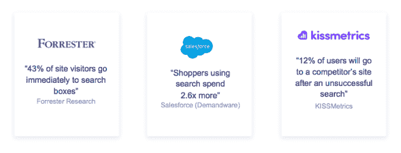
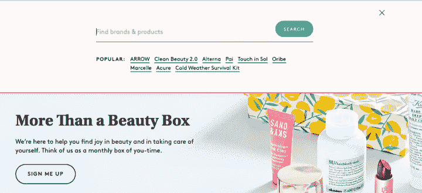
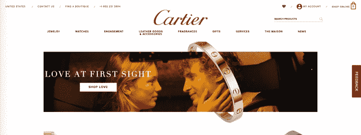
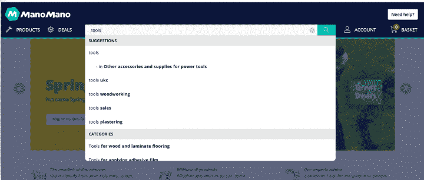
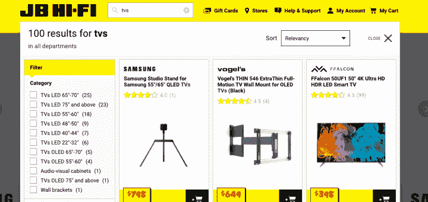
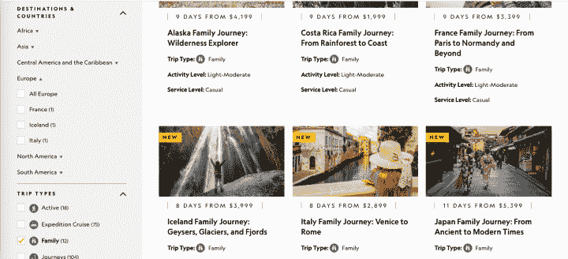
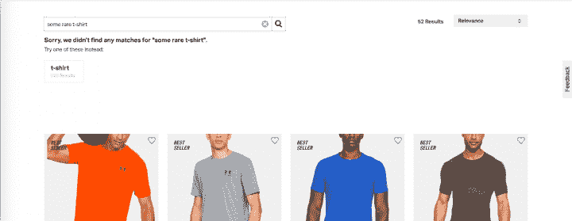

# 7 个伟大的网站搜索用户界面的例子

> 原文：<https://www.algolia.com/blog/ux/7-examples-of-great-site-search-ui/>

伟大的搜索不仅仅是主页上的一个框，你的网站开发者一直坚持要把它包括在内。经过适当的设计和优化，用户界面可以成为一个强大的门户，将您的用户与他们的需求联系起来，甚至是他们尚未发现的需求。一个设计良好的搜索界面是帮助用户保持参与并轻松找到他们想要的东西的好方法。

## 为什么搜索 UI 设计要紧

虽然今天大多数网站都有搜索栏，但许多网站并没有提供全面的搜索体验。 [伟大的搜索超越了搜索栏](https://www.algolia.com/blog/ecommerce/advanced-search-experience-for-e-commerce/) 包括了一系列的功能、结果的相关性和设计。那么，为什么仔细关注你的搜索用户界面很重要呢？

嗯，搜索界面可能是你的用户在你的网站上互动的第一件事。这可能会影响他们对你的产品的印象，他们对你的品牌的认知，以及他们对你的网站的整体体验。只看以下统计:

另外，搜索的用户 [转化](https://neilpatel.com/blog/site-search-killing-your-conversion/) 的可能性比浏览的用户高 200%。如果你的界面很难使用并且提供无用的结果，你的网站就不能从搜索中获益。优化网站搜索的功能和用户界面会让访问者更加满意，并提高转化率、参与度和粘性。

> 相关链接–
> 
> 1.  了解 Algolia 的所有[预建 UI 组件](https://www.algolia.com/developers/search-ui/)。
> 2.  来自 Algolia Code-exchange 的 [UI 启动模板](https://www.algolia.com/developers/code-exchange/frontend-tools/?page=1)。
> 3.  【react、angular、vue 和 mobile 的预建 UI 设计套件。

## 7 恒星搜索 ui 的例子

有许多[搜索 UI](https://www.algolia.com/developers/search-ui/) 组件，您可以对其进行微调，以提供有益且吸引人的体验。搜索栏的设计和功能、搜索结果页面的布局和功能、搜索过滤器和方面等都可以针对您的特定用例进行优化。让我们来看看 8 个定制了搜索用户界面来为用户提供最佳服务的网站。

### 1。with microcopy 的有用提示和建议

[Microcopy](https://uxdesign.cc/the-magic-of-microcopy-a56c5decbe1f)是网站上帮助用户导航和使用界面的简短而有用的文本的术语。通过确保用户理解不同搜索组件的意图，Microcopy 提高了网站的可用性。

[birch box](https://www.birchbox.com/)使用搜索栏中的 microcopy 向用户传达搜索品牌和产品都会得到结果。该网站还在搜索栏下方使用 microcopy 搜索建议。通过在顾客很难错过的地方突出目标品牌，这可能是公司推动业务目标的一种战略方式。

注—[创建动画占位符文本的开发人员指南](https://www.algolia.com/doc/guides/solutions/ecommerce/search/autocomplete/animated-placeholder/)。

### 2。卡地亚—一致的搜索栏位置

对于某些网站，导航是突出产品的主要方式。即便如此，搜索也不应该被忽视。虽然搜索可能在位置和样式上不太受重视，就像在 [卡地亚](https://www.cartier.com/) 的网站上一样，但将搜索栏放在用户习惯找到它的地方仍然很重要。卡地亚的搜索栏很小，对比度极低，但不管是哪一页，都可以在右上角找到，就在用户期望找到的地方:

### 3。ManoMano —自动完成或查询建议

[自动完成](https://www.algolia.com/blog/ux/autocomplete-how-search-suggestions-increase-conversions/) 或 [查询建议](https://www.algolia.com/blog/product/introducing-query-suggestions-better-autocomplete/) ，也称为预测搜索或自动建议，是在用户键入时实时给出的搜索建议。这些建议与用户的查询和/或网站上的热门查询上下文相关，旨在通过加快搜索过程和增加点击率来满足用户的需求。当用户在 [的搜索栏中键入 ManoMano](https://www.manomano.co.uk/) 时，他们会得到具体的产品建议以及更广泛的类别建议。为了帮助用户快速选择最适合他们的选项，建议之间的差异以粗体显示。

注—[创建预测性搜索建议的开发者指南](https://www.algolia.com/doc/guides/solutions/ecommerce/search/autocomplete/predictive-search-suggestions/)。

### 4。JB Hi-Fi —从搜索栏进行即时过滤

[搜索过滤器和方面](https://www.algolia.com/blog/ux/filters-vs-facets-in-site-search/) 帮助用户在浏览你的网站时提炼他们的意图。方面过滤器，通常显示在搜索页面上， [帮助用户使用预定义的类别缩小搜索范围](https://www.algolia.com/blog/ux/faceted-search-and-navigation/) 。这对于大型目录或产品具有许多不同属性的目录非常有用。为了指导用户，JB Hi-Fi 利用搜索栏下拉菜单来利用 facets。当客户搜索大类别的商品(如电视)时，会出现过滤器类别，帮助用户从搜索体验的开始就指定他们的搜索。

注—[为电子商务商店创建自动选择方面的开发人员指南](https://www.algolia.com/doc/guides/solutions/ecommerce/filtering-and-navigation/tutorials/auto-selected-facets/)。

### 5。Birchbox —联合搜索的综合结果

通过 [联合搜索](https://www.algolia.com/blog/ux/what-is-federated-search/) ，您可以在一个易于使用的界面中为用户提供多样化的结果，如产品、文档、产品指南、文章等。这为公司带来了 [诸多好处](https://www.algolia.com/blog/product/federated-search-benefits-and-challenges/) ，包括更好的客户参与度和更高的转化率。

只需在[birch box](https://birchbox.fr/)网站上敲几下键盘，顾客就能看到相关的产品、顶级品牌、有用的类别和相关的文章。这创造了更全面的搜索体验，可以大大减少搜索时间。联合搜索还可以加强客户对品牌的感知，因为策展背后的思想水平对用户来说是显而易见的。

注—[开发人员使用联邦搜索创建自动完成体验的指南](https://www.algolia.com/doc/guides/solutions/ecommerce/search/autocomplete/federated-search/)。

### 6。国家地理探险——动态浏览体验的方方面面

虽然 facets 可以很好地缩小搜索结果的范围，但它们也为探索性的导航体验提供了强大的基础。 [【国家地理探险队】](https://www.nationalgeographic.com/expeditions/) 利用 facets 提供独特的浏览体验，引导用户浏览内容，无需搜索栏。在 expeditions 主页上，用户可以根据目的地、旅行类型和出发月份来搜索旅行。

在结果页面上，他们可以根据价格、行程长度、兴趣等方面进一步细化搜索。这些方面很容易调整，不需要用户从头开始搜索。所有这些都可以在用户不需要在搜索栏中输入的情况下完成。最终，你的搜索用户界面应该以一种最符合你的用户需求和你想要为他们策划的体验的方式来设计。

### 7。安德玛——有用的“没有结果”页面

一般来说，“没有结果”的页面都是 [UX 死角，可以通过优化你的搜索来避免](https://www.algolia.com/blog/product/avoid-no-results-pages/) 。不过，有时用户会搜索与你的网站无关的产品或内容，或者他们会键入无法理解的搜索查询，而 [系统无法恢复这些查询。当这种情况发生时，为用户提供一条快速返回到他们的搜索和发现过程的途径是很重要的。](https://support.algolia.com/hc/en-us/articles/4406975253649-How-does-Algolia-handle-typing-mistakes-)

在 [安德玛](https://www.underarmour.com/en-us) 的网站上，如果出现这种情况，会向用户显示与其原始查询相关的搜索推荐以及具体的产品推荐。虽然他们最初的查询可能不成功，但搜索巧妙地引导他们发现他们可能感兴趣的新东西

## 设计一个搜索 UI，平稳地引导用户找到他们的需求

设计搜索 UI 时，必须考虑用户旅程和探索过程的每一步。为了提供您的用户期望的服务级别，您需要一个 [搜索即服务](https://www.algolia.com/products/search-and-discovery/hosted-search-api/) 合作伙伴，帮助您以灵活和可定制的方式提供所有行业标准功能。阅读我们的电子书“ [超越框框的搜索](https://resources.algolia.com/ebooks/search-beyond-the-box-ecommerce-version) ”来学习如何开始为你的用户构建一个伟大的搜索设计。

> 相关链接–
> 
> 1.  了解来自 Algolia 的所有[预建 UI 组件](https://www.algolia.com/developers/search-ui/)。
> 2.  来自 Algolia Code-exchange 的 [UI 启动模板](https://www.algolia.com/developers/code-exchange/frontend-tools/?page=1)。
> 3.  [react、angular、vue 和 mobile 的预建 UI 设计套件](https://www.algolia.com/doc/guides/building-search-ui/resources/ui-kit/js/)。