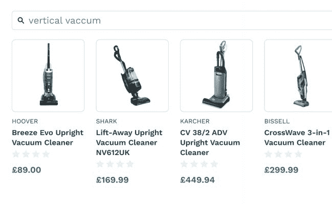
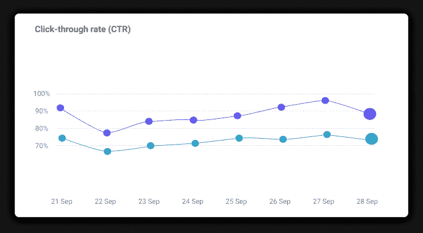

# [8 个技巧]如何使用数据驱动的搜索和发现增加收入- Algolia 博客

> 原文：<https://www.algolia.com/blog/ecommerce/8-tips-how-to-grow-revenue-using-data-driven-search-and-discovery/>

头条新闻告诉我们衰退仍在持续，但这并不意味着你的零售业务只能听天由命。有创新的方法可以从每一次客户互动中获得更多。这就是人工智能和数据驱动方法可以发挥作用的地方。在本文中，我将分享 8 个使用数据驱动的站点搜索和发现来提高底线的例子。

## 把最大的卖家推上榜首

你想最大限度地提高人们每次购物的机会。一种方法是在每个类别和每个网站搜索中推广最好的商品。

像 Algolia 这样的搜索引擎会自动为你的现场搜索和现场收藏完成这项工作。无论访问者是使用你的网站搜索还是仅仅浏览，Algolia 都可以使用滑动 30 天的数据，每 24 小时动态地重新排列项目。

[动态重新排名](https://www.algolia.com/doc/guides/algolia-ai/re-ranking/) 根据点击、购买、注册或其他积极信号等事件调整结果 。随着时间的推移，它会自动将最好的项目推至顶部。您可以设置动态重新排名，然后忘记它——它会自动完成它的任务——或者您可以在仪表板中预览结果，以准确了解产品结果是如何受到影响的。

## 给高毛利物品搭车

在经济衰退期间，每一分钱都很重要。动态重新排名给你一个增加销售和收入的好机会。你可以通过提高高利润的商品来更进一步。

通过连接你的后端数据和元数据，例如你的批发价和零售价，你可以“告诉”Algolia 哪些商品的利润最高，然后推广这些商品。

这是用 [自定义排位](https://www.algolia.com/doc/guides/managing-results/must-do/custom-ranking/how-to/configure-custom-ranking/) 完成的。它使您能够控制对您的业务最重要的行为和属性，如库存、利润、退货和您正在索引的任何其他内容。

假设你有两个同品类的商品表现很好，转化率几乎一样。然而，一个项目比另一个项目有更好的利润。随着可定制的排名，你可以给它一个凸起。

这些规则将贯穿你的整个目录，因此每一个利润大、受欢迎的产品在排名中都会被提升。你不仅给了自己一个更好的转化机会，而且提高了你的利润！

## 那你目录里的另外 80%呢？

我们刚刚谈到关注最畅销和利润最大的商品，但这并不意味着你目录中的其他商品都是累赘。虽然帕累托原则认为网上卖家的大部分利润仅来自其产品的 20%，但其余 80%仍有价值。

通常情况下，长尾关键词和短语非常具体，可能比“头部”术语(目录中前 20%的术语)还要长。虽然您的团队可能没有时间来优化这些关键字，但 Algolia 引擎可以。我们的 [即将推出的混合搜索引擎](https://www.algolia.com/about/news/algolia-disrupts-market-with-search-io-acquisition-ushering-in-a-new-era-of-search-and-discovery/) 使用数据来理解概念，纠正常见的拼写错误，并知道您的目录中哪些产品最相关。

在上面的截图例子中，有人键入了“垂直真空”。他们的意思是“直立的 *真空的* ”尽管有错误的术语和拼写错误，搜索引擎还是返回了正确的产品。在查询中添加“best”这样的概念，Algolia 将返回最畅销或高评级的真空吸尘器。

你可以用传统的关键词搜索引擎做到这一点，但这需要编写大量的规则和同义词，并创建其他“技巧”,如关键词填充，才能让它工作。你 *也许* 有时间为你目录中的前 20%做这件事。人工智能可以为你的 100%的目录自动完成，所以你可以最大限度地利用每一个机会。

## 提高建议增加购物车订单值

一项研究表明，产品推荐占亚马逊总收入的 [高达 35%](https://www.mckinsey.com/industries/retail/our-insights/how-retailers-can-keep-up-with-consumers) 。个性化网站的商家可以促进销售。这不仅仅是零售商想要的东西； [56%的网购者](https://www.intelliverse.com/blog/the-power-of-personalized-product-recommendations/) 更有可能重游一个有更好推荐的网站。

有不同种类的推荐，也有不同的使用数据进行推荐的方式。一些包括:

*   **趋势** :建议其他流行的、与搜索相关的项目，就像你的客户所做的那样。
*   **:人们希望购买数量最多、评分最好的产品。**
***   **个性化** :基于你上次购买的东西、浏览历史、位置或其他因素，我们推荐这些其他产品。我们将在下一节详细讨论这一点。**

 **虽然还有其他推荐类型(例如，员工选择的产品)，但通过使用数据，您可以快速增强和改善结果，因此您更有可能推荐实际转化最佳的产品。

使用 [阿果推荐](https://www.algolia.com/products/recommendations/) ，Gymshark 看到了一个 [在结果](https://www.algolia.com/blog/product/how-algolia-recommend-can-increase-basket-sizes-and-values-and-build-customer-loyalty/) :

*   在黑色星期五，新用户的订单率增加了 150%，而“添加到购物车”率增加了 32%
*   回头客的订单率和“加入购物车”率分别提高了 13%和 10%
*   每用户 1.4 次点击，而之前的解决方案为 1.1 次

## 个性化，个性化，个性化

世界上最成功的电子商务公司都明白 [个性化](https://www.algolia.com/products/search-and-discovery/personalization/) 对于改善客户体验和推动现场转化的力量。

使用高级个性化的公司 [报告](https://www.clickz.com/roi-advanced-personalization/255692/) 每花费 1 美元可获得 20 美元的回报。消费者也想要个性化的体验: [91%的消费者](https://www.accenture.com/_acnmedia/PDF-77/Accenture-Pulse-Survey.pdf) 表示，他们更有可能购买包含相关优惠、信息和推荐的品牌。

无论你只是在自己的网站上销售，还是采用全渠道销售方式，你个性化所需的数据都在那里。它存在于您的客户数据平台(CDP)、会员管理或数据仓库中，包括如下信息:

*   最近查看或购买的产品
*   年龄、性别、会员身份、地理位置等。
*   颜色和品牌偏好
*   点击的广告和横幅

所有这些信息都可以用来为每个用户的 [个性化搜索和浏览](https://www.algolia.com/doc/guides/personalization/going-to-production/in-depth/implementation-checklist/) 结果。在 Algolia 中，这是一个识别你想要用于个性化的属性，对行为(浏览、点击、转化等)进行分类和加权的问题。)，并启用个性化令牌。您甚至可以对个性化进行 A/B 测试，以确定哪种配置效果最好。实时预览显示任何查询的结果可能如何变化。借助个性化数据，您可以快速改善结果以赢得业务。

## 提升最不可能被退回的项目

很可能最受欢迎的产品最不可能被退回。但是为了以防万一，为了最小化人们购买他们可能会退回的产品的可能性，你可以添加一个规则。

如果您已经将 Algolia 与您的 PIM、库存、运输、退货管理或类似后端系统连接，您可以确定哪些产品最有可能被退回，并将该信息添加为自定义排名属性。在这种情况下，您会希望减少这些项目之一显示在结果中的机会。

## 数据驱动的商品销售

说到商品推销，你通常是在给定的时间范围内推销特定的产品。例如，您的年终销售可能从 10 月持续到 12 月。借助数据驱动的商品销售 ，您可以创建一个规则来自动促销所有在售或库存较高的产品。

此外，动态排名、推荐和个性化功能仍然适用。您可能只是在促销目录的一个子集，比如打折商品，但是在这个子集内，您仍然可以推行相同的数据驱动规则。

## A/B 测试你的搜索算法

那么，你应该从这七个想法中的哪一个开始呢？商品销售？个性化？高利润提升还是更好的推荐？

实际上，这些变化的某种组合可能比任何单一变化更能改善结果。这就是 [A/B 拆分测试](https://www.algolia.com/doc/guides/ab-testing/what-is-ab-testing/how-to/create-and-run-an-ab-test/) 可以帮忙的地方。你可能认为 A/B 测试是为你的 CTA 按钮挑选最好的颜色。事实上，它也可以用来测试你的站内搜索算法，以确定哪一个驱动更多的销售。

根据点击量和转化率来衡量，搜索结果有数百种排列方式，可能会导致不同的结果。通过调整搜索结果的显示方式或显示顺序，你可以影响搜索效率、访问者满意度，甚至网站转化率。

让数据引导你做出正确的选择。

## 保持人数持平的同时

艰难的时刻可能就在前方，但这并不意味着你需要放弃希望。数据驱动的方法有助于在每次访问中释放收入。

这是否意味着你需要雇佣更多的人来帮忙？绝对不行。但是，你需要合适的工具。我们设计了 Algolia，这样任何人都可以调整他们的现场搜索和浏览算法的结果。不需要额外的人数！**