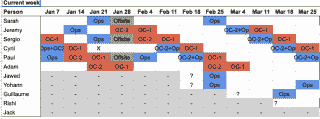

# SRE 之旅-阿尔戈利亚博客|阿尔戈利亚博客

> 原文：<https://www.algolia.com/blog/engineering/a-journey-into-sre/>

站点可靠性工程师(SREs)设计并管理高效的流程和操作，他们保持公司基础设施的健康运行。

在 Algolia，我们的团队在不到两年的时间里从 4 人发展到了 10 人，这一增长速度与整个公司相当。该团队不仅在人数上有所增长，而且在我们如何一起工作和创建良好的运营流程方面也有所增长。

本博客讲述的是一群勤劳的个人，凭借独特的技能和工作方法，成功创建了一个成功的【SRE】*团队* 。

我自己在 SRE 领域的经历反映了这一成熟过程。在我加入 Algolia 之前，我作为一名电信公司的集成工程师周游世界。在不止一个场合，我找到了构建小工具的机会，这些小工具帮助我提高了工作效率。这增加了我在职业上更进一步的信心。从那时起，我开始探究什么是 SRE。以下是谷歌副总裁本·特雷纳对 SREs 的评论:

> *SRE 是当一个软件工程师被分配* *过去被称为运营的任务时发生的事情。*

虽然从技术上讲，我不是软件工程师，但我的职业生涯遵循着同样的模式:编写代码来管理运营任务。因此，我对 SRE 这个角色感到兴奋，并准备好了改变。

# **SREs 在 Algolia 做什么**

SRE 团队的每个成员都参与了这三项活动:

*   项目
*   操作
*   随叫随到

项目我们从事不同种类的项目。其中一些对业务有直接影响，另一些有助于改善全球基础设施。

**运营:** 我们的大部分基础设施都是裸机，这意味着我们需要相当多的自动化和安装/破坏/修复服务器的工作。我们需要调试实时应用程序，并支持其他团队寻求技术建议。最重要的是，我们必须联系提供商来处理提供商的任何问题。

随叫随到:我们需要为整个基础设施提供支持。这意味着我们每个人都必须每周 7 天、每周 4 天、每天 24 小时随叫随到。

## 会议

每周一我们都会开一个一小时的会，回顾上周并计划本周。我们谈谈:

*   待命问题
*   操作
*   项目状态
*   个人目标和计划

## 作战

随着时间的推移，Algolia 的运营也发生了变化。例如，当我加入时，操作是每天进行的，这使得我很难深入了解已经完成了哪些任务。我们的 *黄金法则* 关于优先权是

*   首先响应客户
*   内部回答关于时差的问题
*   解决突发事件
*   供应基础设施

现在每周进行一次操作。你可以看到下面的轮换计划。除此之外，我们还有两个级别的随叫随到。最后，随叫随到不应该与我们的正常操作有什么不同。总的来说，运营不仅仅是维护和改善我们的基础设施。

# **我们如何作为一个团队工作**

## 通讯

我在 Algolia 的第一天，我马上注意到我的同事们主要通过 Slack 交流，即使他们彼此之间只有几米远。这感觉有点冷，特别是考虑到我天生喜欢站起来和人说话。此外，团队分散在办公室各处。它不像是一个有凝聚力的单位。由于这些原因，交流很困难。

有趣的是，我不是唯一一个有这种经历的人。新来的人也注意到了同样的问题。

## 来者

临界质量可能将我们推向了正确的方向:有太多的任务需要我们像以前一样继续工作。我们的第一步是为每个成员设定期望，这样每个人都会提前知道他们能从彼此身上得到什么。

> 新人给团队带来了老成员意想不到的好处和品质。此外，如果他们对此持开放态度，老成员实际上可以向新成员学习，并让这些新人/新品质将团队变得更好。新老的正确结合是一个团队伟大的原因。

我们采取的一项举措是创造一种每周两天的工间休息文化。在这些休息时间，我们谈论不同的事情，工作或与工作无关的。我们互相了解，更好地交流。

# **结对创建团队**

最初，团队中的每个成员都在各自指定的项目中工作，为自己选择他们想要研究的主题。这种自主性和个人主动性并不是那么糟糕，但对于一个新人来说，这是压倒性的；它迫使我经常切换齿轮:学习 *和* 做我的日常支持想出项目点子 *和* 完成它们，全靠我自己。

因为我们在成长，我们很快意识到我们需要改变这种状况，我们需要开始合作。第一步是做一些配对，两人一组。这给了我们一个与团队其他成员互动和认识的机会。

## **三个项目**

### **1–逆向工程一个金库/领事服务器**

在这个项目中，Paul 和我致力于了解当前的部署是如何工作的，我们如何在灾难情况下进行恢复，以及恢复需要多长时间。

这个项目花了两个星期。一旦我们完成了，我们可以选择换搭档或者继续合作。在这两周结束时，我们有:

*   深入了解项目
*   自动化部署
*   复制数据

### **2–负载均衡器知识分享**

接下来的两周，我继续与 Paul 一起工作，深入了解新的负载平衡器。如果你还没有读过他关于[一年负载均衡](https://www.algolia.com/blog/engineering/one-year-load-balancing/)的博文，我建议你去看看。

我们发现的主要问题是，在运营或待命期间，任何关于负载平衡器的请求都必须转发给 Paul。这种知识共享有两个好处:首先，它向不止一个人提供见解；其次，它从拥有所有知识的人身上卸下任务。

最近，一名新成员加入了 Algolia，开始全职从事负载平衡器的工作。对负载均衡器的专门支持不仅为新成员提供了更多的操作技能，还为团队提供了更多的咨询对象。

### **3–备用方案**

在这个项目中，基础小组的三名成员共同合作提出了一个新的备份解决方案。有趣的是，我们决定开始使用 Scrum 方法论。这是一个巨大的成功，因为它让我们:

*   在更复杂的任务中定义小任务，这样我们三个人会在某个时候一起工作。
*   建立一个时间估计，这有助于我们预见项目的进展情况。
*   自动分配任务。这对我来说是最好的部分，一旦我完成了我必须做的事情，就可以开始做其他的事情。
*   由于我们几乎参与了所有部分的工作，因此对项目有了更大的了解。

# **旅程继续..**

我们的努力非常成功，我们的团队变得非常稳定，以至于我重新审视了我刚开始时遇到的原始“问题”:过度使用 Slack 和分散的团队没有坐在一起。今天，这不是一个问题:我们经常使用 Slack，然而谈话感觉自然而直接。我可以每天坐在不同的地板或桌子上，轻松地与我的团队合作——因为我知道我团队中的人是如何工作的。这就是一个伟大的 SRE 体验的组成部分:有效的沟通，高效的流程。