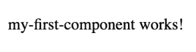

# 在你的网站上添加一个角搜索框

> 原文：<https://www.algolia.com/blog/algolia/add-angular-search-to-your-website-your-website/>

一个好的搜索可以决定你的网站或应用的成败。自行开发一个复杂的搜索 UI，根据您的特定需求进行定制，可能是一个令人生畏的挑战。在这篇文章中，我们将展示 Angular 的基于组件的架构是如何帮助我们的。如果你已经用 Angular 建立了你的网站，你会想继续读下去，看看如何快速实现一个 [Angular 搜索框](https://www.algolia.com/developers/web-instantsearch-angular/)。

## [](#why-angular)为什么有棱角？

首先，让我们讨论一下你是否在使用 Angular 来构建你的网站。如果你已经是了，那太好了！你可能已经知道它能提供的许多好处。如果你不是，让我们来谈谈 Angular 能做什么，以及为什么它可能是你构建网站 UI 特性的一个好选择。

Angular 是 Google 开发的一种基于打字稿的语言。有了这种强大的支持，再加上一个充满活力的[社区](https://github.com/angular/angular#community)，它应该拥有在未来几年保持相关性所需的资源。Angular 越来越受欢迎，数百万使用它的人组成了一个热情的社区。在这个社区和 Google 文档之间，你不会缺少帮助。

Angular 对于构建动态 web 应用程序很有用。你可以用 Angular 创建一个单页应用程序，这意味着你的网站不需要不断刷新就可以响应用户。它也是为速度而生。这种情况可能超出了本文的范围(这是由于它的渲染器)，但无论如何，期待您的 web 应用程序加载有一定的乐趣。

Angular 的一个关键特点是它的模块化设计。Angular 应用程序由独立的[组件](https://angular.io/guide/component-overview)构建而成。这种基于组件的架构在构建复杂的 web 应用程序时非常有用，可以防止您的代码变得混乱。

哦，那些组件也可以来自第三方！结合前面提到的强大社区，这意味着 Angular 很可能拥有您需要的工具。现在让我们更深入地了解这些工具。

## [](#setting-up-your-angular-app)设置你的 Angular app

如果你之前没有使用过 Angular，你可以很容易地站起来跑步。首先需要的是使用框架的方法。Angular 的另一个备受青睐的地方是它强大的[命令界面](https://www.npmjs.com/package/@angular/cli)。它基本上可以处理任何你想要它做的任务。安装起来也很容易:

```
npm install -g @angular/cli

```

你可以用 Angular 同样快速地创建一个网络应用程序。安装 Angular CLI 时，可以使用`ng`调用它。在本例中，我们将创建一个名为“我的第一个应用程序”的 web 应用程序:

```
ng new my-first-app
```

通过该 CLI，还可以方便地在本地提供应用程序。只需更改到由 CLI 创建的应用程序目录中，然后运行`ng serve`命令:

```
cd my-first-app
ng serve
```

`ng serve`为您处理应用程序的构建和发布。默认模板甚至会将您指向文档，并提供一些有用的提示！有角度构建的应用程序有三个重要文件(当然，这是一个简化):

*   `app.component.css`
*   `app.component.html`
*   `App.component.ts`
*   `app.module.ts`

在探索 Angular 过程时，您将使用其他文件，但这些文件中的内容在查看网页时最为明显。

## [](#angular%e2%80%99s-components-%e2%80%94-making-your-app-dynamic)棱角分明的组件——让你的应用充满活力

那么，如何实现组件呢？如前所述，这些是 web 应用程序的构造块。虽然您可以手动创建组件，但 CLI 是更快的选项:

```
ng generate component my-first-component
```

此命令将创建您需要的所有文件。这些文件类似于上面列出的应用程序文件，但只针对组件。这意味着您可以真正对特定组件中发生的事情进行精细、独立的控制。组件被`@Component`装饰器中的`selector`语句引用。默认值是组件的名称，正如我们在生成的`my-first-component.component.ts`文件中看到的:

```
@Component({
  selector: 'app-my-first-component',
  templateUrl: './my-first-component.component.html',
  styleUrls: ['./my-first-component.component.css']
})

```

我们还可以看到，相同的命名约定适用于组件的 HTML 和 CSS 文件。这又一次指向了角度的模块化；这些文件有目的地与您的 web 应用程序的其余部分分开，并在您构建 web 应用程序时引用。这当然很容易想象出在哪里发生了什么！

但是它们在哪里被引用呢？你可以在你的应用程序的 HTML 文件中引用这个组件。

```
<app-my-first-component></app-my-first-component>
```

这样，我们可以看到我们的 web 应用程序现在只是采用了组件的 HTML 模板中的形式:



组件也可以显示动态信息。例如，您可以在`my-first-component.component.ts`中设置变量:

```
export class MyFirstComponentComponent implements OnInit {
  text = "test";
  constructor() { }
  ngOnInit() {
  }
}

```

然后，在你的应用程序的 HTML 文件中，你可以引入这些变量。在这种情况下，`my-first-component.component.html`就是。

```
<h2>{{text}}</h2>
```

web 应用程序将刷新以显示该变量的设置:


可以想象，能够动态改变 web 应用程序显示的内容是拥有搜索框的一个重要方面。毕竟，用户会期望页面对他们的搜索结果做出响应！当然，那是在他们提供查询之后。让我们看看它在 Angular 中是如何工作的。

## [](#angular-events-%e2%80%94-interacting-with-the-user)角度事件—与用户交互

Angular 开发人员可以创建组件来响应基于用户的事件。这可以是从鼠标点击到用户文本输入的任何事情。可以想象，这对于搜索来说非常重要，因为用户需要能够输入他们的搜索查询。

首先，让我们通过一个简单的事件来看看 Angular 是如何处理事件的:鼠标点击。`component.ts`文件类中的角度手柄。

```
export class MyFirstComponentComponent implements OnInit {
  selectedText?: Test;
  onSelect(test: Test): void {
    this.selectedText = test;
  }

```

然后，您可以在为该特定组件描述的`component.html`文件中指定它在您的 web 应用程序上的外观。

我们已经了解了搜索框的两个基本特性:信息的动态显示和事件处理。现在让我们解决搜索的另外两个方面:执行查询和构建 UI。

## [](#search-specific-issues)搜索-具体问题

### [](#executing-the-search)执行搜索

搜索结果和过滤器从何而来？这取决于您希望如何在后端访问您的数据。这将具体到您自己的情况，但这是您在实现搜索时需要考虑的问题。您将从哪里获取这些数据？如果您有足够的数据来构建搜索功能，您需要考虑快速可靠地访问这些数据的最佳方式。

例如，您可以使用以下内容进行搜索:

–定义连接到您的数据库的路线
–构建用于共享搜索功能的[内部 API](https://angular.io/tutorial/toh-pt6)–云提供商提供的基本托管搜索服务

无论选择哪一种，您都希望确保速度和延迟——这需要高性能的搜索功能和最佳延迟(到服务器的一次访问)。它还涉及数据存储和相关性问题。

### [](#building-the-search)建筑搜索

Angular 的组件结构使得理解高层发生的事情变得简单明了，但是您仍然需要构建界面的单个元素。说到搜索，你可能会想到一个简单的输入框。您可能还需要一些[自动完成](https://material.angular.io/components/autocomplete/overview)功能，这些功能需要在用户输入时出现。即使有了预输入的体验，你也需要一个搜索按钮来完善用户界面。根据您的使用情况，可能会有更多。让我们看看角度搜索组件的注意事项。

首先，考虑你希望你的搜索框是什么样子。Angular 让你有机会充实组件的 HTML 和 CSS。你会希望为你的网站设计风格，同时也为它使用的搜索功能设计风格。

第二是考虑缩放，在使用方面，但也包括搜索功能。如上所述，在 Angular 中创建基于事件的组件的概念验证可以轻松完成。也就是说，当你需要扩展你的搜索功能时，你会怎么做？许多用户希望在搜索时可以使用以下功能:

–**过滤器**:用户想要控制返回给他们的结果类型。这样做意味着有过滤器聚焦的事件在搜索后等待响应
–**分页控件**:用户希望通过搜索结果获得可控的导航体验。也许他们只想一次看到几个结果，或者他们想要一个永无止境的卷轴。不管怎样，他们想要的不仅仅是一连串的结果。
–**突出显示**:用户希望了解为什么他们的搜索会返回特定的项目。如果项目很复杂，他们会很高兴能够看到为什么它们会出现在搜索结果中。

那就要考虑很多方面了！当然，Angular 基础设施允许您手动构建这些特性。您可以使用 HTML 和 CSS 创建界面，然后绑定适当的事件。假设您的搜索后端可以处理过滤器、分页和其他特性，您可以在 Angular 中工作，以适当地显示结果。

Angular 基于组件的架构也让你可以利用第三方库。当您在已经建立的库的基础上构建时，您可以专注于实现这些预先构建的(通常是预先格式化的)组件。

## [](#a-search-library-algolia)一个搜索库:阿哥利亚

基于搜索的角度库的一个例子是 Algolia 的 Angular InstantSearch。Angular InstantSearch 旨在节省您自己创建搜索 UI 的额外开发时间。有了 Angular 基于组件的结构，你可以快速地将这种搜索功能实现到你的 web 应用的其余部分。

本着 Angular 的模块化精神，Algolia 的即时搜索库是基于小部件的。小部件是构成我们搜索 UI 的构件。您将使用哪些微件取决于您的 web 应用程序。Algolia 将小工具分为[类别](https://www.algolia.com/doc/api-reference/widgets/angular/)。

把小部件想象成房子的建筑材料。如果我们扩展这个比喻，这些小部件是在建造过程中使用的不同类型的材料。将我们的库想象成预先配置的小部件的集合通常是一种合理的近似。事实上，你能控制的比你想象的要多。通过扩展小部件，你可以改变它们的行为和输出。扩展小部件的过程包括使用小部件的业务逻辑代码(我们称之为连接器),并调整它们以适应您自己的需要。

您还可以为您的特定用例定制这些小部件。这样做是一个密集的过程，因为它涉及到创建自己的连接器。也就是说，我们已经有了一个帮助你[创建自己的小部件](https://www.algolia.com/doc/guides/building-search-ui/widgets/create-your-own-widgets/angular/)的指南。即使你构建了自己的小工具，你仍然可以从 Algolia 灵活的搜索基础设施中获益。

在大多数情况下，您会发现没有必要构建自己的小部件，因为有许多预构建的选项可用。有关实现 Angular InstantSearch 库的深入说明，请参见我们的[入门指南](https://www.algolia.com/doc/guides/building-search-ui/getting-started/angular/)，或者您可以查看我们的 [Algolia 的灵活搜索基础设施](https://www.algolia.com/products/search-and-discovery/hosted-search-api/)。