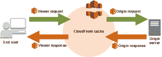
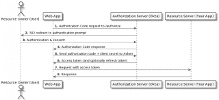

# 通过 Okta & Lambda@Edge \n 向 AWS S3 / Cloudfront 添加 OAuth2 身份验证

> 原文：<https://www.algolia.com/blog/engineering/adding-oauth2-authentication-to-an-aws-s3-static-bucket-with-okta/>

我们的团队最近实现了一个内部静态网站，允许员工下载技术报告。由于我们是 AWS(亚马逊网络服务)的重度用户，我们自然决定将其托管在 AWS S3 上，它提供了一个专门的功能来构建静态网站( [S3 静态网站托管](https://docs.aws.amazon.com/AmazonS3/latest/userguide/WebsiteHosting.html))。

然而，很快我们就遇到了一个问题:AWS S3 不提供任何本地的、开箱即用的认证/授权过程。因为我们的网站将只供内部使用，所以我们需要某种授权机制来防止未经授权的用户访问我们的网站和报告。

我们需要找到一个解决方案来保护我们在 AWS S3 的内部静态网站。

## 用亚马逊 CloudFront 和 Lambda@Edge 发现解决方案

我们使用 [Okta](https://www.okta.com/) 进行所有身份和用户管理，因此无论我们找到什么解决方案，都必须使用 Okta 插件。Okta 有几个认证/授权流程，所有这些流程都需要应用程序执行后端检查，比如验证 Okta 返回的响应/令牌是否合法。

因此，我们需要找到一种方法，在一个静态网站上进行这些检查/操作，该网站使用我们无法控制的后端。就在那时，我们了解到了 [AWS Lambda@Edge](https://aws.amazon.com/lambda/edge/) ，它允许您在亚马逊 Cloudfront 的请求和响应的不同阶段运行 [Lambda 函数](https://aws.amazon.com/lambda/):

如图所示，我们可以在四个不同的阶段触发 Lambda 函数:

*   当请求进入 Amazon Cloudfront ( `viewer-request`)时
*   当请求发送到原点(`origin-request`)时
*   当响应从原点返回时(`origin-response`
*   当亚马逊 Cloudfront ( `viewer-response`)返回响应时

我们看到了最初问题的解决方案:**在`viewer-request`阶段**触发一个 Lambda 来检查用户是否被授权。

有两个条件:

1.  如果用户得到授权，则让请求继续，并返回受限制的内容以进行安全的内容传递
2.  如果用户未经授权，则发送 HTTP 响应，将他们重定向到登录页面

## 

## 实现 Lambda@Edge 功能

我们将在这里讨论我们面临的关键因素和主要问题。完整的代码可在[这里](https://github.com/GuiTeK/aws-s3-oauth2-okta)获得。请随意在您的项目中使用它！

### λ@ Edge 限制和注意事项

在开发解决方案时，我们遇到了 Lambda@Edge 的一些限制和警告。

#### 1–环境变量

Lambda@Edge 函数**不能使用环境变量**。这意味着我们需要找到另一种方法在我们的函数中进行数据传输。我们在 Node.js 代码中选择了 **SSM 参数**和**模板化参数名**(我们在部署 Lambda 函数时使用 [Terraform](https://www.terraform.io/) 来呈现模板)。

#### 2–Lambda 封装大小限制

对于查看器事件(提醒:我们使用`viewer-request`事件)，Lambda 包最多可以**1mb**。考虑到一个 MB 包含了你的 Lambda 函数的*所有依赖关系*(当然除了运行时/标准库)，这个 MB 是很小的。

这就是为什么**我们不得不在 Node.js** 中重写我们的 Lambda，而不是原来的 Python，因为 Python 包及其 API 和其他依赖项超过了 1 MB 的限制。

#### 3–λ区域

Lambda@Edge 函数**只能在`us-east-1`区域**中创建。这不是一个大问题，但这意味着您需要:

*   在该地区提供您的 AWS 资源，使事情变得更容易
*   在 Terraform 中，如果你想要保护的桶不在`us-east-1`中，你需要有一个单独的 AWS `provider`来访问它

#### 4–Lambda 角色权限

与 Lambda@Edge 函数**相关联的 IAM 执行角色除了通常的`lambda.amazonaws.com`之外，还必须允许主体服务`edgelambda.amazonaws.com`** 。请参见[AWS–设置 Lambda@Edge 的 IAM 权限和角色](https://docs.aws.amazon.com/AmazonCloudFront/latest/DeveloperGuide/lambda-edge-permissions.html)。

### 授权机制同 Okta

一旦我们管理了上面的限制和警告，我们就把重点放在了授权上。

Okta 提供了几种认证和授权用户的方法。我们决定使用行业标准的授权协议 [**OAuth2**](https://oauth.net/2/) 。

**注意:** Okta 实现了 **OpenID Connect (OIDC)标准，**在 OAuth2 之上增加了一个瘦认证层(这就是下文提到的 ID 令牌的目的)。我们的解决方案也可以使用纯 OAuth2，只需很少的修改(删除代码中使用的 ID 标记)。

OAuth2 本身提供了几个*授权流*，这取决于使用它的应用程序的种类。在我们的例子中，我们需要[授权代码流](https://developer.okta.com/docs/guides/implement-grant-type/authcode/main/)。

下面是取自[developer.okta.com](https://developer.okta.com/docs/guides/implement-grant-type/authcode/main/)的完整授权代码流程图，展示了它是如何工作的:

总结一下流程:

*   我们的 Lambda 函数将用户重定向到 Okta，提示他们登录
*   Okta 用*代码*将用户重定向到我们的网站/Lambda 功能
*   我们的 Lambda 函数检查代码是否合法，并通过向 Okta 发送请求来交换访问和 ID 令牌
*   根据 Okta 返回的结果，我们:
    *   允许或拒绝访问受限制的内容
    *   如果允许访问，将访问和 ID 标记保存在 cookie 中，以避免在每个页面上重新授权用户

### 使用 JSON Web 令牌存储授权结果

到目前为止，我们有一个有效的授权流程；然而，我们需要检查每个请求上的 access/ID 令牌(恶意用户可以伪造无效的 cookie 或令牌)。检查令牌意味着向 Okta 发送请求，并在用户访问的每一页上等待响应**，这**显著降低了 Cloudfront CDN 的延迟和加载时间**，显然是次优的。**

**注意:**虽然 Okta 令牌的本地验证在理论上是可能的*，但是在撰写本文时[Okta](https://github.com/okta/okta-jwt-verifier-js)提供的 SDK 在获取用于检查令牌的密钥时使用了 *LRU* (内存中)缓存。因为我们使用的是 AWS Lambda，并且程序的内存/状态不会在调用之间保存，所以 SDK 对我们来说是无用的:它仍然会为每个用户请求向 Okta 发送一个 HTTP 请求，以检索 JWKs (JSON Web Keys)。更糟糕的是，每分钟有 10 个 JWK 请求的限制，如果每分钟超过 10 个请求，我们的解决方案就会停止工作。*

 *为了解决这个问题，我们决定使用 [**JSON Web 令牌**](https://jwt.io/introduction) ，就像我们对[管理应用程序](https://www.algolia.com/blog/engineering/api-keys-vs-json-web-tokens/)所做的那样。初始授权过程是相同的，只是我们创建了一个包含这些令牌的 JWT，然后将 JWT 保存到 cookie 中，而不是将访问/ID 令牌保存到 cookie 中。

因为 JWT 是加密签名的:

*   恶意参与者无法伪造(他们需要用于签名的私钥)
*   每个请求所需的检查步骤都很快:我们用一个很长的 I/O 开销很大的 HTTP 请求来计算一个快速的加密检查。

#### 关于 JWT 到期和续期的说明

JWT 具有**相对较短的预定义到期时间**，以避免有效的 JWT 包含到期或撤销的访问/ID 令牌。另一种选择是定期检查访问/ID 令牌，并在需要时撤销相关的 JWT，但这样我们将需要一个撤销机制，这使得事情变得更加复杂。

最后，如上所述，Okta 提供的令牌有过期时间。有可能**使用刷新令牌**透明地更新它们(因此当令牌过期时，用户不必重新登录)，但我们没有实现这一点。

## 结论

虽然通过 Okta(或任何其他 OAuth2 提供者)将 OAuth2 身份验证添加到 S3 静态桶中是可能的，但这肯定不是简单的。

它需要使用 Lambda@Edge 在 AWS 和 OAuth2 提供者(在我们的例子中是 Okta)之间编写一个中间件。我们必须自己做以下事情:

1.  验证用户身份验证
2.  还记得用户认证吗
3.  刷新用户身份验证(在我们的解决方案中没有实现)
4.  撤销用户身份验证(TTL 实现了，但 TTL 结束前的撤销没有实现)

最后，必须创建一堆 AWS 资源来将所有东西粘在一起并使其工作。

所有这些努力都是值得的，因为它起作用了，我们的网站现在更安全了。

你可以在这里找到 Lambda@Edge 以及基础设施(Terraform)的代码:[https://github.com/GuiTeK/aws-s3-oauth2-okta](https://github.com/GuiTeK/aws-s3-oauth2-okta)。*