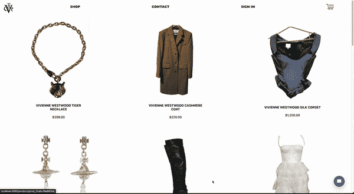
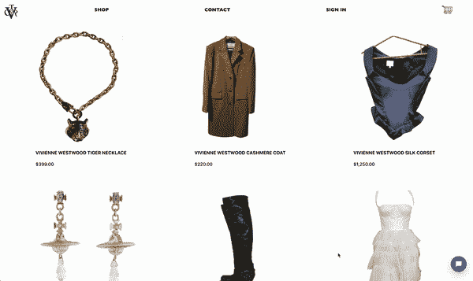
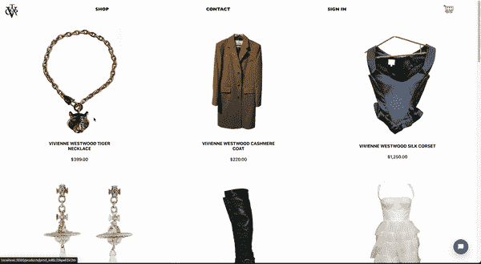
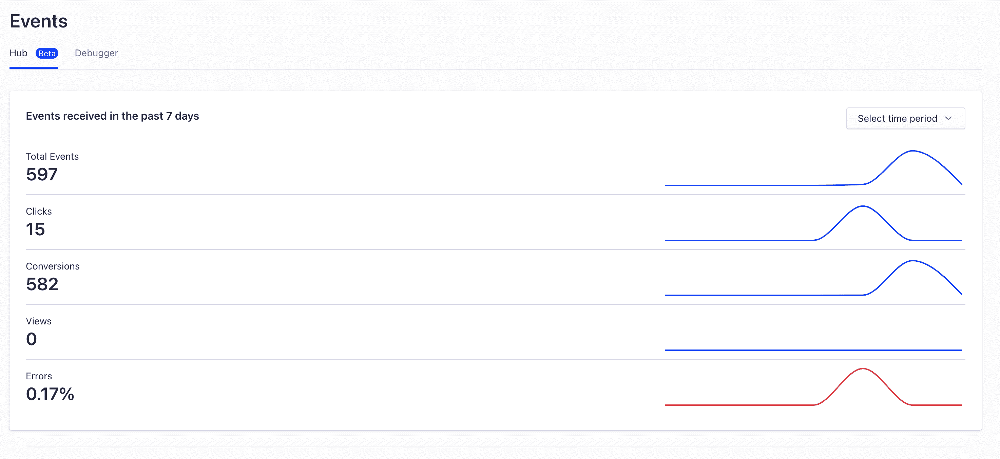
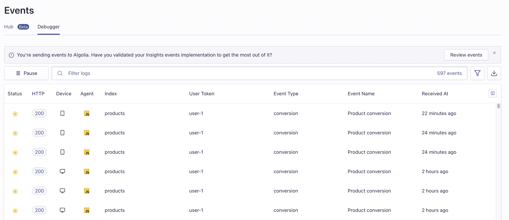
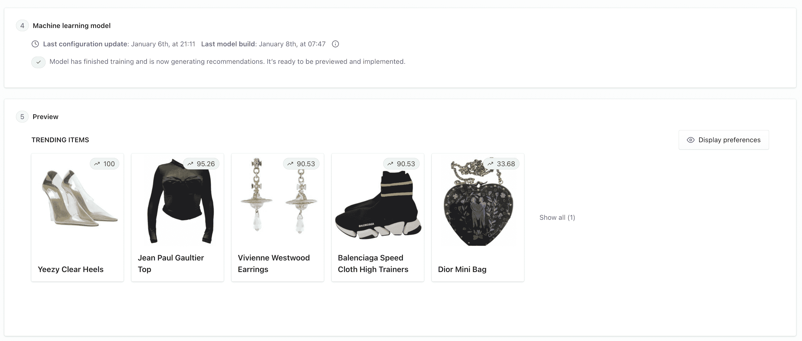
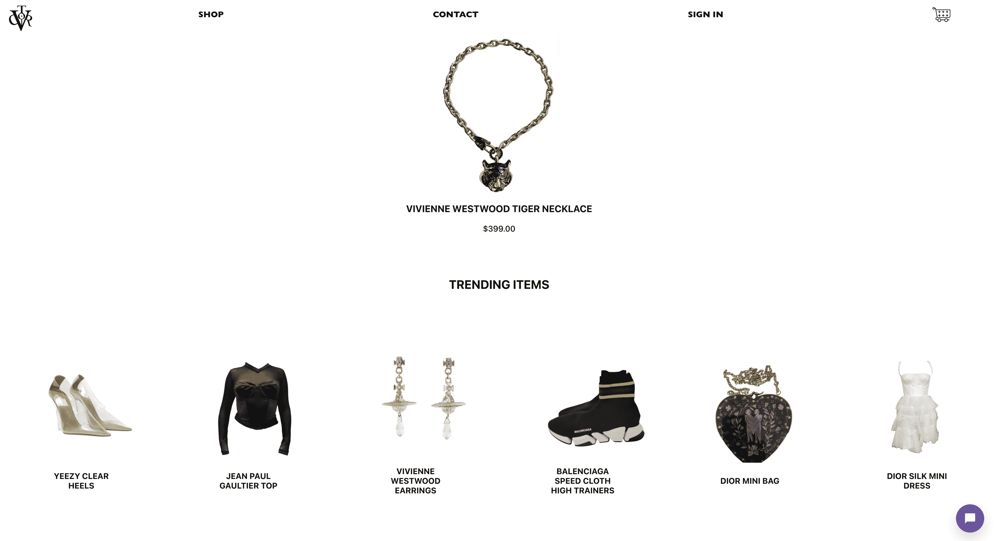

# 向您现有的电子商务商店添加趋势推荐- Algolia 博客

> 原文：<https://www.algolia.com/blog/engineering/adding-trending-recommendations-to-your-existing-e-commerce-store/>

推荐可以成就或毁掉一次网上购物体验。在一个充满无限选择和无限滚动的世界里，推荐让客户能够穿过噪音，发现他们更有可能喜欢的新东西。他们还可以帮助客户了解新的购物领域的新事物——无论是搜索完美的礼物还是购买新的东西，基于推荐的功能，如趋势产品部分，可以帮助用户充分利用他们的在线时间。

对于希望将这些重要功能添加到他们的电子商务体验中的开发者来说， [Algolia 推荐](https://www.algolia.com/doc/guides/algolia-recommend/overview/)可以成为拯救世界的超级英雄。请继续阅读，了解如何利用 Algolia 推荐以及 Insights API 来展示趋势产品并增强您的电子商务应用程序！

## [](#what-we%e2%80%99re-building)我们在建设什么

在本文中，我们将使用 React 和 Commerce.js 开发一个电子商务应用程序。幸运的是，我们不必从头开始构建——我们将使用最初为 Algolia DevCon 开发的[这个](https://github.com/hello-ashleyintech/algolia-commercejs-app)基本电子商务应用程序[作为我们的起点。](https://www.youtube.com/watch?v=61r_YZn5x84&ab_channel=Algolia)

完成教程后，我们的应用程序将能够使用 Algolia 的 InstantSearch insights 库、Insights API 和 Algolia Recommend 在单个产品详情页面上推荐热门产品。

如果你想提前查看完整的项目代码，可以访问`[algolia-commercejs-recommendations-app`资源库】(https://github . com/hello-ashleyintech/algolia-commerce js-recommendations-app)。




还要记住，尽管这篇文章是面向 React 和 Commerce.js 的，但它仍然是扩展任何带有 Algolia 推荐的*电子商务应用程序的通用指南。如果您对在不同的环境中实施推荐有更具体的问题，[文档](https://www.algolia.com/doc/guides/algolia-recommend/overview/)会提供您想要的信息。*

## [](#getting-started)入门

在我们开始构建之前，请确保您设置了以下内容:

*   *Node:* 要检查是否已经安装了 Node，可以在命令行中运行`node -v`。如果没有弹出版本，你需要安装它——你可以在这里找到你的机器[的安装说明。](https://nodejs.org/en/download/)
*   Chec: Commerce.js 使用一个名为 Chec 的平台来管理您的集成、API 密钥和产品。你需要在这里创建一个账户[，然后建立一个 Commerce.js 商店。](https://commercejs.com/)
*   *Algolia:* 要利用 Algolia 的功能，你需要在这里创建一个 Algolia 账户[。您还需要](https://www.algolia.com/users/sign_up)[创建一个应用程序](https://support.algolia.com/hc/en-us/articles/4406975239441-How-do-I-create-an-application-)来表示您的电子商务应用程序，然后创建一个名为`products`的[索引](https://support.algolia.com/hc/en-us/articles/4406981910289-What-is-an-index-)。
*   *ngrok:* 在这里创建一个 ngrok 账户[。您将需要它从您的本地应用程序隧道连接，以便您可以配置 webhooks 和进行 API 调用。](https://ngrok.com/signup)

当以上一切准备就绪时，将基础项目 [`algolia-commercejs-app`的 GitHub 库](https://github.com/hello-ashleyintech/algolia-commercejs-app)克隆到您的机器上。然后，按照本自述文件中的说明[完成本教程应用程序的设置(确保为`client`和`server`目录在`.env.example`中设置了包含所有环境变量的`.env`文件)。](https://github.com/hello-ashleyintech/algolia-commercejs-recommendations-app#readme)

一旦您有了一个在本地运行的电子商务商店，并且成功地展示了您的产品并运行了聊天机器人，您就可以进行下一步了！



## [](#let%e2%80%99s-build)咱们建吧！

既然基础应用程序已经设置好了，让我们开始构建吧！🔨

### [](#add-in-routing-and-a-product-detail-page)在工艺路线和产品明细页面中添加

为了开始跟踪什么是趋势，我们需要设置页面路由和一个组件，当从主屏幕上单击产品时，它会显示产品的详细信息页面。



### [](#create-a-productindividual-component)创建`ProductIndividual`组件

首先，我们需要一个新的组件来展现产品的细节。在您选择的代码编辑器中，通过向`client/src/components`目录添加一个新文件`ProductIndividual.js`，创建一个新组件`ProductIndividual`:

```
// client/src/components/ProductIndividual.js
import React from "react";

function ProductIndividual() {
  return (
    <></>
  );
}

export default ProductIndividual; 
```

您可能会注意到文件现在非常空——组件将是空的，直到我们能够从`ProductList`向其传递单个产品数据。一旦我们配置了主页和产品详细信息页面之间的链接路径，这将成为可能。

在`client/src/components`目录中，还可以为标题为`ProductIndividual.css`的`ProductIndividual`组件创建一个对应的 CSS 文件。因为组件中没有呈现任何内容，所以这个 CSS 文件现在可以保留为空白。您可以通过在现有的 import 语句下添加以下行，在您的`ProductIndividual.js`文件中导入新的 CSS 文件:

```
import "./ProductIndividual.css"; 
```

### [](#set-up-react-router)设置 React 路由器

为了路由到不同的页面，我们将使用 [React Router](https://reactrouter.com/en/main) ，它允许我们无缝地创建具有不同视图的 URL 路由。首先，我们需要安装`react-router-dom`包。在项目的`client`目录中运行以下命令，以便只在前端安装软件包:

```
npm i react-router-dom 
```

一旦安装了这个包，我们就可以开始向我们的应用程序添加路由，包括一个指向我们刚刚添加的`ProductIndividual`组件的路由。为此，转到`client/src/App.js`并将以下导入语句添加到文件顶部:

```
import { BrowserRouter as Router, Routes, Route } from "react-router-dom";
import ProductIndividual from "./components/ProductIndividual"; 
```

既然已经导入了`react-router-dom`,我们可以使用它的功能将 URL 路由连接到由各种组件组成的不同视图。在`App()`函数中，更新`return()`，使其仅包含以下代码:

```
<Router>
  <div className="app">
    <NavBar />
    <Routes>
      <Route
        exact path="/"
        element={
          <>
            <ProductsList products={products} />
            <Bot />
          </>
        }
      />
      <Route
        exact path="/products/:id"
        element={
          <>
            <ProductIndividual />
            <Bot />
          </>
        }
      />
    </Routes>
  </div>
</Router> 
```

上面的代码初始化了两条路线，`/`和`/products/:id`:

*   `/`路径呈现了用户可用的所有产品的主页视图，以及基础应用程序中存在的聊天机器人小部件。
*   `/products/:id`路径将呈现新添加的`ProductIndividual`组件以及基础应用程序中已有的聊天机器人小部件。此路线中的`:id`代表所选产品的 ID，它允许在所有不同的产品详细信息页面中区分路线。

### [](#make-navbar-icon-clickable)使导航栏图标可点击

既然我们已经设置了路线，我们可以在导航栏中配置我们的品牌图标，以链接回主页。这对于我们进入产品详细信息页面非常有用，因为它会给我们一个简单的返回主页的路径。

转到`client/src/components/NavBar.js`并添加以下导入语句:

```
import { Link } from "react-router-dom"; 
```

这将从`react-router-dom`包中导入一个`Link`组件。`[Link`组件】(https://reactrouter . com/en/main/components/link)允许我们将组件、文本和其他元素链接到`App.js`中 React Router 初始化的路由。

为了使 logo 组件`<Logo>`在导航条中可链接，你应该把它包装在`<Link>`标签中，就像这样:

```
<Link to={"/"}>
  <Logo className="logo" />
</Link> 
```

我们将一个`to`属性传递给`Link`组件，该属性将指定当点击`<Link>`标签中的组件时，应用程序将重定向到什么路由。在这种情况下，`to`属性是到主页的路径(`/`)。

一旦添加完毕，点击你的导航条图标，你将回到主页！

## [](#set-up-home-page-products-to-link-to-product-details)设置商品首页链接到商品详情

现在我们已经有了链接组件的经验，这样它们可以重定向到特定的路径，我们可以开始工作，使主页上的每个产品都可以点击！

主页上的每个产品都是通过`ProductsList`组件呈现的，从 Commerce.js 查询的一组产品已经作为一个道具传入。在`ProductsList`组件中，产品数组被遍历以呈现显示每个产品及其相关信息的单个`ProductItem`组件。

在`ProductsList`中，我们可以将为每个产品呈现的`ProductItem`包装在一个`<Link>`标签中，这样产品就可以导航到单个产品页面。

首先，在`client/src/components/ProductsList.js`中导入`Link`组件:

```
import { Link } from "react-router-dom"; 
```

然后，在同一个文件中，将在`products.map()`语句的每次迭代中呈现的`ProductItem`组件包装在一个`<Link>`标记中:

```
<Link
    to={`/products/${product.id}`}
    state={{ selectedProduct: product }}
    key={product.id}
>
  <ProductItem product={product} />
</Link> 
```

在`<Link>`标签中，我们这次传入了两个道具:

*   一个`to`属性，指定重定向到哪个路由。对于`to`属性，我们传入的是产品的 ID，而不是路线的`:id`部分，这确保用户链接到一个带有产品自定义视图的特定产品页面。
*   一个`state`属性，它允许将信息传递给在`Link`组件重定向到的路径中呈现的组件。对于`state`属性，我们传入产品信息，该信息可以通过`selectedProduct`属性访问。

### [](#spruce-up-your-product-details-page)美化您的产品详情页面

现在用户可以从主页访问`ProductIndividual`组件了，我们可以将它更新为从添加在`ProductsList`中的`Link`组件传递给它的表面信息。

在`client/src/components/ProductIndividual.js`中，添加以下导入:

```
import { useLocation } from "react-router-dom"; 
```

上面的语句从`react-router-dom`库中导入了一个`[useLocation`钩子】(https://react router . com/en/main/hooks/use-location)。`useLocation`允许你访问一个`location`对象，该对象详细描述了关于你当前所在的 URL 的信息，以及传入到那里的信息。该信息包括从`ProductsList`传入的`state`属性。`state`包含一个`selectedProduct`属性，其中包含从 Commerce.js 中检索到的所有产品信息。

让我们从使用`useLocation`挂钩开始！在`ProductIndividual.js`中`ProductIndividual()`的函数体顶部，添加以下几行代码:

```
const location = useLocation();
const selectedProduct = location.state?.selectedProduct; 
```

上面的代码会通过`useLocation`钩子抓取`location`对象。然后，使用该对象，将所选产品的信息从该对象填充到`selectedProduct`中。

我们现在可以使用来自`location`对象的`selectedProduct`来显示与产品相关的一组特定信息(因为我们的目标是一个非常简单的产品详细信息页面，所以我们将只显示一个图像、一个名称和一个格式化的价格)。更新`ProductIndividual`组件中的`return()`,如下所示:

```
<>
  <div className="item__container">
    
    <div className="item__info">
      <h3 className="item__name">{selectedProduct.name.toUpperCase()}</h3>
      <div className="item__details">
        <p className="item__price">
          {selectedProduct.price.formatted_with_symbol}
        </p>
      </div>
    </div>
  </div>
</> 
```

最后，为了更新`ProductIndividual`组件新添加信息的样式并使其看起来更漂亮，将`ProductIndividual.css` 文件中的 [CSS 添加到项目的`ProductIndividual.css`文件中。](https://github.com/hello-ashleyintech/algolia-commercejs-recommendations-app/blob/master/client/src/components/ProductIndividual.css)

*此时，您的应用程序现在应该能够:*

*   主页中的 Surface 单个产品详细信息页面
*   允许用户使用导航栏中的商店徽标从产品详细信息页面导航回主页


## [](#add-in-event-tracking)添加事件跟踪

好消息—现在，用户可以在您的应用中访问单个产品的详细信息页面！🎉添加了这个功能后，我们可以开始跟踪用户交互，看看有什么趋势。对于我们的应用程序，我们将考虑一个“趋势项”,即用户持续交互的项。

由于我们的应用程序除了点击产品之外不包含任何交互，所以每当有人点击商品并导航到商品的详细页面时，我们都会记录一个到 Algolia 的转换事件。通常，如果我们的应用程序有更多的特性，我们可能会使用“添加到购物车”按钮交互作为转换事件。你可以在这里了解更多关于事件和向 Algolia [发送事件的信息。](https://www.algolia.com/doc/guides/sending-events/getting-started/)

### [](#set-up-instantsearch)设置即时搜索

我们需要安装来自 Algolia 的三个包，以帮助我们实现基于用户点击记录转换事件的预期目标。这些包是`algoliasearch`、`react-instantsearch-dom`和`search-insights`。

您可以使用以下命令将它们一次性安装到项目的`client`目录中:

```
npm i algoliasearch react-instantsearch-dom search-insights 
```

为了跟踪用户交互，我们需要设置 [InstantSearch](https://www.algolia.com/doc/guides/building-search-ui/what-is-instantsearch/js/) ，这是一个开源 UI 库，支持各种搜索功能，包括将 Algolia 跟踪组件嵌入其实现中的能力。

首先将以下导入语句添加到`client/src/App.js`:

```
import aa from 'search-insights';
import algoliasearch from 'algoliasearch';
import { InstantSearch, Configure } from 'react-instantsearch-dom'; 
```

接下来，在`App()`函数声明的顶部添加以下内容:

```
const searchClient = algoliasearch(
  process.env.REACT_APP_ALGOLIA_APP_ID,
  process.env.REACT_APP_ALGOLIA_API_KEY
);

aa('init', {
  appId: process.env.REACT_APP_ALGOLIA_APP_ID,
  apiKey: process.env.REACT_APP_ALGOLIA_API_KEY
}); 
```

上面通过 Algolia Search 初始化了一个搜索客户端，我们可以将它传递给 Algolia 的`InstantSearch`组件以及一个 search insights 实例，帮助记录用户交互。

接下来，我们将把每条路线的组件包装在一个`InstantSearch`组件中，并添加一个`Configure`组件，该组件专门支持在`InstantSearch`实例中跟踪点击。在您的`App.js`的`return()`语句中，用以下代码替换`<Routes>`标记中的代码:

```
<Route
  exact
  path="/"
  element={
    <InstantSearch searchClient={searchClient} indexName="products">
      <Configure clickAnalytics />
      <ProductsList products={products} />
      <Bot />
    </InstantSearch>
  }
/>
<Route
  exact
  path="/products/:id"
  element={
    <InstantSearch searchClient={searchClient} indexName="products">
      <Configure clickAnalytics />
      <ProductIndividual />
      <Bot />
    </InstantSearch>
  }
/> 
```

每条路线的组件都用一个`InstantSearch`包装器包装，该包装器接收从`algoliasearch`初始化的`searchClient`。此外，它接受一个与您的产品同步到的 Algolia 索引相对应的`indexName`——在本例中，它是`products`。

### [](#add-an-event-to-log-insights)添加事件到日志洞察

现在一切都已配置完毕，我们可以开始在主页上跟踪产品的转换事件了。更新`client/src/components/ProductsList.js`文件中的代码，如下所示:

```
import React from "react";
import { Link } from "react-router-dom";
import PropTypes from "prop-types";
import ProductItem from "./ProductItem";
import "./ProductsList.css";
import aa from "search-insights";
import { connectHitInsights } from "react-instantsearch-dom";

function Product({ products }) {
  return (
    <div className="products" id="products">
      {products.map((product) => (
        <Link
          to={`/products/${product.id}`}
          state={{ selectedProduct: product }}
          key={product.id}
          onClick={() => {
            aa("convertedObjectIDs", {
              userToken: "user-1",
              index: "products",
              eventName: "Product conversion",
              objectIDs: [product.id],
            });
          }}
        >
          <ProductItem product={product} />
        </Link>
      ))}
    </div>
  );
}

Product.propTypes = {
  products: PropTypes.array,
};

const ProductsList = connectHitInsights(aa)(Product);
export default ProductsList; 
```

我们在这里做了一些更新:

*   `aa`和`connectHitInsights`作为进口增加。
*   The component’s functional declaration, `ProductsList()`, has been renamed to `Product()` — this is so we can connect the component’s declaration to Algolia’s Insights API later on in the file using the `connectHitInsights()` function, which will then be stored and exported as the `ProductsList` component. This is accomplished in the following line of code at the end of the file:

    ```
    const ProductsList = connectHitInsights(aa)(Product); 
    ```

    由于这一变化，当拉动`Product()`组件初始化下面的`propTypes`时，`ProductsList`也被换成了`Product`。

*   `Link`组件添加了一个`onClick()`监听器。因为我们将用户点击产品视为转换，所以每当用户点击产品时，`onClick()`监听器将使用`search-insights`库中的`aa`来记录一个`[convertedObjectIDs`事件(https://www . algolia . com/doc/API-reference/API-methods/converted-object-ids/)。`aa`事件记录还需要一些其他参数:
    *   一个`userToken`，我们硬编码为`user-1`。这是一个唯一的用户 ID——如果您为您的应用程序使用单独的用户帐户，您将检索当前用户的 ID 并在此处填充它。
    *   一个`index`，这是我们的产品所对应的 Algolia 指数，在这种情况下，它是`products`。
    *   这可以是你想要的任何东西。
    *   `objectIDs` —这是一系列与此事件相关的产品。因为我们的应用程序为每一次产品点击记录一个事件，所以我们总是只传入一个产品 ID。

### [](#confirm-events-are-being-sent-to-algolia)确认事件正在被发送到阿哥利亚

至此，向 Algolia 发送转换事件的所有设置都已添加完毕。但是…这些事件在哪里结束？我们怎么知道所有的重担是否值得？

答案很简单——你可以进入 Algolia 仪表盘的[事件](https://www.algolia.com/events/studio)部分！本节由两部分组成:

*   [事件中心](https://www.algolia.com/events/studio)，将显示过去 7 天发送到 Algolia 的所有事件的仪表板:
*   [事件调试器](https://www.algolia.com/events/debugger)，它显示了事件进来时的详细的、逐个事件的分解:

当您看到您的活动出现在 Algolia 界面上并带有`200`状态代码时，您就知道这些活动已成功发送。要了解更多关于调试和验证事件的信息，你可以访问[这篇文章](https://www.algolia.com/doc/guides/sending-events/validating/)。

## [](#the-final-frontier-surface-trending-product-recommendations)最终前沿:表面趋势产品推荐

此时，您成功地将应用用户的转化事件发送到了 Algolia。现在你有了所有这些漂亮的数据，你该怎么处理呢？

介绍 [Algolia 推荐](https://www.algolia.com/doc/guides/algolia-recommend/overview/) —一个易于使用的 Algolia 功能，它获取事件数据，训练机器学习模型识别数据中的期望模式，然后将信息显示在您的网站上！

虽然这听起来可能很复杂，但 Algolia 让它变得非常简单——你需要做的只是收集事件并提交表单，然后他们会做剩下的事情。但是，要确保为您想要使用的推荐模型收集正确类型的事件。您可以在此查看各型号[的要求。](https://www.algolia.com/doc/guides/algolia-recommend/overview/#events-requirements-for-the-models)

### [](#generate-a-recommend-model)生成推荐模型

对于这个特定的教程，我们将为“趋势推荐”生成一个推荐模型，这需要在 3 天的时间内对一个特定的索引进行至少 500 次转换事件。要获得您需要的数据，您可以暂时在这里暂停，让您的应用程序有机地生成这些事件，或者我们可以走捷径，生成一个事件数据的 CSV[。为了测试本教程，我们创建了一个假的 CSV，它包含名为`userToken`、`timestamp`、`objectID`、`eventType`和`eventName`的列。然后，我们为 3 个不同的日子生成 3 个不同的时间戳，用这些时间戳填充`timestamps`列，并为我们的索引中的产品随机添加`objectID`。](https://www.algolia.com/doc/guides/algolia-recommend/how-to/csv-upload/?utm_medium=page_link&utm_source=dashboard)

一旦你有了你的数据，在你的仪表板上进入[推荐模型](https://www.algolia.com/recommend/models)页面，选择“趋势推荐”选项。对于数据源，请选择您用来存储电子商务商店商品的索引。

第二步，添加您的数据。如果您在 3 天内手动生成了 500 个转换事件，则可以跳过这一步，除非除了您选择作为数据源的事件之外，还有任何事件记录到其他索引中。如果您已经创建了包含所有活动数据的 CSV，您将在此步骤中使用“上传 CSV”按钮上传它。

接下来，确保选择了“趋势项目”选项。然后，您可以单击“开始训练”按钮。您推荐的模型将开始训练，根据您拥有的数据，训练可能需要几分钟到几个小时。当您在模型页面上看到类似以下内容时，您就知道您的模型已经完成了训练:



如果您遇到任何问题或模型失败，您可能需要检查您的数据和模型所需的数据标准，以确保一切按预期运行。一旦您做出了任何需要的更改，您总是可以提交带有新数据的模型来重新训练它。你可以点击查看完整的 Algolia 推荐设置指南[。](https://www.algolia.com/doc/guides/algolia-recommend/how-to/set-up/)

### [](#surface-trending-items-on-your-app)app 上的表面趋势项目

一旦你的模型被训练好，你就可以把这些生成的建议放到你的应用中。Algolia 通过两个库使这个过程变得简单明了:`@algolia/recommend-react`和`@algolia/recommend`。将它们都安装到您项目的`client`目录中:

```
npm i @algolia/recommend-react @algolia/recommend 
```

为了提供建议，我们将创建一个新的组件，它将从我们的趋势项目模型中提取数据，然后在 UI 中呈现出来。

在`client/src/components`中，创建一个名为`RecommendationCard.js`的文件。这将是一个`RecommendationCard`组件，一个类似于`ProductIndividual`组件的简单组件，它将把关于产品的数据作为道具，并在其上显示特定信息:

```
// client/src/component/RecommendationCard.js
import React from "react";
import PropTypes from "prop-types";

function RecommendationCard({ product }) {
  return (
    <>
      <div className="rec__card">
        
        <div className="rec__info">
          <h4 className="rec__name">{product.name.toUpperCase()}</h4>
        </div>
      </div>
    </>
  );
}

RecommendationCard.propTypes = {
  product: PropTypes.object,
};

export default RecommendationCard; 
```

添加完`RecommendationCard`后，在`client/src/components`中创建一个`Recommendations.js`文件，这是一个通用`Recommendations`组件，包含从 Algolia 发送的每个趋势项的`RecommendationCard`:

```
// client/src/component/Recommendations.js
import React from "react";
import { Link } from "react-router-dom";
import { useTrendingItems } from "@algolia/recommend-react";
import recommend from "@algolia/recommend";
import aa from "search-insights";
import RecommendationCard from "./RecommendationCard";
import "./Recommendations.css";

function Recommendations() {
  const recommendClient = recommend(
    process.env.REACT_APP_ALGOLIA_APP_ID,
    process.env.REACT_APP_ALGOLIA_API_KEY
  );
  const indexName = "products";

  const { recommendations } = useTrendingItems({
    recommendClient,
    indexName,
  });

  return (
    <div className="trending__container">
      <h2>TRENDING ITEMS</h2>
      <div className="trending__grid">
        {recommendations.map((product) => (
          <Link
            to={`/products/${product.id}`}
            state={{ selectedProduct: product }}
            key={product.id}
            onClick={() => {
              aa("convertedObjectIDs", {
                userToken: "user-1",
                index: "products",
                eventName: "Product conversion",
                objectIDs: [product.id],
              });
            }}
          >
            <RecommendationCard product={product} />
          </Link>
        ))}
      </div>
    </div>
  );
}

export default Recommendations; 
```

该组件使用 Algolia 的`useTrendingItems`钩子来查询我们生成的趋势项目模型的结果。`useTrendingItems`需要传入一个`recommendClient`,它是使用`@algolia/recommend`库的`recommend`函数初始化的。

与`ProductsList`类似，该组件随后遍历 Algolia 返回的建议数组，并呈现一个`RecommendationCard`，呈现每个产品的数据。`RecommendationCard`封装在一个`Link`组件中，该组件将用户路由到所选推荐的产品页面，并通过一个`onClick()`监听器记录一个转换事件。

当您准备好在您的产品详情页面上展示您的建议时，请进入`client/src/components/ProductIndividual.js`并导入您的`Recommendations`组件:

```
import Recommendations from "./Recommendations"; 
```

然后，将组件添加到组件的`return()`中的`</>`结束标记之前:

```
<Recommendations /> 
```

此时，`Recommendations`组件应该出现在您的产品详细信息页面上，但是它看起来可能有点滑稽。如果你想为这个组件添加一些简单的样式，使它看起来像下面的页面，在`client/src/components`目录中创建`Recommendations`和`RecommendationCard` CSS 文件。从那里，您可以将我们的`[Recommendations` CSS 文件】(https://github . com/hello-Ashley intech/algolia-commerce js-recommendations-app/blob/master/client/src/components/recommendationcard . CSS)和`[RecommendationCard` CSS 文件】(https://github . com/hello-Ashley intech/algolia-commerce js-recommendations-app/blob/master/client/src/components/recommendation card . CSS)的内容复制到您的本地组件。



# [](#conclusion)结论

恭喜你！🥳:你已经创建了一个漂亮的电子商务应用程序，允许你根据真实的用户趋势来展示流行产品！你可以在这里查看整个项目的 GitHub 库。通常，这种类型的功能需要几天的编码和相当多的机器学习知识。然而，有了 Algolia 的魔力，你节省了自己的时间*和*许多受挫的谷歌搜索从零开始训练机器学习模型。✨

正如您在本教程中了解到的， [Algolia 推荐](https://www.algolia.com/doc/guides/algolia-recommend/overview/)是一个强大的工具，可以帮助客户获得更有帮助、更个性化的电子商务体验。如果您有兴趣进一步扩展我们今天构建的应用程序，请随意查看其他类型的模型及其所需的数据类型[此处](https://www.algolia.com/doc/guides/algolia-recommend/overview/#events-requirements-for-the-models)并探索如何使用 Algolia 为您的客户添加更多个性化体验。此外，请继续关注即将推出的另一个教程，学习如何为您的电子商务应用程序实现个性化搜索结果！🎉