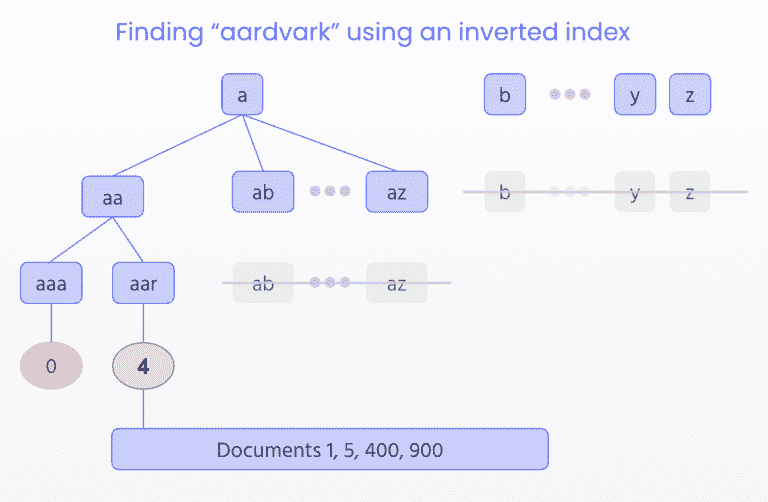

# 关键词搜索建立在自然语言处理(NLP)的基础上

> 原文：<https://www.algolia.com/blog/ai/advanced-keyword-search-is-built-upon-natural-language-processing-nlp/>

搜索引擎在执行查询之前需要“处理”搜索栏中的语言。这个过程可能非常简单，只需将查询*与写入索引的内容*进行精确比较。但是经典的关键字搜索比这更高级，因为它涉及到 *将* 和*将查询规范化为更小的部分——即单词和关键字。这个过程可以很简单(单词之间用空格隔开)，也可以更复杂(比如亚洲语言，不使用空格，所以机器需要识别单词)。*

一旦查询被分解成更小的部分，搜索引擎可以纠正拼写错误和打字错误，应用同义词，将单词进一步简化为词根，管理多种语言，等等——所有这些都使用户能够键入更“自然”的查询。

### [](#natural-language-keywords)自然语言*关键词*

平均而言，人们会键入单个单词或短语来描述他们正在搜索的项目。也就是说，他们使用 *关键词，* 而不是整句或疑问句。(尽管由于语音技术和谷歌问答结果的成功，这种情况正在改变。)

这种 **关键词搜索，** 无论是它的简单版本还是更高级的版本，从搜索之初就一直存在。越是自然，技术就越先进。搜索引擎需要对传入的查询进行结构化，然后才能在搜索索引中查找结果。这种*预处理*技术属于我们所说的 **自然语言处理，或 NLP** ，是任何使计算机能够理解人类语言的技术的总称，无论是书面语言还是口头语言。

> *自然语言处理(“NLP”)将文本转换成更易于计算机使用的片段。一些常见的 NLP 任务是删除停用词、分词或拆分复合词。NLP 还可以识别词类或文本中的重要实体。*
> 
> *—达斯汀·科茨，Algolia 的产品和 GTM 经理*

我们已经在 Algolia 写了很多关于自然语言处理(NLP)的文章。我们已经 [定义了 NLP](https://www.algolia.com/blog/product/what-is-natural-language-processing-and-how-is-it-leveraged-by-search-tools-software/) ，对比了[NLP vs](https://www.algolia.com/blog/product/what-is-natural-language-understanding-and-how-is-it-different-from-nlp/)，并描述了一些流行的 [NLP/NLU 应用](https://www.algolia.com/blog/product/what-is-natural-language-processing-and-how-is-it-leveraged-by-search-tools-software/) 。此外，我们的工程师解释了我们的引擎 [如何处理语言](https://www.algolia.com/blog/engineering/natural-languages-in-search/) 和 [处理多语言搜索](https://www.algolia.com/blog/engineering/increase-decompounding-accuracy-by-generating-a-language-specific-lexicon/) 。在本文中，我们将了解 NLP 如何驱动关键字搜索，这是我们的 [混合搜索解决方案](https://www.algolia.com/blog/ai/the-past-present-and-future-of-semantic-search/) 的重要组成部分，该解决方案还包括基于 AI/ML 的 [矢量嵌入](https://www.algolia.com/blog/ai/what-is-vector-search/) 和 [哈希](https://www.algolia.com/blog/ai/vectors-vs-hashes/) 。

为了理解关键词和自然语言处理之间的联系，深入研究关键词搜索是很重要的。

## [](#what-is-keyword-search)什么是关键词搜索？

最基本的，关键字搜索引擎将查询的文本与搜索索引中每条记录的文本进行比较。搜索引擎返回所有匹配的记录(无论是精确的还是相似的)。正如所建议的，匹配可以是简单的，也可以是高级的。

我们用关键词来描述服装、电影、玩具、汽车和其他物品。大多数关键字搜索引擎依赖于结构化数据，其中索引中的对象用单个单词或简单的短语清楚地描述。

例如，一朵花可以使用标签或“键”来构造，形成 **键-值对** 。 **值** (一朵大的、红色的、夏天的、有四片花瓣的花)可以与它们的 **键** (大小、颜色、季节、物体类型和花瓣数量)配对。这花还能卖到“4.99”的“价格”。

我们可以这样表示键和值的结构:

```
{
"name": "Meadow Beauty",
"size": "large",
"color": "red",
"season": “summer”,
"type of object": "flower",
"number of petals": "4",
"price": "4.99", 
"description": "Coming from the Rhexia family, the Meadow Beauty is a wildflower.” 
}
```

所有这些键值对构成了一个可以存储在搜索索引中的记录，因此像“红色花朵”这样的查询将返回“类型=花朵”和“颜色=红色”的所有花朵记录。

此外，类似“红色”的部分查询可以找到“颜色=红绿”的花，因为“红色”在“ **红色** 盘中”。

许多关键字搜索引擎使用手动定义的同义词。因此，如果您明确地告诉引擎“blue”和“azure”是同义词，那么“blue”查询可以返回“azure”花朵。

其他技术可以纠正拼写错误和打字错误。查询“4 pedels”包含一个错别字；一个允许输入错误的引擎将返回拼写正确的 flowers(" PE**t**als ")。引擎也可以将“4”视为“四”的同义词。它还可以将复数“花瓣”与单数“花瓣”进行匹配，因为它们都具有相同的词根“花瓣”。

部分搜索，如“4 pe”，可以匹配“four petals”，因为大多数关键字搜索引擎都允许前缀搜索，这使得重要的 *as you type* 功能成为可能，用户可以在键入时看到搜索结果或查询建议。

再举一个例子(还有很多例子):*音译*。音译将一种语言的字母或声音映射到另一种语言的字母或声音。例如，音译使得用户能够键入拉丁字母(例如，a、b、c 等)。)来搜索俄语西里尔字符，或者键入日语 平假名来搜索片假名。

## [](#keyword-searchs-relevance-ranking-algorithm)关键词搜索的相关性&排名算法

关键词搜索引擎使用这些语言处理技术来创造伟大的*相关性*和*排名*——伟大的搜索解决方案的双重目标。

### [](#relevance)关联性

[相关性](https://www.algolia.com/doc/guides/managing-results/relevance-overview/in-depth/defining-relevance/)确保找到所有匹配查询的记录:

> *相关性依赖于一种智能匹配，这种智能匹配考虑了打字错误容差、部分单词匹配、匹配单词之间的空间距离、匹配属性的数量、同义词和规则、停用词和复数等自然语言特征、地理位置以及人们对搜索的许多其他直观方面，尤其是在谷歌时代。*

### [](#ranking)排名

[排名](https://www.algolia.com/doc/guides/managing-results/relevance-overview/in-depth/defining-relevance/#ranking---putting-the-best-at-the-top)将记录排序:

> 排序是你对搜索返回的记录进行排序的方式，这样最准确的结果会出现在最前面(在前几页)，而不太准确的结果会出现在后面。

### [](#the-keyword-search-algorithm)关键字搜索算法

为了实现最佳相关性和排名，工程师需要设计最佳算法和数据结构，以实现最佳文本比较。

对于相关性，有许多数据结构和搜索算法可供选择。然而，关键字搜索最好通过使用 [倒排索引](https://www.algolia.com/blog/product/defining-what-a-search-index-is-and-the-speed-and-relevance-of-a-search-engine-index/) 和应用基于字符的比较来服务。这意味着搜索引擎*预处理*数据，以便每个字符(字母、数字和键盘上的大多数字符)引用一个或多个包含这些字符的记录。例如，当一个引擎将“aardvark”与一个搜索索引进行比较时，它将执行一个颠倒的查找，试图找到所有包含字母 a-aa-AAR-aard-aardv-aardva-aardvar-aardvark:的记录



这种倒排索引可以考虑到打字错误和其他关键字搜索技术。

找到记录后，引擎的最终任务是对结果进行排序，确保最匹配的**出现在列表的顶部。同样，有不同的技术，例如，基于匹配单词频率的统计排名。我们选择的这个依赖于一个** [平局决胜算法](https://www.algolia.com/doc/guides/managing-results/must-do/custom-ranking/#the-ranking-criteria) ，通过应用自上而下的平局决胜，或 *测试，* 类似于淘汰赛的策略来对记录进行排名。

一个很好的例子就是看第一次和第二次测试: **错别字** 和 **地理位置** 。在美国查询“theater”将返回带有“theater”或“theater”的记录，其中英国的拼写被视为输入错误。由于平局决胜算法赋予了最佳匹配的特权，因此完全匹配(没有错别字=“theater”)的记录将被选为最佳匹配，而英国拼写将被发送到列表的底部。

接下来，最佳唱片(带“影院”)将接受 *第二次测试* ，地理定位:位于用户附近的影院(类似坐标)将被选为最佳。然后，平局决胜算法继续应用接下来的六个测试(精确匹配先于部分匹配，两个单词查询中单词之间的距离等)。)直到所有记录都被排序。

## [<svg aria-hidden="true" class="octicon octicon-link" version="1.1" viewBox="0 0 16 16"></svg>](#natural-language-processing)自然语言处理

基于关键字的相关性和排序算法建立在自然语言处理(NLP)的基础上。自然语言处理语言的复杂性。例如，单复数术语，动词变化(现在时与过去时，现在分词，等等。)、粘合或复合语言等等。我们将在下面看到一些 NLP 技术，但是首先我们将定义两个 NLP 基础:*标记化*和*规范化*。

### [](#what-is-tokenization)什么是标记化？

标记化将一个较大的文本分解成较小的片段。它可以将文档分解成段落，段落分解成句子，句子分解成“记号”标记化可能非常困难。例如，即使像识别段落中的句子这样简单的事情也很棘手。“迈克尔·J·福克斯”是两个独立的句子吗，因为它包含一个句点，后跟一个大写字母的单词？

### [](#what-is-normalization)什么是正常化？

在进行自然语言处理时，一个众所周知的低级步骤是归一化。这一步的目标是标准化每个查询，更多地依赖于字母而不是输入方式。因此，我们没有将大写的“michael”与小写的“michael”区别对待，而是将两者都规范化为“Michael”。我们对重音符号或特殊字符进行类似的规范化。

*   我们找到一个字母的标准形式:à→A 和à→ss。
*   我们找到了规范形的小写形式:à→A→A .

### [](#once-parsed-tokenized-and-normalized-what-can-nlp-do)一旦解析(标记化和规范化)，NLP 能做什么？

以下是一些标准 NLP 技术的简短列表。

*   **音译** :如上所述，音译允许您使用另一种语言的字母表来搜索一种语言的字符。这对于像俄语(拉丁语到西里尔语)、日语( 平假名到片假名)和中文(繁体到简体)这样的语言很有用。

*   **词干化** :词干化是通过去除前缀和后缀，将单词转化为其基本形式的过程。词干通过去掉词尾(“run”、“chang”)，允许“run”和“running”匹配，或者“change”和“changing”。关键词搜索大多关注的是 *名词* 词干，比如词干“pupp”代表“小狗”和“小狗”。

*   **词汇化** :与词干化类似，词汇化将单词分解成它们的基础(或词根)形式，但这样做是通过考虑每个单词的上下文和形态学基础。例如，词汇化可以转换不规则的复数，如“foot”到“foot”，或者法语“il”到“yeux”。(注意，引擎将首先将“OS”规范化为“oe”)。

*   **分词** :在英语和许多基于拉丁语的语言中，空格是单词分隔符(或单词分隔符)的一个很好的近似，尽管由于每种语言如何组合和分隔单词部分的可变性，这个概念有局限性。比如很多英语复合名词都是不定写的(ice box = ice-box = icebox)。但是，空格并不是在所有书写的文字中都存在的，没有它，分词就成了一个难题。没有琐碎的分词过程的语言包括汉语和日语，其中句子而不是单词被定界；泰语和老挝语，其中短语和句子而不是单词被定界；和越南语，其中音节而不是单词被定界。

*   **粘合:** 在一些语言中(德语、荷兰语、芬兰语等。)几个名词可以不加空格的连在一起构成新词。例如，Baumhaus 是一个由 Baum(树)和 haus(房子)组成的德语单词，Haus(房子)表示“树屋”。搜索“Baumhaus”(树屋)的人很可能对包含类似“Haus in einem Baum”(树上的房子)的结果感兴趣，而不仅仅是“Baumhaus”。一个更令人吃惊的挑战是冰岛语单词" valahei arvegavinnuverkf rageymsluskúraútidyralyklakippuhringur "，这是一个较小单词的组合，意思是" valahei I 高原上道路工人的储存工具棚的外门钥匙链的钥匙圈"。非常精确，可能对需要在瓦拉黑伊高原打开工具棚的道路工人有用。

*   **词性标注(POS-tagging)** :也叫语法标注，词性标注是根据特定单词或一段文本的用法和上下文来确定其词性的过程。在“我能做一架纸飞机”中，它把“做”识别为动词，在“你拥有什么牌子的汽车？”中，它识别为名词。

## [](#going-further-with-nlp-%e2%80%93-semantics)进一步发展自然语言处理——语义

关键词搜索技术，加入了更多 AI 驱动的技术，包括 NL**(自然语言 *理解* )和基于向量的语义搜索，可以把搜索带到一个新的高度。**

 **这里只是几个例子

*   总结新闻文章和博客文章
*   检测网页的语言以提供翻译
*   确定销售拜访记录中的关键话题
*   对推文中表达的情绪进行分类
*   服务客户服务请求的机器人
*   为搜索请求提供正确的产品
*   智能语音助手

以下是基于语义的自然语言处理技术的示例列表:

*   **实体提取** :实体提取对于语音搜索变得尤为重要。顾名思义，实体抽取是一种识别查询中不同元素的方法——人、地点、日期、频率、数量等。—帮助机器“理解”它包含的信息。实体提取是克服简单关键字搜索限制的一个非常好的解决方案。
*   **词义** :发现单词的多重含义，比如‘make the grade’(实现)中的动词‘make’与‘make a bet’(地点)不同。
*   **共指解析** :将两个词作为同一个实体对待(例如‘她’=‘玛丽’)，或者在文本中识别一个隐喻或者一个习语(例如‘熊’不是动物而是一个大毛人)。
*   **情感分析** :试图从文本中提取主观品质——态度、情绪、讽刺、困惑、怀疑。

## [](#concluion-%e2%80%93-nlp-reduces-the-ambiguity-of-keywords)结论——自然语言处理减少了关键词的歧义

人类的语言充满了歧义，这使得很难编写能够准确确定文本或语音数据的预期含义的软件。同音异义词、谐音、讽刺、习语、隐喻、语法和用法异常、句子结构的变化——这些只是人类花费数年时间学习的人类语言的一些不规则性，但如果这些应用程序要有用，程序员必须教会自然语言驱动的应用程序从一开始就准确识别和理解。

为了解决语言最复杂的方面，自然语言处理已经随着时代而改变。这一变化的核心是人工智能，特别是向量和大型语言模型(LLM)等机器学习模型。在翻译和自然语言理解领域(NLU)，机器学习极大地简化和改进了搜索过程。向量空间消除了手动创建同义词的需要。在本文中，我们重点讨论了关键字搜索的目的和方法，以及一些基本的 NLP 技术。NLP 继续发展，以增强关键字搜索的查询级功能——它仍将是处理我们日常执行的简单查询的首选方法。**