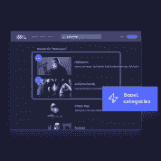

# 发现我们新的人工智能推荐产品| Algolia

> 原文：<https://www.algolia.com/blog/product/ai-powered-recommendations-product-launch/>

我们很高兴地宣布推出 Algolia 年春季推荐产品。 [Algolia 推荐](https://www.algolia.com/products/recommendations/) 是一个基于人工智能的推荐引擎，与我们的搜索和发现平台相集成，为用户提供最相关、最可行的推荐。

从您的主页到分类页面——从产品页面到结账台——在每个接触点并使用任何设备，Algolia Recommend 帮助您最大限度地提高用户参与度。

请继续阅读，了解此次发布的新内容，并了解其他企业如何受益于 Algolia 的搜索&发现平台。

## Algolia 有什么新的推荐？

在内 Algolia 推荐 ，从单个仪表板，跟单员、数字内容经理或数字业务领导可以选择适合他们的模式，部署它，然后跟踪结果。Algolia 推荐春季发布 2022 包括以下新功能:

*   **流行趋势**——一套创新的人工智能模型，可根据用户与各种品牌、产品和内容类别以及感兴趣的话题互动时的行为数据来检测新兴趋势，所有这些都为商家和数字内容领导者提供了与访客即时互动的能力。这增加了点击率，降低了跳出率，并通过显示哪些项目或主题是流行的，帮助访问者克服了“害怕错过”的感觉。

*   **业务规则**——低代码/无代码功能，利用人工智能进行持续改进，激活独特的业务策略——无需开发人员干预。这为品类经销商、在线零售策略师和内容专家提供了更大的灵活性和控制力，以生成与其业务目标相关的强大新推荐，同时获得显著的运营效率和灵活性。

*   **混合推荐引擎**–这是协同过滤算法和基于内容的过滤算法的结合，共同提高了推荐的相关性和准确性。这种方法克服了“冷启动”问题，因为一旦基于内容的数据被索引，推荐就可以立即呈现给用户。在这个初始阶段或稍后阶段的行为信息的可用性可以进一步帮助微调和丰富推荐的质量。这一新功能将使所有在线供应商能够立即启动并运行，更快地增加用户参与度并提高订单率。

除了这些新的型号和功能，客户已经看到 Algolia 推荐功能的成功，例如:

*   **相关产品**–这种推荐模型使零售商能够通过分析购物者在会话期间与之互动的商品(例如，点击、加入购物车和/或购买)并根据这种分析推荐类似的产品，来增加转化率和订单。

*   **经常一起购买**–这种推荐模式通过根据其他购物者在单次购物会话中购买的相同商品，在产品页面或购物车页面上追加销售补充商品，从而增加平均订单价值(AOV)。

## Algolia 推荐用例及客户

Algolia 推荐的一个最明显的使用案例是在线零售或[电子商务](https://www.algolia.com/industries-and-solutions/ecommerce/)环境，然而推荐在媒体、出版物和各种其他环境中是有益的。无论您选择将它集成到您的主页、产品详情页面还是结账体验中，它都可以帮助用户发现他们可能需要的产品，并确保他们在这个过程中有一个愉快的体验。

像英国最大的运动服装零售商之一 [Gymshark](https://resources.algolia.com/home/webinar-blackfridaygymshark-retail) 这样的 Algolia 客户已经看到了 Recommend 在 2021 年黑色星期五期间以订单率增加 150%和“加入购物车”率增加 32%的形式转变了他们的业务。其他零售商，如 [诺斯基诺斯基](https://resources.algolia.com/home/casestudy-noskinoski) 利用推荐来确保他们超过 10，000 种产品目录中的正确产品在正确的时间找到正确的用户。自从实施推荐后，Flaconi 的平均订单价值(AOV)增加了 10%。其他公司，如英国的 Co-op，出版商 Android Authority，宽带互联网提供商 Orange Romania，以及其他公司都在利用 Algolia 的平台来支持他们的推荐。

根据芬德乐器公司数字产品总监克莱尔·阿姆斯特朗的说法

> " *有了 Algolia 的推荐，我们能够在'*[*Fender Play*](https://www.fender.com/play)*'，完整的吉他贝斯和尤克里里学习应用程序中进一步推广我们的各种内容、课程和学习活动，所有这些都在支持下一代玩家踏上他们的音乐之旅。*

Algolia 客户也从[推荐功能](https://www.algolia.com/blog/product/why-we-recommend-recommend-to-make-recommendations/)中获益，这些功能涵盖了这些示例之外的各种不同的使用案例和行业。Algolia 已准备好满足您的推荐需求。

## 今日入门推荐

我们宣布的 Algolia 年春季推荐产品现已上市。想看看如何在短短 4 天内实施 Algolia 建议，并立即对您的业务产生影响吗？今天就来个 [个性化试玩](https://www.algolia.com/demorequest/) 。准备好开始建造了吗？ [免费注册](https://www.algolia.com/users/sign_up) ，今天就开始使用 Algolia。

如果您是 Algolia 的现有客户，实施推荐就像引入 6 行代码来创建一个新的传送带一样简单—[在我们的文档中了解更多信息](https://www.algolia.com/doc/guides/algolia-recommend/how-to/set-up/) 。联系您的客户成功经理或 [联系我们](https://www.algolia.com/contactus/) 如果您想了解更多信息。

感谢您的阅读、传播和试用推荐！