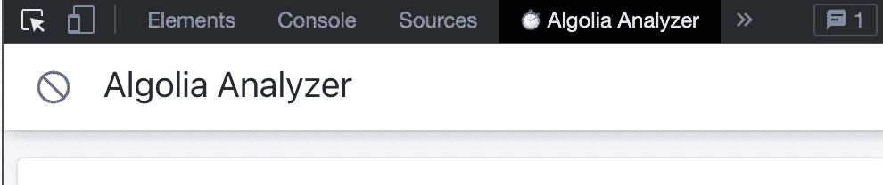
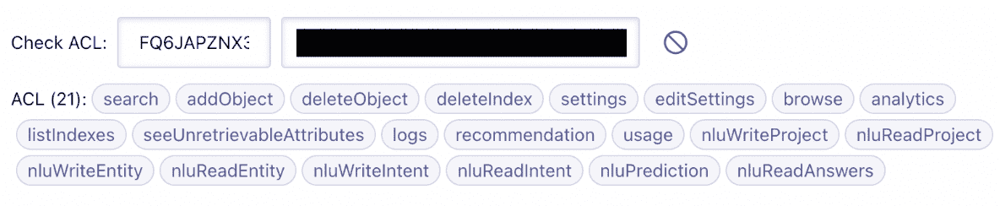
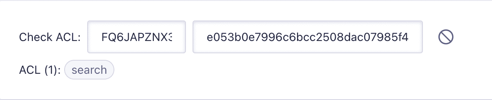
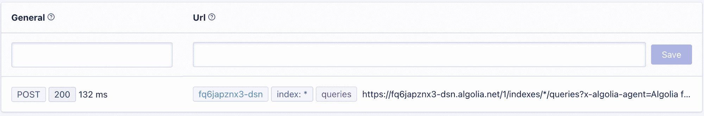
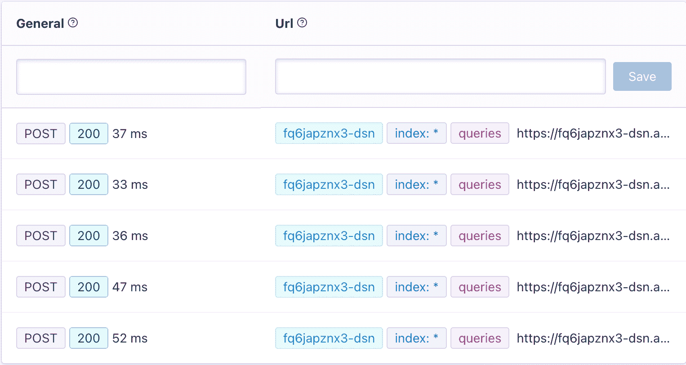
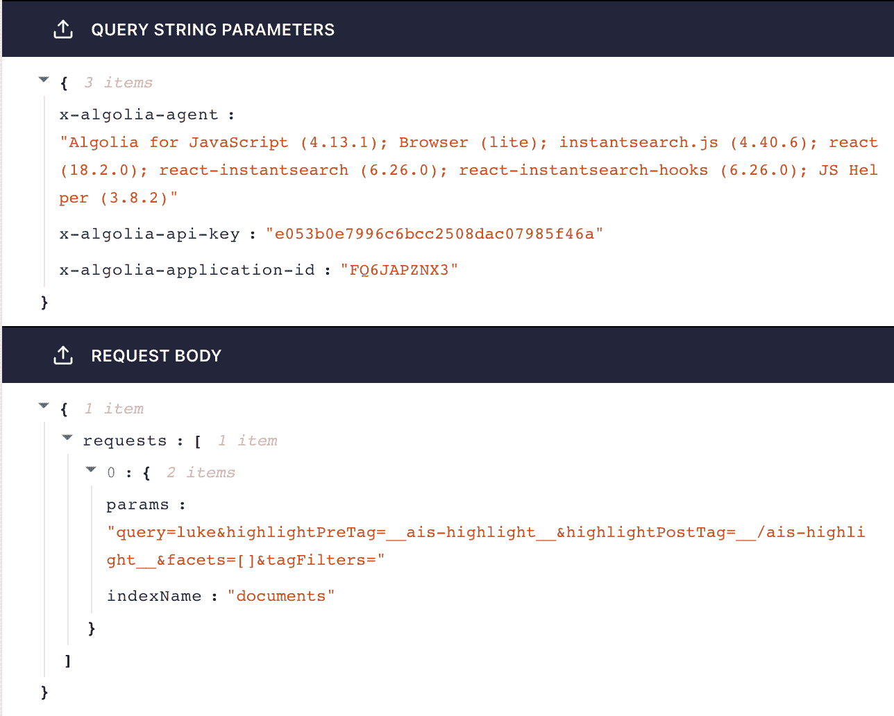
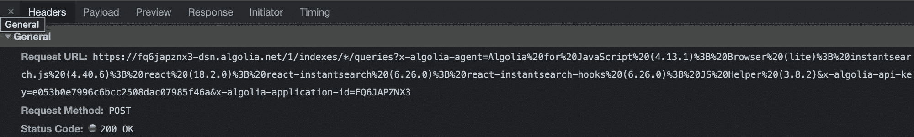
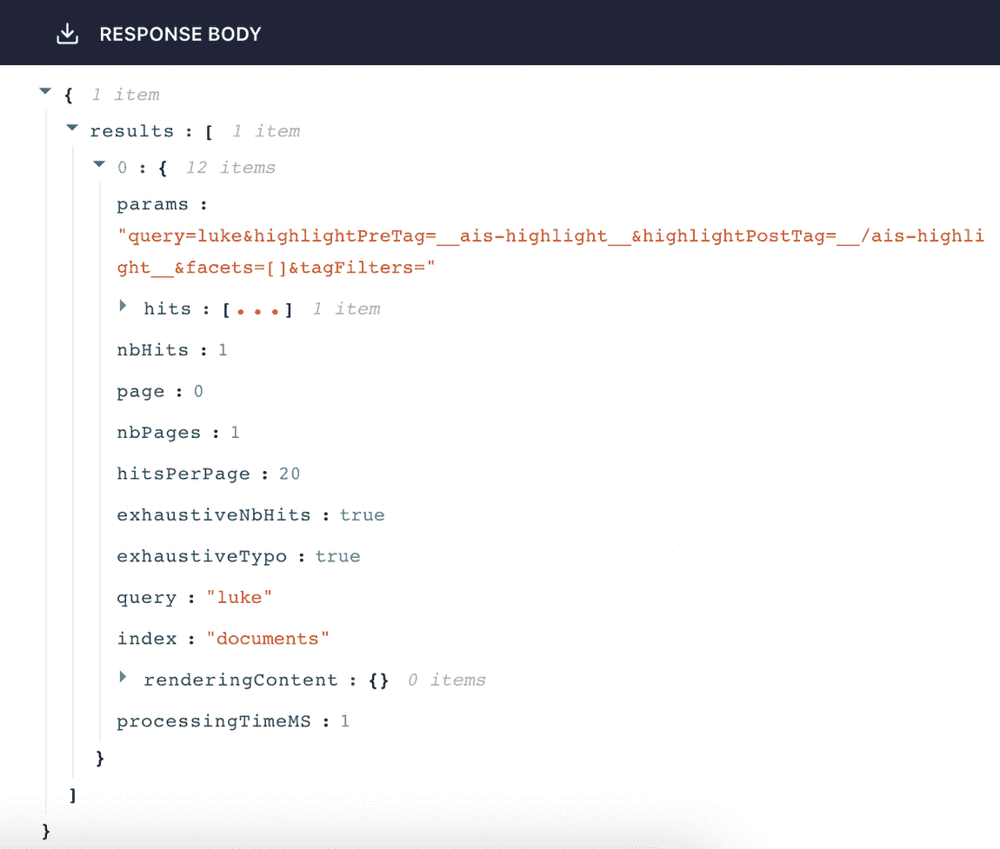

# 如何在 DevTools 中检查 Algolia 请求:Algolia 分析器扩展

> 原文：<https://www.algolia.com/blog/engineering/algolia-analyzer-browser-extension-inspect-algolia-specific-requests-in-devtools/>

你在浏览器的开发工具上花了多少时间？拜托，说实话。太多了，不是吗？别担心，我也是——我叫艾曼纽，是阿尔戈利亚公司的工程师。有时候我会花几个小时调试请求和 API 调用，所以我已经和 DevTools 中的 Network 选项卡成了非常非常好的朋友。但是像任何混乱的关系一样，我们有沟通问题:通常我会向它询问一些 API 调用的信息，但是 DevTools 给我的信息不清楚或者不如我期望的那样有用。

然后我有了一个想法。我是开发商，对吧？与其依赖通用工具来适应我非常具体的以 Algolia 为中心的用例，为什么我不能构建一个 Chrome 扩展来帮助我调试 Algolia 请求呢？

我照做了。在高层次上，该扩展在 Chrome DevTools 中添加了一个名为“ [Algolia 分析器](https://github.com/algolia/algolia-analyzer)”的新面板。起初这相当困难——我有扩展的经验，但没有将它们添加到 DevTools 的经验。我找到了[正确的文档](https://developer.chrome.com/docs/extensions/mv3/devtools/)，但是它们没有为版本 3 清单更新。幸运的是，它基本上是兼容的，但这种一开始就出现的小问题并没有让我充满希望。经过一番欺骗，我终于得到了这个新的定制面板:

我想做的第一件事是创建一个小工具来检查 API 键的访问控制列表。这非常有帮助，因为我们永远不应该在前端 Algolia 应用程序中使用 admin API 键(*或任何应用程序，如果我们能帮助它的话*)。你只能得到一把万能钥匙，可以解锁 Algolia 的任何功能，包括删除所有内容和为你注册更昂贵的计划——如果放在错误的环境中，这些功能肯定会被滥用。admin 键允许我们创建只具有特定权限的角色和 API 键，并且我们只在应用程序内部使用*和*。因此，我在这里添加了这个功能，以避免每次我们想要检查给定 API 键的权限时都必须进入我们的 Algolia 仪表板。

为了测试这一点，我去了我的同事 Jaden 为最近一个以 Algolia 为主题的项目制作的网站。它看起来是这样的，显然包含了 API 键:

当然，这里有一些危险的能力，这就是为什么我们不想在前端使用它(或者任何地方，如果可能的话)。想象一下，一些捣乱者看到你用了你的管理键，然后用了你的整个 Algolia 搜索索引。使用默认的搜索 API 键，它应该看起来更像这样:

好多了。

另一个有用的特性:向服务器发出的请求列表:

这是自动更新的，所以它向我们展示了我们的程序是如何与 Algolia 交互的。这个特定的应用程序只有一个初始搜索请求(只是为了显示结果的初始页面)，但当你真正开始搜索时，它会上升:

在搜索框中键入四个字符后，您已经进行了五次搜索(在这种情况下，我键入了`luke`，因此 Algolia 被 ping 为空白请求、`l`、`lu`、`luk`和`luke`)。结果上方的那些框让我只过滤某些类型的结果，如果您返回奇怪的错误或者如果您正在使用多个 Algolia 应用程序 id，这将非常有用。

如果你点击其中任何一个请求，你会看到一个解释这个请求的窗口:

在最初的描述中，已经有很多我发现自己在调试过程中经常需要的信息。例如，常见的故障诊断问题是“您使用的是最新版本的 __？”，这里我们可以在`x-algolia-agent`参数中说出所有相关库的确切版本。以前肯定可以在 DevTools 中找到这些信息，但是在 Network 选项卡中这部分看起来是这样的:

很大的进步，对吧？

下面是我们从 Algolia 得到的一个简洁的回复:

当然，我们可以在代码中和更通用的 DevTools 视图中访问所有这些数据，但是现在我们不需要担心到处粘贴`console.log`或者深入到一个视图中，该视图主要是为了帮助您确定您正在加载哪个 CSS 文件而设计的。多亏了我的 [Algolia 分析器浏览器扩展](https://github.com/algolia/algolia-analyzer)，所有 Algolia 特有的信息现在都在那里，都在一个地方。

不过，我不能假装这是刚刚发生的。实际上很难规划出哪些信息应该放在哪里。我不得不有意识地删掉一些不需要的部分，这样它们就不会挤掉重要的部分。我们对这里的信息是如何构建的进行了大量思考。我能够在这个项目中使用 React，因此它使组织过程更加精简。

如果你有兴趣使用这个扩展，我很乐意听到你的反馈！让我知道你是否可以在新的 DevTools 标签中使用其他的东西，通过发推特@Algolia 和添加 PR 到 GitHub repo 的[！我很高兴听到你的想法！](https://github.com/algolia/algolia-analyzer)