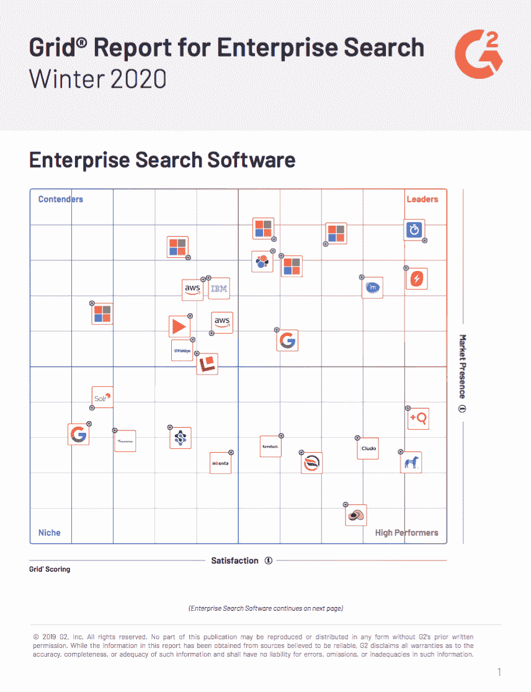

# Algolia 在 G2 的企业搜索软件类别中排名领先

> 原文：<https://www.algolia.com/blog/algolia/algolia-announced-leader-on-enterprise-search-software/>

# 市场已经说话，G2 正在倾听。

Algolia 的使命是让任何公司——无论规模大小或开发者数量多少——都能创造愉快的搜索和发现体验。

我们由全球 350 多名 Algolians 人组成的团队为这一使命而自豪，并为提供市场领先的搜索和发现解决方案而自豪，该解决方案是为开发人员、最终用户和企业 构建和优化的 **，旨在提供** **卓越体验，为所有人带来真正的价值。**

但更让我们自豪的是，当我们的客户在 G2 等对等点评网站上用自己的声音分享他们自己的体验和 Algolia 的成功时，我们脸上露出了笑容。

> *“类似谷歌的企业搜索，开箱即用…Algolia 非常易于使用，使实施企业搜索变得轻而易举。它为我们提供了 Elasticsearch 的几乎所有优势，但却是一个交钥匙解决方案。”*
> 
> *–**首席产品官***

来源:引自 G2.com Algolia 用户的话

每个月都有超过 100 万人，包括商务人士和买家，访问 G2 的网站，阅读软件和服务的评论。

在 G2 的 [企业搜索软件](https://www.g2.com/categories/enterprise-search) 类别中，我们今天荣幸地宣布，Algolia 已经获得了最高领导者排名——最值得一提的是在[2020 年冬季企业搜索网格报告](https://go.algolia.com/report-g2-winter-20) 中。这一最高排名是基于真实用户对 G2 评论表中特定搜索相关问题的反馈，这是 Algolia 连续第八个季度领先该报告。

来源:G2、[2020 年冬季电网报供企业搜索](https://go.algolia.com/report-g2-winter-20)

# 企业搜索软件市场买方指南

G2 将企业搜索定义为“对组织内存储的业务数据进行有组织的检索，用户可以在企业数据库中安全地输入和查找数据。”

今年，G2 扩展了这一定义，将“企业搜索软件还可以提供 **搜索即服务功能，允许企业安全地向外部来源(如移动应用程序和网站)公开选定的数据和信息源(包括产品目录、视频和营销内容)。通过索引，用户能够搜索这些数据，找到他们正在寻找的** “以支持客户旅程的关键方面，包括研究、发现、购买和/或购后活动。

这是 Algolia 的亮点，它满足了用户的搜索需求，为搜索和发现体验提供动力，将消费者与他们通过网络、手机或语音寻找的内容和服务联系起来。Algolia 使客户能够直观、快速地找到他们想要的东西，并激励他们停留更长时间，进一步参与和深入探索，最终带来更高的点击率和更多的转化。

在企业搜索软件类别中，Algolia 网站搜索在企业搜索产品中获得最高满意度:

*   **97%的用户将其评为 4 星或 5 星**
***   **94%的用户认为它正朝着正确的方向前进*****   **92%** 的用户表示他们可能会推荐 Algolia 网站搜索****

 ****与同类其他产品相比，Algolia 在企业搜索网格报告中获得了认证用户的积极评价，成为领先产品。该报告比较和对比了 Algolia 与其他供应商在用户满意度排名方面的表现，包括:

*   推荐的可能性
*   产品方向
*   商业价值
*   易用性
*   易于设置
*   支架质量。

→ [进入完整报告——企业搜索网格报告| 2020 年冬季](https://go.algolia.com/report-g2-winter-20)

此外，我们很荣幸 Algolia 在 G2 的企业搜索动量网格报告中被评为领导者，该报告通过用户满意度得分、员工增长和数字存在显示了产品在各自领域的增长轨迹，并根据用户满意度在 G2 的[“20 大企业搜索软件”列表中排名第一，](https://www.g2.com/categories/enterprise-search?tab=highest_rated) 。

# 安果用户评论 G2

以下是用户对 Algolia 的评价:

> “与我们电子商务网站的原始搜索工具相比，Algolia 代表了一个巨大的进步。它几乎可以即时提供更精确、更相关的搜索结果，让购物者的体验更有效率、更愉快。”T48
> 
> **–消费品行业的执行发起人**

> *“快速直观的搜索……搜索速度非常快，能够根据您的输入返回结果。我用 Algolia 创造的体验远超其他搜索提供商，而且非常容易实现。”T56*
> 
> **–高级网页开发人员**

> *“供应商关系总是倾向于承诺多于兑现。这是首批交付了同样多(甚至更多！)比承诺的。我对 Algolia 系统的性能感到惊讶。极快，准确，相关，立即更新，优雅，易于实施，轻而易举地定制。真的好得不能再好了。”T3*
> 
> **–技术执行总监**

要查看其他用户在 G2 上对 Algolia 的评价，请点击 [。](https://www.g2.com/products/algolia-site-search/references/algolia-on-g2)

了解更多有关我们针对客户和工作场所的[企业搜索解决方案的信息](https://www.algolia.com/products/search-and-discovery/enterprise/)。

我谨代表我们全球的员工，感谢我们 8，600 多名客户！您的意见和反馈让我们感到自豪，我们希望代表您继续改进和创新。****