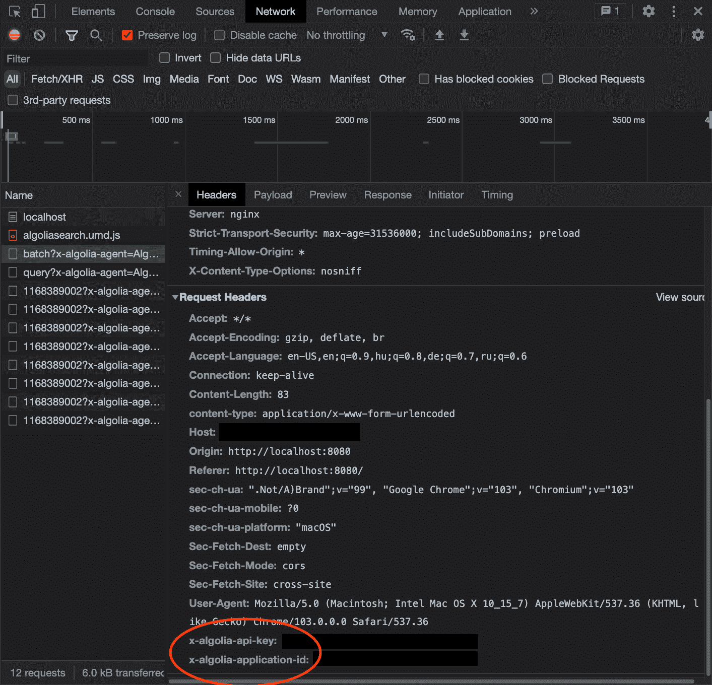
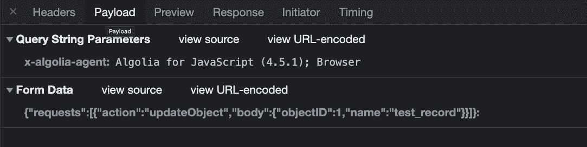
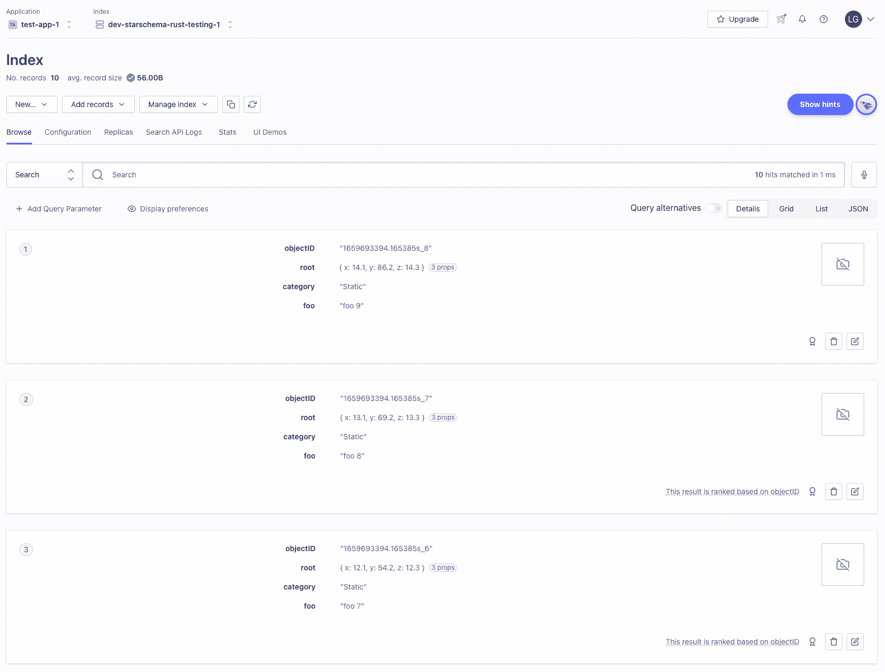
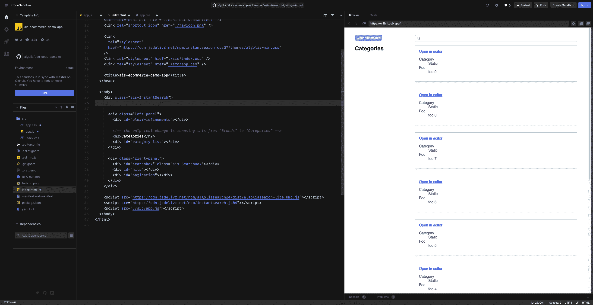

# 如何在 Rust 中使用 Algolia 作为游戏引擎调试工具

> 原文：<https://www.algolia.com/blog/engineering/algolia-as-rust-game-engine-debugging-tool/>

我们邀请我们在 Starschema 的朋友写一个结合 Rust 使用 Algolia 的例子。他们提出了一个非常独特的用例，我们希望它能启发你以不同的方式使用 Algolia。喝一杯饮料，享受高级开发人员久拉·拉斯洛的这篇文章吧！

* * *

大多数现代软件的数据驱动本质意味着调试也发生在两个不同的层次上:调试代码和调试代码使用的数据。虽然现代 ide 提供了大量的代码调试工具，但它们通常只包含非常基本的数据调试工具(最常用的是显示当前范围内变量的内容)。

ide 不能提供更高层次的数据调试服务，因为它们不知道你的数据的更高层次的结构。

## [](#example-scenario)举例场景

我们将使用的例子设想了一个小的游戏引擎开发团队作为一个更大的团队的一部分为游戏引擎(在 Rust 中)开发内容。挑战在于调试来自 QA 的案例。

如果我们假设单元测试捕捉到了最直接的错误(如打字错误、基本逻辑问题等)，这些 QA 问题通常源于这样一个事实，即由内容团队创建的数据与单元测试测试的场景有很大的不同，并且要复杂得多。调试通常涉及大量日志和运行期间创建的数据的运行后整理。

CD Project Red 使用的一种缓解这种痛苦的解决方案，在“[The Witcher 3:Optimizing Content Pipelines for Open-World Games](https://www.youtube.com/watch?v=p8CMYD_5gE8)”GDC talk 中进行了解释，就是为构建期间使用的每个实体建立一个可搜索的数据库。对于产品范围的问题，这是一个很好的解决方案(通常是针对内容开发人员的)，但是对于我们的“专注于核心代码开发的小团队”场景，这可能不是最好的解决方案:

*   它们需要所有其他团队的合作(以及产品范围的构建系统修改)
*   数据库需要维护
*   “所有的数据”对于这些调试会话来说通常是多余的(排序会消耗更多的时间)
*   不支持通过修改单个测试运行的数据来进行调试(因为整个数据库假设一个单一的、一致的输入数据集)

### [](#what-do-we-want)我们想要什么？

拥有一个数据库的想法感觉不错，但是我们有更多的要求:

*   我们希望从运行时数据(而不是构建时间)构建数据库
*   我们想要多个并行的数据库(因为团队可能正在处理许多问题)
*   实体数据是自由格式的——因为我们可能会在调试期间改变结构，所以我们不希望预先指定模式
*   我们不想浪费时间维护数据库
*   我们想要快速搜索能力`*`

`*` *关于“快速搜索”的一些注意事项:最常见的跟踪任务之一是跨多个实体匹配地址或 id，我们不希望为每个实体类型运行多个 SQL 查询，因为将相同的 id 复制粘贴到 9 个不同的查询，然后将结果复制粘贴到单个文本编辑器窗口进行检查，这既缓慢又缺乏动力。*

### [](#algolia)阿果

当查看 [Algolia](https://www.algolia.com/) 时，我们看到它符合我们的 DB 标准:

*   支持多个数据库
*   数据是自由形式的
*   无需维护
*   有很好的搜索能力
*   可以为搜索构建简单的自定义用户界面

考虑到这一点，我们可以创建一个列表，列出将数据传输到 Algolia 所需的代码:

*   我们需要一种简单的方法来标记 Algolia 序列化的数据(我们可以使用 JSON 序列化来达到这个目的)
*   创建一个可以向 Algolia 发送序列化数据的库(最好是通过一个简单的调用)
*   实现库的简单配置

## [](#sending-data-to-algolia)发送数据给阿哥利亚

### [](#where-do-we-send-it-and-how)我们把它送到哪里，怎么送？

Algolia 确实提供了关于如何使用 REST API 的[文档](https://www.algolia.com/doc/api-reference/rest-api/)，但是，目前可用的库都不能用于 Rust(没有 C 或 C++版本可以包装),所以我们必须利用用于生成客户端本身的 [API 客户端自动化](https://github.com/algolia/api-clients-automation)库。

作为基线，让我们看看提供的 [JavaScript 客户端示例:](https://api-clients-automation.netlify.app/docs/clients/guides/send-data-to-algolia)

```
// for the default version
import { algoliasearch } from 'algoliasearch';
// you can also import the lite version, with search only methods
// import { liteClient } from 'algoliasearch/lite';
const client = algoliasearch('<YOUR_APP_ID>', '<YOUR_API_KEY>');

// The records retrieved by any of your data sources
const recordsFromDataSource = [
  { name: 'Tom Cruise' },
  { name: 'Scarlett Johansson' },
];
// Here we construct the request to be sent to Algolia with the `batch` method
const requests: BatchOperation[] = recordsFromDataSource.map((record) => {
  return {
    // `batch` allows you to do many Algolia operations, but here we want to index our record.
    action: 'addObject',
    body: record,
  };
});
const { taskID } = await client.batch({
  indexName: '<YOUR_INDEX_NAME>',
  batchWriteParams: {
    requests,
  },
});
// Wait for indexing to be finished
await client.waitForTask({ indexName: '<YOUR_INDEX_NAME>', taskID });
console.log('Ready to search!'); 
```

所以这个过程看起来相当简单:

*   使用`APP_ID`和`API_KEY`为 Algolia 提供认证
*   打包我们想要发送的数据(见[本规范部分](https://github.com/algolia/api-clients-automation/blob/main/specs/search/paths/objects/batch.yml)
*   将请求发送到 Algolia
*   我们可以跳过等待索引完成(因为我们在核心代码中，我们希望避免长时间的等待)

直接使用 REST API 的一个缺点是，如果你没有使用官方 API 客户端，Algolia 不提供 SLA[T21。](https://www.algolia.com/policies/sla/)

### [](#authentication)认证

为了弄清楚认证是如何处理的，让我们跟踪一下`algoliasearch(...)`构造函数调用:

*   在`clients/algoliasearch-client-javascript/packages/algoliasearch/builds/browser.ts`中，我们看到默认的认证选项是`WithinQueryParameters`，并且是硬编码的——我们将使用它
*   稍后我们看到`clients/algoliasearch-client-javascript/packages/client-search/src/searchClient.ts`中的`createSearchClient()`实际上是在构建大部分`algoliaclient`对象(包括我们关心的部分)
*   这将使用`clients/algoliasearch-client-javascript/packages/client-common/src/createAuth.ts`中的`createAuth()`创建认证:

```
const credentials = {
  'x-algolia-api-key': apiKey,
  'x-algolia-application-id': appId,
};

return {
  headers(): Headers {
    return authMode === 'WithinHeaders' ? credentials : {};
  },

  queryParameters(): QueryParameters {
    return authMode === 'WithinQueryParameters' ? credentials : {};
  },
}; 
```

这清楚地表明，我们必须将`x-algolia-api-key`和`x-algolia-application-id`添加到用于认证的查询参数中。

### [](#the-hosts)东道主

目标主机列表来自`searchClient.ts`中的`getDefaultHosts()`函数，我们看到它有`read`、`write`和`readwrite`主机:

```
function getDefaultHosts(appId: string): Host[] {
  return (
    [
      {
        url: `${appId}-dsn.algolia.net`,
        accept: 'read',
        protocol: 'https',
      },
      {
        url: `${appId}.algolia.net`,
        accept: 'write',
        protocol: 'https',
      },
    ] as Host[]
  ).concat(
    shuffle([
      {
        url: `${appId}-1.algolianet.com`,
        accept: 'readWrite',
        protocol: 'https',
      },
      {
        url: `${appId}-2.algolianet.com`,
        accept: 'readWrite',
        protocol: 'https',
      },
      {
        url: `${appId}-3.algolianet.com`,
        accept: 'readWrite',
        protocol: 'https',
      },
    ])
  );
} 
```

当检查 Transporter `request()`方法时，我们可以看到`read`主机用于`GET`请求，而`write`主机用于其他所有事情。

由于调试不是关键任务，我们将忽略完全成熟的 Algolia 客户端使用的重试逻辑。

### [](#creating-the-request)创建请求

我们还可以在`.batch()`中看到`searchClient.ts`中的请求结构:

```
batch( { indexName, batchWriteParams }: ...) {
    // ...
    const requestPath = '/1/indexes/{indexName}/batch'.replace( '{indexName}', encodeURIComponent(indexName));
    // ...
    const headers: Headers = {};
    const queryParameters: QueryParameters = {};

    const request: Request = {
        method: 'POST',
        path: requestPath,
        queryParameters,
        headers,
        data: batchWriteParams,
    };

    return transporter.request(request, requestOptions);
}, 
```

我们可以看到请求的路径是`/1/indexes/<INDEX>/batch`，这个请求看起来像一个标准的`POST`请求。

当跟踪初始化它的`createTransporter()`调用时，我们看到它添加了一个带有`Algolia for JavaScript (<VERSION>)`值的`x-algolia-agent`查询参数。

### [](#reality-check)真人检查

解决了大部分细节后，我们想使用官方的 Algolia Client SDK for Javascript 创建一个快速测试，以检查我们关于发送数据的假设是否正确。使用 [Javascript 客户端文档](https://www.algolia.com/doc/api-client/getting-started/install/javascript/?client=javascript)，很容易将一个简单的 HTML 文件放在一起，向 Algolia 发出批量上传请求:

```
<html>
    <head>
        <!-- load the Algolia JS library -->
        <script src="<https://cdn.jsdelivr.net/npm/algoliasearch@4.5.1/dist/algoliasearch.umd.js>"></script>
    </head>
    <body>
        <script>
            // Connect and authenticate with your Algolia app
            const client = algoliasearch('<APP CODE>', '<ADMIN API TOKEN>')

            // Create a new index and add a record
            const index = client.initIndex('<INDEX>')
            const record = { objectID: 1, name: 'test_record' }
            index.saveObject(record).wait()

            // Search the index and print the results
            index
                .search('test_record')
                .then(({ hits }) => console.log(hits[0]))
        </script>
    </body>
</html> 
```



当在浏览器中运行时，我们可以看到它在工作，但是，我们看到的一个区别是`x-algolia-api-key`和`x-algolia-application-id`认证密钥是在头中发送的，而不是在查询字符串中。我们将记下这一点并使用它，而不是将它们作为查询参数传递。



另一个值得注意的地方是，请求的内容类型(尽管有 JSON 主体)是`application/x-www-form-urlencoded`，而不是`application/json`(正如人们猜测的那样)或`text/plain`(作为传输的默认内容类型)。我们认为这是一种暗示，在遇到问题之前，可以忽略内容类型。

## [](#rust-pieces)锈件

### [](#marking-the-data-for-serialization)标记用于序列化的数据

为了处理序列化，我们将使用 [SerDe](https://serde.rs/) 库。

> SerDe 是一个有效和通用地序列化和反序列化 Rust 数据结构的框架。

这要求我们的结构实现`Serialize`特征(对于大多数结构来说)，我们只需要给它们的定义添加一个`Serialize`派生:

```
// A vector of 3 floats.
//
// The serialized form will look like `{"x":14.1,"y": 86.2,"z":14.3}`
#[derive(Serialize)]
struct Float3 {
    x: f32,
    y: f32,
    z: f32,
} 
```

我们在 JavaScript 客户端 SDK 的示例代码中看到的一个额外的位是`objectID`字段。引用 [Algolia 索引文档](https://www.algolia.com/doc/api-client/methods/indexing/):

> 索引中的每个对象(记录)最终都需要一个惟一的 ID，称为 objectID。您可以自己创建 objectID，并在索引时发送它。如果您没有发送 objectID，Algolia 会为您生成它。
> 
> 无论是发送的还是生成的，一旦添加了记录，它就会有一个唯一的标识符，称为 objectID。

对于我们的应用程序来说，自动生成惟一的 ID 是理想的，但是在现实中，当向批处理摄取端点发送数据时，所有对象都必须有一个 objectID 字段，我们可以使用 SerDe 来[重命名/转换/重新排列字段](https://serde.rs/field-attrs.html)。

```
// create a string key from the integer and add a prefix for unique id
fn particle_emitter_object_id<S>(id: &i32, s: S) -> Result<S::Ok, S::Error>
where
    S: Serializer,
{
    s.serialize_str(format!("particle_emitter_{}", id))
}

// An example entity that  a customized objectID for serialization
// The `rename_all` is used to transform underscored_name_format to camelCaseNameFormat
#[derive(Serialize, Deserialized, Debug)]
#[serde(rename_all = "camelCase")]
struct ParticleEmitterEntity {
  // serialize this field as `objectID`, but transform it using the `particle_emitter_object_id` field
  #[serde(rename = "objectID", serialize_with="particle_emitter_object_id")]
  id: i32,
  // nested objects are automatically serialzied
  root_position : Float3,
  // ...
} 
```

### [](#sending-the-data)发送数据

我们将使用 [Reqwest](https://crates.io/crates/reqwest) 板条箱进行 HTTP 传输:

```
[dependencies]
reqwest = { version = "0.11", features = ["blocking", "json"] }
urlencoding = { version = "2.1" } 
```

```
use urlencoding;

fn main() -> Result<(), Box<dyn std::error::Error>> {

  // The credentials data
  const APP_ID: &str = "<APP ID>";
  const INDEX_NAME: &str = "<INDEX NAME>";
  const API_KEY: &str = "<ADMIN API KEY>";
  const ALGOLIA_AGENT: &str = "Algolia DataSender for Rust Dev (0.0.1)";

  // build the URI for the batch
  let host = format!("{}.algolia.net", APP_ID.to_lowercase());
  // The index name can have non-url-friendly characters
  let path = format!("/1/indexes/{}/batch", urlencoding::encode(INDEX_NAME));
  let uri = format!("https://{}{}", host, path);
  let uri_with_client = format!("{}?x-algolia-agent={}", uri, ALGOLIA_AGENT);

  // The batch data needs to be in the proper batch request format.
  // <SERIALIZATION CODE GOES HERE>
  // let data = ....

  // The `blocking` client waits for the request to complete
  let client = reqwest::blocking::Client::new();
  let res = client
      .post(uri_with_client)
      .header("x-algolia-api-key", API_KEY)
      .header("x-algolia-application-id", APP_ID)
      .body(data)
      .send()?;

  Ok(())
} 
```

### [](#pre-serialization)预序列化

因为我们的目标是能够向 Algolia 发送任意类型，所以我们并不真正关心底层对象，只关心数据。这很有帮助，因为如果我们想在一个缓冲区中存储实际的对象，我们将很难管理 Rust 中的对象生存期(并且我们必须做的类型魔术将是密集和不可穿透的)。解决方案是在对象到达时将它们序列化到一个共享缓冲区中，并在成批发送对象时从预先序列化的格式开始工作。

Serde 序列化不适合组合预先序列化的数据，所以我们将以非信任的方式进行:我们通过字符串操作而不是类型安全的序列化代码来组合数据。

```
[dependencies]
serde = { version = "1.0", features = ["derive"] }
serde_json = { version = "1.0" } 
```

```
use serde::Serialize;

// ...

// The data we'll send for testing
#[derive(Serialize, Debug)]
struct Float3 {
    #[serde(rename="objectID")]
    object_id: String,
    x: f32,
    y: f32,
    z: f32,
}

// RECREATE THE REQUESTS STRUCTURE
// -------------------------------

// {"requests":[{"action":"updateObject","body":{"objectID":1,"name":"test_record"}}]}

// convert a pre-serialized JSON object into a request object for a batch request
fn build_batch_request_entry(data: &String) -> String {
    format!("{{\\\\"action\\\\":\\\\"updateObject\\\\",\\\\"body\\\\":{}}}", data)
}

// wrap the individual requests into a batch
fn wrap_batch_request_entry(rows: &Vec<String>) -> String {
    format!("{{\\\\"requests\\\\":[{}]}}", rows.join(","))
}

// Create some raw data we'll send for testing
let raw_data = vec![
    serde_json::to_string(&Float3 {
        object_id: String::from("point1"),
        x: 0.1,
        y: 0.2,
        z: 0.3,
    })
    .unwrap(),
    serde_json::to_string(&Float3 {
        object_id: String::from("point2"),
        x: 1.1,
        y: 1.2,
        z: 1.3,
    })
    .unwrap(),
];

// transform the list of raw data objects to individual `updateObject` requests,
// then collect and wrap them in the `requests` array for the batch Algolia request
let data = wrap_batch_request_entry(&raw_data.iter().map(build_batch_request_entry).collect()); 
```

使用这些预先包装的数据，我们可以将它们组合成一个向 Algolia indices 提交数据的工作示例，您可以在 [example1.rs](https://gist.github.com/makvoid/8f88fd81e9ec4fb21ce471543a0a8152) 中找到该示例。

### [](#wrapping-up-into-a-neat-api)包装成一个整洁的 API

既然传输和数据编码已经准备好了，我们可以把它包装成一个简洁的 API:

```
// Allows sending serializable data to Algolia indices
pub struct AlgoliaSender {
    /// ...
}

impl AlgoliaSender {

  // create a new sender with the given credentials and index
  pub fn new(app_id: &str, api_key: &str, index_name: &str) -> Self { }

  // adds a new serializable item to the list to be sent on the next send_items() call
  pub fn add_item<T>(&mut self, v: &T) where T: Serialize {}

  // Send the items to the default index
  pub fn send_items(&mut self) {}

  // Sends items to the ingestion endpoint in a batch job to a specified index
  pub fn send_items_to_index(&mut self, index_name: &str) {}
} 
```

然后可以这样使用:

```
// create a sender
let mut sender = AlgoliaSender::new(APP_ID, API_KEY, INDEX_NAME);

// add some items to send
sender.add_item(&Float3 {
    object_id: String::from("point3"),
    x: 0.1,
    y: 0.2,
    z: 0.3,
});
sender.add_item(&Float3 {
    object_id: String::from("point4"),
    x: 1.1,
    y: 1.2,
    z: 1.3,
});

// send the items in a request (so batch split points can be controlled)
sender.send_items(); 
```

关于此步骤的完整代码，请参见[示例 2.rs](https://gist.github.com/makvoid/a76bcfcf516ac4f336e273f2dc7faa06) 。

### [](#adding-individual-object-ids)添加单个对象 id

由于我们并不真的想将`objectID`字段添加到我们的内部数据结构中，我们必须添加一些额外的逻辑来为我们生成这些字段。

首先，让我们为这些 id 创建一个生成器:

```
// Generates unique IDs to use as ObjectIds.
//
// This implementation combines a prefix with an incremental index.
pub struct IdGenerator {
    prefix: String,
    idx: i32,
}

impl IdGenerator {
    // Creates a new IdGenerator with the given prefix
    pub fn new(prefix: String) -> Self {
        IdGenerator { prefix: prefix, idx: 0 }
    }

    // Creates a new IdGenerator with the current epoch time as prefix
    pub fn new_from_time() -> Self {
        let now = SystemTime::now();
        let prefix = format!("{:?}", now.duration_since(std::time::UNIX_EPOCH).unwrap_or_default());
        Self::new(prefix)
    }

    // Returns a new integer id and increments the internal counter
    pub fn next_i32(&mut self) -> i32 {
        let idx = self.idx;
        self.idx += 1;
        idx
    }

    // Returns a concatenated string id and increments the internal counter
    pub fn next_string(&mut self) -> String {
        let next_id = self.next_i32();
        format!("{}_{}", self.prefix.as_str(), next_id)
    }
} 
```

然后我们可以进行难看的字符串操作，将生成的 objectID 注入到已经序列化的对象中。这假设我们发送的所有东西都是一个对象，而不是一个数组或原始值 Algolia 期望对象，这对我们来说正好。我们使用`filter_map()`来跳过太短的条目(很可能是无效的 JSON)。

```
// converts a pre-serialized JSON object into a request object for a batch request using DANGEROUS STRING MAGIC
fn build_batch_request_entry(id: &String, data: &String) -> Option<String> {
    if data.len() <= 2 {
        return None;
    }

    // Skip the opening curly brace and inject our objectID into the already serialized object
    let remaining_data:String = data.chars().skip(1).collect();
    Some(format!("{{\\\\"action\\\\":\\\\"updateObject\\\\",\\\\"body\\\\":{{\\\\"objectID\\\\":\\\\"{}\\\\",{}}}", id, remaining_data))
}
 // Wrap all pre-serialized data with an object id and the `updateObject` request, then collect into a batch request
let data = wrap_batch_request_entry(
    &self
        .data_buffer
        .iter()
        .filter_map(|entry: &String| -> Option<String> { build_batch_request_entry(&self.id_generator.next_string(), entry) })
        .collect(),
); 
```

这一步的完整代码可以在 [example3.rs](https://gist.github.com/makvoid/c6c65034d95abe53f745429b3b027cb9) 中找到。

### [](#exposing-to-c-c)向 C / C++公开

由于我们的库分为两个不同的部分:将对象序列化为 JSON 和发送数据，我们实际上可以将 Rust 库暴露给 C / C++代码，以便轻松地从这些语言获取数据。如果他们能提供 JSON 序列化的数据，我们就可以发送。

我们的目标是拥有一个带有构造函数和析构函数的 API 来模拟 Rust 端的公共 API。以下是这些函数的第一稿，强力实现:

```
[dependencies]
libc = "0.2" 
```

```
// We need to support adding pre-serialized data directly
impl AlgoliaSender {
    //...

    // adds an already serialized value to be sent
    pub fn add_raw_item(&mut self, data: &str) {
        self.data_buffer.push(String::from(data));
    }

    // ...
}

// C API
// -----

// Constructor for the AlgoliaSender struct from C.
// Returns nullptr if any of the parameters are empty.
#[no_mangle]
pub unsafe extern "C" fn algolia_sender_new(app_id: *const libc::c_char, api_key: *const libc::c_char, index_name: *const libc::c_char) -> *mut AlgoliaSender {

    // rustify all parameters
    let app_id_str: &str = std::ffi::CStr::from_ptr(app_id).to_str().unwrap_or("");
    let api_key_str: &str = std::ffi::CStr::from_ptr(api_key).to_str().unwrap_or("");
    let index_name_str: &str = std::ffi::CStr::from_ptr(index_name).to_str().unwrap_or("");

    // check these parameters
    if app_id_str.is_empty() || api_key_str.is_empty() || index_name_str.is_empty() {
        return std::ptr::null_mut();
    }

    // create a new sender and Box it, and use `Box::into_raw()` to get a pointer that outlives this function call
    let struct_instance = AlgoliaSender::new(app_id_str, api_key_str, index_name_str);
    let boxed = Box::new(struct_instance);
    Box::into_raw(boxed)
}

// Destructor for the AlgoliaSender struct from C
#[no_mangle]
pub unsafe extern "C" fn algolia_sender_destroy(struct_instance: *mut AlgoliaSender) {
    // let the Rust lifetime take over and destroy the instance after the function is done
    Box::from_raw(struct_instance);
}

// Adds an item to be sent to the target sender
#[no_mangle]
pub unsafe extern "C" fn algolia_sender_add_item(a: *mut AlgoliaSender, data: *const libc::c_char) {
    // convert data
    let data_str = match std::ffi::CStr::from_ptr(data).to_str() {
        Err(_) => return,
        Ok(s) => String::from(s),
    };

    // attempt to add it
    match a.as_mut() {
        None => return,
        Some(sender) => sender.add_raw_item(data_str),
    };

}

// Trigger the sending of items
#[no_mangle]
pub unsafe extern "C" fn algolia_sender_send_items(a: *mut AlgoliaSender) {
    // attempt to send the items
    match a.as_mut() {
        None => return,
        Some(sender) => sender.send_items(),
    };
} 
```

这一步的完整源代码可以在 [example4.rs](https://gist.github.com/makvoid/406c0a8167c01942c9c147ed10a823a8) 中找到。

## [](#sample-use-case)示例用例

我们的例子相当简单:

*   内容团队通过放置对象和编写程序性内容生成规则来创建地图
*   我们希望保留一个包含所有对象(包括过程对象)的可搜索数据库
*   我们希望能够通过任何属性找到对象，并在浏览器中显示该对象的已知属性
*   从浏览器搜索中，我们希望能够在内部编辑器工具中快速转到该对象进行评估(使用带有自定义协议的链接)

我们想要发送的数据结构如下所示:

```
#[derive(Serialize)]
pub enum EntityCategory {
  StaticEntity,
  ...
}

#[derive(Serialize)]
pub struct PlacedEntity {
  // The root position of the object -- we'll use these coordinates to create the link to open the editor
  root: Float3,

  // we'll use this as an example of adding selectable categories to the search UI.
  category: EntityCategory,
  // other properties
  // ...
} 
```

类别枚举以整数的形式存储，但幸运的是，默认情况下 [SerDe 将枚举表示为“外部标记的”](https://serde.rs/enum-representations.html)，因此它们应该以字符串而不是整数的形式到达 Algolia。我们将使用这个类别属性在 UI 上添加一个“类别选择器”。

为了能够跟踪静态和过程对象，我们可以在对象创建后使用库将对象数据发送给 Algolia。对于这个例子，我们假设一个`ObjectContainer::place_entity()`用于放置单个对象，在添加一批对象后调用`ObjectContainer::placement_done()`。

```
// ...
impl ObjectContainer {
  pub fn new() -> Self {
    Self {
      //...
      algolia_sender: AlgoliaSender::new( /* ... */),
    }
  }
  // ...
  pub fn place_entity(&mut self, e: &PlacedEntity) {
    // ...
    self.algolia_sender.add_item(e);
    // ...
  }
  // ...
  pub fn placement_done(&mut self) {
    // ...
    self.algolia_sender.send_items();
    // ...
  }
} 
```

### [](#marking-the-data-as-searchable)将数据标记为可搜索

根据文档，要为搜索 UI 设置数据，我们必须告诉 Algolia 要搜索哪些属性才能获得更好的结果:

> 创建索引时，默认情况下，所有记录中的所有属性都是可搜索的。默认情况下，所有属性都是可搜索的，这使您可以从一开始就执行搜索，而无需进行任何配置。然而，如果您想让您的搜索更相关，并消除干扰，您只需将有意义的属性设置为可搜索的。

对于我们的用例，这种“search all”行为很好，但如果我们想要一种更细粒度的方法，我们可以使用现有的 [Algolia API 客户端](https://www.algolia.com/doc/guides/sending-and-managing-data/prepare-your-data/how-to/setting-searchable-attributes/#using-the-api)或 [Algolia 仪表板](https://www.algolia.com/doc/guides/sending-and-managing-data/prepare-your-data/how-to/setting-searchable-attributes/#using-the-algolia-dashboard) ( *注意:嵌套属性(子对象)[不能从仪表板添加，只能从 API](https://www.algolia.com/doc/guides/sending-and-managing-data/prepare-your-data/how-to/creating-and-using-nested-attributes/#where-you-can-use-nested-attributes)* )。



## [](#the-search-ui)搜索 UI

Algolia InstantSearch 提供了一种非常简单的方法来为浏览器构建自定义用户界面，让我们可以搜索我们的数据。我们将简单地复制 [InstantSearch 入门指南](https://www.algolia.com/doc/guides/building-search-ui/getting-started/js/)并根据我们的需要进行修改。

我们可以保留大部分布局和 HTML:

```
<!DOCTYPE html>
<html lang="en">
  <!-- exact same <head> as in the demo -->
  <body>
    <div class="ais-InstantSearch">
      <div class="left-panel">
        <div id="clear-refinements"></div>
        <!-- the only real change is renaming this from "Brands" to "Categories" -->
        <h2>Categories</h2>
        <div id="category-list"></div>
      </div>
      <!-- exact same <div class="right-panel"> as the in the demo -->
    </div>
    <!-- same <script> tags as in the demo -->
  </body>
</html> 
```

Javascript 也几乎与演示相同，除了设置类别列表而不是品牌列表，并更改显示的点击以包含我们的属性。

这里唯一不同寻常的地方是对 hits 进行了定制，包括一个自定义 URL，它可以打开一个外部编辑器，作为 Algolia 与外部应用程序交互的演示:

```
<a href="editor:goto:x:{{root.x}}:y:{{root.y}}:z:{{root.z}}">Open in editor</a> 
```

```
/* global instantsearch algoliasearch */

const search = // ...same as the demo

search.addWidgets([
  instantsearch.widgets.searchBox({
    container: '#searchbox',
  }),
  instantsearch.widgets.clearRefinements({
    container: '#clear-refinements',
  }),
  // categories instead of brands
  instantsearch.widgets.refinementList({
    container: '#category-list',
    attribute: 'category',
  }),
  // customize the hit display
  instantsearch.widgets.hits({
    container: '#hits',
    templates: {
      item: `
        <div>

          <a href="editor:goto:x:{{root.x}}:y:{{root.y}}:z:{{root.z}}">Open in editor</a>
          <dl>
            <!-- The attributes we're interested in -->
            <dt>Category</dt>
            <dd>{{#helpers.highlight}}{ "attribute": "category" }{{/helpers.highlight}}</dd>

            <!-- ... other attributes -->

          </dl>
        </div>
      `,
    },
  }),
  instantsearch.widgets.pagination({
    container: '#pagination',
  }),
]);

search.start(); 
```

只需几行修改，我们的基本搜索 UI 就准备好了:我们可以搜索对象，按类别过滤它们，并在外部编辑器中打开对象:



# [](#potential-further-steps)势更进一步

### [](#async-sending-of-data)异步发送数据

[Tokio](https://tokio.rs/) create 为 Reqwest 提供异步支持，可用于实现数据的异步发送。使用异步包装器会使调用从 C / C++导出的函数变得复杂，并且会扰乱其他运行代码的 CPU 内核分配。

### [](#retry-logic)重试逻辑

所有 Algolia 客户端都实现了重试失败的请求(并在不同的目标服务器上重试)。在将数据传输转移到异步处理之后，将重试逻辑作为一个单独的层添加是相对容易的。

### [](#less-string-manipulation)操纵少弦

虽然我们很喜欢`format!`连接字符串，但如果 objectID 的生成更像 Rust 就更好了:一个`objectID`特征和一个好的`derive`宏对大多数用例来说是更好的解决方案，因为它们允许控制和可重复性，但保持了灵活性。

```
pub trait objectID {
  fn object_id(&self) -> String;
}

#[derive(Serialize, objectID)]
#[object_id(prefix="something", field="id")]
struct Something {
  id: i32,
}

impl objectID for Other {
  // ....
} 
```

* * *

*我们希望你喜欢 Gyula 的这篇深入的文章，如果你正在寻找更多这样的内容，我们在 [Algolia 博客](https://www.algolia.com/blog/)上有更多的主题！如果你是 Algolia 的新手，你可以通过注册一个[免费等级账户](https://www.algolia.com/users/sign_up?utm_source=blog&utm_medium=main-blog&utm_campaign=devrel&utm_id=blog-algolia-and-rust)来尝试一下。*