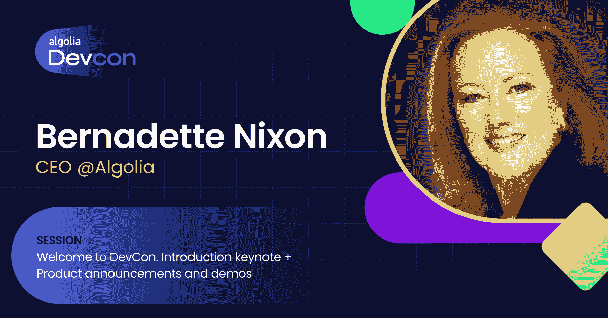

# 了解 Algolia 即将举办的 DevCon 2022 -到时见

> 原文：<https://www.algolia.com/blog/engineering/algolia-devcon-2022-highlights/>

为了帮助您规划您的会议，我们邀请了 Algolia 开发者倡导者 Chuck Meyer 和 Michael King 向我们介绍他们最期待在今年的 DevCon 上看到的会议和研讨会。

## 顶镐

### 1.主题演讲(太平洋标准时间 9 月 14 日上午 8 点)

我们确信这个最佳选择并不令人惊讶。在今年的主题演讲中，首席执行官 Bernadette Nixon 和产品团队将带领我们了解 Algolia 对开发人员体验的愿景，并通过一个*不断发展的*演示展示新功能。

### 2.演示实验室(太平洋标准时间 9 月 14 日上午 8 点到中午 12 点)

如果没有现场编码会议，开发者大会会是什么样的？Algolia 的工程师将在周三全天主持一系列现场演示，并通过聊天回答问题。Chuck 对推荐演示特别兴奋，它延续了主题演讲中的概念。

### 3.在一个遥远的世界中扩展文化(太平洋标准时间 9 月 14 日上午 9:50)

构建和导航文化可能很棘手，而且随着越来越多的开发人员转向远程优先的环境，它只会变得越来越复杂。在这次演讲中，Twilio 文化传播副总裁 Ricky Robinett 分享了几个故事，这些故事教会了他文化如何走向正确的道路，或者走向错误的道路。在这个演讲的最后，你将带着三个不同的文化领域离开，在你作为一个开发者的旅程中，你可以关注这些领域。

### 4.新的 Algolia CLI 将告别手工操作(太平洋标准时间 9 月 14 日上午 11:50)

介绍官方的 Algolia CLI——一个功能强大的轻量级开发工具，用于直接从命令行管理您的 Algolia 应用程序。Michael 喜欢 CLI 帮助您操作索引的方式——修改配置、创建设置快照等等！参加本次会议，了解 Algolia CLI 的功能。

### 5.搜索和发现研讨会(太平洋标准时间 9 月 15 日上午 8 点到中午 12 点)

唯一比看别人写代码更好的事情就是自己动手写代码！周四，我们将举办一系列研讨会，帮助您提升使用 Algolia 的最佳实践。无论你是在使用 Next、js、vanilla JavaScript，还是在 Flutter 中构建移动应用，我们都为你准备了一个研讨会！

### 6.交付卓越的开发者体验(太平洋标准时间 9 月 14 日上午 11:30)

什么是开发者体验(DX)？让我们深入了解 Algolia 员工工程师 Sarah Dayan 发表的见解，她自 2021 年 6 月以来一直主持 DX 播客。向 Netlify、Vercel、CodeSandbox 和 Tailwind Labs 等行业领导者学习他们如何定义伟大的 DX，以及如何利用它来脱颖而出。

### 7.开发者真正在寻找什么？(太平洋标准时间 9 月 14 日上午 10:30)

有没有想过其他开发人员在搜索开源库时会输入什么？在这个有趣的互动演讲中，创始人 Lior Grossman 讲述了 Openbase 团队在扩展到 Algolia 的数百万用户时从搜索分析中学到的五个花絮。

### 8.个性化引擎的七大功能障碍(太平洋标准时间 9 月 14 日上午 8:50)

个性化——客户体验的圣杯。每个人都在谈论它，但很少有人真正知道如何正确地做它。有一个很好的理由:个性化不是一个勾选框练习。这是一项复杂的任务，因为每个用户都是独一无二的，需要尊重他们的隐私，同时还要提供个性化的体验。这是一个学习会议，探讨个性化引擎的七个最常见的功能障碍以及克服它们的策略。

## 其他精彩会议

很难缩小列表的范围，所以这里列出了一天中你会发现的所有其他精彩会议:

### 增进理解:未来的语义搜索(太平洋标准时间 9 月 14 日上午 10:10)

语义搜索是未来，但它是现在吗？在这个演讲中，我们将了解语义搜索的内容，透过宣传来看看它真正能做什么，并了解它如何有助于更好地理解用户的搜索。

### 借助连接器和流程加快您的实施(太平洋标准时间 9 月 14 日上午 11:10)

想要快速启动您的 Algolia 实施吗？想让别人来处理您的数据更新和同步吗？在本次讲座中，我们将介绍我们即将推出的两个数据功能:连接器和流，它们将帮助您提取和转换数据，并自动将其加载到 Algolia 中。

### 即时搜索，从 7 年前推出到今天(太平洋标准时间 9 月 14 日上午 9:10)

一个伟大的搜索引擎没有一个伟大的用户界面，用户可以很容易地互动，查找和探索。在本次演示中，我们将回顾 Algolia InstantSearch 的 7 年历程。我们将探索我们已经走了多远，以及前端开发人员构建世界级搜索和发现体验的未来。

你可以在 [DevCon 2022 网站](https://www.algolia.com/devcon/#agenda "https://www.algolia.com/devcon/#agenda")上查看完整议程，当然还有[注册](https://algolia.com/devcon "https://algolia.com/devcon")，这样我们就能在那里看到你了！