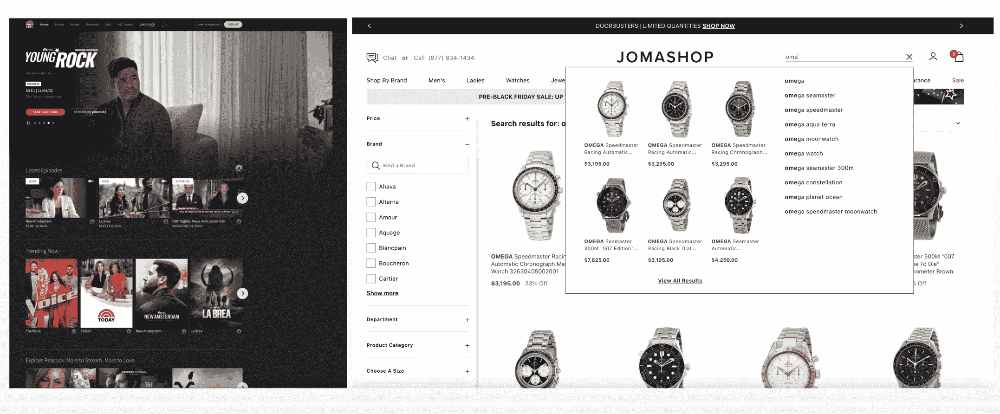
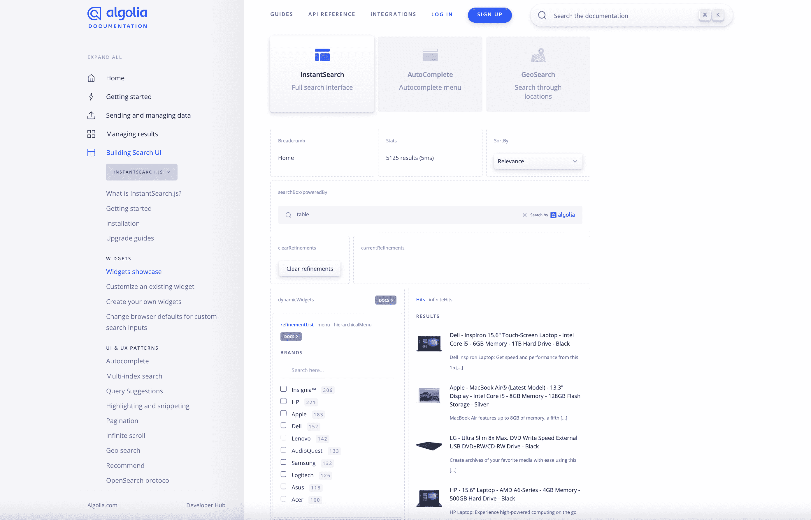
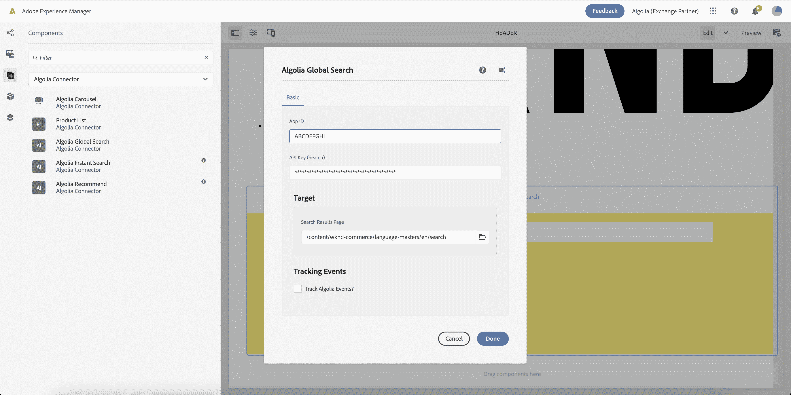
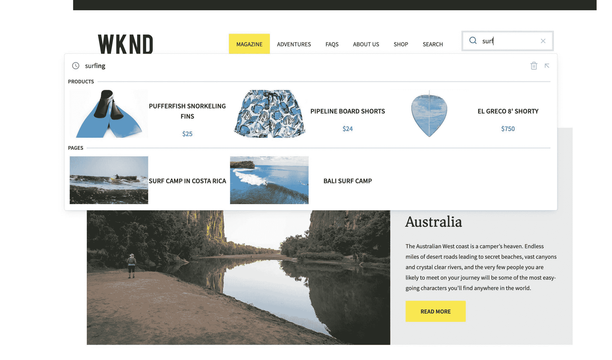
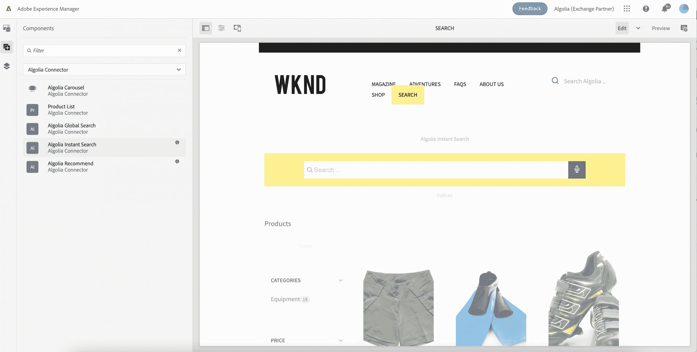
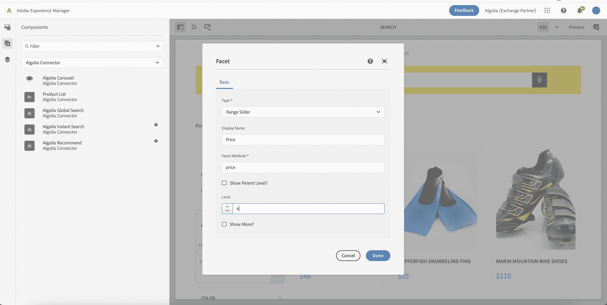
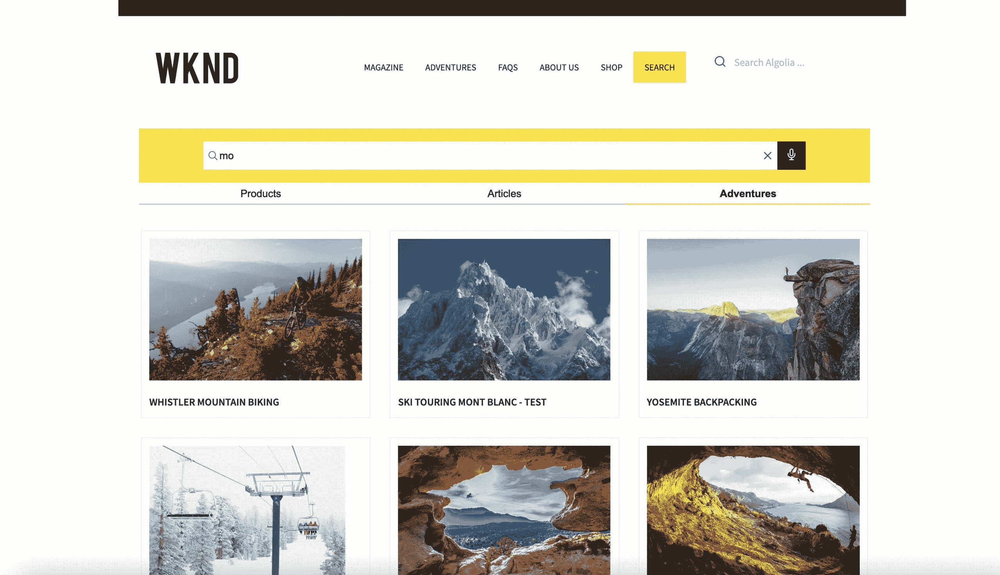

# Adobe 体验管理器上的 Algolia 支持的搜索组件

> 原文：<https://www.algolia.com/blog/product/algolia-powered-search-components-on-adobe-experience-manager/>

当有人访问一家数字企业时，第一印象非常宝贵。要么他们被自己看到的东西所吸引，想要进一步参与——要么他们从网站上退下来。数字 b 企业必须展示与用户意图相匹配的内容，个性化的内容，与该周相关的内容，并与他们的商业战略保持一致。他们必须分析如何充分利用他们的网站，从搜索结果中的第一个项目，到分类页面的第一行，到屏幕顶部的横幅——尤其是在移动设备上。他们必须计划如何在每个季节、销售周期和促销中做出改变——以一种对他们的出版商、编辑和商人来说具有战略意义和高效的方式。最成功的数字企业会对内容和产品发现进行深思熟虑，并投资合适的工具来提高参与度、忠诚度、转化率和收入。

越来越多的企业转向**Adobe Experience Manager(AEM)**来管理他们的内容并创建丰富的全渠道体验。AEM 是企业内容管理的领导者，能够处理全球组织的复杂性，并为出版商建立工作流，以构建和管理他们的网站。它是可扩展的，使得在平台之上构建增强的用户体验更加容易。然而，AEM 用户很难创建强大的搜索和发现体验。他们在内容上投入了大量资金，但不一定能获得他们想要的参与度，因为正确的内容不会出现在正确的观众面前。搜索结果在页面上显示的时间太长，浏览者会失去注意力。如果不依赖开发者，出版商没有工具来管理日常的搜索策略。最终，他们在与其他在线企业竞争时处于不利地位，这些企业已经将搜索和发现钉在了一起。

这些企业中的许多都求助于 **Algolia** 来提供高级搜索和发现功能，从而扩展 AEM 的功能。Algolia 在其网站上提供了更快、更高性能的搜索，允许企业统一从多个来源发现内容。出版商可以从他们的内容投资中获得更多回报，并获得管理和发布的工具，以及制定如何根据相关性、业务指标和机器学习模型的洞察力对结果进行排名的策略。他们可以进行实验并衡量改进，看看更好的搜索能力如何影响他们的底线。

让这变得非常简单的是 **AEM 的可扩展性** 和 **Algolia 的 API 优先、以构建者为中心的方法** 。AEM 用户可以轻松地将他们的 AEM 数据连接到 Algolia 平台，并利用其强大的索引引擎(更多关于索引 [此处](https://www.algolia.com/blog/product/ingesting-data-from-adobe-experience-manager-aem-for-search-discovery/) )，快速构建由 Algolia 支持的前端体验。 **在这里，我们讨论如何利用 Algolia 的 UI 库来构建 AEM 搜索体验。**

## 为什么要用 Algolia 的 UI 库，而不是从头开始构建你的前端？

Showcase for Algolia InstantSearch.js Widget Library

虽然可以直接使用 Algolia 的 API 构建您的前端，并且一些企业选择这样做，但 Algolia 提供了一个更简单的解决方案:您可以使用其开箱即用的前端 UI 库，这可以显著加快您的前端开发。以下是一些好处:

#### **可立即获得投资回报的特性**

*   你已经准备好插入和定制每一个构件:搜索栏和自动完成、搜索结果页面、查询建议、传送带、刻面、排序、分页等等。您可以利用可重复性、最佳实践并降低风险。
*   Faceting 是现成可用的——并且 facets 是可定制的和动态的，随着每个搜索查询而更新，以关注最相关的内容。
*   联合搜索小工具允许你同时 ping 多个索引，这可以将不同的数据源整合到一个统一的搜索体验中。
*   包括点击和转化分析，用于跟踪事件和趋势，使搜索更加智能，并生成推荐和个性化。

#### **更高的性能**

*   您可以充分利用阿尔戈利亚的基础设施。不用叫服务器，会拖慢速度。Algolia 的前端小工具直接 ping CDN，并在几毫秒内呈现每次按键的结果。
*   Algolia 的性能提高了网站的核心网站活力，从而提高了搜索引擎优化。

#### **更容易实施**

*   这些前端构建模块在 Javascript、React、Angular、Vue、iOS 和 Android 中可用，并且可以嵌入到任何前端中，在这种情况下，可以嵌入到您的 AEM 组件中！
*   InstantSearch 实施 Algolia 最佳实践。
*   即时搜索库由 Algolia 维护和支持。

## 用 Algolia 两种方法构建你的前端

### 方法 1:从 Algolia UI 库开始

我们的一些客户已经很好地将 Algolia 的 UI 库嵌入到他们的 AEM 组件中，定制了外观，并通过 AEM Site Composer 使用了这些构建模块。一些组织甚至决定为每个组件包含一个 AEM 创作接口，这允许作者进一步配置搜索体验。例如，他们可以指定搜索哪些索引，或者包括哪些方面。一旦 AEM 开发者添加并定制了组件，AEM 发布者就可以将它们拖放到站点上，并为索引、显示格式、显示项目的数量等选择适当的设置。

第一步，从这些 [Github 库](https://github.com/algolia/instantsearch.js/) 中下载我们的前端代码，作为依赖添加到 AEM 中。它们有普通 Javascript、React、Angular、Vue、React Native、iOS 和 Android 版本。有两个主要的库:Autocomplete 和 InstantSearch。Autocomplete 是一个轻量级的下拉菜单，可以很容易地添加到你网站的每一页。它有查询建议和自动完成的结果，但是没有任何用于过滤器或分页的 UI。这就是即时搜索的用武之地。InstantSearch 是一个完整的搜索体验，每种细化类型都有不同的小部件(refinementList、rangeSlider、pagination 等)。 我们还可以使用我们的 [联合搜索组件](https://www.algolia.com/doc/guides/solutions/ecommerce/search/autocomplete/federated-search/) 将多个索引(即来自 Adobe Commerce、AEM 和其他来源的索引)引入联合搜索体验。

### 方法二:从新的 AEM 组件加速器&开始定制

为了让刚刚起步的客户更加轻松，我们为 AEM 创建了 Algolia 组件，以加快他们的开发时间。有了这些组件，就可以投入更多的时间来优化体验。

该包包含用于的 AEM 组件

*   自动完成全局搜索、查询建议和自动完成的结果
*   即时搜索，带有搜索栏、方面、类别页面和联合搜索结果选项
*   内容&产品推荐
    
*   类别页面和产品推荐的 CIF 组件

每个组件都反映了 Algolia Javascript 库的配置，配置体验是通过 AEM 创作对话框实现的。

Algolia Autocomplete 组件主要用于全球导航，所以许多出版商会将它添加到他们的标题片段中。配置体验是通过 AEM 创作对话框实现的。该组件允许基本配置，并允许作者在自动完成框中添加索引组件。显示结果需要一个索引组件，但是您可以添加更多组件来创建联合搜索体验。

当许多出版商希望搜索占据整个页面，或者作为全球搜索结果的登陆页面时，他们会选择使用即时搜索小工具。

与自动完成组件相比，即时搜索组件有更多的配置，包括可以嵌入每个索引组件的分面组件。

我们还可以引入多个索引来获得联合结果，并为每种类型的索引配置显示模板(网格视图、列表视图等)。).

小部件也可用于支持构建类别页面和推荐传送带。

要了解关于加速器的更多信息，以及关于[索引 AEM 内容](https://www.algolia.com/blog/product/ingesting-data-from-adobe-experience-manager-aem-for-search-discovery/)或[与 Algolia](https://www.algolia.com/blog/product/leveraging-adobe-launch-events-in-algolia-for-personalization/) 连接发布的解决方案，请通过[【adobe-algolia-solutions@algolia.com](mailto:adobe-algolia-solutions@algolia.com)***联系我们。***

## 

## 用阿洛利亚的其他方式构建你的前端

今天，组织使用许多不同的方法来构建他们的前端。正如我们在本文中所探讨的，许多人使用 Adobe Experience Manager 的 Site Composer 来构建前端并拉入相关内容。其他零售商使用 Adobe Commerce storefront，或者 Adobe Commerce 和 Adobe Experience Manager 的混合体。一些人利用 PWA 前端，这有助于那些寻求移动设备高性能的人，而其他人将选择使用前端框架完全“无头”或从头开始构建一些东西。最好的消息是，Algolia 在所有这些情况下都有效！我们适合任何架构的简单性来自于我们分离前端和后端组件的方式，并以任何编程语言提供 API 客户端和 UI 库来加速实施。

## 

## 想了解更多或了解如何尝试 Algolia？

请致电[adobe-algolia-solutions@algolia.com](mailto:adobe-algolia-solutions@algolia.com)联系我们，获取我们的加速器以及如何将 Algolia 构建到您的 AEM 解决方案中的指导！我们很高兴与您讨论最佳实践、权衡，并了解什么最适合您！

查看我们“Adobe x Algolia 集成”系列的其余部分，包括 *我们的第一部分:* [*以三种方式从 AEM 获取数据*](https://www.algolia.com/blog/product/ingesting-data-from-adobe-experience-manager-aem-for-search-discovery/) 。