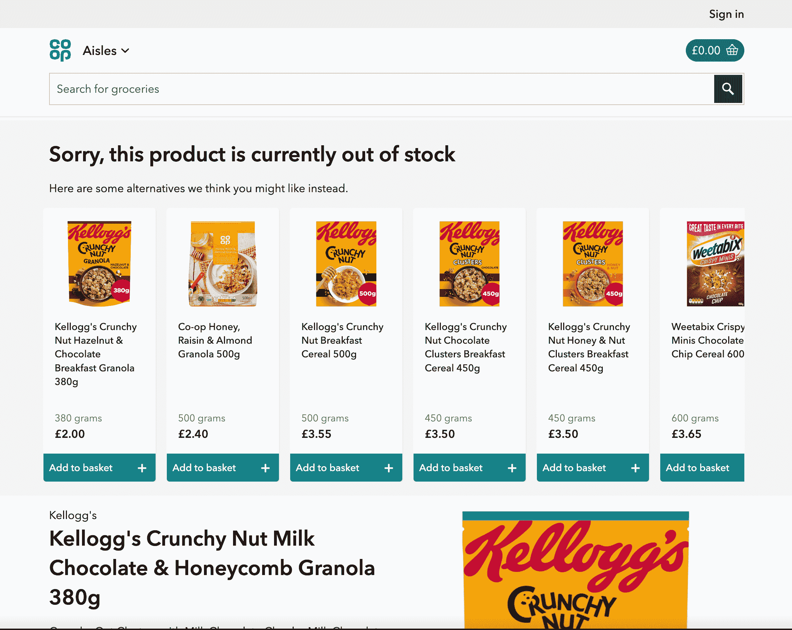
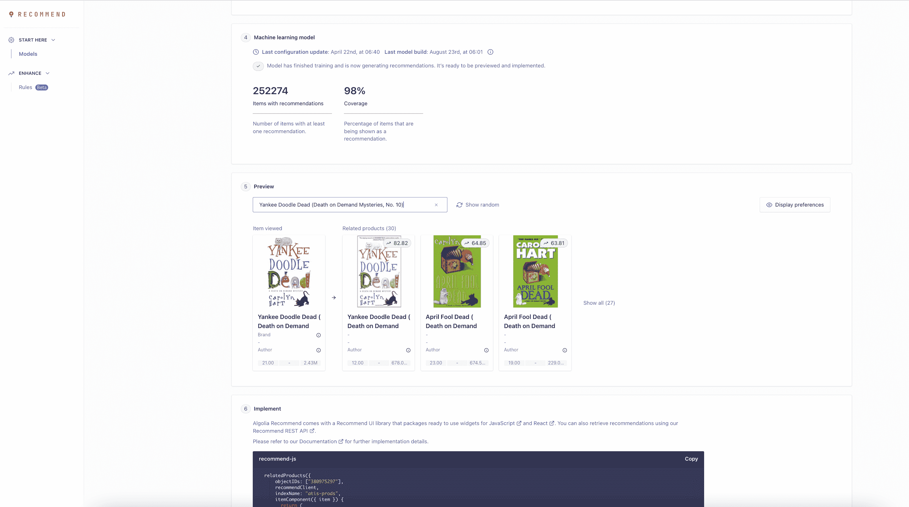
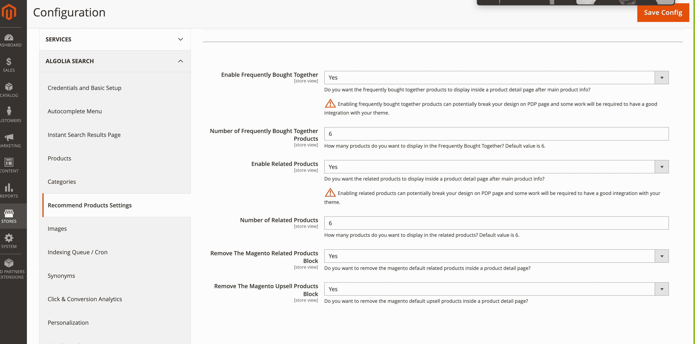

# 如何在 Adobe Commerce \n 中使用 Algolia 推荐

> 原文：<https://www.algolia.com/blog/product/algolia-recommend-for-adobe-commerce/>

我们很高兴地宣布，Algolia 推荐现已面向我们的 Adobe Commerce 客户推出。这是零售商高度要求的功能，他们中的许多人已经使用 Algolia 在 Adobe Commerce 上进行搜索，并准备将 discovery 提升到一个新的水平。

## ***我有好的搜索——为什么我还需要推荐？***

推荐改变了在线的典型动态:推荐为你找到内容，而不是需要搜索。网飞说过，网飞 80%的观众来自他们的推荐算法。而且，亚马逊 35%的收入来自产品推荐。一旦你对你的电子商务网站进行了搜索优化，相关的推荐通常是下一个投资领域。拥有 ***正确的*** 建议在产品详情页面下方、购物车上，或者作为“无结果”搜索查询的建议，可以改变游戏规则。

总部位于英国的杂货店 Co-op ，每当用户搜索库存中的商品时，都会添加推荐。他们发现，虽然你想要的产品缺货是一种令人沮丧的体验，但他们可以减少摩擦，改善客户体验，并通过提供用户可能视为替代品的相关产品来获得更好的结果。

实施 Algolia 推荐后，合作社看到:

*   篮子尺寸增加 6%
*   添加到购物篮的商品增加 45%
*   转化率提高 39%

## *有哪些集阿果推荐分开？*

Algolia 因我们提供基于人工智能的解决方案的灵活性而闻名。您可以随时定制您的结果，将它们放在您喜欢的任何地方(无论是信息亭、电子邮件还是您网站上的任何地方)，并且在上线之前，您可以通过模拟和评分了解一切的执行情况，以了解为什么会推荐这些内容。

Algolia 允许用户通过“规则”混合机器和人类的学习，以达到最佳效果(目前处于测试阶段)。例如，您可能希望在产品列表页面上显示相关项目。Algolia 不仅使用人工智能来展示您的客户可能选择的类似产品，我们还允许您进一步定制它。也许您希望所有推荐的商品与显示的主要产品颜色相同，也许您希望将促销商品固定在第一个位置，或者您可能希望筛选库存中剩余不到 10 件的所有产品。使用 [Algolia 推荐的](https://www.algolia.com/products/recommendations/) ，非技术管理员可以轻松配置所有这些(以及更多)。

## ***如何入门？***

### 1。引入事件数据

注册 Algolia ( [*在此免费开始使用*](https://www.algolia.com/users/sign_up) )后，将点击和转换事件带入您的帐户以训练您的模型非常重要。这在 Magento 集成中是现成可用的。更多详情请参考 [文档](https://www.algolia.com/doc/integration/magento-2/how-it-works/click-and-conversion-analytics/?client=php) 。在您开始学习时，您可以使用我们的 [基于内容的学习模型](https://www.algolia.com/doc/guides/algolia-recommend/overview/?utm_medium=page_link&utm_source=dashboard#how-recommend-works) ，或者通过. CSV 文件上传过去的事件来加快学习过程。

### 2。训练你的模特

通过您的 Algolia 仪表盘，您可以选择指数，并根据您的点击和转换数据训练模型。您可以使用规则进一步自定义结果。您也可以使用预览功能来模拟结果。

### 3。向您的 PDP 页面添加推荐模块

在 Magento 仪表盘上点击几下，您就可以将您的“相关产品”、“经常一起购买”和“趋势”推荐添加到您的产品详情页面或购物车页面。这些推荐可以由开发者进一步定制，包括放置在你的站点的其他区域。

【Algolia 推荐入门简单、有效、值得。感谢阅读并查看我们的 [文档](https://www.algolia.com/doc/integration/magento-2/how-it-works/recommend/?client=php) 了解更多！

* * *

有关如何充分利用您的 Adobe 堆栈中的 Algolia 的更多想法，请查看我们的集成系列的其余部分，其中有关于如何使用 Algolia 与[Adobe Experience Manager](https://www.algolia.com/blog/product/ingesting-data-from-adobe-experience-manager-aem-for-search-discovery/)，[Adobe Launch](https://www.algolia.com/blog/product/leveraging-adobe-launch-events-in-algolia-for-personalization/)，以及[Adobe Analytics](https://www.algolia.com/blog/product/leveraging-adobe-analytics-for-algolia-search/)！