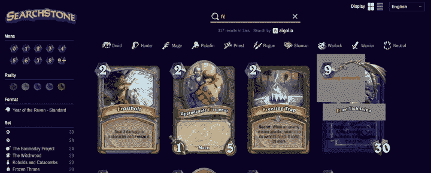

# 升级交易:通过 Algolia 搜索改善交易卡体验

> 原文：<https://www.algolia.com/blog/customers/algolia-search-improving-trading-card-experience/>

你熟悉像游戏王这样的纸牌交易游戏(TCG)吗？？游戏王！交易卡牌游戏是一款日本收藏卡牌游戏，基于漫画《游戏王》中流行的决斗怪兽卡牌游戏。。这种交易卡牌游戏的目标是收集多张虚构怪物的卡牌，并创建强大的卡牌来挑战(并战胜)其他玩家的卡牌。

同 [同超过 250 亿的游戏币！出售](https://www.animenewsnetwork.com/interest/2011-06-14/yu-gi-oh-sets-guinness-record-with-25.1-billion+cards) 交易卡，游戏王哦！交易卡游戏是最受欢迎的交易卡游戏之一，在世界各地拥有强大的追随者。基于它的起源，它在日本尤其盛行，玩家们积极寻求与他人交换卡片，以改善他们在个人和网络上的卡片收藏。

为了帮助玩家找到卡片并在线交易，[ka-nabell](https://www.ka-nabell.com/)是最受欢迎且历史悠久的游戏王之一！日本的交易卡市场。为了给那些积极寻找有价值的卡片以添加到他们的卡片组中的玩家提供出色的体验，ka-nabell 知道它必须提供极快的搜索和发现体验，允许粒度过滤功能返回高度相关的结果，以便玩家可以快速找到他们想要的东西。在引入 Algolia 搜索之前，ka-nabell 非常依赖 SQL 查询。实施 Algolia 后，ka-nabell 正在改善客户体验。

我们采访了 ka-nabell 的工程师阿桔广孝和西胁俊治，他们与我们分享了他们的经验。

Courtesy of ka-nabell engineers, Hirotaka Koga and Toshiharu Nishiwak

## **开发更好的搜索体验**

Hirotaka 和 Toshiharu 说 ka-nabell 正在寻找更快的搜索解决方案。然后，他们偶然发现了一个叫做[SEARCHSTONE](https://searchstone.io/)的网站。

由于易于购买多张有价格、类别、效果等粒度过滤的卡片，他们认为 Searchstone(由 Algolia 提供)上的这一搜索功能是创建交易卡片组的理想选择。他们还被 Algolia 网站上看到的转化率提高所带来的价值所鼓舞( [加速转化率的电子商务搜索解决方案](https://www.algolia.com/solutions/e-commerce/) )。

此外，Hirotaka 和 Toshiharu 希望使用 Algolia 最大限度地减少前端开发任务。[Vue instant search](https://www.algolia.com/doc/guides/building-search-ui/what-is-instantsearch/vue/)非常适合他们构建更快更流畅的用户界面(UI)。Hirotaka 说他“喜欢用 Vue InstantSearch 编写可水平滚动的用户界面”。为了插入和更新数据，他们在 PHP 构建的现有系统中添加了一些代码。对于批处理，他们从头开始编写 Node.js 代码。

## **迎接语言挑战**

日语有三种字母，叫做平假名、片假名和日本汉字。为了能够在所有可能的字母表中进行搜索(例如，用平假名搜索片假名)，他们在索引之前添加了字段并转换了字符。他们还定制了搜索体验，制作了可搜索的常用、游戏和交易卡专用的特殊字符，如☆和 Y18。

## **把伟大的搜索变成伟大的结果**

在不到一个月的时间里为他们的项目实施了 Algolia 之后，已经有来自客户的积极反馈，比如

*   “Ka-nabell 搜索超级有用。”
*   “实时！他们花了多少钱建造这个？”
*   “高质量搜索。错别字没问题。”
*   “超快超有用。和以前完全不一样。”

在提高转换率方面，Hirotaka 和 Toshiharu 将使用 [Algolia 的分析功能](https://www.algolia.com/products/analytics/) 随着时间的推移对此进行跟踪。

最好的还在后头。由于这个项目非常成功，他们决定将 Algolia 引入他们全新的服务。它将于 9 月推出。

## **未来目标**

展望未来，ka-nabell 对其 Algolia 实施进行了更多规划。由于 Algolia 的搜索即服务平台，ka-nabell 将能够利用其现有的 Algolia 实施，并灵活地利用 Algolia 的其他功能，包括:

使用 Algolia 的高级分析来发现优化用户搜索体验和提高转化率的机会。

从交易卡搜索扩展到他们经营的其他业务。