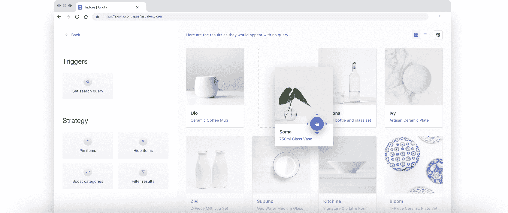
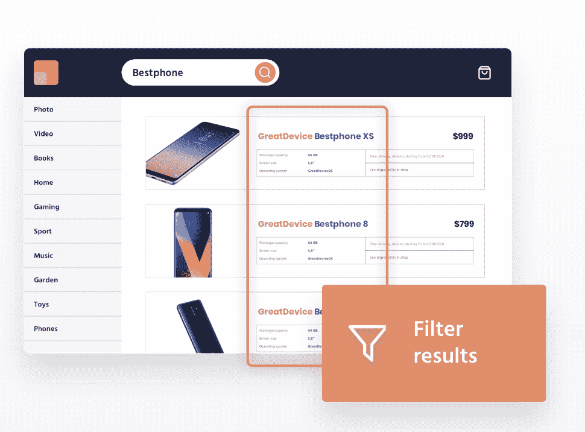
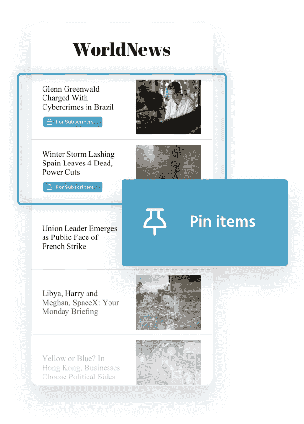
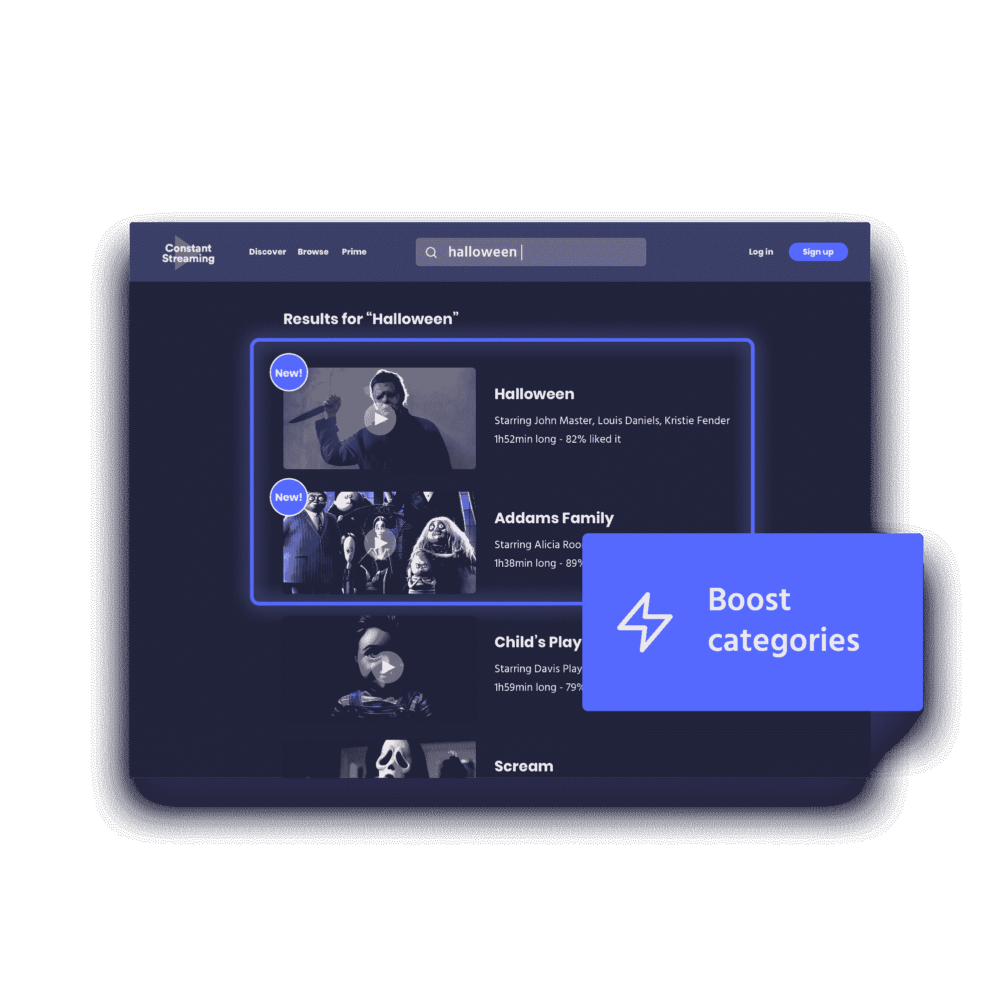
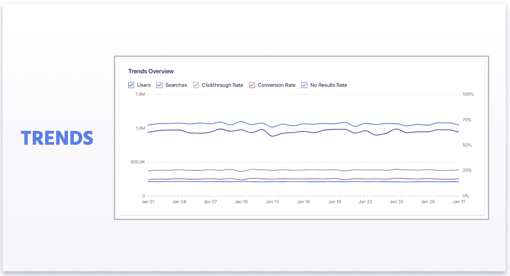
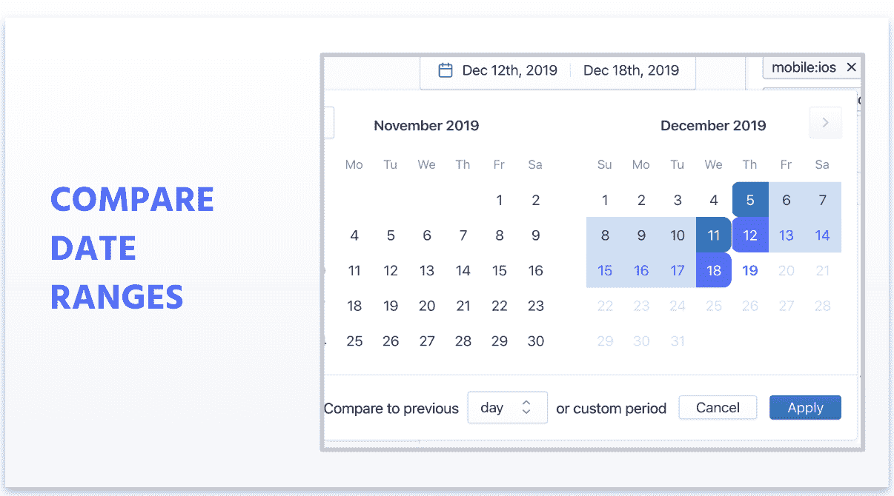
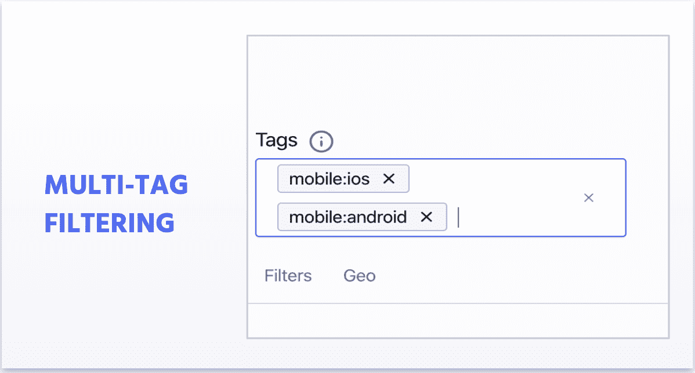

# Algolia Winter '20 —通过搜索体验管理增加收入

> 原文：<https://www.algolia.com/blog/product/algolia-winter-20-business-value/>

我们从一些世界上最好的品牌那里听说过:搜索和发现对用户体验至关重要，但很难衡量它们对收入的影响。

不难理解为什么:在过去的几十年里，任何消费级搜索工具对于非技术、业务团队来说都太难管理，这已经成为一种行业规范。然而，正是这些业务团队——数字战略家、产品经理、业务员、营销人员和内容编辑——最需要优化在线资产搜索和发现的能力和敏捷性。他们也是最直接关注投资回报和改善业务成果的人。

具有讽刺意味的是，业务用户不得不记录 IT 票证，并等待数天或数周来获得可能促进业务增长的增强功能，同时占用了宝贵的开发人员时间。

我们 20 年冬季发布的产品致力于改变这种模式。我们正在提供一套工具，使业务团队能够分析和优化用户的搜索和发现之旅，从而直接释放商业价值并实现增长。

## 新的搜索体验管理工具:分析、优化和迭代相关策略

如果做得好，搜索可以成为商业结果的强大倍增器。关键因素:相关性。交付足够复杂的搜索结果，以符合搜索者的意图并满足业务需求(推广季节性产品或趋势性新闻)是很困难的。现代营销和编辑策略正以(消费者)思维的速度变化；拥有支持它们的工具至关重要。

进入搜索体验管理(SXM)。

### 可视化编辑:简单技术换复杂策略

借助功能强大的拖放界面，我们新的可视化编辑器使编辑和销售团队能够完全控制搜索和发现体验。

> *“借助 Algolia 的可视化编辑器和仪表盘，我们改善了客户的搜索和浏览体验，并将无结果率降低了 60%以上。此外，我们的本地销售团队能够轻松地锁定和隐藏产品，使其符合我们的本地销售策略。"*
> 理查德·米格特，迪卡侬新加坡电子商务主管

这里只是一些可视化编辑器的使用案例。

*   **动态可视化关联策略。**由于产品描述中缺少细节，或者产品目录中的数据不足，预想的相关性策略可能会失败。可视化编辑器使您可以可视化您的实际搜索，以确保结果按计划显示给用户，然后根据需要轻松地重新排列、删除和调整视图。

*   **过滤结果。** Visual editor 允许销售团队在后端过滤搜索结果，例如，确保当用户寻找特定商品时，只显示选定品牌的产品。【T2

*   **提升和锁定项目和类别。一家媒体公司可能希望展示优质内容和免费内容的健康组合，以增加转化率。将优质文章放在分类页面的顶部，或者增加令人兴奋的季节性文章，将鼓励非付费用户最终订阅。**

直到今天，这种类型的功能还没有相应的速度、相关性或基础设施来支持现代在线体验。

## 增强的分析功能可获得更多可见性和洞察力

搜索体验管理的一个关键部分是了解搜索数据的性能。搜索有自己的一套关键绩效指标:搜索量、点击率和转化率等等。我们最新的分析功能让您能够超越定义和跟踪这些关键指标:我们希望您看到您的搜索分析数据中的大画面。

*   **趋势报告**为您提供来自用户的即时反馈，告诉您他们如何使用您的应用程序

*   **比较不同的日期范围**

*   **多标签过滤:**将分析集中在特定标准上，如设备、客户档案等。

这些特性会给你更好更快的洞察力，更多的控制，甚至更多的方法来评估你的搜索数据。

### 通过细分和谷歌标签管理器捕捉洞察事件

今天，我们将为您提供两个新的连接器，分别用于 Segment 和 Google Tag Manager，使您能够将事件从您已经跟踪的位置转发到 Algolia。

高级分析需要收集用户发送的信号:

*   他们点击了哪些搜索结果，是在什么时候，从哪个设备上点击的？
*   他们会浏览或添加哪些内容到他们的愿望清单中？
*   他们将什么产品添加到购物车中？

到目前为止，Algolia 只提供了一种收集这类数据的选择:使用我们自己的点击分析。新的连接器允许已经使用 Segment 或 Google Tag Manager 的客户通过简单地将 Algolia 添加为 Segment 的目的地或使用 Algolia Google Tag Manager 模板，将他们的用户行为数据发送到 Algolia Analytics。在这两种情况下，设置都很快，并且需要最少的努力。

## 网站搜索企业网站

作为消费者，你可能知道浏览企业网站有多难。你可能会访问公司网站，寻找产品、培训、文档、常见问题、投资者信息，甚至是博客文章。在后台，该公司已经花费了数十万美元来制作你想看的内容。然而，似乎不可能找到。

作为一个企业，你知道将所有的营销内容组织成一个最佳的信息架构是多么困难，特别是当现代企业网站必须服务于如此多不同类型的访问者:客户、潜在客户、it 和业务人员…所以你伟大的内容永远不会出现。

我们的网站搜索正在改变这一点，它消除了内容孤岛，让您的访问者准确地找到他们需要的东西，就像他们在谷歌或亚马逊上一样轻松，同时让您的企业打开这个经常被忽视但却强大的商业价值口袋。

### 由浩浩荡荡的阿尔戈利亚履带驱动

Algolia 爬虫是使站点搜索成为可能的工具，把你的内容统一到一个单一的交付平台。爬虫自动地为你做艰苦的工作:浏览你的网站，提取重要的信息，并且在 Algolia 中无缝地索引数据。

但与市场上的其他爬虫不同，Algolia 爬虫是高度可定制的:

*   您可以爬网多种类型的文件
*   它允许你用商业数据丰富提取的内容，比如谷歌分析数据
*   它带有自己的监控套件

还有更多。关于这一点…

## 我们希望您了解更多

以上是我们在冬季 20 版本中推出的最重要的功能和更新。有兴趣了解更多关于搜索体验管理或此版本附加组件的信息吗？[观看我们的网上技术交流讲座](https://go.algolia.com/webinar-winter-20)，我们将深入探讨，并为您提供现场演示和客户示例。