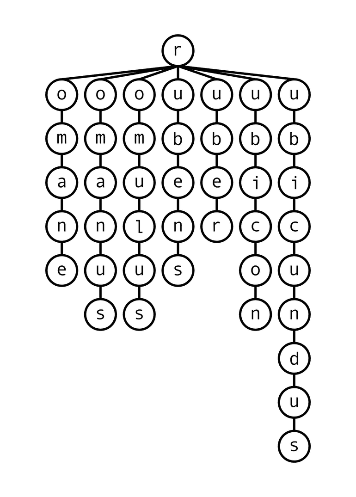
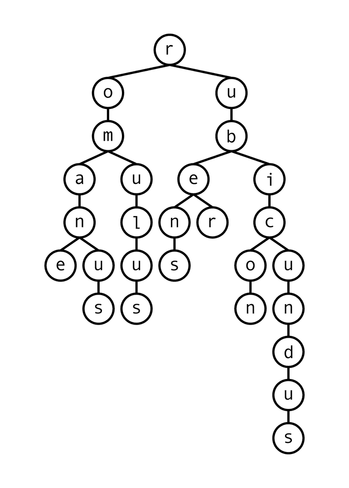
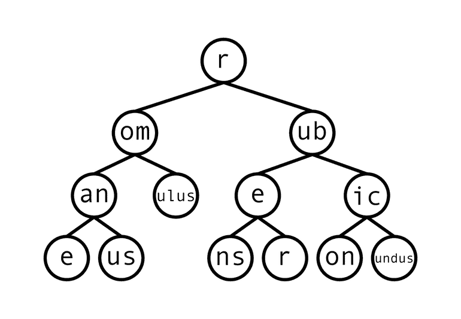
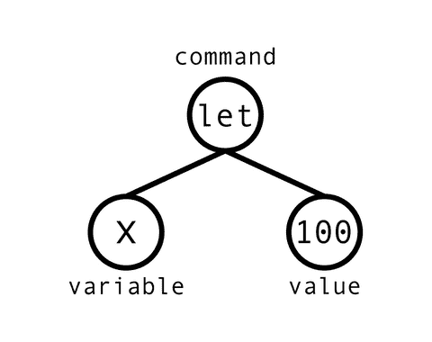

# 了解 Algolia 的压缩算法如何受到闪电和硬币分拣器的启发

> 原文：<https://www.algolia.com/blog/engineering/algolias-compression-algorithm-inspired-by-lightning-and-coin-sorters/>

在 Algolia，我们存储了大量的数据。在如此大的规模下，效率已经成为我们首要关注的问题——但是我们如何将如此多的输入数据放入一个可以在几毫秒内搜索完的索引中呢？

我们用一种非常有效的叫做树搜索的方法来解决这个难以置信的难题。一开始可能有点难以理解，但如果我们在深入研究之前先使用一些更熟悉的类比，将会很有帮助。

## 欧元和电子的算法

想象一下我有一个手动硬币分类器([这是一个](https://youtu.be/vmhZWJSWQOE?t=30)的广告，如果你想看的话)，你可以把硬币丢到一个导轨上。根据硬币运行轨道尺寸的变化，硬币按其大小落入不同的容器中。这种简单的机制不需要复杂的电子设备来读取和理解硬币代表的内容，而是记录它们之间的简单区别——它们的小尺寸差异——并通过在轨道上的几个关键点强制做出某种“决定”来利用它。实际上，你可以想象分拣员“问”硬币，“你够大了吗，可以继续沿着这条路走下去，或者你应该被分开走上一条新的道路？”

闪电是这种算法在实践中的另一个很好的例子，所以让我们浏览一下为什么闪电会有它的形状背后的科学表面。看看下面这幅闪电的图像，记住闪电本质上是一束非常兴奋的电子试图到达一个电子较少的地方:

虽然我们很多人经常看到闪电，但我们可能从未想过这种模式有多奇怪。真的，如果闪电只是电子试图尽可能快地从 A 点到达 B 点，那么它们肯定会沿着直线前进，对吗？为什么闪电会走这么尖的弯？为什么会分裂成树枝？

老实说，这是一门正在发展的科学(我们的科学关注的是另一种不同的云)，但一般的解释是*闪电不是一次*形成的。电子在离云层只有几十米的地方往下跳，停顿片刻，做出某种决定。根据它们周围空气的电导率(这是非常不规则的，因为“[空气不是完美的混合物](https://www.cbc.ca/radio/quirks/may-26-2018-cheating-on-the-ozone-treaty-nano-nutrients-for-crops-why-birds-almost-died-out-1.4675194/why-doesn-t-lightning-travel-in-a-straight-line-1.4675201)”)，电子将“选择”采取不同的方向进行下一次跳跃。正是通过这一过程，它们跳跃到地面，每一步都扭曲甚至分支。虽然它看起来是随机的，但正是因为这个原因，闪电实际上是确定性的——如果我们可以在大致相当于每一步长度的规模上重建相同的空气混合物，我们理论上就可以重建已经存在的闪电。

硬币分拣机和闪电看起来是截然不同的现象，但如果我们剥离细节，它们实际上遵循类似的递归过程:

1.  一些物品沿着轨道行进一段距离。
2.  他们通过一些特定的方面分析轨道上的每个项目，并决定它是否应该分支到新的路径上。
3.  对于轨道的所有新分支，重复步骤 1。

这是一个相当简单的算法，但这使得它非常通用。当谈到闪电时，击中地面的各种闪电的强度映射出它们上方空气的导电性(第二步的神秘“因素”)。硬币分拣机实际上是利用这种效应建造的，因为硬币分拣机的全部意义在于，每个桶中的硬币数量反映了首先进入轨道的硬币大小的差异。

## 树搜索的工作原理类似

如果我们有一种分支结构，像闪电穿过的空气或硬币滑落的轨迹一样工作，会怎么样？在这个基于节点的结构的每一步，我们都要通过将节点与搜索查询进行匹配来决定下一级的分支。本质上，我们对空气传导率或硬币大小的类比是查询相关性。通过逆向工程我们期望如何遍历这棵树，我们可以建立它！

假设我们的数据集是七个字符串:`romane`、`romanus`、`romulus`、`rubens`、`ruber`、`rubicon`和`rubicundus`。我们第一次尝试用这些数据构建一个树，将从树的顶层的`r`开始，然后向下的每个分支将一个字母一个字母地拼出我们的一个可搜索项目，如下图所示:

现在，我们可以将每个字符串指定为每个交叉点上的一系列移动！例如，我们的原始字符串`romulus`可以描述为第一个分支处的第三个选项，以及其余连接处的第一个选项— `311111`。不过，这只是为我们每个字符串节省了一个字符，因为连接点比字符数少了一个。让我们看看是否可以通过横向组合相同的字符来优化这一点，就像我们对第一行中的`r`所做的那样:

这并没有缩短查询时间，因为遍历树需要同样多的步骤，但是现在已经干净多了！理解起来就容易多了，而且只占用了之前版本 65%左右的存储空间。它还提供了垂直组合节点的可能性:

这个新的、更短的树包含的数据量与前一个树相同，但是遍历起来要快得多——同一个查询`romulus`只需要我们经过两个交叉点，而不是前六个。当然，这是一个相当人为的例子，存在多种优化途径的情况，但要点就在这里。

## 树搜索实际上是用于什么

而且这也不仅仅是理论上的事情！树搜索是一项非常知名和常用的技术，您可能每天都在使用它而不会注意到它。像 JPEG 和 MP3 这样的格式包含了树搜索的版本(具体来说是一种叫做[霍夫曼编码](https://en.wikipedia.org/wiki/Huffman_coding)的相关技术)以获得压缩的好处，这可能是通过手机联系人列表进行搜索的动力。另一个常见的例子是[抽象语法树](https://en.wikipedia.org/wiki/Abstract_syntax_tree)，这是一种保存编程语言标记的树形结构。像`let x = 100;`这样简单的代码行不会直接由解释器或编译器运行，因为它并不知道如何处理完整形式的字符串。相反，它会把它分解成这样:

像`=`和`;`这样的语法细节有助于解决歧义，但它们实际上对代码的功能没有帮助。一旦代码被转换成一个清楚理解的树结构，编译器或解释器遍历树并一次运行或编译一个命令就不再需要这些语法了。

在 Algolia 这里，我们被问了很多问题，我们是如何让我们的搜索工具变得如此之快。真的，乍一看，我们可以整理数百万个数据点——JSON 对象、字符串内容、数字、URL、布尔值——但仍然可以在几毫秒内找到用户想要的东西，这难道不合理吗？嗯，我们不是魔术师；我们用的是树形搜索！

如前所述，我们选择了只有七个相似字符串的例子来展示这种算法的能力。实际上，对于这么小的典型数据集，树搜索几乎不会带来任何改进，因此很难为本文创建一个实用的数据集。随着数据集变大，真正的优势出现了，数据集的新条目中的信息更有可能已经包含在树的一部分中。这实际上可能比你想象的要快，有几个原因，其中最重要的是某些字母在句子中不会互相跟随。例如，作为不同分支并排放置的字符不遵循预期的均匀分布，并且可以垂直聚集到一个节点的字符序列比随机生成的文本更频繁。

> 作为一个题外话，这实际上允许我们相当容易地纠正错别字。包含`W`的节点不太可能是包含`g`的节点的父节点，因此用户可能指的是在我们现有的树中出现在`W`之后的最常见的字符，或者是碰巧在键盘上附近的字符，这些标准通常会集中在`h.`上，树越大，这就越有把握。

新添加到树中的平均分支点在结构中变得越来越靠下，我们将开始为新条目的每个字符需要更少的新存储空间。这意味着随着数据集的增长，Algolia 的搜索索引(本质上只是巨大的树结构)变得越来越有性能。出于这个原因，一些最知名的 Algolia 客户正在建立令人难以置信的大索引(想想 GitLab 文件中的指南，或者亚瑟王烘焙发布的食谱，或者 T4 GoFundMe 的筹款人，或者关于古驰产品的细节。这就是说，搜索速度和这些大规模数据集的大小不会随着它们添加更多信息而线性增长，而是实际上趋向于某个地方——如果你有时间和耐心，理论上你可以计算出古驰产品数据库的存储空间和搜索速度的极限，因为记录数接近无穷大！

也许我们现在应该就此打住，因为如果我们继续这种思路，我们可能会陷入一个很深的兔子洞。但是如果你觉得这个解释很有趣，这里有一些要点、进一步研究的链接和值得思考的问题:

*   你每天都用树搜索。它们可能最常被实现为[霍夫曼树](https://youtu.be/JsTptu56GM8)，或者如果你是程序员，则被实现为 [ASTs](https://www.twilio.com/blog/abstract-syntax-trees) 。
*   就像闪电中的电子穿过天空并选择最导电的路径一样，我们的树搜索算法本质上只是我们的[搜索查询沿着树](https://brilliant.org/wiki/tree-search/)向下移动并找到最接近的可用匹配。还有哪些自然现象是这样的？
*   优化树的大小和优化在树中搜索的速度是两码事:为了减小树的大小，我们将横向组合等价的节点，但是为了减少搜索时间，我们将纵向组合连续的单个子节点。这两个过程如何相互作用？
*   这种通用算法是 Algolia 在处理大型数据集时无与伦比的性能的核心。如果你有兴趣在小范围内进行测试，[我们的免费层](https://www.algolia.com/users/sign_up)足够大，可以开始感受树搜索优化的好处。

我们希望你喜欢这种深入的树形搜索，如果你想让对话继续下去，请像往常一样，随时在 [Twitter](https://twitter.com/algolia) 上联系我们。