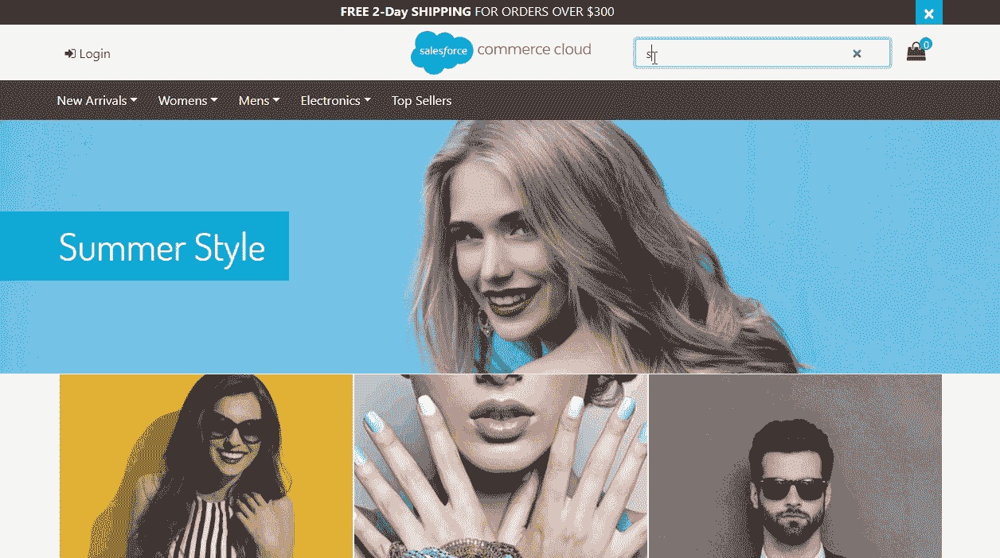

# 宣布面向 Salesforce 商务云的 Algolia 无头商务集成

> 原文：<https://www.algolia.com/blog/ecommerce/announcing-algolia-headless-commerce-integration-for-salesforce-commerce-cloud/>

今天，我们非常激动地宣布我们的 Salesforce 商务云套件。Algolia 和 Salesforce 客户现在可以轻松采用统一的无头架构，在每个渠道(从网站和移动应用程序到语音技术和信息亭)上创建基于创新产品的体验，以推动更多的客户参与和转化。

> “Algolia 在育碧的在线体验中起着关键作用。我们使用 Algolia 取得了很好的结果，它非常容易与 Salesforce Commerce Cloud 集成并管理不同国家的配置。我们计划在 2020 年将 Algolia 的使用范围从 5 家扩大到所有 17 家在线商店。我们注意到，在搜索整合了 Algolia 的最新商店时，转化率提高了 35%。”
> 
> ——育碧电子商务项目经理大卫·勒沃

让我们探索 Algolia Cartridge 为 Salesforce Commerce Cloud 提供的功能。

# 轻松将目录编入 Algolia

在后端，Algolia cartridge 使将 Salesforce Commerce Cloud 的产品目录同步到 Algolia 的任务变得非常简单，只需点击几下鼠标。Algolia Cartridge 自动索引商业云产品和类别，使其可搜索，并增强高级导航体验。联合客户可以定义他们想要在 Algolia 中索引的产品属性，使它们可搜索，在结果中显示它们，或者在 Algolia 的排名公式中使用它们。

# 扩充您现有的店面参考架构(SFRA)，无需任何开发…

Algolia 的 Salesforce 商务云套件集成了 SFRA。它取代了原生搜索和导航体验，为在线购物者提供快速、相关和个性化的体验。可以使用全面的开源 Javascript 框架和预先存在的小部件来定制体验。

开箱，下面是阿尔戈利亚的异能:

丰富的产品和类别自动完成，允许输入错误，随输入搜索:

具有动态过滤功能的完整搜索结果页面，便于浏览:

动态过滤分类页面，方便浏览:

这种原生前端集成带有内置的点击和转换跟踪，允许进行 [点击和转换分析](https://www.algolia.com/products/search-and-discovery/analytics/) 、 [A/B 测试](https://www.algolia.com/products/search-and-discovery/ab-testing/) 、 [个性化](https://www.algolia.com/products/search-and-discovery/personalization/) 等等，一切都是现成的。

# …或者，在每个频道上采用无头架构和全新的、创新的体验

虽然用于 Salesforce Commerce Cloud 的 Algolia Cartridge 与 SFRA 的店面进行了本机集成，但客户只能使用 Cartridge 的索引功能，并在每个渠道上构建基于定制创新产品的体验，在 Algolia 的 API 上采用无头方法。

利用我们的 API 客户端、先进的前端库和丰富的文档，Salesforce Commerce Cloud 客户可以在其在线商店上进行产品搜索和发现，还可以为商店员工提供配套应用程序、为客户服务代表提供库存浏览器、店内信息亭等。

# 为您的电子商务和销售团队配备直观的工具

Algolia 通过一个 [视觉营销工具](https://www.algolia.com/products/search-and-discovery/visual-merchandising-curation/) l，一个用户友好的仪表板和高级搜索分析，提高了商业团队的工作效率。只需点击几下鼠标，即可发起促销活动，并对各种渠道、特定商品关键词或类别页面的最新趋势做出反应。    Algolia cartridge for Commerce Cloud 的用户可以访问 Algolia 的用户友好仪表板来管理体验，其中包括可视化销售工具、关联算法的轻松管理、个性化算法管理工具及其实时模拟器、A/B 测试工具等。

# 将多个云的内容汇集在一个统一的体验中

除了通过插件索引 Salesforce Commerce Cloud 产品和类别之外，Algolia 还可以通过其 API 和爬虫索引任何内容源，包括 Salesforce Commerce Cloud、Community Cloud 和 Service Cloud 中的内容，并将其引入 Algolia，以提供统一的搜索和发现体验。

# 如何入门

Algolia for sales force Commerce Cloud 现已正式上市。您可以通过[sales force Commerce Cloud Partner market place](https://www.salesforce.com/products/commerce-cloud/partner-marketplace/partners/algolia/)访问它，并阅读我们的 [墨盒文档](https://www.algolia.com/doc/integration/salesforce-commerce-cloud-b2c/getting-started/introduction/) 几下鼠标即可开始使用。

Algolia 与世界领先的系统集成商和数字机构合作，帮助零售商制定和实施正确的数字战略。联系我们，开始或加速您的数字化转型！

