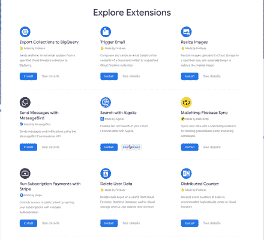
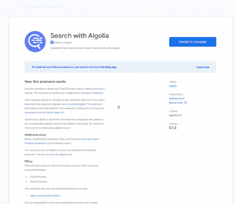
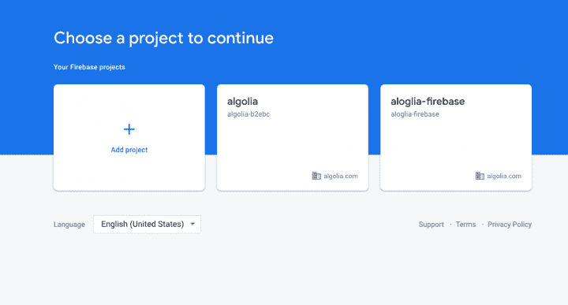
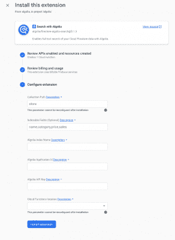

# 宣布 Firebase + Algolia 搜索扩展

> 原文：<https://www.algolia.com/blog/product/announcing-the-firebase-algolia-search-extension/>

我们知道你为什么在这里。你想学习如何整合谷歌 Firebase Firestore 数据库与 Algolia 搜索。

Firebase Firestore 是一个 NoSQL 云数据库，它提供了将您的数据管理成多个集合的结构。它是可扩展的，无服务器的，它提供客户端和服务器之间的同步和离线模式。最重要的是，它非常安全，而且价格合理。

然而，Firebase 不支持开箱即用的搜索功能。为了解决这个问题，你需要求助于第三方应用 Firebase 推荐的应用实际上是 [Algolia](https://firebase.google.com/docs/firestore/solutions/search) 。

我们有一个搜索产品，可以实现快速、相关、API 优先的全文搜索，并且有一个可靠的免费计划，可以轻松启动和发展您的产品。我们还为所有主要语言/平台提供了广泛的客户端库和 SDK 选择，并为我们的文档感到非常自豪。

然而，直到今天，整合 Algolia 和 Firebase 还涉及到一个非同寻常的 [步骤](https://effbada.hashnode.dev/how-to-import-data-from-firebase-firestore-into-algolia-using-cloud-functions-part-2-ckcrwverh000flvs10l5rfloy) 。今天，我们很兴奋地宣布 Firestore < > Algolia 扩展。

# 技术堆栈

让我提供一个高层次的集成图，说明我们试图用您的产品组合中的这两种产品实现的目标。

[T32](https://blog-api.algolia.com/wp-content/uploads/2021/05/image1-3.png)

那么，我们如何用新的 Firebase 扩展框架实现上述架构呢？

## 老派方式

有很多文章和 [博文](https://effbada.hashnode.dev/how-to-update-algolia-data-to-match-changes-in-firebase-firestore-with-cloud-functions-part-3-ckcrx6yv4000kkys199x6gi9v) 描述了实现。其要点是使用云函数来实现监控 Firestore 数据库的逻辑，并将更改推送到 Algolia 索引。这需要在 Google Cloud 函数中编写代码来连接和监控 Firestore 数据库的变化，以及维护和支持集成。

## 街区上的新小子

在 Fireconf 2019 上，Firebase 公布了 Firebase 扩展框架。其思想是为用户提供由扩展提供者维护和支持的仅配置的扩展。正如在 Google I/O 上宣布的那样，我们很自豪能够在 2021 年成为该框架的一部分。只需点击一个按钮或使用 CLI 即可安装 Algolia 扩展，这将启动一个提供云功能的流程，以根据开发人员提供的配置信息监控 Firestore 数据库的变化。让我们来看看实际情况。

### **先决条件**

1。导航到 [Firebase 扩展列表页面](https://firebase.google.com/products/extensions/) 。

有关扩展的详细信息，请点击“查看详细信息”。

2。单击“在控制台中安装”开始安装过程。该过程的第一步是创建或选择一个现有的 Firebase 项目。

3。系统将提示您输入以下配置:

1.  收藏路径，您的 Firestore 数据库中收藏的路径
2.  字段，要发送到 Algolia 进行索引的文档字段
3.  Algolia 应用程序 ID
4.  阿尔戈利亚指数名称
5.  Algolia Api 密钥
6.  地点，GCP 地区部署云功能

注意:该扩展可以多次安装，以监控不同的集合，并将更改推送到中央 Algolia 搜索索引或每个集合的单独索引。

就是这样！现在，继续点击安装并根据您的意愿进行配置，别忘了给我们发送反馈:twitter.com/algolia.，配置愉快！

## 附:未来的改进

该扩展有一些已知的限制，将在未来的版本中解决。

1.  Algolia 相关性适用于小于 10kb 或根据您的计划设置的限制的记录。任何大于此限制的记录将被 Algolia 索引过程拒绝。在扩展的未来版本中，我们希望实现一个记录分割逻辑，将大记录分割成小记录用于索引。有关大型文档 的更多信息，请参考 [发送和管理数据。](https://www.algolia.com/doc/guides/sending-and-managing-data/send-and-update-your-data/tutorials/google-drive-algolia/#large-documents)
2.  [在将 Firestore 文档发送给 Algolia](https://www.algolia.com/doc/guides/sending-and-managing-data/prepare-your-data/in-depth/prepare-data-in-depth/) 之前对其进行重组，以提高相关性。