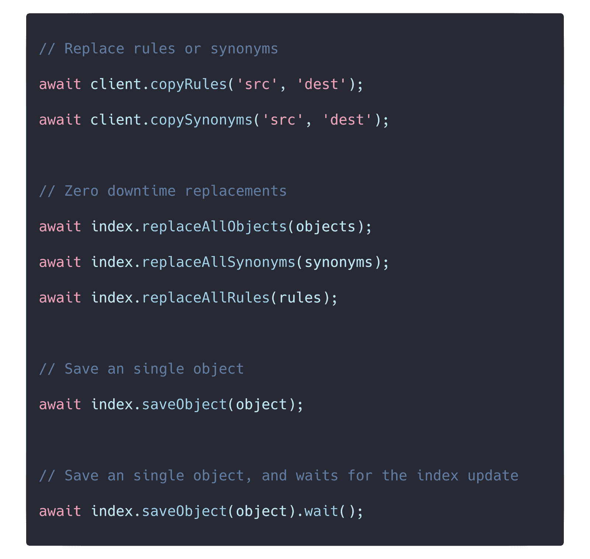
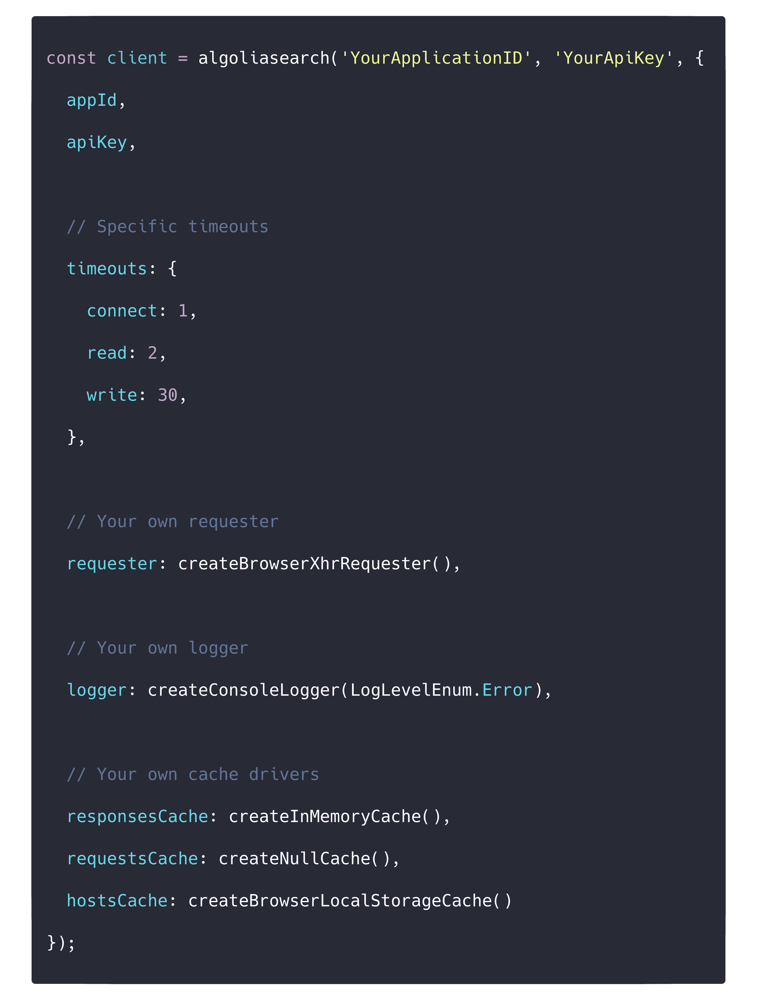

# 宣布新的 JavaScript API 客户端 v4 - Algolia 博客

> 原文：<https://www.algolia.com/blog/engineering/announcing-the-new-javascript-api-client-v4/>

二月初，我们发布了 Algolia API 客户端 JavaScript v4，这是我们有史以来最强大的 JavaScript 客户端。它更快、更小、更灵活，并且完全支持我们的 [**通用 API 客户端规范**](https://blog.algolia.com/release-api-client-specifications-common-test-suite/) 。值得注意的是，它包括以前不可用的方法，如零停机时间重新索引、跨帐户操作和许多其他复杂的操作。

好消息是它只涉及到对 API的最小改动，所以更新应该用不了 **十分钟** : [**升级指南**](https://www.algolia.com/doc/api-client/getting-started/upgrade-guides/javascript/#upgrading-from-3351-to-4x) 。

在本文中，我们将重点介绍这个全新版本的一些主要改进。

## 缩小了文件大小

我们的新客户带来了许多新功能；然而， 尽管增加了这些内容，但实际上 **比【v3】小了**

*   精简版是 v4 上压缩的**4.27 kb**g，比 v3 上的 13.21 kb 有所下降。
*   默认版本是 v4 上压缩的**7.44 kb**g，低于 v3 上的 19.35 kb 。

这相当于与前一版本相比， **总共减少了 64%的尺寸** 。随着这种减少， **您的页面加载更快** 。

## 零依赖

此外，我们还将 **依赖项的数量从** **15** **减少到** **0** 。对，没错——**0 依赖** 。因此，我们不再冒险接收可能破坏客户端的第三方更新。

## 更进一步 DX

为了提供最佳的开发者体验，我们添加了一系列新的助手，它们不仅仅是 API 端点的简单映射。用户现在能够零停机地“替换所有对象”，或在应用程序之间“复制索引”，以及许多其他这样的多任务操作！下面是一些例子:

## 【T9

## 最新 JavaScript

为了优化开发者体验和类型安全，新的客户端是 **完全写在**[**TypeScript**](https://www.typescriptlang.org)**中。** 得益于此，开发者将能够利用 开箱即用的可选静态类型和类型推断。

## 重新设计的架构

就像 v3 一样，我们 出货有两个版本:*lite*和 *默认*——这些都是 **预定义版本** ，帮助开发者快速入门使用传统的:*algoliasearch(appId，apiKey)*。

现在，得益于全新的架构，你可以 **构建自己版本的客户端****适应你的需求** 。这里有一个例子:

使用这种方法，开发人员可以注入他们自己的请求程序和日志程序，以及他们自己的缓存实现。好消息是，即使你注入你的具体实现，一切仍然在我们的 [**重试策略**](https://www.algolia.com/doc/api-client/methods/advanced/#retry-logic) 下运行。

我们相信这种模块化有助于开发人员满足更高级用例的需求。

## 等等！

Algolia API 客户端 JavaScript 是 100%开源的，所以可以随意挖掘 [**源代码**](https://github.com/algolia/algoliasearch-client-javascript) 来看看它到底是如何工作的。挖吧！访问我们的 [**文档**](https://www.algolia.com/doc/api-client/getting-started/install/javascript/?language=javascript) 。

看到需要改进的地方？只需在 GitHub 上向我们发送请求。谢谢！我们希望你喜欢这个新版本！🎉