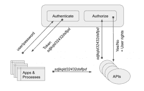

# API 密钥与 JWT 授权:哪个最好？

> 原文：<https://www.algolia.com/blog/engineering/api-keys-vs-json-web-tokens/>

当你构建自己的 API 时，检查你的 *用例* 将帮助你决定为每个 API 实现哪些安全方法。对于某些用例，API 键就足够了；在其他情况下，您会想要 JSON Web 令牌(JWT)授权带来的额外保护和灵活性。所以在比较 *API 密匙和*JWT 授权时，胜者是..看情况。

所有 API 调用都需要某种程度的安全性和访问控制。具有合理 ACL 的 API 密钥可以提供足够的安全性，而不会增加太多的开销。但是随着微服务在几乎所有大小任务中的使用越来越多，您的 API 生态系统可能需要一种更统一、更细粒度、更安全的方法，比如 JWT 授权。

## [](#when-api-keys-are-fine)API 键正常时

使用基于云的搜索 API 的在线企业通常可以暴露只读 API 密钥，而没有太大的风险——如果数据的底层索引不包含秘密的话。事实上，客户端应用程序 *应该* 出于性能原因直接连接到云搜索引擎——从而暴露其 API 密钥——以避免在走向云之前更长时间的后端服务器之旅。另一方面，索引更新需要限制访问的 API 键，这些键永远不应该公开。

但是在两种用例(搜索和索引)中， [API 键一般还好](https://www.algolia.com/doc/guides/security/security-best-practices/)；没有迫切需要 JWT 授权的开销。

## [](#when-it%e2%80%99s-time-to-consider-jwt-authorization)什么时候才能考虑 JWT 的授权

然而，API 越来越需要更多的灵活性和保护。JWT 授权不仅增加了额外的安全级别(下面将详细介绍)，它还提供了一种更易于管理和更容易的方法来协调日常使用的大量 API 和网络。如下一节所述，[](https://en.wikipedia.org/wiki/JSON_Web_Token)****通过生成包含用户和应用级信息(加密或散列)的** ***单个共享令牌*** **来帮助同一生态系统中的任何 API 确定令牌持有者被允许做什么，从而集中认证&授权。****

 **API 密匙，乍一看，似乎很简单——你只需要发送正确的 API 密匙就可以了。但那有点骗人。当您的生态系统依赖于许多集成的微服务时，管理众多的 API 密钥会变得混乱、不可靠，并且几乎无法管理。它们的数量会增加、更改、过期、删除、ACL 更改等等，而无需通知依赖这些 API 密钥的应用和用户。

**借助 JWT，您为单点登录架构奠定了基础。** 我们在下面的 *一节中讨论这个切换到 JWT。*

> 相关链接–
> 
> 1.  深究 [API 密钥安全](https://www.algolia.com/blog/engineering/search-101-what-is-an-api-key-how-does-it-provide-api-security/)。
> 2.  对于 CLI 人员，一个全新的 [Algolia CLI 工具](https://www.algolia.com/blog/engineering/algolia-devtool-introduction-the-algolia-cli/)。
> 3.  关于 Algolia 的[安全性和合规性。](https://www.algolia.com/distributed-secure/security-compliance/)

## [](#using-api-keys-vs-jwt-authorization)使用 API 密钥 vs JWT 授权

### [](#using-api-keys)使用 Api 键

API 密钥直接、简单且完全透明。它们不代表任何潜在的信息，它们不加密秘密消息。它们只是一个不可读的唯一 id。

这里有一个客户端 javascript 中公开可用的 API 密钥的例子。该代码包括一个应用程序 ID (`app-id-BBRSSHR `)，它使用 API 键(` temp-search-key-ere 452 sdas 56 qsjh 565d `)来允许它进行搜索。应用程序 ID 是指您的一个面向用户的应用程序(如在线网站或流媒体服务)。API 密钥是临时的和短暂的(在一段时间后过期),以提供某种保护来防止不必要的使用或滥用。

```
import { hitTemplate } from "./helpers";
const search = instantsearch({
  appId: "app-id-BBRSSHR",
  apiKey: "temp-search-key-ere452sdaz56qsjh565d",
  indexName: "demo_ecommerce"
});

```

再比如:索引，需要更安全的 API 密钥。它有相同的格式(`appId` + `apiKey`)，但它是私有的，因为它对公众是隐藏的，要么在编译的代码中，要么在后端的安全数据库中。App ID ( `YourApplicationID`)指的是后台系统。API 密钥(`YourAdminAPIKey`)可能是一个永久的管理密钥，为了简化维护，它一年只改变一次。

```
use Algolia\AlgoliaSearch\SearchClient;
$client = SearchClient::create(
    'YourApplicationID',
    'YourAdminAPIKey'
);
$index = $client->initIndex('demo_ecommerce');
$index->saveObject(
  [
    'firstname' => 'Jimmie',
    'lastname'  => 'Barninger',
    'city'      => 'New York',
    'objectID'  => 'myID'
  ]
);

```

### [](#using-the-jwt-token)使用 JWT 令牌

一个 [JWT 令牌](https://jwt.io/introduction) 是一个庞大的不可读字符集，包含隐藏和编码的信息，被签名或加密算法掩盖。它由三部分组成:标题、正文和签名。它们之间用一个句号隔开:`Header.Body.Signature`。

```
EZPZAAdsqfqfzeezarEUARLEA.sqfdqsTIYfddhtreujhgGSFJ.fkdlsqEgfdsgkerGAFSLEvdslmgIegeVDEzefsqd

```

**JWT 报头** 为`EZPZAAdsqfqfzeezarEUARLEA`，包含以下信息:

```
{
  "alg": "HS256",
  "typ": "JWT"
}
{
  "sub": "1234567890",
  "name": "John Doe",
  "iat": 1516239022
}

```

有不同的算法可用，例如`RS256`和`HS256`。这里我们使用`HS256`，它要求在生成签名时使用一个私钥。“RS256”使用私钥和公钥组合。

**JWT 体** (称为 **有效载荷** )是`sqfdqsTIYfddhtreujhgGSFJ`，它包含用户的身份，帮助建立令牌用户的权限。它还给出其他信息，比如截止日期(越短越安全):

```
{
  "sub": "1234567890",
  "name": "John Doe",
  "iat": 1516239022
}

```

**签名** 是`fkdlsqEgfdsgkerGAFSLEvdslmgIegeVDEzefsqd`， ，它是通过使用 HS256 散列方法组合报头、主体和共享私钥而生成的，如报头中所示。

```
HMACSHA256(
  base64UrlEncode(header) + "." +
  base64UrlEncode(payload),
  secret)

```

这就是你如何得到下面的令牌:`Header.Body.Signature` :

```
EZPZAAdsqfqfzeezarEUARLEA.sqfdqsTIYfddhtreujhgGSFJ.fkdlsqEgfdsgkerGAFSLEvdslmgIegeVDEzefsqd

```

## [](#a-word-about-authentication-authorization)关于认证的一句话&授权

API 密钥和 JWT 都用于认证和授权，但它们的工作方式不同。

*   *认证* 允许用户或应用程序使用 API 的一个或多个方法。
*   *授权* 定义了他们如何使用那些方法。有些 app 或用户只能读取数据；其他的可以更新；其他人是管理员(角色和权限)。API 键也是如此，由它们的 ACLS 管理——它们可以是只读的、写访问的或管理的。

API 密钥使用相同的 API 密钥进行认证和授权。JWT 授权在生成授权令牌之前需要一个初始身份验证过程。令牌生成后，将在整个生态系统中使用，以确定令牌持有者可以做什么和不可以做什么。

另外，API 密钥认证的是 *应用* 而不是 *用户*；而 JWT 对用户和应用程序都进行身份验证。当然，您可以使用 API 密钥进行用户级授权，但它并不是为此而精心设计的——生态系统需要为每个用户或会话 id 生成和管理 API 密钥，这对系统来说是不必要的负担。

## [](#a-word-about-better-protection-and-security)关于更好的保护和安全的一句话

在安全性方面，API 密匙和 JWT 都是易受攻击的 *。* 最好的安全措施是为所有的端到端通信实现一个安全的架构。

也就是说，API 密钥在历史上不太安全，因为它们依赖于隐藏的 *。* 你可以用 SSL/TLS/HTTPS 隐藏密钥，或者限制它们在后端进程中的使用。但是，你不能控制所有的 API 使用；API 密钥可能会泄漏；HTTPS 并不总是可能的；诸如此类。对于 JWT，由于令牌经过了哈希处理/加密，因此它采用了更安全的方法，不太可能被暴露。

## [](#what-information-is-in-a-jwt-token)JWT 令牌中有什么信息？

API*密钥* 和 JWT *令牌* 之间最显著的区别是，JWT 令牌是独立的:它们包含 API 需要的信息，以确保交易安全并确定令牌持有者的权限粒度。相比之下，API 键使用它们的唯一性来获得初始访问权；但是 API 需要在一个中央表中找到一个键的相关 ACL，以准确地确定这个键允许访问什么。通常，API 密钥只提供应用程序级的安全性，给予每个用户相同的访问权限；而 JWT 令牌提供用户级访问。

一个 JWT 令牌可以包含像它的截止日期和用户标识符这样的信息，以确定用户在整个生态系统中的权利。

让我们来看看你可以在 JWT 令牌中包含的一些信息:

```
iss (issuer): identifies the principal that issued the JWT.
sub (subject): identifies the principal that is the subject of the JWT. Must be unique
aud (audience): identifies the recipients that the JWT is intended for (array of strings/uri)
exp (expiration time): identifies the expiration time (UTC Unix) after which you must no longer accept this token. It should be after the issued-at time.
nbf(not before): identifies the UTC Unix time before which the JWT must not be accepted
iat (issued at): identifies the UTC Unix time at which the JWT was issued
jti (JWT ID): provides a unique identifier for the JWT.

```

示例

```
{
    "iss": "stackoverflow", 
    "sub": "joe", 
    "aud": ["all"], 
    "iat": 1300819370, 
    "exp": 1300819380, 
    "jti": "3F2504E0-4F89-11D3-9A0C-0305E82C3301",
    "context": 
    { 
        "user": 
        { 
            "key": "joe", 
            "displayName": "Joe Smith" 
        }, 
        "roles":["admin","finaluser"] 
    } 
}

```

## [](#jwt-authorization-offers-flexibility-reliability-and-more-security)JWT 授权提供了灵活性、可靠性和更多的安全性

这是一个场景。你有很多应用:

*   允许我们跟踪所有用户的 API 使用情况的应用
*   提供账单和客户数据的应用
*   允许 API 用户在不同系统上更改设置的应用
*   检索产品数据或业务内容的应用
*   等等

### [](#doing-it-with-api-keys)用 API 键做

运行节目的 API 多了，问题就出现了。您将所有这些访问所需的 100 多个 API 密钥存储在哪里？管理太多的 API 密钥需要将 API 密钥表提供给生态系统中运行的所有应用程序。

因此，生态系统中的每个应用都必须了解数据库。每个应用程序都需要连接并读取该表。一些应用程序将被允许生成新密钥或修改现有密钥。所有这些都很好，但是变得难以维持。管理这个问题的一种方法是创建一个 API，根据这个数据库验证一个键。但是为此，您需要第二个身份验证系统来连接到这个 API。

不仅检索 API 密钥很麻烦，而且维护它们的持续时间和授权级别也很繁琐。而且并不是每个 app 都是 app 级别的功能，他们需要用户级别的权限。此外，API 的使用方式因系统而异。更糟糕的是，不同的应用程序共享 API 密钥，因此依赖于不同的应用程序来维护共享 API 密钥的正确访问级别。

### [](#switching-over-to-jwt)切换到 JWT

任何需要认证的 API 都可以很容易地切换到 JWT 的授权。通过 JWT 授权，您可以获得基于用户的身份验证。一旦用户通过身份验证，用户将获得一个可以在所有系统上使用的安全令牌。用户(以及令牌)的管理是集中的。您设置了访问权限，并为每个用户提供了每个系统的不同权限。JWT 授权端点对用户进行身份验证并创建令牌。

有了这个架构，下一步就是创建一个单点登录到完整的生态系统中，并且只依赖令牌来获得权限。最后，最简单、最可靠、最易于管理的方法是创建一个端点，专门进行身份验证和授权，这样整个生态系统中的所有其他服务器都可以依靠这个中心点来授权客户端和服务器之间的 API 交互。



## [](#in-sum-sometimes-jwt-is-absolutely-needed-and-sometimes-it%e2%80%99s-overkill)总之，有时候 JWT 是绝对需要的，有时候又是多余的

作为一名应用程序开发人员，我在构建 API 时主要关心的是正确使用它们并提供正确的数据和功能。因此，我非常依赖 DevOps 的建议来推荐最佳和最易管理的安全性。但这不仅仅是安全问题。在一个大型生态系统中，我们需要一种简单而健壮的方法来跨多个系统和服务器访问微服务，这种方法最好通过集中身份验证和授权流程来实现。

### [](#jwt-is-overkill-in-the-following-two-situations)【JWT】在以下两种情况下是矫枉过正:

*   只有几个 API 的简单生态系统
*   第三方原料药供应商。

第三方 API 应该易于使用和快速实现，集成时前期工作很少。此外，您需要共享用于签署令牌的密钥。所以两端都控制的时候最好，这在第三方场景中不太可能。您还需要信任实现。例如，API 可以选择忽略截止日期或 NBF(“不在此之前”)。

### [](#jwt-is-not-overkill-when-%e2%80%a6)JWT 不是矫枉过正当…

当多个服务需要在一个巨大的网络上相互通信时，您会想要使用 JWT。集中和保护这些交流至关重要。当每个网络或应用程序需要基于用户而不仅仅是应用程序的不同访问级别时，这一点尤为重要。控制流量并能够对网络呼叫进行优先级排序也很重要。最后，在添加新的微服务或改进现有微服务时，您需要简单的即插即用体验。

> 相关链接–
> 
> 1.  深究 [API 密钥安全](https://www.algolia.com/blog/engineering/search-101-what-is-an-api-key-how-does-it-provide-api-security/)。
> 2.  对于 CLI 人员来说，一个全新的 [Algolia CLI 工具](https://www.algolia.com/blog/engineering/algolia-devtool-introduction-the-algolia-cli/)。
> 3.  关于 Algolia 的安全性和合规性。**