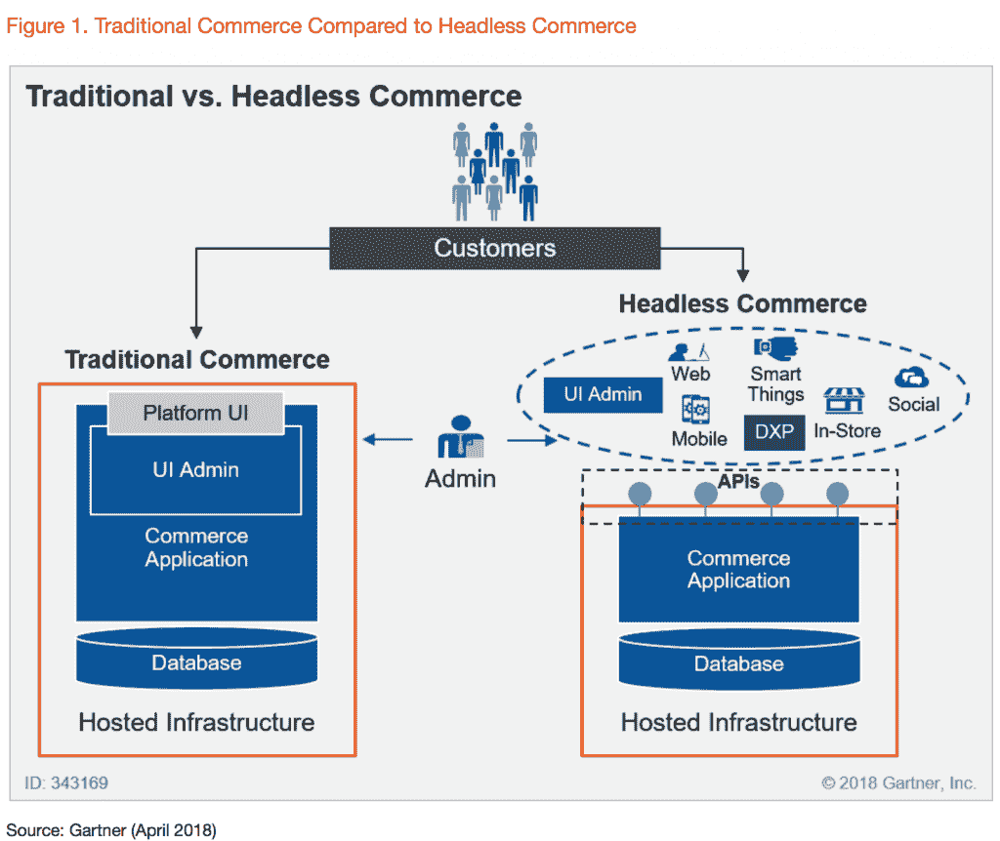
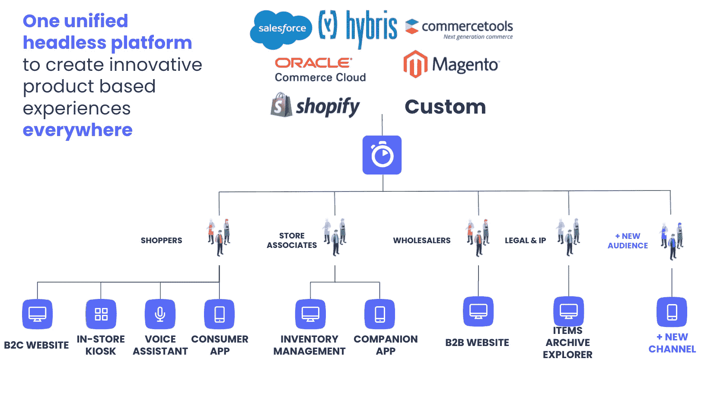
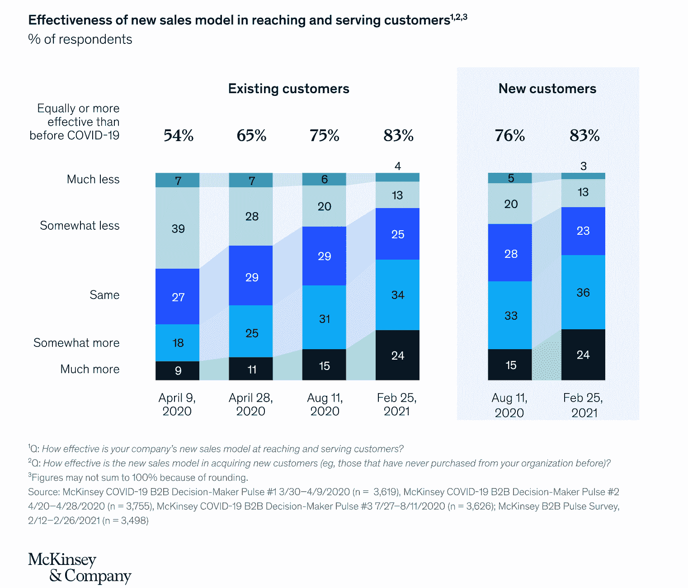
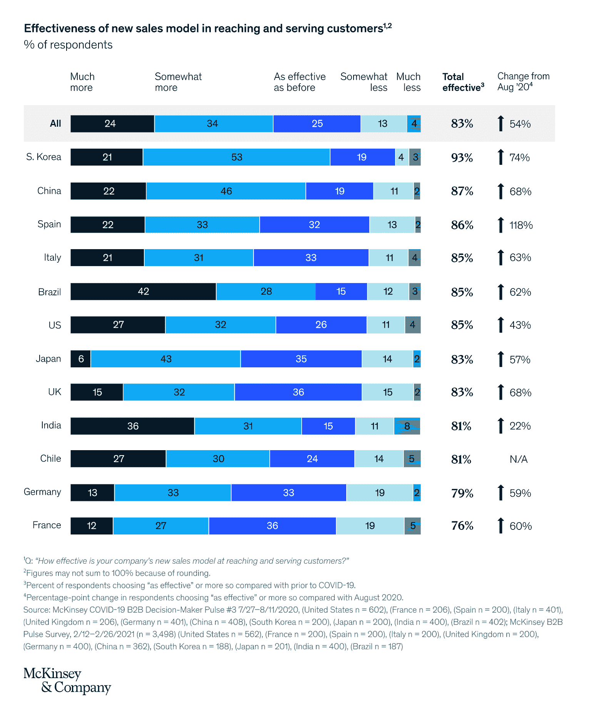

# B2B 电子商务的数字化转型:如何建立一个成功的 B2B 电子商务网站，结合最佳行业实践

> 原文：<https://www.algolia.com/blog/ecommerce/b2b-commerce-digital-transformation-how-to-build-a-successful-b2b-ecommerce-website-incorporating-best-industry-practices/>

在构建引人入胜且适应性强的 p 产品搜索和发现界面时，无头、可组合的架构创造了关键的灵活性，以确保 c 转换和增加的交易和订购。在本文中，我们将讨论这三个要素，或者说*步骤*——无头/可组合、搜索/发现、转化/参与——如何在一个现代的、竞争激烈的 B2B 业务中发挥作用。

## 第一步:无头/可组合架构取代传统的单片平台

Gartner 预测，“到 2023 年，采用可组合方法的组织将在新功能实施速度上超过竞争对手 80%。”

[无头架构](https://www.algolia.com/blog/ecommerce/composable-commerce-how-to-select-best-of-breed-components-to-meet-your-business-needs/) 通过去除前端和后端之间的链接，允许自由和灵活。站点内容和 UI 元素可以即时更改，而不会影响后端基础设施。现代的 API 优先方法让内部团队(产品、营销和销售)能够迭代在线全渠道体验，并测试具有高敏捷性和可扩展性的新策略。

B2B 行业领导者，如 [戴尔科技](https://www.delltechnologies.com/en-us/blog/small-building-blocks-deliver-big-ecommerce-transformation/) 为其电子商务平台采用了无头、API 优先的架构。与传统整体解决方案相比，无头/可组合方法的优势对任何组织都非常有影响:

*   快速创新:快速部署新功能，更好地控制每个功能
*   降低维护成本:可以灵活选择组件和功能，立即获得自动软件更新
*   轻松适应和改变业务需求的任何变化

可组合架构使 B2B 公司能够实现全渠道销售模式，这已被证明比传统方法更有效。麦肯锡 [发布的最新研究将全渠道确定为“全球 B2B 销售的至关重要的固定设备”，83%的 B2B 领导者称其是比传统的“仅面对面”销售方法更成功的发现和获得新业务的方法。](https://www.mckinsey.com/business-functions/marketing-and-sales/our-insights/omnichannel-in-b2b-sales-the-new-normal-in-a-year-that-has-been-anything-but)

此外，全渠道模式适用于多个地区，显示了全球 B2B 公司的热情采用趋势。

## 第二步:产品搜索和发现

根据 Forrester 的研究， [92%的 B2B 购买都是从搜索](https://go.forrester.com/blogs/a-social-take-on-social-selling/) 开始的。此外，Baymard Institute 最近的 [研究](https://baymard.com/premium/guideline-collections/z9xilv) 发现，“产品类型”搜索(例如，“男孩的帽衫”、“凉鞋”)几乎总是用户与网站的第一次交互。产品类型查询有助于塑造用户对可用产品的早期印象。即使用户查询与网站的精确类别描述不匹配，正确配置搜索相关性以提供相关结果也是至关重要的。当搜索结果给用户留下库存有限或不受欢迎的印象时，放弃的风险就会大大增加。

*   将产品目录和电子商务功能统一到一个 UX 中，针对多个平台进行优化
    *   产品目录和购物平台必须统一
    *   支持内容，如规格表、文件、销售过程中因各种法规要求提交的文件以及类似文件，应可通过单个搜索栏访问，并链接至特定产品或产品类别
    *   架构需要将搜索引擎和定价引擎结合起来。

注意:对于 [定价是动态的](https://www.mckinsey.com/business-functions/marketing-and-sales/our-insights/what-really-matters-in-b2b-dynamic-pricing) 并且产品价格经常变化的情况，定价引擎解决方案应该提供任何定价复杂程度的实时定价数据。

*   产品目录结构:计划包括哪些可搜索属性(尺寸、产品类型/类别、品牌、颜色、流行度)
*   相关性设置:确保快速高效的产品发现，包括并配置 B2B 特定功能(如 SKU 搜索)
*   商品销售:使用以下工具自动销售活动和促销产品:
    *   相关性规则(例如，将特定产品提升到搜索结果列表的顶部)
    *   AI 动态重新排名
    *   艾同义词建议
    *   个性化
    *   产品推荐

## 第三步:兑换、交易、订购

提高转化率和用户参与度的一些要素是什么？

*   个性化定价:确保您的每个企业客户都能看到自己定制的预先协商好的价格、折扣和运输信息，并实时更新
*   结账流程简化:确保高效的结账流程，同时包括所有相关的订单信息，如库存/存货数据、跟踪和运输。
*   快速简单的再订购:B2B 购物者大部分时间都是回头客；因此，重新订购流程应该精简和简化(例如，通过别名进行个性化搜索，个性化搜索结果页面和浏览页面，一个快速订购按钮，让 B2B 购物者只需粘贴他们想要购买的产品的 SKU)

为 B2B 电子商务公司的数字化转型选择合适的搜索和发现引擎的决策流程:

*   时间表和紧迫性
    *   B2B 购物者已经习惯了 [B2C 在线体验](https://www.algolia.com/blog/ecommerce/b2b-commerce-digital-transformation-why-should-b2b-retailers-adopt-b2c-best-practices/) 。他们对 B2B 世界的期望是与 B2C 电子商务的趋势和最佳实践相匹配。今天，用户不想再等了，这给在在线 B2B 购物体验上落后的 B2B 组织带来了风险。因此，数字化转型的紧迫性和优先性需要很高。
*   基础设施
    *   性能。在搜索和索引等关键功能中，专门设计和构建的第三方引擎具有明显的优势。你应该期待搜索引擎能以闪电般的速度提供搜索结果，并且可以很容易地从一个平台复制到另一个平台。
    *   可靠性。不需要安全或维护补丁的解决方案，为具有高安全维护需求的产品提供了更好的替代方案。
    *   规模。为扩展进行资源调配需要付出巨大的努力，并且由于时间限制、工程资源缺乏和预算限制，通常无法很好地实施。最佳解决方案需要能够处理任何规模的大数据量。
*   API 优先 vs monolith 解决方案:可组合/无头方法是使公司适应未来新趋势和挑战的重要工具。
    *   易于构建和迭代。搜索引擎解决方案应该有完整的文档记录(API 客户端、前端库)。当打开新的渠道或部署到新的国家或地区时，应该不需要从头开始。
    *   易于连接/为无头体验做好准备。为了成功实现全渠道销售模式，搜索引擎需要连接到所有的客户接触点。全渠道是 B2B 行业的关键，也是开展业务的最佳方式，例如，销售人员应用程序、在线目录、仅提供给特定客户的翻新专用应用程序、客户支持工具等等。
*   相关性管理
    *   白盒方法。搜索引擎应该提供透明的算法，让商业团队控制排名和相关性策略
    *   仪表盘为了高效运作并对业务趋势和挑战做出快速反应，业务团队应该能够从用户友好的仪表板管理相关性，而不需要每天都依赖它。

**性能、可靠性、可伸缩性和灵活性** 是搜索和发现引擎应该为 B2B 商务组织提供的四个基本优势。Elastic 和 Solr 等开源解决方案是高度资源密集型的，需要大量的工程资源来维护和更新。虽然开放源码解决方案看似“免费”，但其实施和维护既昂贵又耗时。这些困难堆积在其他挑战之上，例如搜索结果排名算法缺乏透明度。另一方面是易于实现的解决方案，它们的灵活性和可伸缩性有限，因为它们依赖于开源解决方案和千篇一律的架构和设计。这些解决方案受到不透明排序算法的限制，并且当面临对搜索结果的相关性排序实施修改或定制的需求时，它们的不可预测性是众所周知的。这对于任何 B2B 商务公司来说都是一个很大的劣势，因为这些公司可能需要对产品进行多次修改。Algolia 为客户提供了广泛的定制，以确保产品满足每个 B2B 企业的独特要求，并提供可扩展性和从一个平台到多个其他平台的简单复制。

[](https://www.algolia.com/search-inspiration-library/?configure%5BhitsPerPage%5D=9&indices%5BPROD_algolia_com-inspiration-library_query_suggestions%5D%5Bconfigure%5D%5BhitsPerPage%5D=6&indices%5BPROD_algolia_com-inspiration-library_query_suggestions%5D%5BrefinementList%5D%5Bpage%5D=1&indices%5BPROD_algolia_com-inspiration-library_query_suggestions%5D%5Bpage%5D=1&page=1&refinementList%5Bindustry%5D%5B0%5D=B2B%20Retail&refinementList%5BbizDevTools%5D=&refinementList%5BuseCase%5D=&refinementList%5BimpactedPage%5D=&query=)