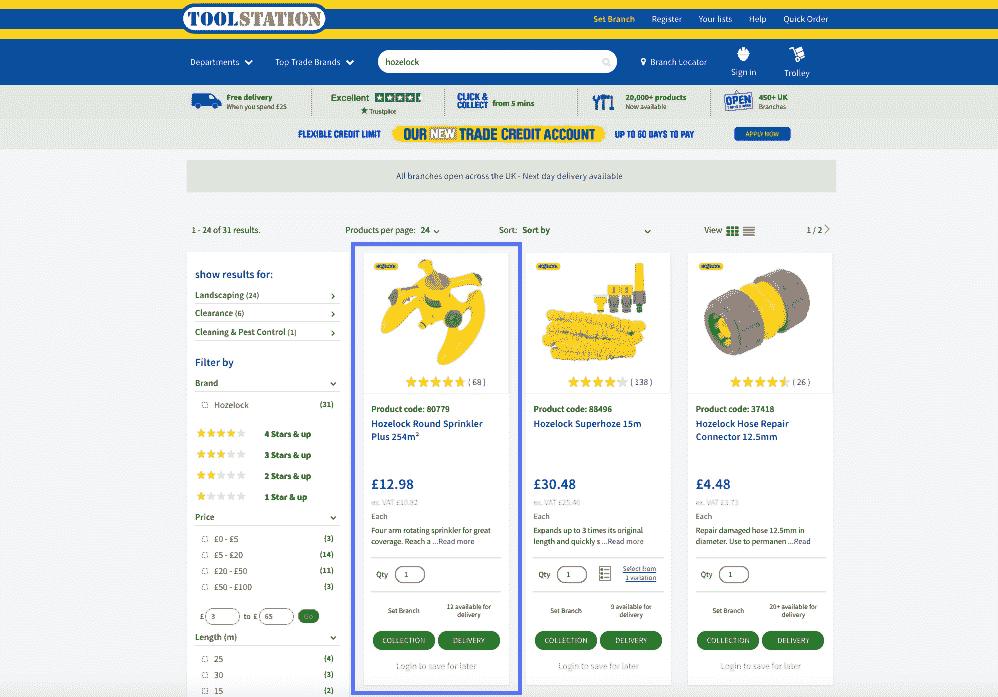
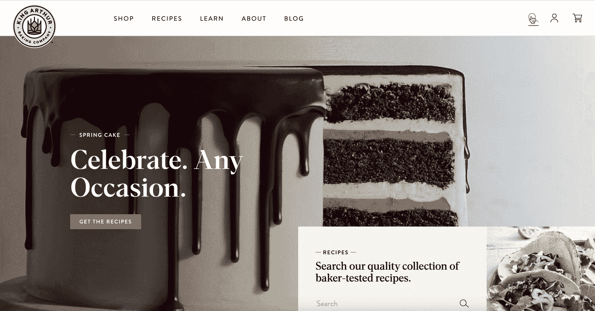
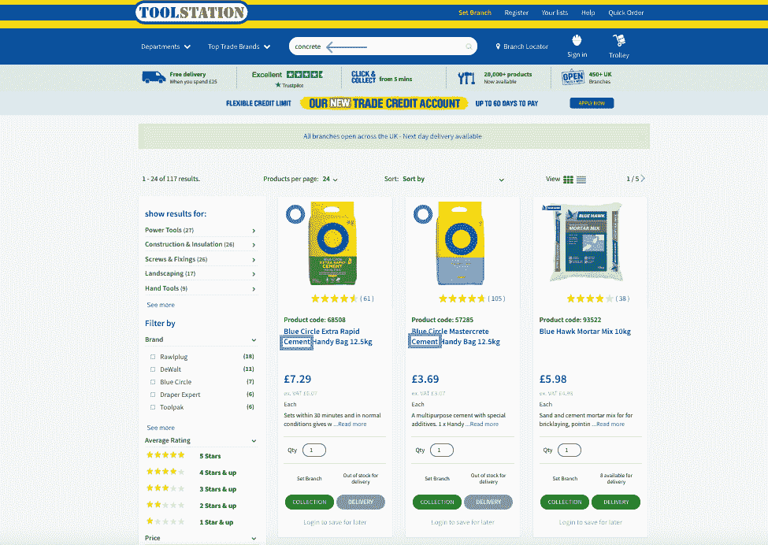
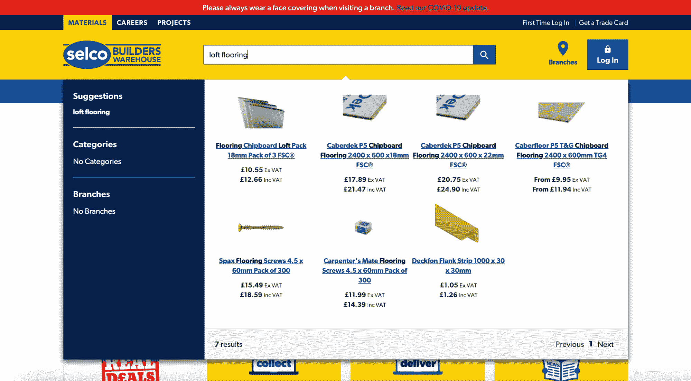

# B2B 商务数字化转型:营销和人工智能优化

> 原文：<https://www.algolia.com/blog/ecommerce/b2b-commerce-digital-transformation-merchandising-and-ai-optimizations/>

在我们的 B2B 数字化之旅中，继[搜索和导航优化](https://www.algolia.com/blog/ecommerce/b2b-commerce-digital-transformation-search-filtering-sorting-and-navigation/) 之后，我们将讨论商品销售以及如何利用人工智能自动化对其进行优化。[数字销售](https://www.algolia.com/industries-and-solutions/ecommerce/digital-merchandising/)让您能够控制产品目录的展示，并允许您将业务逻辑应用于搜索结果页面、类别页面、过滤面，甚至产品传送带。

### 面向 B2B 公司的商品销售

B2B 公司需要完全控制如何向网站用户展示目录，轻松选择要推广的产品和要突出显示的产品。为了在日常生活中有效地利用这种功能，需要一个以业务用户为中心的 UI 界面，其目标是使 B2B 销售团队能够独立自主地工作，不受工程和其他技术团队的影响。此外，拥有多个子部门的大型 B2B 组织需要有能力在子级别推出销售指南。每个地方分支都应该能够独立地建立自己的规则和商业策略。

销售策略是电子商务的重要工具，不应该是 B2C 零售商的专利。B2B 公司需要能够受益于 B2C 的最佳在线销售实践，并获得基于内部销售和营销策略快速推广任何产品或类别的能力。

### 用 AI 自动化优化商品销售

自动化是另一个可以增强销售工作并最大限度提高效率的方面，尤其是在处理超大目录时。这包括为用户提供 ML 生成的产品推荐，对搜索结果进行动态重新排序，以确保最受欢迎的产品出现在顶部，或者根据用户搜索建议人工智能生成的同义词。

通过应用人工智能和机器学习工具，我们可以腾出时间让组织的人才专注于电子商务流程和网站管理的定制方面，同时补充员工可用的数据，并利用人工智能生成的分析见解支持他们的业务决策过程。人工智能和人工智能工具能够大规模分析大量数据，并推荐和强调战略机会，例如识别潜在的增长空间或发现应该减轻的“失去的”机会。

## 商品销售

### **搜索商品销售**

搜索营销确保所有必要的业务逻辑都包含在将呈现给用户的搜索结果中。

### **商品类别**

类别销售工作流程使公司能够将业务逻辑应用于类别页面。这样，每次购物者在浏览网站和不同的产品类别时(或从外部来源(如谷歌)登录类别页面时)，结果都会以特定的顺序出现，可以根据当前的促销业务需求轻松调整和优化转换。

*   锁定并隐藏物品
*   增强、隐藏和过滤类别
*   设置类别排序的优先级
*   禁止物品类别
*   商品筛选选择
*   基于日期范围的商品，用于限时促销
*   基于地理位置、设备、用户群的商品
*   可配置的预览界面
*   设置无条件规则(规则一直触发*)，例如:*
    **   返回自定义数据，如横幅(例如，在类别页面上显示横幅)*   添加默认搜索参数(例如，将所有查询的半径搜索参数设置为 1000 米)*   隐藏项目(例如，根据用户搜索的内容隐藏记录)*
**   设置仅上下文规则(由‘rule context’触发的规则，不需要查询)*   基于过滤器选择的商品，其中过滤器可以是条件或触发器，但也可以是商品*   Facet Merchandising(Facet type 和 value 重新排序–功能可应用于搜索和分类页面)*

 *### Algolia B2B 电子商务客户成功实施销售策略的例子:

#### 使用相关性规则搜索商品和促销项目:工具站

当用户在 B2B 零售商 Tool Station 的网站上搜索“hozelock”时，选定的产品会被钉在搜索结果的顶部，以便更有效地进行商品销售。

#### 搜索商品——重定向到一个包含相关规则的专用登录页面:亚瑟王面粉

在 B2B 零售商亚瑟王烘焙网站上，当用户输入查询“过敏”时，他们会被重定向到网站上专门为他们的查询定制的页面。

## AI 优化

### 人工智能

[动态重新排名](https://www.algolia.com/products/ai-search/dynamic-reranking/)利用人工智能来发现用户行为的趋势。根据查询和他们点击或转换的结果的位置，它可以通过提升越来越受欢迎的结果来提高你的相关性。

### 艾同义词建议

使用人工智能，Algolia 可以识别用户经常更改(重写)的查询，并提出术语的同义词。有了[动态同义词建议](https://www.algolia.com/products/ai-search/dynamic-synonym-suggestions/)，你所要做的就是接受或拒绝建议的同义词。如果你认为有更好的选择，你也可以在接受建议前调整一下。这些同义词很好地表明了用户在网站上搜索的内容以及他们如何表达他们的查询，这对 SEO、数据改进、产品目录增强等非常有用。

### 人工智能推荐

利用 ML 对[推荐进行过滤、推销、排名和语境化](https://www.algolia.com/products/recommendations/)以符合您的品牌和独特的业务目标。

*   经常一起购买——推动交叉销售，增加平均订单价值
*   相关产品–最大化转化率和目录曝光度

### Algolia B2B 电子商务客户成功实施人工智能优化的例子:

#### 动态同义词建议:工具站，Selco

在 Tool Station 的网站上，由于 Algolia 的人工智能生成的同义词建议，用户即使在输入查询时使用不同的词(例如“水泥”或“混凝土”)，也可以获得相关的结果。

在 Selco 的网站上，由于 Algolia 的人工智能生成的同义词建议，用户即使在输入查询时使用不同的单词(例如“loft flooring”或“chipboard flooring”)，也可以获得相关的结果。

上面的例子展示了配置和执行稳健的销售策略的各种有效方法，从开展季节性促销活动，到利用人工智能和人工智能工具，通过自动实现向 B2B 电子商务网站购物者显示的搜索和浏览结果的最佳相关性来推动销售和收入。*