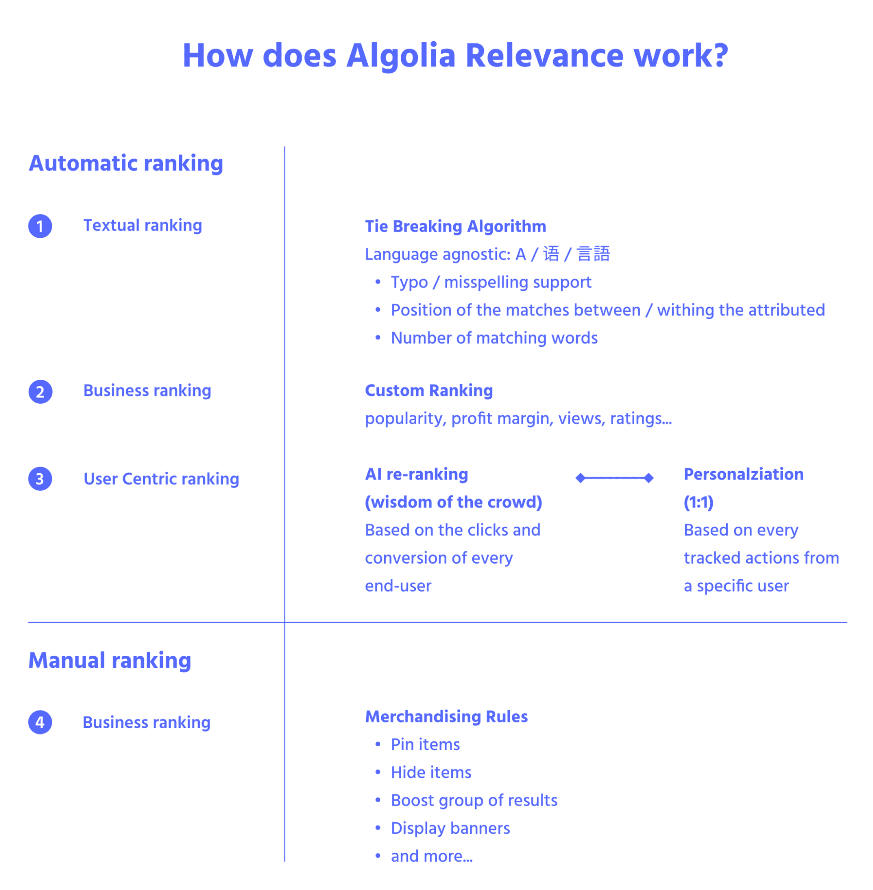

# B2B 电子商务的数字化转型:建设一流 B2B 电子商务网站的基本搜索和发现组件是什么

> 原文：<https://www.algolia.com/blog/ecommerce/b2b-commerce-digital-transformation-what-are-the-essential-search-and-discovery-components-for-building-a-best-in-class-b2b-ecommerce-site/>

电子商务网站的基本要素包括快速、相关和上下文相关的搜索和导航体验，以及通过销售功能和人工智能优化实现的业务逻辑，如搜索结果的动态重新排序、同义词建议和基于独特用户配置文件的个性化。这对于 B2B 来说应该没有什么不同，因为用户希望能够快速方便地订购。

除了上面列出的标准电子商务元素之外，B2B 网站还有独特的挑战和要求，这些对于成功实施电子商务平台解决方案至关重要:

### 核心要求

| **数据** | [Personalised catalogues](https://www.algolia.com/doc/guides/solutions/ecommerce/b2b-catalog-management/tutorials/personalized-catalogs/)

*   买方账户级别的目录管理和授权政策
*   每个客户的可用库存

[个性化价格](https://www.algolia.com/doc/guides/solutions/ecommerce/b2b-catalog-management/tutorials/personalized-pricing/) |
| **搜索** | 

*   搜索最终客户自己的参考资料(大宗产品订单的别名)、标题、描述、技术信息、特性( [、零件号](https://www.algolia.com/doc/guides/solutions/ecommerce/b2b-catalog-management/tutorials/search-by-sku/) 、制造商、品牌、项目功能)
*   使用特殊字符搜索尺寸-缩写、 [连字符属性](https://www.algolia.com/doc/guides/managing-results/optimize-search-results/typo-tolerance/how-to/how-to-search-in-hyphenated-attributes/) 、符号“("、" = "、"/")、测量单位的刻面(m，cm)..)
*   强&快 [刻面](https://www.algolia.com/doc/guides/managing-results/refine-results/faceting/)
*   长尾查询(超出最受欢迎的结果)

 |
| **用户界面** | B2B 快速订单(根据 SKU 或产品名称快速下单) |

### 高级要求

| **联合搜索** | [包括多种结果类型](https://www.algolia.com/doc/ui-libraries/autocomplete/guides/including-multiple-result-types/) : FAQ、产品评论或规格表 |
| **排序依据** | (注意:B2B 的价格排序特性的实现取决于每个独特的用例以及技术堆栈/架构)下面是一些建议和想法

*   公共价格:如果每个客户的折扣以百分比表示，则公共价格可能有用。
*   每客户价格(虚拟副本)
*   每个客户群(虚拟副本)

 |
| **查询建议** | [Query suggestions](https://www.algolia.com/doc/guides/building-search-ui/ui-and-ux-patterns/query-suggestions/js/) can be implemented on B2B sites under some conditions.*注意:查询建议只包括最流行的查询，不包括长尾上的查询。* |
| **行为个性化** | [基于用户交互的个性化结果](https://www.algolia.com/doc/guides/personalization/personalizing-results/) |

https://www . algolia . com/doc/guides/solutions/ecommerce/B2B-catalog-management/

数字化转型计划需要将独特的 B2B 需求与基本的电子商务功能无缝融合，以实现拥有高效易用的全渠道 B2B 电子商务平台的目标。你想让你的买家从你的平台上购物变得尽可能简单高效——比打电话给你的销售代表或客户服务更容易。

实施计划从配置搜索开始；设计过滤、分类和导航流程；运用营销策略；并通过人工智能优化来放大设计，包括 B2B 特定的个性化功能。对于 Algolia，相关层的结构和设计使您能够完全控制如何向客户展示您的产品和内容。

