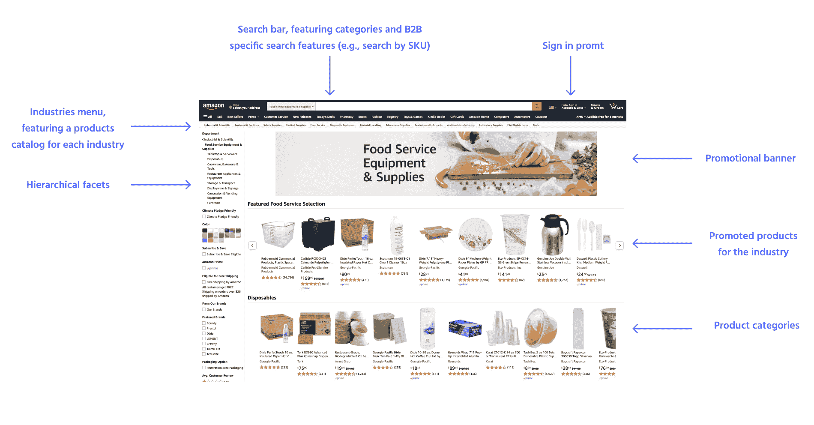
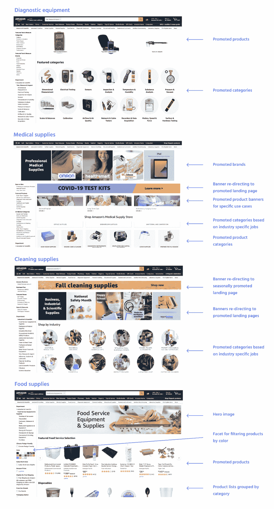
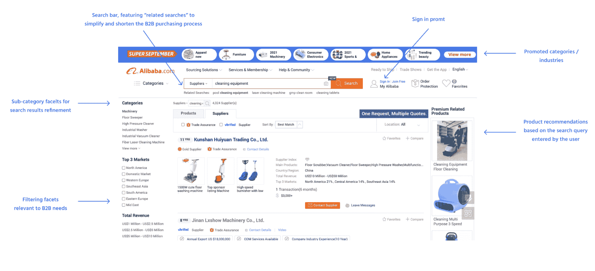
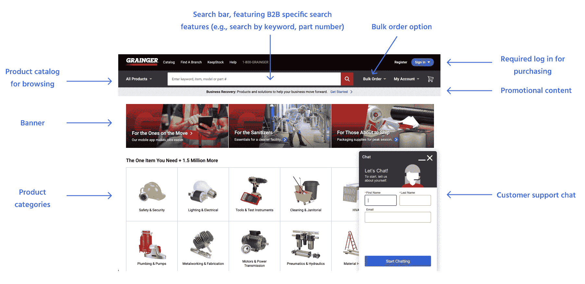
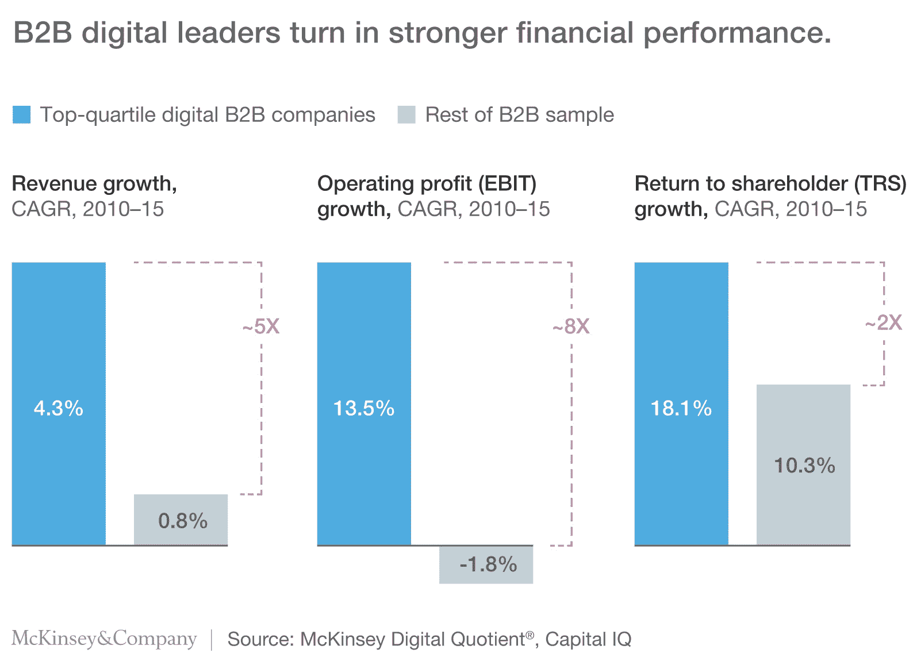

# B2B 商务数字化转型:为什么 B2B 零售商应该采用 B2C 最佳实践

> 原文：<https://www.algolia.com/blog/ecommerce/b2b-commerce-digital-transformation-why-should-b2b-retailers-adopt-b2c-best-practices/>

B2B 电子商务的数字化转型对数字化用户体验提出了越来越高的要求。对 B2B 电子商务的需求正在迅速增长。目前， [75%的 B2B 产品采购已经在网上完成](https://www.sana-commerce.com/b2b-buying-process-2019-report-how-to-meet-b2b-buyers-demand/) 。虽然有 30%的 B2B 买家更愿意在网上购买至少 90%的产品，但目前只有 19%的人这样做。B2B 网站访问者的活动不仅限于购买产品，而是跨越多个其他领域，如产品信息收集、客户服务相关的互动(如帮助中心搜索)、通过聊天或电话与销售或支持代表沟通等。多达 62%的 B2B 买家现在更喜欢在线获取信息，这促使企业开始考虑客户对 B2B 商务流程和体验的新需求和期望。

如今，超过 [90%的 B2B 购买是从搜索](https://go.forrester.com/blogs/a-social-take-on-social-selling/) 开始的，而 [大多数互动已经通过数字渠道](https://www.gartner.com/en/newsroom/press-releases/2020-09-15-gartner-says-80--of-b2b-sales-interactions-between-su) 发生。新一代买家对 B2B 电子商务平台有更高的期望:相关和直观的产品搜索和导航，更容易和更快的结账，容易重复订购，更快的交货和改进的跟踪。

“在线 B2B 领导者，如亚马逊商务、W.W .固安捷公司、MSC 工业供应公司、惠普企业和戴尔技术公司，多年来一直在提高制造商和分销商的电子商务标准。”*(来源:**[Order Up:酝酿 B2B 买家的有效购买路径](https://www.digitalcommerce360.com/industry-resource/order-up-brewing-an-effective-purchase-path-for-b2b-buyers/)* *，2021 年 8 月)*这些公司迅速跟随 B2C 数字化转型的脚步。通过采用 B2C 电子商务最佳实践，他们成为了 B2B 领域的领导者，现在主导着整个行业。

“制造商 HPE 和戴尔长期投资在线订购和相关系统，如复杂的产品配置器。分销商固安捷(Grainger)和 MSC 都在继续改进他们如何让客户通过多种电子渠道(从电子商务网站和移动设备到互联网连接的自动售货机和 EDI)找到并订购产品和服务。”*(来源:* *[Order Up:酝酿 B2B 买家的有效购买路径](https://www.digitalcommerce360.com/industry-resource/order-up-brewing-an-effective-purchase-path-for-b2b-buyers/)* *，2021 年 8 月)*这种对 B2B 商务平台数字化的战略投资让这些公司经得起未来考验，使他们从竞争中脱颖而出，并允许他们快速适应和迭代任何行业转变。最重要的是，持续创新的文化使新技术的采用成为一个更顺利的过程，并且比那些跟不上潮流的组织更少内部阻力。

### 当前 B2B 商务趋势

领先的 B2B 电子商务市场平台包括以下功能*(来源:* *[亚马逊](https://business.amazon.com/en/discover-more/blog/the-rise-of-b2b-ecommerce) ， [促销营销杂志](https://magazine.promomarketing.com/article/amazon-business-b2b-marketplace-surpasses-25-billion-annual-sales/) ， [阿里巴巴](https://rfq.alibaba.com/)**2021)*:

*   该平台是各行业/品类产品的采购中心
*   买家可以按行业或产品类别进行分类或搜索
*   该平台支持公司采购卡，并提供数量折扣、商业定价和其他优惠
*   一种供应商/卖家过滤选项，通过各种品质进行过滤，例如多样性、公平性和包容性，旨在将买家与小型和多样化的卖家、供应商、行业、年收入、原产国、行业经验、他们经营的市场等联系起来
*   该平台允许买卖双方直接在平台上协商价格，包括使用聊天功能
*   该平台利用 B2C UX 和最佳实践

### UI 和 UX 设计仿照 B2C 最佳实践

在下面的例子中，亚马逊 B2B marketplace 采用了单独的产品目录和不同的 UI 设计，专门为每个行业的企业客户量身定制，以确保只向每个用户提供最相关的产品。

### 登陆页面最佳实践

在下面的例子中，亚马逊为其 B2B 市场上的每个行业定制了登录页面 UI/UX 设计，以最好地满足每个企业客户部门的需求。向企业销售商品和服务在多个方面不同于向个人销售。B2B 公司可能会面临 B2C 领域通常不存在的挑战。例如，B2B 公司必须展示他们的专业知识，并在登录页面上反映他们买家的行业和背景，以便在他们的商业客户中建立信任。

### 高级电子商务功能，如促销和推荐

在下面的例子中，B2B 市场阿里巴巴为其 B2B 市场提供了 B2C 电子商务网站上常用的高级电子商务功能:基于用户搜索查询的产品推荐、促销类别和推荐搜索查询。

领先的 B2B 制造商和零售商网站包括与领先的 B2C 网站类似的高级电子商务功能。成功的 B2B 电子商务网站包括 B2B 特定功能与 B2C 电子商务最佳实践*(来源:* *[贝玛研究所](https://baymard.com/premium/guideline-collections/t0ynv1) )* ，如:

*   带有预测性查询建议的自动完成搜索，包括迎合特定 B2B 用户行为，如 SKU 搜索
*   高搜索结果相关性
*   高效的过滤和导航，服务于特定的业务需求
*   个性化目录、搜索结果、定价等。对于每个企业用户
*   人工智能优化和先进的销售策略，以实现更好的转化和销售增长
*   直观、B2B 优化的结账流程
*   UX 迎合新手用户，而不仅仅是老用户或有经验的用户

[](https://www.algolia.com/search-inspiration-library/?configure%5BhitsPerPage%5D=9&indices%5BPROD_algolia_com-inspiration-library_query_suggestions%5D%5Bconfigure%5D%5BhitsPerPage%5D=6&indices%5BPROD_algolia_com-inspiration-library_query_suggestions%5D%5BrefinementList%5D%5Bpage%5D=1&indices%5BPROD_algolia_com-inspiration-library_query_suggestions%5D%5Bpage%5D=1&page=1&refinementList%5Bindustry%5D%5B0%5D=B2B%20Retail&refinementList%5BbizDevTools%5D=&refinementList%5BuseCase%5D=&refinementList%5BimpactedPage%5D=&query=)

## 为什么迫切需要采用 B2C 的做法？

B2C 公司的数字化转型比 B2B 零售商更早开始。当新冠肺炎·疫情加速电子商务的发展并快速适应不断变化的客户需求和期望时，最懂技术的 B2C 零售商准备利用他们可用的多种工具，将自己与亚马逊等大型 B2C 零售商相提并论。今天的购物者习惯于快速和相关的搜索结果、简单的网站导航和订购流程、产品推荐、方便的结账流程和有用的客户支持服务。新一代的商业购物者希望 B2B 网站也能提供类似的功能和用户体验。随着 B2C 零售巨头进入并很快主导 B2B 领域，尽快适应商业购物者的期望并为其网站实施 B2C 最佳电子商务实践对于 B2B 零售商的生存至关重要。

## 数字化转型对 B2B 行业的影响

*   **市场规模:**B2B 市场总规模为 67 万亿美元，是全球零售市场规模的近三倍。*(来源:加拿大皇家银行资本市场，* *[美国消费者新闻与商业频道](https://www.cnbc.com/2019/12/06/amazon-business-a-b2b-unit-to-reach-31-billion-revenue-by-2023-rbc.html) )*
*   **商机:** 今天的 B2B 世界仍然没有达到高效服务的地步。*(资料来源:加拿大皇家银行资本市场，* *[美国消费者新闻与商业频道](https://www.cnbc.com/2019/12/06/amazon-business-a-b2b-unit-to-reach-31-billion-revenue-by-2023-rbc.html)* *)* 如今相对较低的在线销售额落后于 B2C 同行，但仍在稳步增长，代表着在线扩张的巨大潜力。今天的 B2B 购物者希望获得与 B2C 购物者相同的购物体验。通过投资 B2B 电子商务平台、技术基础设施和其他在线交易支持系统(如定价引擎、库存管理)的数字化转型，B2B 公司将能够获得更大的市场份额，因为大多数 B2B 竞争对手在电子商务数字化方面都远远落后。
*   **成功指标:**根据[麦肯锡](https://www.mckinsey.com/business-functions/marketing-and-sales/our-insights/how-b2b-digital-leaders-drive-five-times-more-revenue-growth-than-their-peers)进行的一项研究，成功掌握数字化转型的 B2B 公司比同行多 8%的股东回报和五倍的收入增长。

亚马逊等行业领导者预计将主导 B2B 零售市场。通过正确的 B2B 数字用户体验和电子商务流程优化方法，例如采用 B2C 的最佳实践并解决 B2B 的独特需求和常见难题，亚马逊能够在市场份额和盈利能力方面实现巨大增长。

*   到 2023 年，亚马逊的业务(B2B 电子商务市场)收入将达到 310 亿美元，同期销售额将增长五倍，达到 520 亿美元。*(来源:加拿大皇家银行资本市场，**)*
*   2019 年亚马逊业务(B2B 零售)增速比亚马逊(B2C 零售)快 3 倍。*(资料来源:加拿大皇家银行资本市场，* *[美国消费者新闻与商业频道](https://www.cnbc.com/2019/12/06/amazon-business-a-b2b-unit-to-reach-31-billion-revenue-by-2023-rbc.html) )*
*   亚马逊业务在 2019 年的增长速度也是亚马逊网络服务的 1.6 倍。那一年，亚马逊网络服务的销售额从 256.6 亿美元增长到 350.2 亿美元，增幅为 37%。*(来源:加拿大皇家银行资本市场，* *[美国消费者新闻与商业频道](https://www.cnbc.com/2019/12/06/amazon-business-a-b2b-unit-to-reach-31-billion-revenue-by-2023-rbc.html) )*
*   亚马逊企业全球采购解决方案被 9 个国家的 500 多万家企业使用，全球年销售额达 250 亿美元。*(来源:* *[亚马逊](https://business.amazon.com/en/discover-more/blog/us-public-entities-and-enterprises-accelerate-adoption-of-amazon-business) ，2021)*

## B2B 电子商务的特点及含义

|  | 特性 | 含义 |
| 用户细分 | 领域专家和回归用户拥有专业背景和丰富的产品知识 | 产品知识水平极高的 B2B 用户可以执行导航快捷方式:搜索 SKU、点击导航面包屑、在表单中使用键盘跳转等。 |
| ‘领域专家’谬论 | 对新手用户 (对 B2B 品牌、行话或整个行业领域来说都是新的)的关注度低导致了重大的导航挑战。 | 忽视新手用户会让 B2B 网站错失良机，因为这些用户是获得新客户的巨大潜在来源。 |
| 个人用户的重要性 | 个人用户代表着巨大的利润来源，更不利于疏远。 | B2B 网站在客户支持解决方案上投入更多，而 B2C 网站出于利润考虑，尽量减少投入。 |
| 用户意图 | B2B 产品浏览更多的是意图和问题驱动。 | B2B 用户倾向于根据特定的产品属性进行过滤，或者执行功能查询(寻找特定的东西)。 |
| 结账流程/复杂性 | Checkout flow and order confirmations are more complex (separate billing and shipping addresses, VAT numbers, PO numbers, accounting information, etc.).支付方式可以是异步的(发票、采购订单、信用等。). | B2B 结帐将需要结帐优化，以在功能丰富和可用的流程之间建立适当的平衡。 |
| 电子商务功能 | 电子商务功能通常与产品目录分开。 | 从网站 UX 的角度来看，目录和电子商务的分离与用户对网站功能的期望不一致。 |

*【https://baymard.com/premium/guideline-collections/t0ynv1】[来源:](https://baymard.com/premium/guideline-collections/t0ynv1)*

 *为了成功地将传统 B2B 零售业务转变为现代数字电子商务平台，必须重新设计和重构软件架构。为了能够实施和利用电子商务行业的最佳实践，这是一个必要的步骤。此外，这样的架构变化将使 B2B 组织经得起未来考验，并使其有能力生成快速有效的迭代，并对任何新趋势或业务影响事件做出闪电般的快速响应。

[T39](https://www.algolia.com/search-inspiration-library/?configure%5BhitsPerPage%5D=9&indices%5BPROD_algolia_com-inspiration-library_query_suggestions%5D%5Bconfigure%5D%5BhitsPerPage%5D=6&indices%5BPROD_algolia_com-inspiration-library_query_suggestions%5D%5BrefinementList%5D%5Bpage%5D=1&indices%5BPROD_algolia_com-inspiration-library_query_suggestions%5D%5Bpage%5D=1&page=1&refinementList%5Bindustry%5D%5B0%5D=B2B%20Retail&refinementList%5BbizDevTools%5D=&refinementList%5BuseCase%5D=&refinementList%5BimpactedPage%5D=&query=)*