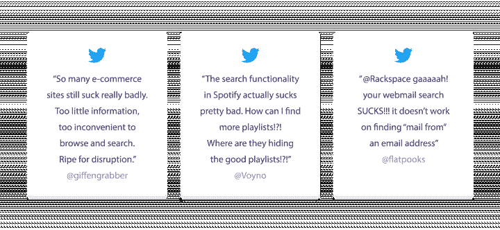
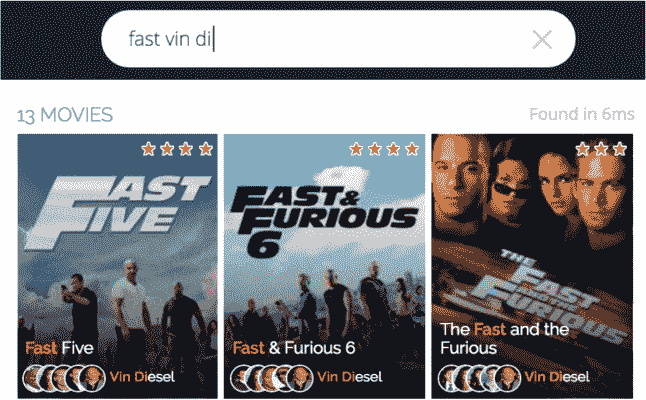
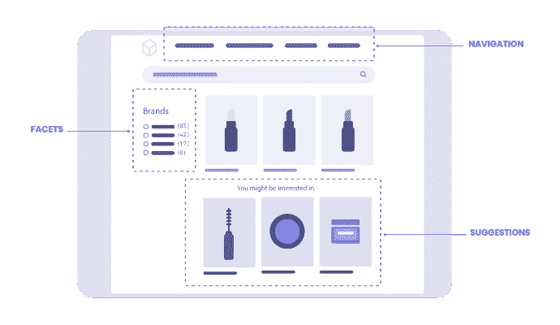

# 自定义内部网站搜索的好处| Algolia

> 原文：<https://www.algolia.com/blog/ux/benefits-internal-site-search/>

今天，众所周知，谷歌、亚马逊和网飞这样的巨头为搜索设立了很高的门槛。因此，用户希望随时搜索他们想要的内容，并立即获得相关的结果。不幸的是，许多网站和企业认为搜索是一种事后的想法，而不是一种商业工具。如果你的网站有一个普通的搜索工具或者没有优化的搜索工具，你可能会把用户从你的网站上赶走，并且浪费你的商业资金。

定制的内部网站搜索通过提供一个为企业量身定制的搜索引擎，将用户与网站内容或产品目录快速关联起来，从而帮助您保持竞争力。通过定制网站搜索，企业可以测试、调整和迭代搜索和 UX，以确保它对用户来说始终是一流的。自定义内部站点搜索是实现业务目标和流畅客户体验的关键功能。

## 内部搜索如何惠及客户？

自定义网站搜索将传统搜索提升为有益且令用户满意的体验。每个网站访问者都有许多好处:

### **减少搜索体验中的摩擦**

自定义内部搜索使搜索流程更加简化和高效。大多数现代网站和应用程序都充斥着多种格式的信息，这些信息以各种方式组织在不同的微型网站和子域名中。

即使你的网站是精心组织的，绝大多数网站或应用程序用户并不知道你的布局，许多人也不会花太多时间去理解它。事实上，根据 Forrester Research 的调查，[43%的网站访问者](https://neilpatel.com/blog/site-search-killing-your-conversion/) 在打开网站时会立即进入内部搜索栏。因此，一个适当优化和相关的搜索功能是连接他们所需要的最快捷的方式。

这是零售网站上使用搜索栏 [的购物者比不使用搜索栏的购物者多花费 2.6 倍](https://www.salesforce.com/solutions/industries/retail/shopping-index/?cc=demandware.com/shopping-index/) 的部分原因。定制搜索工具将有强烈购买意愿的用户与他们的需求紧密联系起来，而不需要他们进行大量的网站搜索或反复试验。

### **为每个查询提供更好的相关性**

不幸的是，用户经常面对过多的模糊或偏离目标的搜索结果，太少的结果，或者在某些情况下，根本没有结果。如果一个搜索引擎的实现没有考虑到用户概况和客户及行业的期望，搜索将会受到影响，你的网站访问者也会注意到。当客户遇到糟糕的搜索体验时，他们会记住它。

定制的内部网站搜索通过向用户提供相关结果来消除这些客户痛点。相关性可以分为两个主要部分——匹配和排名。

匹配是指为查询找到适用的记录。要做到这一点，网站搜索必须容忍用户的错误，如打字错误和替代措辞。网站搜索还需要真正具有适应性，考虑自然语言特征和部分单词匹配等因素，以确保每个查询都能找到结果。

排名确保最佳匹配出现在搜索结果的顶部。最好的网站搜索工具了解用户的在线行为，并迎合他们的期望和需求。对于现代网站搜索，基于用户简档的个性化可以驱动优化排名。所有这些加在一起就能产生符合每个用户期望的结果，让访问者更加满意，并最终提高转化率。

### **为网站访问者提高 UX**

对于用户来说，没有什么比一长串没有优先级的结果更糟糕的了。通过自定义搜索，公司可以突出显示搜索结果，以帮助用户了解为什么会返回某些结果。他们还可以 [使用方面和过滤器](https://blog.algolia.com/inside-the-engine-part-8-handling-advanced-search-use-cases/) 为复杂的搜索建立一个直观的界面，以及从网站的不同区域提取内容，以简化用户需要完成的搜索数量。

An example of a search query where several attributes are required to explain the result: the movie title & the actor name.

但是除了交易体验之外，网站搜索能做的不仅仅是引导客户快速转化。当访问者查询一个真正优化的、定制的内部网站搜索时，他们应该很高兴发现他们甚至不知道自己需要的内容或产品。相关产品和内容、季节性商品或企业希望推广的商品可以配置为在特定查询的搜索结果中显示，从而推动用户进一步参与您网站上的产品或内容。

在这个网络世界中，客户希望他们的需求尽快得到满足，而不是感觉自己在商业计划中无足轻重。他们也想获得鼓舞人心的经历。自定义内部网站搜索可以帮助你做到这两点。当您释放自定义网站搜索的潜力时，您的客户将从即时提供的更相关和个性化的结果中受益。这提高了用户满意度，建立了品牌忠诚度，并增加了回头客的机会。

## 内部网站搜索如何让企业受益？

受益于定制网站搜索的不仅仅是用户。提供强大的搜索功能是在用户对他们的搜索体验有很高期望的世界中保持竞争力的重要方法。毕竟，你的用户搜索越成功，你的生意就越成功。

自定义内部搜索也有助于解决公司面临的关键挑战:

### **揭露客户意图**

其中一个挑战是，由于缺乏关于客户兴趣的数据，对客户的需求缺乏了解。自定义内部网站搜索功能可以让公司直接获得这些信息。事实上，当需求出现时，消费者通常会转向搜索，期望获得即时、顺畅的体验。这些“[Now Moments](https://www.algolia.com/)”提供了与客户联系并了解其意图的最佳机会，因为每次搜索都会生成可操作、可分析的数据。通过搜索，企业可以直接了解用户在某个特定时刻的需求，并获得战略洞察力。

### **提高内容可发现性**

另一个挑战是内容的可发现性。随着网站的发展，寻找特定的内容变得越来越困难。某些页面、产品或信息可能比网站导航本身更容易通过网站搜索找到。

自定义网站搜索可帮助您发现所有内容。无论你的站点上有多少页面或文档，只要是组织良好的索引的，你的站点搜索就能全部解析。配备了 [联合搜索界面](https://blog.algolia.com/federated-search-benefits-and-challenges/) 的定制内部站点搜索工具特别有效，因为它们可以同时在几个单独的索引中进行搜索。例如，通过一个查询，联合搜索界面可以在一个简化且直观的界面中显示博客文章、常见问题解答和产品，其中相关性可以根据业务和用户规范进行调整。一个优秀的联合搜索引擎还可以包含同义词，并考虑到搜索过程中的拼写错误和其他关键变量。

通过这种方式，内部搜索最大限度地增加了为客户提供相关搜索结果的机会，而无需您付出特别的努力。推而广之，它提高了转化率。自定义搜索还允许您向用户显示特色产品或相关信息，这些用户可能不会在其他地方发现这些信息。

## 真正的商家如何从定制网站搜索中获益

Coursera， 一个拥有数千门课程和数百万用户的在线学习平台，需要一个能够跟上公司发展的网站搜索功能，而 Coursera 的开发人员无需付出太多努力。Coursera 需要直观的网站搜索，开发者可以随时定制和测试。使用 Algolia，Coursera 实现了 [联合内部搜索](https://blog.algolia.com/what-is-federated-search/) 以及全新的 UX、高亮显示、标签等等。结果，Coursera 看到了 [令人印象深刻的改进](https://goto.algolia.com/coursera) :

*   10 倍的搜索速度
*   学位描述页面浏览量增加 10%
*   30%的注册来自网站搜索

德国的在线杂货商 Bringmeister 正在努力满足网站搜索用户和开发者的需求。用户感到沮丧，因为他们必须键入准确的产品名称才能找到他们要找的东西，而开发人员对性能问题和他们的开源搜索平台缺乏灵活性感到沮丧。Bringmeister 在 Algolia 上实现了一个新的搜索功能，结果令人惊讶。Bringmeister 发现，退出搜索页面的用户减少了 63%，与搜索相关的客户投诉降至零。除此之外，Bringmeister 还有 [增加效率和敏捷](https://goto.algolia.com/bringmeister) 几个方面:

*   团队可以在没有开发者资源的情况下调整搜索排名。
*   商业领袖可以使用查询规则来推广某些产品以及其他活动和合作关系。
*   Bringmeister 可以通过搜索向客户展示新的、鲜为人知的产品。

## 为什么需要自定义内部站点搜索

使用自定义网站搜索的网站在速度、用户体验、开发者控制和效率方面有优势。在这个世界上，近一半的用户在访问网站时会寻找内部搜索栏(成功的搜索会使转化率增加一倍以上)，自定义网站搜索为保持竞争力和提供出色的用户体验带来了重要的好处。

Algolia 让您在网站或应用上轻松创建和实现出色的搜索。借助开箱即用的各种高级功能和丰富的分析功能，您可以将您的站点搜索转化为竞争优势。

了解更多关于 [购买 vs .构建您的内部搜索](https://www.algolia.com/pdfs/Buy.vs.Build.-.The.trus.cost.of.an.enterprise.search.-.Infographic.pdf) ，或 [观看我们的演示](https://go.algolia.com/deep-dive-demo) 了解 Algolia 的行动。