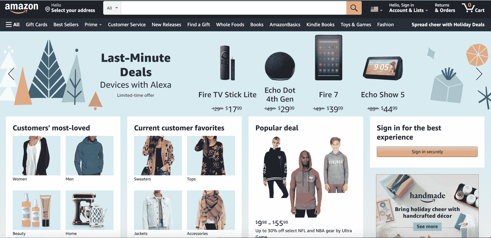
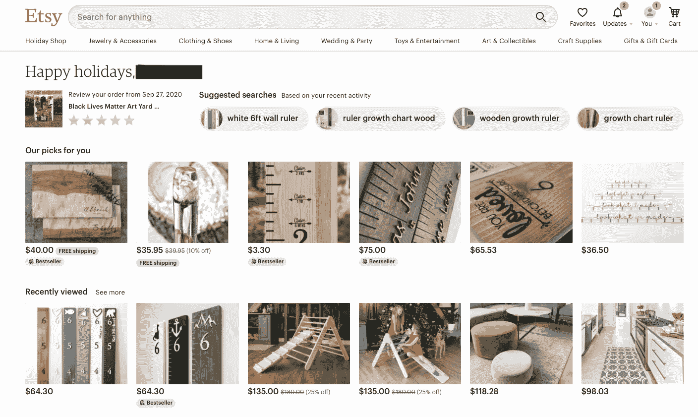
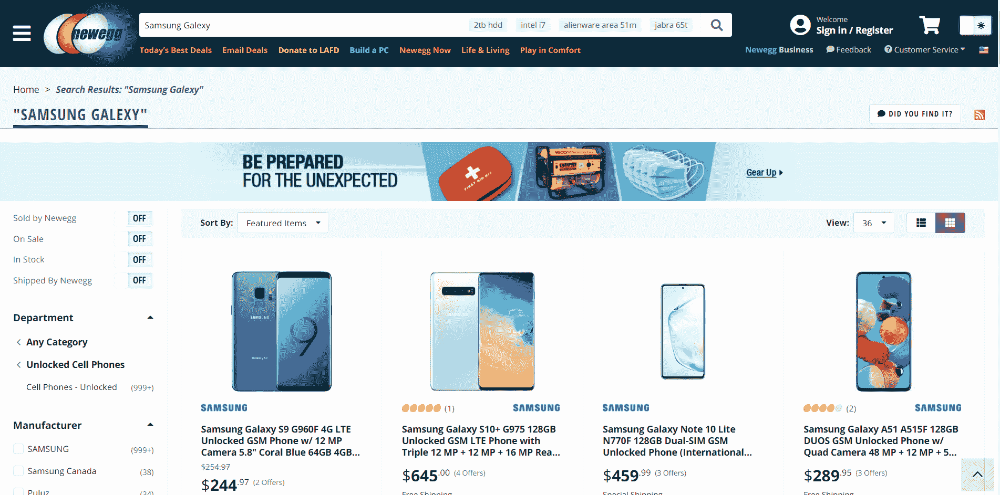
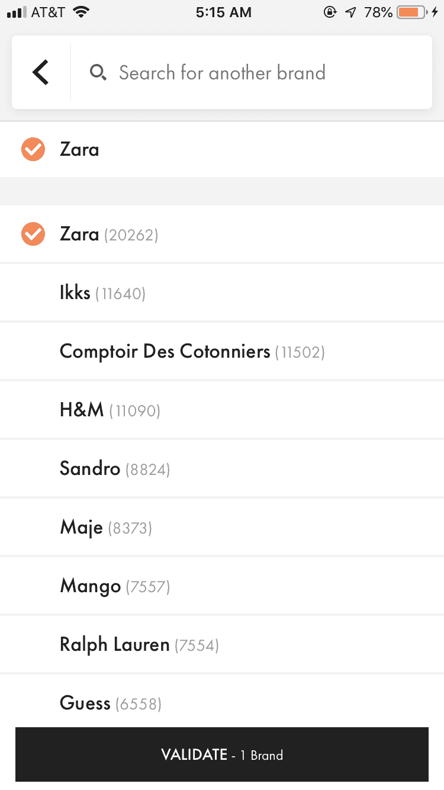
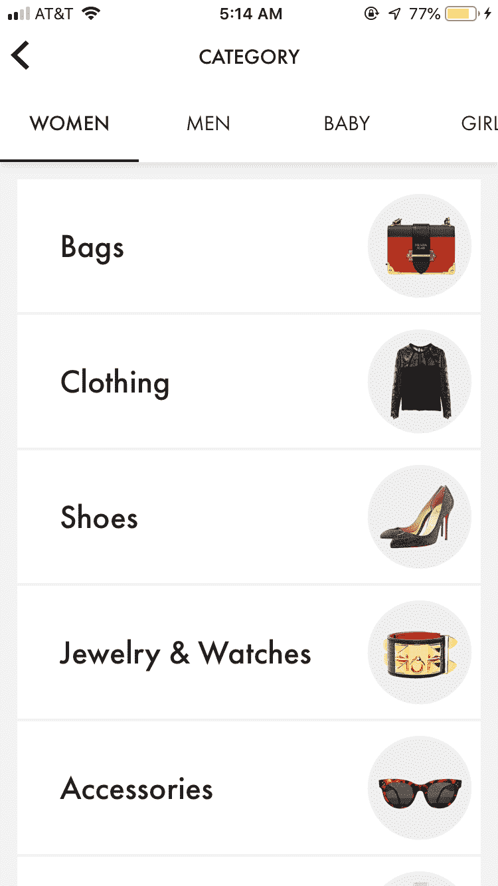
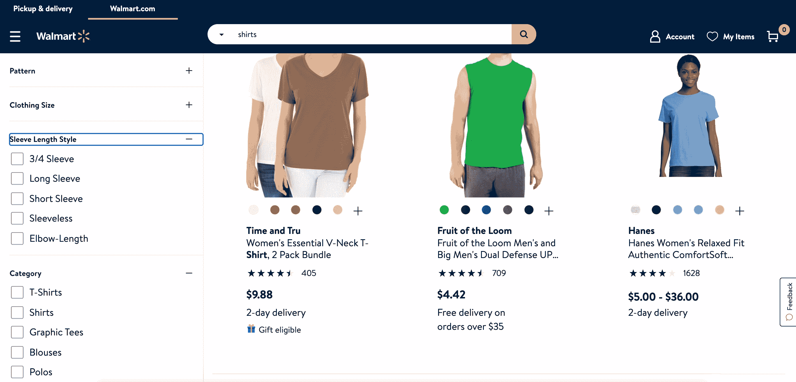
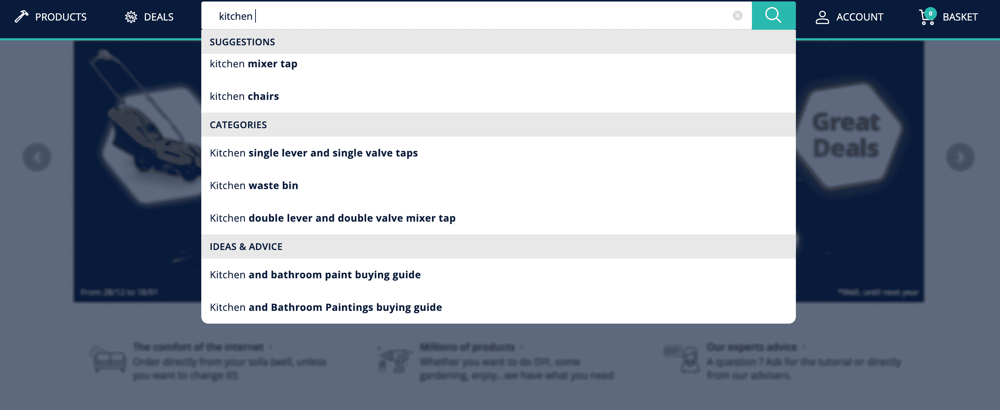

# 最佳市场 UX 搜索实践，由行业领导者展示- Algolia 博客

> 原文：<https://www.algolia.com/blog/ecommerce/best-marketplace-ux-practices-for-search/>

在本帖中，我们将从世界上最受欢迎和最赚钱的市场中寻找 UX 最佳市场实践。您会注意到一个趋势:市场搜索引擎需要支持高级搜索和浏览场景，如动态分面、内容传送带、自动完成下拉列表和联合搜索。

如果您受到启发，不要忘记以一种跨 web、移动 web 和移动应用程序提供统一的全渠道体验的方式来实现这些实践。

## 亚马逊:内容传送带

亚马逊主页有一个广泛的内容展示，涵盖几十个类别。体育用品，流行的交易，节日装饰，最后一分钟的交易被叫出来。这是浏览百货商店的数字等价物，也是商品内容传送带的一个很好的例子。

https://www . algolia . com/doc/guides/solutions/gallery/static-content-carousels/

## Etsy:个性化市场 UX

从基于最近搜索和浏览活动的建议搜索，到个性化选择和最近查看的商品，Etsy 知道如何通过个性化留住和重新吸引购物者(当然也非常了解这位作家！)

https://www . algolia . com/doc/guides/solutions/gallery/recent-search/

## 新蛋:错别字公差

购买电子产品通常需要输入精确的搜索查询，然而品牌名称的变化很容易被打错，[尤其是手机用户。这就是错别字容忍度如此重要的原因。新蛋明白了:搜索“三星 Galexy”会得到与“三星 Galaxy”相同的结果。](https://www.algolia.com/blog/ux/mobile-search-ux-best-practices/)

## 色鬼:优化的中间搜索屏幕

作为到即将到来的搜索结果页面的过渡的屏幕是珍贵的不动产。当一个 Goat 用户搜索一个产品时，他们会快速浏览一下之前的搜索结果作为提醒，同时显示其他用户正在搜索的内容。这可以帮助一个缺乏灵感或漫不经心的购物者变成一个认真的买家。

## Houzz:引人入胜的搜索栏

Houzz 知道用户可能不了解他们网站提供的所有购物和内容的可能性。他们没有提供一个空白的搜索栏，而是利用这个机会为购物者提供多种搜索和发现选项(照片、产品、优点……)——并随之转化。

## vide dreaming:手机上的可搜索过滤器

您是否曾经不得不滚动一长页的筛选值来找到您要找的值？ 因为过滤器的数量有时太多，就像这里的品牌一样，Videdressing 为用户提供了一个在这些过滤器中进行搜索的便利，并在给定的上下文中找到可用于过滤的品牌。

此外，Videdressing 使过滤视图非常直观，以提高可访问性和用户体验。

## 沃尔玛:定制面

沃尔玛的面是为特定的产品类别量身定制的。例如，搜索 t 恤会触发标准过滤器，如尺寸和颜色，但也会触发“袖长样式”或“类别”等方面。(虽然搜索结果中的照片裁剪可能会更好)。

## ManoMano:联合搜索

除了提供相关的搜索结果(加粗最相关的搜索词的奖励！)，ManoMano 巧妙地根据用户的个人喜好和处理信息的方式，为用户提供多种类型的内容，转化为多种转化路径。

https://www . algolia . com/doc/guides/solutions/gallery/federated-search/

> 对建立这样的高级体验感兴趣吗？下面是我们的指南[如何构建高级市场搜索](https://resources.algolia.com/marketplaces/ebook-whatittakestobuildmarketplacesearch-marketplace)。