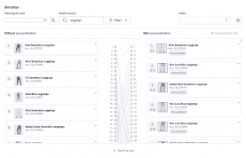
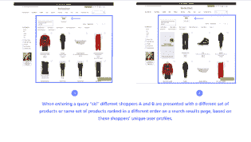
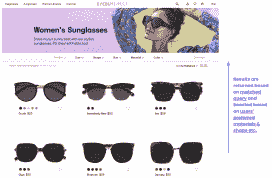
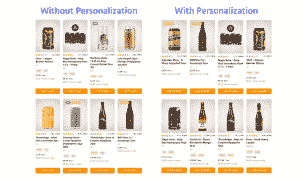
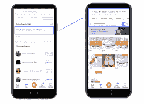
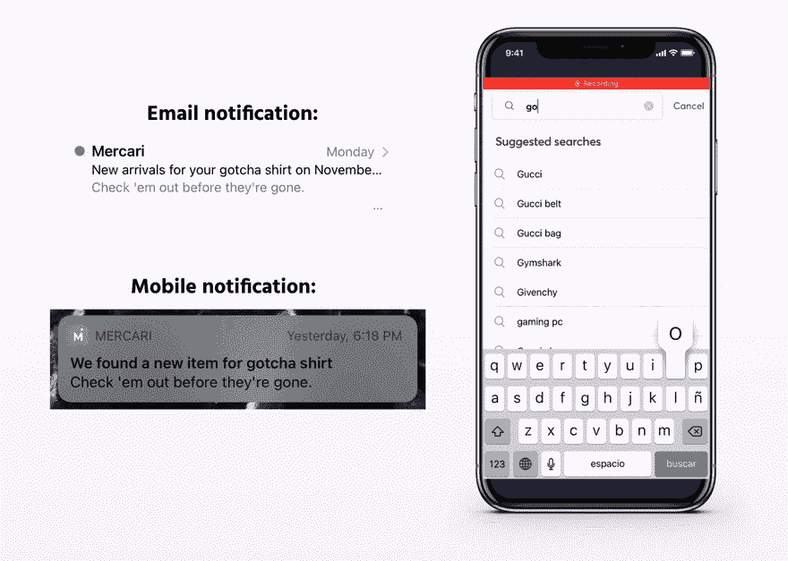
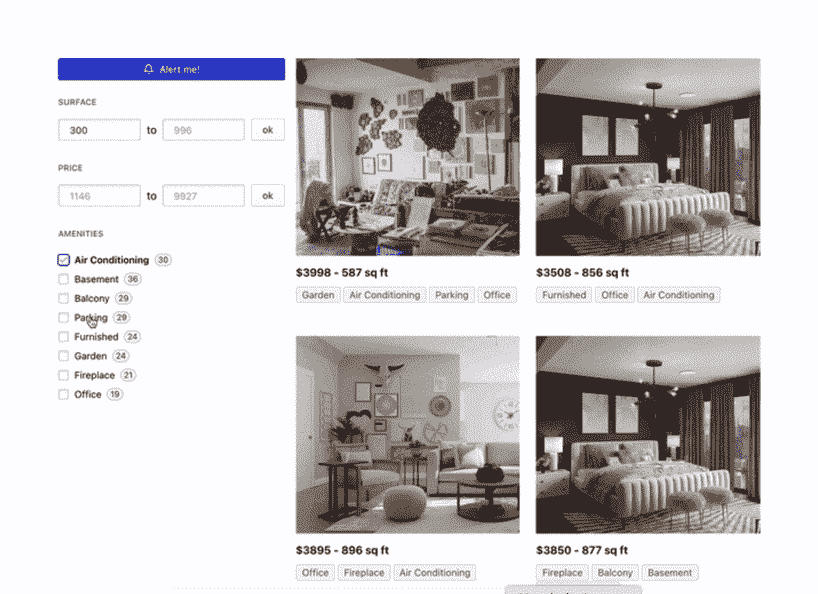
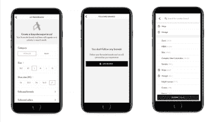
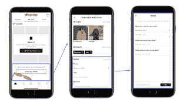
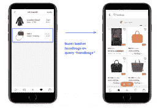

# 电子商务个性化的最佳实践

> 原文：<https://www.algolia.com/blog/customers/best-practices-for-ecommerce-personalization/>

通过个性化直接面对每一位顾客是在这个艰难的市场中取胜的关键。这种客户忠诚度是一个成功的电子商务品牌与竞争对手的区别。换句话说，千篇一律的网络营销方式已经成为过去。公司需要通过从各种客户行为和互动中捕捉每一个信号，分析数据并实时应用于每个渠道，来适应他们的目标受众。

这篇文章展示了个性化电子商务的最佳实践。 学习那些创造了各种个性化购物体验的流行品牌的成功经验。了解个性化如何将他们的在线业务提升到客户忠诚度的新高度。

## 第 1 部分:个性化的最佳实践—搜索结果和类别页面

Algolia 提供的最具影响力的优势之一是为搜索和分类页面创造更加统一的个性化体验。将 Algolia 个性化应用到这两个页面，可以确保在整个用户旅程中获得更加一致和个性化的体验。

### 体育用品零售商的个性化搜索结果&Gymshark

Gymshark 通过结合事件和方面值来创建用户资料，确保每位购物者都能看到最符合其独特偏好的产品。例如，Gymshark 的个性化策略包括用户点击出现在搜索结果中的产品、点击过滤方面和“添加到购物车”按钮等事件，以及其他类似事件。

个性化搜索结果基于匹配查询返回，然后基于用户对活动、颜色、特征和适合度的特定简档偏好提升一些项目。每个用户 ID 的个性化策略背后的逻辑听起来会是这样的:“你主要购买了紫色的女性产品，这些产品是为瑜伽制作的；下次你来的时候，让我们展示更多这样的产品。

您可以通过三个主要步骤实现个性化:

1.  向 Algolia 发送用户数据(需要编码):
    *   计划跟踪哪些用户行为
    *   使用 Algolia 的 Insights API 向 Algolia 发送点击和转换事件以及用户令牌。用户令牌允许 Algolia 识别执行特定事件的用户
2.  配置个性化策略:
    *   使用 Algolia 仪表盘配置每个事件和方面的加权重要性
    *   使用 Algolia 仪表盘模拟和测试您的个性化策略
3.  在生产中启用个性化:
    *   为每个查询添加一个额外的参数以实现个性化

澄清一下，Gymshark 的成功指标:

*   搜索转化率:从 Algolia 之前的 6.2%上升到平均 10%，并且还在攀升
*   来自搜索的订单:从不到 10%的前 Algolia 增长到 2020 年黑色星期五的 30%以上
*   来自搜索用户的收入同比增长 400%

[](https://www.algolia.com/search-inspiration-library/?configure%5BhitsPerPage%5D=9&indices%5BPROD_algolia_com-inspiration-library_query_suggestions%5D%5Bconfigure%5D%5BhitsPerPage%5D=6&indices%5BPROD_algolia_com-inspiration-library_query_suggestions%5D%5BrefinementList%5D%5Bpage%5D=1&indices%5BPROD_algolia_com-inspiration-library_query_suggestions%5D%5Bpage%5D=1&page=1&refinementList%5Bindustry%5D=&refinementList%5BbizDevTools%5D%5B0%5D=Personalization&refinementList%5BuseCase%5D%5B0%5D=eCommerce&refinementList%5BimpactedPage%5D%5B0%5D=Search%20Result%20Page&query=)

### 奢侈品时尚市场个性化搜索结果页面:真实真实

一刀切的个性化方法并不奏效。不同的商业目标需要不同的策略。因此，每个公司都需要分析他们的具体使用案例，并基于三个主要问题来配置个性化策略:

1.  您应该包括哪些事件，这些事件相对于其他事件有多重要？
2.  你应该包括哪些方面，它们相对于其他方面有多重要？
3.  个性化对你的相关性有多大影响？

对于某些行业，特定方面或事件可能比其他方面或事件更重要。像 Real Real 这样拥有多个品牌和产品类型的奢侈品网站上的用户行为，可能与 Gymshark 这样的运动服装零售网站上的用户行为不太相似，后者提供更多由单一品牌生产的特定产品，产品类别数量明显较少。

因此，在现实生活中，他们选择了一种个性化策略，这种策略依赖于用户点击 faceting、产品视图、“添加到购物车”CTA 按钮以及定义为已完成订单的转换。个性化搜索结果基于匹配查询返回，然后基于用户的特定配置文件偏好提升一些项目，如设计师姓名、尺码、颜色、性别、金属类型和戒指尺寸。

[](https://www.algolia.com/search-inspiration-library/?configure%5BhitsPerPage%5D=9&indices%5BPROD_algolia_com-inspiration-library_query_suggestions%5D%5Bconfigure%5D%5BhitsPerPage%5D=6&indices%5BPROD_algolia_com-inspiration-library_query_suggestions%5D%5BrefinementList%5D%5Bpage%5D=1&indices%5BPROD_algolia_com-inspiration-library_query_suggestions%5D%5Bpage%5D=1&page=1&refinementList%5Bindustry%5D=&refinementList%5BbizDevTools%5D%5B0%5D=Personalization&refinementList%5BuseCase%5D%5B0%5D=eCommerce&refinementList%5BimpactedPage%5D%5B0%5D=Search%20Result%20Page&query=)

### 眼镜零售商个性化分类页面:EyeBuyDirect

EyeBuyDirect 网站上的购物者享受一致的个性化体验。例如，当用户浏览到“女性眼镜”类别页面时，搜索结果会根据每个用户的独特偏好(如镜架样式/形状或材料)进行放大。Algolia 个性化为所有行业提供信号，在本例中为镜架，非常适合眼镜行业使用案例。换句话说，可以个性化的信息种类是没有限制的，就像你在这篇文章中看到的其他公司一样。每次用户浏览网站时，他们都会看到根据他们的浏览行为、历史记录和用户资料定制的产品结果。

EyeBuyDirect 的成功指标:

*   通过搜索、增加的浏览和个性化服务，收入增加了 4%
*   根据产品推荐，转化率提高 1–1.5%

[](https://www.algolia.com/search-inspiration-library/?configure%5BhitsPerPage%5D=9&indices%5BPROD_algolia_com-inspiration-library_query_suggestions%5D%5Bconfigure%5D%5BhitsPerPage%5D=6&indices%5BPROD_algolia_com-inspiration-library_query_suggestions%5D%5BrefinementList%5D%5Bpage%5D=1&indices%5BPROD_algolia_com-inspiration-library_query_suggestions%5D%5Bpage%5D=1&page=1&refinementList%5Bindustry%5D=&refinementList%5BbizDevTools%5D%5B0%5D=Personalization&refinementList%5BuseCase%5D%5B0%5D=eCommerce&refinementList%5BimpactedPage%5D%5B0%5D=Category%20Page&query=)

### A/B 测试零售商搜索结果和类别页面的个性化:Honest Brew

Honest Brew 运行 A/B 测试来评估其类别页面浏览和搜索结果页面的不同个性化策略。根据用户对价格、啤酒风格、数量等的独特偏好，Honest Brew 微调其个性化策略，以在低风险环境中通过实时流量提高点击率和客户转化率。

【T2

[](https://www.algolia.com/search-inspiration-library/?configure%5BhitsPerPage%5D=9&indices%5BPROD_algolia_com-inspiration-library_query_suggestions%5D%5Bconfigure%5D%5BhitsPerPage%5D=6&indices%5BPROD_algolia_com-inspiration-library_query_suggestions%5D%5BrefinementList%5D%5Bpage%5D=1&indices%5BPROD_algolia_com-inspiration-library_query_suggestions%5D%5Bpage%5D=1&page=1&refinementList%5Bindustry%5D=&refinementList%5BbizDevTools%5D%5B0%5D=Personalization&refinementList%5BuseCase%5D%5B0%5D=eCommerce&refinementList%5BimpactedPage%5D=&query=A%2FB%20testing)

## 第二部分:附加个性化体验

### 保存的时尚市场搜索和通知:Mercari

在 Mercari 的 marketplace 上，当用户在搜索中找不到商品时，他们可以选择保存搜索结果。因此，只要匹配搜索查询的项目被列出，Mercari 就会通知用户。

[](https://www.algolia.com/search-inspiration-library/?configure%5BhitsPerPage%5D=9&indices%5BPROD_algolia_com-inspiration-library_query_suggestions%5D%5Bconfigure%5D%5BhitsPerPage%5D=6&indices%5BPROD_algolia_com-inspiration-library_query_suggestions%5D%5BrefinementList%5D%5Bpage%5D=1&indices%5BPROD_algolia_com-inspiration-library_query_suggestions%5D%5Bpage%5D=1&page=1&refinementList%5Bindustry%5D=&refinementList%5BbizDevTools%5D=&refinementList%5BuseCase%5D%5B0%5D=eCommerce&refinementList%5BimpactedPage%5D=&query=saved%20search%20alerts)

### 用 Firebase 保存了搜索警报

当有新的匹配商品时，自动通知顾客。保存的搜索非常适合自动化重复的搜索查询，并与不断变化的内容保持同步，例如，在具有房地产列表和在线市场的网站上。

[](https://www.algolia.com/search-inspiration-library/?configure%5BhitsPerPage%5D=9&indices%5BPROD_algolia_com-inspiration-library_query_suggestions%5D%5Bconfigure%5D%5BhitsPerPage%5D=6&indices%5BPROD_algolia_com-inspiration-library_query_suggestions%5D%5BrefinementList%5D%5Bpage%5D=1&indices%5BPROD_algolia_com-inspiration-library_query_suggestions%5D%5Bpage%5D=1&page=1&refinementList%5Bindustry%5D=&refinementList%5BbizDevTools%5D=&refinementList%5BuseCase%5D%5B0%5D=eCommerce&refinementList%5BimpactedPage%5D=&query=saved%20search%20alerts)

### 个性化过滤器——时尚市场的用户偏好设置:Vide Dressing，Depop

在 Videdressing 的设计师时尚网站上，用户可以保存品牌、类别和尺寸的偏好，在继续浏览时实现个性化。

购买设计师时装的顾客可以在 Depop 的应用程序中保存他们喜欢的风格、品牌和尺寸，方便他们继续浏览时的个性化。

[](https://www.algolia.com/search-inspiration-library/?configure%5BhitsPerPage%5D=9&indices%5BPROD_algolia_com-inspiration-library_query_suggestions%5D%5Bconfigure%5D%5BhitsPerPage%5D=6&indices%5BPROD_algolia_com-inspiration-library_query_suggestions%5D%5BrefinementList%5D%5Bpage%5D=1&indices%5BPROD_algolia_com-inspiration-library_query_suggestions%5D%5Bpage%5D=1&page=1&refinementList%5Bindustry%5D=&refinementList%5BbizDevTools%5D=&refinementList%5BuseCase%5D%5B0%5D=eCommerce&refinementList%5BimpactedPage%5D=&query=personalized%20filters)

### 个性化过滤器——时尚市场的愿望清单:视频着装

当用户在 Vidressing 的市场上找到他们想要的产品，但不准备购买时，他们可以将它们添加到愿望清单中。当用户继续浏览时，Videdressing 使用这个愿望列表数据来个性化用户体验。

[](https://www.algolia.com/search-inspiration-library/?configure%5BhitsPerPage%5D=9&indices%5BPROD_algolia_com-inspiration-library_query_suggestions%5D%5Bconfigure%5D%5BhitsPerPage%5D=6&indices%5BPROD_algolia_com-inspiration-library_query_suggestions%5D%5BrefinementList%5D%5Bpage%5D=1&indices%5BPROD_algolia_com-inspiration-library_query_suggestions%5D%5Bpage%5D=1&page=1&refinementList%5Bindustry%5D=&refinementList%5BbizDevTools%5D=&refinementList%5BuseCase%5D%5B0%5D=eCommerce&refinementList%5BimpactedPage%5D=&query=personalized%20filters)

## 结论

个性化是电子商务公司的强大工具，帮助零售商优化销售流程，最大化转化率和整体收入，同时提高客户满意度和品牌忠诚度。