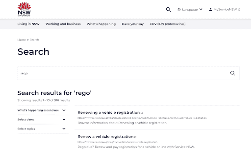
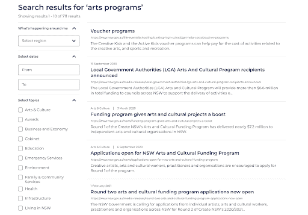

# 联合搜索——它是什么，为什么使用它，最佳实践

> 原文：<https://www.algolia.com/blog/product/best-practices-for-federated-search/>

联合搜索本质上是跨多个站点、应用程序或数据源运行搜索查询，并以单列或多列布局显示结果。

通过一个联合搜索界面，一个流媒体平台可以显示来自不同数据源的歌曲、艺术家和播客的列表——只需一个查询。电子商务也可以通过在显示器的不同部分显示推荐和不同类别的产品而受益。

在一个网站环境中，你可以创建一个跨多个域或子域的实时搜索应用。这很简单，只需在要包含在中央索引中的站点列表中添加一个新的域或子域，然后创建一些附加的搜索规则。例如，如果您有一个“父”网站和几个“姐妹”网站，您可能希望父网站平等地显示来自所有网站的结果，但在姐妹网站上，它可能更喜欢来自该姐妹网站的结果。

对于企业搜索，它可能包括不同的信息源，如内部网、数据库和其他数据集。您可以集中后端数据，或者在不同的应用程序和数据集上执行相同的查询。

在所有情况下， [联合搜索](https://www.algolia.com/blog/ux/what-is-federated-search/) 从单个查询开始，从多个数据源返回不同的结果，帮助您的用户找到他们需要的信息。

## 联邦搜索案例研究:NSW.gov.au

NSW.gov.au 是澳大利亚新南威尔士州的公众形象。像世界各地的其他政府机构一样，有一个顶级政府网站加上几十个其他机构网站，如财政部、卫生部、工业部等。

NSW.gov.au 大学的团队发现，访问者经常在姐妹机构网站 ServiceNSW 上搜索有关驾照、酒牌、搬家和其他主题的问题。

*驾照更新信息在 ServiceNSW。NSW.gov.au 提供跨两个网站的联合搜索，为网站访问者提供更好的用户体验。*

为了满足访问者的需求，NSW.gov.au 混合了来自 ServiceNSW 的数据集(包括网页、PDF 和 DOCX 内容),并将结果与母网站的内容一起交付。

在 NSW.gov.au 上的网络搜索包括来自这两个网站的结果，但相关性评分和机器学习会自动改善结果，以支持某些关键词搜索。访问者在 NSW.gov.au 上输入“rego”(驾照注册的缩写)，就会从 ServiceNSW 得到结果。

每个站点被独立地爬行，并且数据被合并到联合搜索索引中；不需要额外的连接器。在另一种情况下你可能需要使用我们的[API](https://www.algolia.com/customer-onboarding/data-pipeline-and-indexing/)和其他 [开发者资源](https://www.algolia.com/developers/) 来构建一个中央索引。

## 跨网站联合搜索的注意事项

在确定如何跨站点联合搜索数据时，需要考虑几个因素。这里只是几个。如果你想要更多的信息，看一看我们深入的 [联邦搜索的实现](https://www.algolia.com/blog/product/make-disorganized-content-discoverable/) 。

### 整理搜索结果

每个站点都有自己的目标。不同网站的内容和受众可能会有很大差异，因此确保为正确的查询提供正确的内容非常重要。

您可以配置 [规则](https://www.algolia.com/products/search-and-discovery/search-relevance-rules/) 以多种不同的方式在一个或多个站点上交付结果。例如，您可以按类别、按前端的过滤器，甚至按后端的索引过程和查询执行来组织。这些只是思考这个问题的几种方式。让我们简单地看一下它们中的每一个。

*   **类别** :每个网站都可以有自己的搜索同义词或推广。在这种情况下，您可能希望将系统配置为根据查询的来源在每个网站上不同的类别中进行搜索。
*   **过滤器&过滤器** :你可以在每个站点上使用不同的 [过滤器或面](https://www.algolia.com/blog/ux/filters-vs-facets-in-site-search/) 来缩小搜索结果的范围，只搜索那个站点或主题。换句话说，过滤器可以明确地按域过滤，或者，如果站点有非常不同的内容，过滤器可以按内容类型过滤。
*   **索引** :您的索引过程可以用一个相似的标签对网站 A 和 B 中的内容进行分类，这样每个记录在进入时都会被标记，但为网站 c 设置一个不同的标签。然后您可以根据标签建立搜索面规则。或者，也许你想偏向某人正在搜索的网站的结果。在这种情况下，您可以在查询时使用一些步骤来提升某些结果，从而提升该域的结果。此外，您还可以在管道本身进行过滤。
*   **多个查询** :可以在不同的数据源上并行执行同一个查询*，发送每个数据集的结果。*

 *搜索索引可能是上述所有内容的混合。换句话说，在索引和查询时，联邦搜索解决方案有许多不同的选项来传递相关信息。从确定每个网站访问者的目标和结果开始，然后你就可以确定如何通过搜索来实现这些目标。

### 索引、模式和数据转换

也许联合站点搜索的最大挑战是索引和管理完全不同的模式和站点组织。

*   **不同的模式** :每个站点可以使用不同的模式，如 Dublin Core、Open Graph 或 Schema.org，它们具有不同的元数据字段以及日期和时间格式。
*   **域结构** :每个站点可能有非常不同的域结构和层次结构。搜索引擎可以使用域结构(例如/index、/products/、/services/、/services/details/，等等。)对结果进行分类，提高相关性。
*   **标记** :索引可受(1)h1、h2、h3 等如何影响。标签是结构化的，以及(2)标签中包括什么元数据(例如，元标签和属性)。

为了管理这些差异，您可以添加规则来在数据被索引时转换数据。例如，您可能希望以一致的格式存储记录和数据，如时间/日期。您还可以选择转换搜索索引的内容。一个网站可能称它为“冠状病毒”，另一个网站可能称它为“新冠肺炎”，所以您需要存储一个包含同义词的索引。这也可以通过更高级的 [向量分析](https://www.algolia.com/blog/ai/vectors-vs-hashes/) 来处理，将数据聚类为数字主题。

另一个考虑是内容的重复。不同来源的数据可能具有相同类型的内容，例如/about 或/company 页面，因此当某人搜索有关业务的信息时，他们可能会遇到这两种情况。您需要决定如何处理重复或非常相似的内容。

### 滤镜

[搜索过滤器](https://resources.algolia.com/merchandising/search-filters-5-best-practices-for-a-great-ux) 帮助用户缩小搜索范围，找到他们想要的东西。使用联合搜索，您可以创建跨每个站点或特定于每个域的过滤器。

一般来说，有三种不同类型的滤镜。这些并不相互排斥；如果您愿意，可以使用其中一个或全部三个。

*   静态过滤器，允许最终用户在输入搜索查询后过滤内容。例如，您可以给访问者一种按主题或评级过滤结果的方法。
*   动态过滤器(也称为方面)，根据搜索结果集的值生成。例如，如果用户搜索“汽车”,你可以显示所有品牌——丰田、福特、沃尔沃等。—可用于该类别，这不同于搜索“船”或“摩托车”
*   使用过滤表达式过滤结果。在这种情况下，最终用户将始终看到过滤后的结果。例如，您可以将结果限制在一个站点或站点的一部分。如果您销售衬衫、鞋子和珠宝，您可以从一个或多个部分中排除结果。换句话说，类别是过滤器的自然起点。

无论你选择哪种过滤器，你都要考虑它们如何出现在每个网站上。你可以在每个站点上使用相同的过滤器，或者根据上下文来提供过滤器。

### 分析学

关于分析的一个简短说明:如果你已经添加了跨不同来源的联合搜索，你如何知道它在工作？每个网站所有者都希望查看他们网站的搜索性能。应该监控点击率(CTR)、转换、热门查询和无效搜索或无结果等指标，以确保访问者找到他们需要的内容。

## 结论

联合搜索可以为最终用户提供更好的搜索体验，但它需要大量的规划，以确保结果符合每个网站的预期。值得指出的是，联合搜索并不意味着每个网站都需要使用相同的 CMS 或遵循完全相同的模式或元数据标准。只要搜索索引能够标准化，就很容易产生好的结果。*