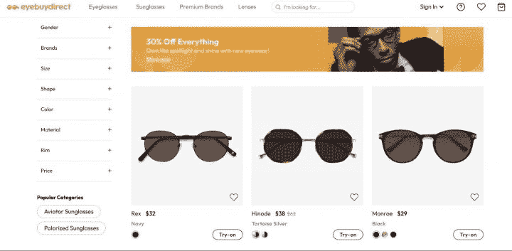
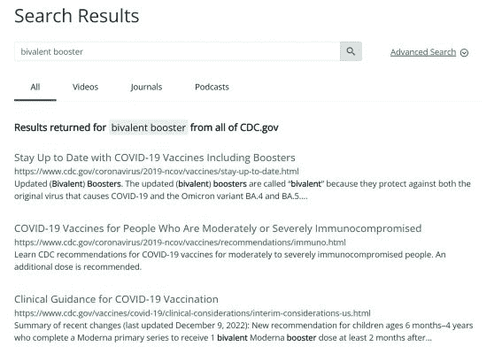
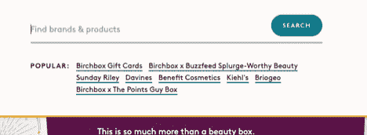
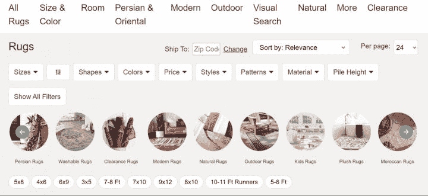
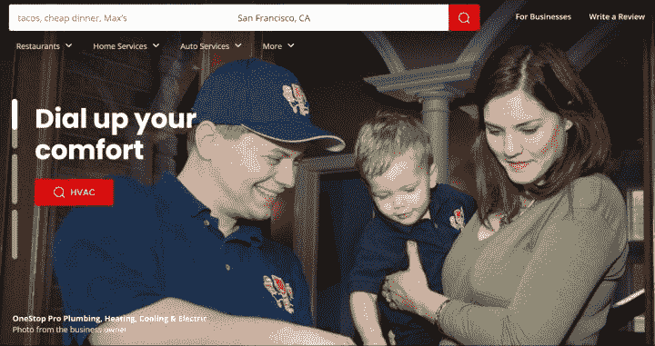
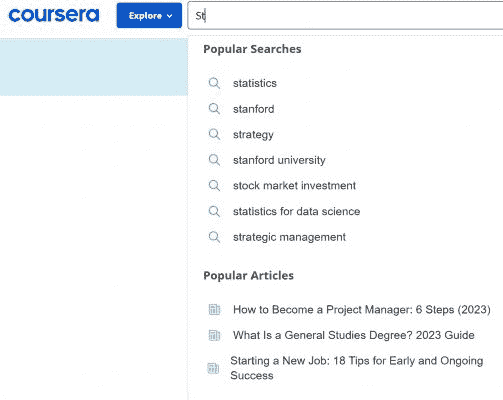
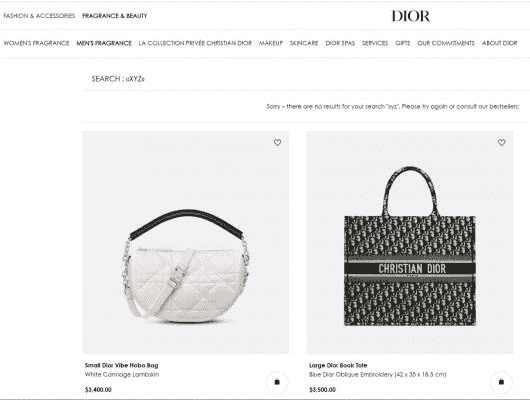
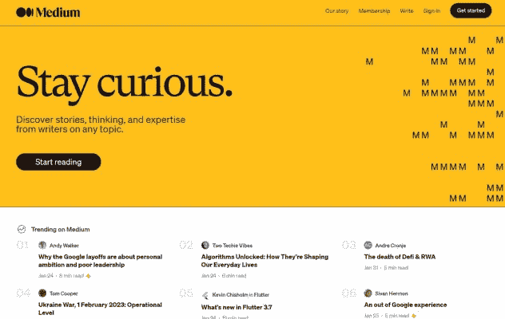

# 网站和应用程序搜索可用性秘密| Algolia

> 原文：<https://www.algolia.com/blog/ux/best-practices-for-site-search-ui-design-patterns/>

你的网站搜索用户界面(UI)是否易于使用，或者它是否是一项需要极大耐心的可用性工作？你的整体用户体验(UX)得到好评吗？

把你的搜索用户界面放在显微镜下，然后根据你独特的使用情况精简你的网站搜索用户流，这是你能做的最被低估但最有力的事情之一，以促进你的在线业务。

诚然，一些公司——从初创公司到老牌巨头——在网页开发和为目标受众应用 UI 设计技巧上投入了大量的精力和资源。有些人甚至创建和分析复杂的用户角色。但是，即使是最深思熟虑的搜索用户界面设计也可能会无意中让人陷入困境。由于糟糕的搜索模板设计思想、被误导的开发者决策以及过时的技术，某些问题会在网站搜索界面中突然出现。

## 搜索:不是“一劳永逸”

在动态的在线商务世界中，持续监控和动手调整你的搜索功能可能会很有见地；甚至可能是转型。

无论你是经营一家小型电子商务商店，管理一个大型商场，还是维护一个出版或企业网站，执行良好的网站搜索设计工作都是你最好的朋友。

例如，如果你的网站有大量的内容，与其强迫访问者浏览你的网页目录，你可以强有力地帮助他们直接找到相关的条目。当您的目标最终用户能够避开痛点并找到他们需要的东西时，战斗就成功了一半。

## 常见搜索 UI 问题

你如何确保良好的搜索体验，在回报用户的同时，有助于提高客户保持率和转化率？

这里有一些现实世界中交互设计的障碍——搜索信息架构的问题可以通过简化你的 UX 设计过程来解决。

错误设计流程的提示包括:

### 别人找不到你的搜索框(或放大镜)

不够大，或者不在你主页的显著位置，不在下级页面的同一位置一致显示。现在怎么办？

### 您搜索的外观/感觉与网站的其他部分不匹配

为什么？也许一个开发人员想通过在搜索按钮上添加铃铛和口哨来创造“好的 UX”，使视觉设计“令人兴奋”也许他们的想法是添加弹出动画和古怪的排版。然而，这些干扰正在干扰有效搜索用户旅程的完成。

### 搜索结果不容易被截留

你尽职尽责地向搜索者展示密集的文本块和冗长的描述。不幸的是，尽管你试图给他们提供细节，但人们不容易通过查看这些乱七八糟的东西来找出他们应该点击哪些相关的结果。他们需要一种快速定位的方法。

### 搜索者可以删除“没有结果”

如果他们的搜索词不太正确或输入不正确，他们可能得不到匹配的结果。它发生了。然而，你不必“终止”他们的搜索，让他们悬在虚空中。相反，你可以使用这个空间来提供他们可能喜欢的替代项目的快捷方式，其他人最近在你的网站上进行的搜索，或者促销。

### 他们没有显示关联内容

假设有一篇有趣的博客文章宣传他们刚刚搜索的产品，但是当他们在搜索栏中键入产品名称时，他们只能看到产品页面的相关信息。

[联邦搜索](https://blog.algolia.com/what-is-federated-search/) 就解决了这个问题。它呈现多种类型的内容，如产品相关的评论、常见问题解答、产品使用指南、教程。您可以标记每种类型的搜索结果(例如，“产品”和“操作视频”)。联合搜索还允许您通过微调结果的相关性来满足每个用户的需求。

### 没有帮助 [微缩](https://www.smashingmagazine.com/2019/06/better-search-ux-microcopy/)

Microcopy 是一些文本，可以帮助网站用户导航搜索界面或有效地生成搜索结果。如果它在一个重要的搜索关头丢失了，你的搜索用户可能很难回到正轨。

### 您不提供建议搜索和自动完成

这些 [两个响应式设计特征](https://www.algolia.com/blog/ux/suggested-search-and-autocomplete-what-is-it-and-how-does-it-work/) 通常出现在大多数现代搜索体验中，用户期望他们的帮助，例如，如果他们输入错别字。

### 您的搜索功能并非人人都能使用

在使用网站搜索和其他网站功能方面，人们有不同的能力水平。由于视力不好等障碍，他们中的一些人需要一些帮助。你希望你的 UX 设计能被所有的访问者容易地使用，你可以用已建立的 [指南](https://www.algolia.com/blog/ux/web-content-accessibility-guidelines-wcag-how-to-make-site-search-work-for-people-with-disabilities/) 来增强它。

## 为什么无故障搜索如此重要？

对于一个企业来说，所有这些场景都是不确定的，尤其是考虑到 43%的网站访问者会立即进入搜索栏。然后，这些专注于搜索的人转化的可能性是其他人的 2-3 倍。所以从他们决定搜索的那一刻起，你就不想让他们失望。

不要担心:你可以让你的搜索 UX 对你的信息搜索者来说天衣无缝，这意味着他们在这个过程中保持富有成效的参与。

## 超级站点搜索最佳实践

这里有一些我们最喜欢的行之有效的方法来创建用户满意的、优秀的搜索:

### 评估你的搜索栏

说到搜索，用户研究发现人们习惯于行业标准的布局，一切都按照他们期望的方式运行。例如，他们希望能够很容易地找到搜索图标或文本输入框。

召集你的设计团队利益相关者，看看你主页上的搜索栏，问这些问题:

#### **美观吗？**

一个好的搜索界面是一件美好的事情:它看起来越吸引人，就越有可能吸引网站上的人们来查看它。

#### **搜索框是否放在显著位置？**

传统智慧:让你的搜索栏或放大镜图标在你的主页上容易被看到，不管它是在页面的底部中心、顶部中心还是右上角(或右下角)效果最好。然后，为了保持一致性，把它放在所有页面的同一个位置。

#### **醒目吗？**

如果你的网站访问者被迫首先搜索你的搜索栏或放大镜图标来开始他们的搜索，你的用户界面需要一些调整。

你不必过分使用闪烁的红色矩形，但是你需要一个与你的站点整体外观和感觉相协调的输入框。此外，你需要一个能在小屏幕上显示的页面，这样你的移动搜索用户不用眯着眼睛就能快速访问。

#### 对于一般的查询，文本输入空间是否足够长？

大多数搜索者不会输入超长的短语，但是如果他们碰巧想罗嗦，你也不想妨碍他们。

#### 有用吗？

优化你的搜索用户界面并不是简单地勾选视觉元素复选框让它看起来更漂亮，然后快速移交给产品。就以用户为中心的设计原则而言，它也使 UI 元素 100%功能化——也就是说，简单明了，令人愉悦。例如，它可以快速提供相关的搜索结果。

### 优化人们的搜索结果如何出现

拿出你的 digita l 设计工具: 下面是一些修复搜索页项目外观的秘诀。

#### **在网格和列表视图之间决定**

根据 UX 的研究，对于一些网站，使用列表视图是有意义的，而对于其他网站，网格视图是显而易见的选择。

电子商务网站有丰富多彩、清晰的商品图片，通常使用网格视图来展示他们的产品，而那些有更多规格的商品(例如，计算机和计算机部件，学术工作)的网站则使用列表视图。您也可以简单地让用户选择他们想要的视图。

例如，Eyebuydirect 的电子商务网格视图是这样的:

#### **增强可回收性**

面对一大堆冗长的搜索结果，你的眼睛会变得呆滞无神吗？不需要 UX 的设计技巧或可用性测试就能发现人们需要轻松的搜索体验；他们只想确定他们想要的信息或与产品相关的选项。

为此，你可以:

*   使标题和产品描述简洁
*   在标题或项目名称下，包含内容的简短摘录或预览
*   在项目和文本块之间添加足够的空白区域
*   在搜索结果项中高亮显示输入的关键词
*   对于你的移动用户:看看搜索结果如何出现在不同的 [移动设备](https://www.algolia.com/blog/ux/mobile-search-ux-best-practices/) 上，比如最新的苹果 iPhones 等机型上有限的屏幕空间。直观地区分和标记不同类型的搜索结果内容可以帮助您的移动用户更好地浏览内容。您的图形设计应该与设备 [限制](https://blog.algolia.com/mobile-search-ux-8-obstacles/) 兼容。

#### **将信息放在人们可以看到的地方**

研究表明，为了高效地收集信息，人们阅读网页内容时会采用不同的模式。两个例子:

*   在没有标题、副标题和项目符号的页面上，用户以 F 型模式浏览，重点放在页面的顶部和左侧
*   在 [**分层饼状图**](https://www.nngroup.com/articles/layer-cake-pattern-scanning/)**中，它们关注正文前的标题和副标题**

 **解决问题的诀窍在于，你可以根据用户的阅读方式调整搜索结果的外观。通过找出访问者通常使用的阅读模式，你可以看到他们的目光被吸引到了页面的哪个位置。这些地方是关键细节的地方，如标题、片段和描述。

#### **使用上下文搜索片段**

乍一看，你的网站访问者可能会怀疑他们的搜索结果与他们的需求有多大的相关性。这就是 [上下文搜索片段](https://baymard.com/blog/search-snippets) 可以发挥作用的地方:强调表明搜索结果如何匹配其查询的摘录。这很容易通过在搜索结果中的关键词上使用加粗字体来实现。

下面是 CDC 如何使用上下文片段:

在关键术语上使用粗体，加上不同类型文本的颜色编码，给读者提供了即时的上下文，使他们可以轻松地点击进入。

### 用缩微品引导搜索者

如果与搜索相关的内容含糊不清，添加定向文本、提示或标签来澄清。

搜索提示就是一个例子。以下是 Birchbox 使用 microcopy 的方式，建议可以激发访问者进入的流行搜索查询:

### 提供搜索过滤选项

像 microcopy 一样， [过滤器](https://www.algolia.com/blog/ux/search-filter-ux-best-practices/) 可以用来将人们推向你知道会提供大量结果的搜索查询。过滤器还根据预定义的类别缩小用户搜索范围。

以下是 Rugs.com 如何过滤它众多的地板覆盖物

### 用刻面方便高级搜索

[分面搜索](https://www.algolia.com/blog/ux/faceted-search-an-overview/) 是另一种形式的过滤。面不同于过滤器，因为它们是动态的；它们可以根据查询的上下文而改变。

Yelp 是一个很好的例子，它在设计组合中有效地使用了分面搜索。无论你是在找餐馆、水管工还是机械师，都可以通过屏幕顶部的下拉菜单轻松缩小搜索范围；然后，您可以根据提供商与您的距离、营业时间和其他变量深入搜索结果页面。

### 提供建议搜索和自动完成

每一个网站搜索用户界面都可以通过提供相关的建议来帮助用户，让用户看到他们的搜索结果随着他们的输入而“进化”。并且 [自动完成](https://www.algolia.com/blog/ux/suggested-search-and-autocomplete-what-is-it-and-how-does-it-work/) (也称为自动建议)除了似乎试图读取您的想法之外，还通过注意感知的拼写错误来保持事情的进展。

以下是 Coursera 如何在你输入时生成搜索建议:

### 总是提供(某种类型的)结果

“哦不！我们找不到任何结果。”

谈到 UX/用户界面网页设计，你一定不希望你的网站访问者看到这样令人沮丧的消息；这类似于“你运气不好；走开，去另一个网站试试。”这一不幸的结论可能只是因为他们在查询中拼错了一个单词，或者他们使用了搜索引擎无法识别的同义词(例如，“慢跑者”而不是“汗水”)。

幸运的是，有几种的方式可以让你用建设性的想法取代一条没有出路的搜索结果信息。在你的用户界面设计过程中，这当然是值得做的，因为它可以让人们留在你的网站上，并最终提高你的转化率。

迪奥电子商务网站通过推荐利润丰厚的畅销书，将“没有结果”的不愉快转变为潜在的胜利

当然，你不必等待你的搜索者来礼貌地推销商品。甚至在访问者寻找搜索栏之前，你就可以像 Medium 所做的那样，向他们推荐有趣的热门内容

## 奖励你的搜索者，提升你的 KPI

通过仔细分析你的搜索栏、你的搜索结果的显示方式以及你的目标用户看到的信息，你可以创造出成功的用户界面设计，使你的网站或移动应用搜索收入达到新的里程碑。

想要一个搜索用户体验设计的合作伙伴，一个可以帮助你提供你的客户期望的所有行业标准 UI 设计模式和特性的合作伙伴？查看 [安座](https://www.algolia.com/products/search-and-discovery/hosted-search-api/) 搜索 API。我们拥有业经验证的技能，可以让你的用户搜索体验变得不可思议。让我们今天就 [开始](https://www.algolia.com/contactus/) 微调和优化你搜索 UX 的方方面面。**