# 利用人工智能优化用户转化的最佳方式

> 原文：<https://www.algolia.com/blog/customers/best-ways-to-leverage-ai-to-optimize-a-user-conversion/>

当购物者不转化时，也就是说，当他们不容易或不迅速地找到他们想要的东西时，零售商就会失去收入。对于跨国公司来说尤其如此，因为理解多种文化和语言背景的意图非常重要。 推动转化率的关键特征之一是相关性。

在一个精心规划的相关性策略之上，人工智能工具通过主动自动化这一过程来添加最后一笔，并立即提出商业见解，这些见解不会通过耗时的手动微调系统设置来浮出水面。人工智能工具可以生成同义词建议，对呈现给购物者的搜索结果进行重新排序，为聊天机器人提供支持，并为客户查询生成准确的答案。这些只是成功品牌利用人工智能工具将每个新的数字购物者和网站访问者转变为长期满意的客户的一些例子。

## Algolia AI—个性化

一个这样的工具， *个性化* ，是在电子商务市场赢得客户忠诚度的关键。品牌需要通过捕捉各种客户行为和互动的每一个信号，分析数据，然后实时应用于每个渠道，以适应他们的目标受众。

个性化是电子商务公司工具箱中的一个强大工具。根据使用案例，它可以应用于搜索结果、类别页面或两者，确保客户始终获得与他们独特偏好相匹配的最相关的结果。一旦配置了个性化策略，就会对其进行 A/B 测试，以确保转化率和销售额都如预期的那样增长。除此之外，公司还可以更进一步，通过向购物者发送保存的搜索通知、捕获用户偏好商品的意愿列表，并让用户保存他们的购物偏好，如衣服尺寸、偏好的品牌、款式或颜色，来增强他们的客户体验。

## 个性化体育搜索结果&商品零售商:Gymshark

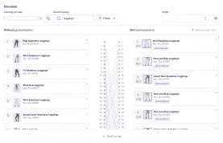

Gymshark 通过结合事件和方面值来创建用户资料，确保每位购物者都能看到最符合其独特偏好的产品。Gymshark 用于其个性化策略的事件包括用户点击出现在搜索结果中的产品，点击过滤方面和“添加到购物车”CTA 按钮，以及其他类似的事件。

个性化搜索结果基于匹配查询返回，然后基于用户对活动、颜色、特征和适合度的特定简档偏好提升一些项目。每个用户 ID 的个性化策略背后的逻辑听起来会是这样的:“你主要购买了紫色的女性产品，这些产品是为瑜伽制作的；下次你来的时候，让我们展示更多这样的产品。

要了解更多关于为您的网站配置和应用个性化策略的信息，请阅读我们关于电子商务个性化最佳实践的最新博客:

[**电子商务个性化的最佳实践**](https://www.algolia.com/blog/customers/best-practices-for-ecommerce-personalization/)

[](https://www.algolia.com/search-inspiration-library/?configure%5BhitsPerPage%5D=9&indices%5BPROD_algolia_com-inspiration-library_query_suggestions%5D%5Bconfigure%5D%5BhitsPerPage%5D=6&indices%5BPROD_algolia_com-inspiration-library_query_suggestions%5D%5BrefinementList%5D%5Bpage%5D=1&indices%5BPROD_algolia_com-inspiration-library_query_suggestions%5D%5Bpage%5D=1&page=1&refinementList%5Bindustry%5D=&refinementList%5BbizDevTools%5D%5B0%5D=Personalization&refinementList%5BuseCase%5D%5B0%5D=eCommerce&refinementList%5BimpactedPage%5D%5B0%5D=Search%20Result%20Page&query=)

## Algolia AI—运动的动态同义词建议&商品零售商:Gymshark

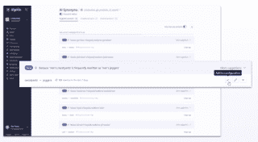

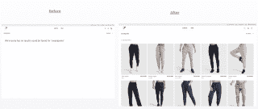

总部位于英国的体育零售商 Gymshark 使用 Algolia 的人工智能生成的同义词来让用户找到相关的结果，即使他们对相同的产品使用不同的单词。在激活动态同义词建议之前，搜索“运动裤”的美国客户不会得到任何查询结果。原因是在英国运动裤的通用术语是“慢跑者”。一旦同义词建议得以实施，Gymshark 购物者的搜索和发现能力就大大提高了。

[**阅读更多关于 Gymshark 的马赫之旅**](https://resources.algolia.com/gymshark-customer-story/gymshark-s-journey-to-mach-the-practical-case-for-search-and-navigation)

[](https://www.algolia.com/search-inspiration-library/?configure%5BhitsPerPage%5D=9&indices%5BPROD_algolia_com-inspiration-library_query_suggestions%5D%5Bconfigure%5D%5BhitsPerPage%5D=6&indices%5BPROD_algolia_com-inspiration-library_query_suggestions%5D%5BrefinementList%5D%5Bpage%5D=1&indices%5BPROD_algolia_com-inspiration-library_query_suggestions%5D%5Bpage%5D=1&page=1&refinementList%5Bindustry%5D=&refinementList%5BbizDevTools%5D%5B0%5D=Personalization&refinementList%5BuseCase%5D%5B0%5D=eCommerce&refinementList%5BimpactedPage%5D%5B0%5D=Search%20Result%20Page&query=)

## 

## Algolia AI—时尚零售商动态同义词建议:Bombas

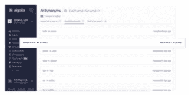

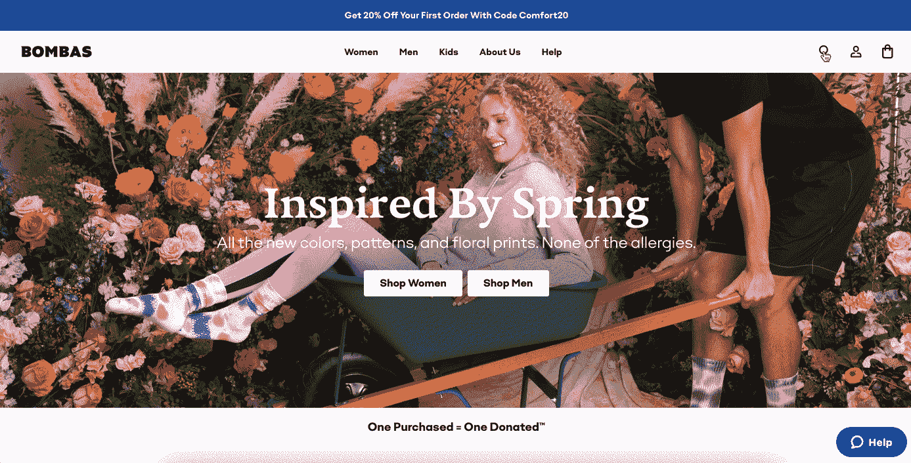

在 Bombas 的网站上，由于 Algolia 的人工智能生成的同义词建议，用户即使在输入查询时使用不同的单词(例如，“婴儿”和“婴儿”，“压缩”和“糖尿病”)，也可以获得相关的结果。

[](https://www.algolia.com/search-inspiration-library/?configure%5BhitsPerPage%5D=9&indices%5BPROD_algolia_com-inspiration-library_query_suggestions%5D%5Bconfigure%5D%5BhitsPerPage%5D=6&indices%5BPROD_algolia_com-inspiration-library_query_suggestions%5D%5BrefinementList%5D%5Bpage%5D=1&indices%5BPROD_algolia_com-inspiration-library_query_suggestions%5D%5Bpage%5D=1&page=1&refinementList%5Bindustry%5D=&refinementList%5BbizDevTools%5D%5B0%5D=AI%20Optimizations&refinementList%5BuseCase%5D%5B0%5D=eCommerce&refinementList%5BimpactedPage%5D%5B0%5D=Search%20Result%20Page&query=synonyms)

## Algolia AI—动态同义词建议支持:PayPal

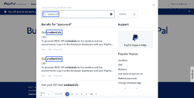

对于许多公司来说，客户支持通常不仅是一项非常耗时的任务，也是一项巨大的开支。顾客满意是任何零售商的目标，但是维持一个庞大的支持团队的成本有时过于沉重。此外，在线购物者习惯于独立搜索与支持相关的信息，并且显然更喜欢这样做，而不是拨打帮助中心的电话并等待下一个可用的代表。另一个因素是信息的准确性，这可能因代表的经验和领域知识而异。另一方面，我们不希望我们的客户为了找到相关的支持信息而广泛地浏览网站，在许多情况下，这些信息被隐藏在页面的底部。幸运的是，人工智能优化可以帮助电子商务和其他公司快速轻松地提供相关的支持信息，消除与维护和培训大量客户支持代表相关的成本，同时通过使网站访问者能够独立查找和访问他们需要的任何信息来改善用户体验。

例如，在 PayPal 的开发者支持页面上，由于 Algolia 的人工智能生成的同义词建议，用户即使在输入查询时使用不同的单词(如“密码”或“凭据”)，也可以获得相关的结果。

 

## Algolia AI—零售商搜索结果页面重新排名:Bombas

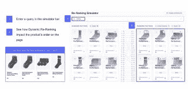

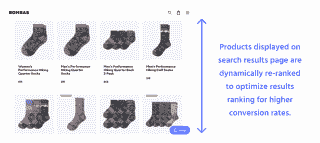

搜索结果的相关性经常随时间快速变化，尤其是对于零售电子商务行业。人工智能重新排名是 Algolia 的一个功能，它利用人工智能来发现用户行为的趋势。根据查询和他们点击或转换的结果的位置，它可以通过提升越来越受欢迎的结果来提高你的相关性。例如，如果一个特定的产品在你的网站上很流行，重新排名算法将确保它出现在搜索结果的顶部，而不是隐藏在底部。人工智能重新排序也可以降低异常结果的等级，这些异常结果有时会因为文本相关性边缘情况而出现。离群值是在特定查询的上下文中与用户实际不相关的结果。一个例子可能是搜索 iPhone 手机，但在搜索结果中看到 iPhone 案例，尽管文本相关，但这些产品不匹配用户的查询意图。

在这个例子中，当用户在 Bombas 的网站上搜索“徒步旅行”袜子时，搜索结果页面上显示的产品被动态地重新排名，以优化结果排名，从而获得更高的转化率。购买最多的“徒步旅行”袜子将被推到顶部，而购买最少的将被埋在底部。

[](https://www.algolia.com/search-inspiration-library/?configure%5BhitsPerPage%5D=9&indices%5BPROD_algolia_com-inspiration-library_query_suggestions%5D%5Bconfigure%5D%5BhitsPerPage%5D=6&indices%5BPROD_algolia_com-inspiration-library_query_suggestions%5D%5BrefinementList%5D%5Bpage%5D=1&indices%5BPROD_algolia_com-inspiration-library_query_suggestions%5D%5Bpage%5D=1&page=1&refinementList%5Bindustry%5D=&refinementList%5BbizDevTools%5D%5B0%5D=AI%20Optimizations&refinementList%5BuseCase%5D%5B0%5D=eCommerce&refinementList%5BimpactedPage%5D%5B0%5D=Search%20Result%20Page&query=re-ranking)

## 

## Algolia AI—体育类重新排名&商品零售商:Gymshark

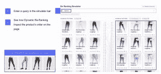

在 Gymshark 的网站上，被频繁点击的产品排名高于其他产品。在幕后，AI 动态优化排名以提高转化率。

成功指标:

*   具有机器学习的商品销售(AI 重新排名)负责 2M 一年的额外销售

请注意，人工智能重新排序不会干扰之前配置的相关性设置。在引擎计算出结果的文本相关性并应用了您的自定义排名后，动态重新排名开始生效。如果您启用了个性化，重新排名不会生效，Algolia 有足够的数据来个性化搜索。如果没有足够的数据来个性化搜索——例如，对第一次使用的用户来说——那么重新排序就会重新开始。

这是应用关联策略的顺序:

*   文本相关性(通过文本排名标准)
*   业务相关性(通过自定义排名)
*   个性化(如果您已启用，并且引擎有足够的信息为特定用户个性化结果)
*   助推和掩埋类别(通过规则)
*   人工智能重新排名
*   推广和隐藏特定项目(通过规则)

[](https://www.algolia.com/search-inspiration-library/?configure%5BhitsPerPage%5D=9&indices%5BPROD_algolia_com-inspiration-library_query_suggestions%5D%5Bconfigure%5D%5BhitsPerPage%5D=6&indices%5BPROD_algolia_com-inspiration-library_query_suggestions%5D%5BrefinementList%5D%5Bpage%5D=1&indices%5BPROD_algolia_com-inspiration-library_query_suggestions%5D%5Bpage%5D=1&page=1&refinementList%5Bindustry%5D=&refinementList%5BbizDevTools%5D%5B0%5D=AI%20Optimizations&refinementList%5BuseCase%5D%5B0%5D=eCommerce&refinementList%5BimpactedPage%5D%5B0%5D=Search%20Result%20Page&query=re-ranking)

## 

## 零售商:JB Hi-Fi 人工智能在分类页面上的重新排名

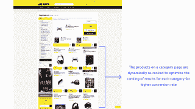

除了在搜索结果页面上的重新排名之外，在类别页面上的 AI 重新排名增加了用户体验的一致性。无论用户在搜索栏中输入查询，还是在他们感兴趣的类别中浏览该公司的网站，显示的结果都是匹配的。对于拥有大量产品类别的大型零售商和电子商务网站来说，人工智能重新排名至关重要。手动调整每个类别的结果是不合理的，尤其是因为电子商务行业是一个竞争激烈的高节奏环境。一眨眼的功夫，你就可能将客户流失到一个在客户之旅上投入更多的竞争对手那里。

在上面的例子中，澳大利亚零售商 JB Hi-Fi 使用 Algolia 的人工智能根据用户搜索的内容对每个类别页面上的产品进行重新排序。如果一个特定的产品或一组产品比所选类别中的其他产品获得更多的浏览量或转化率，这些项目将被移动到列表的顶部。或者，当前在列表上占据较高位置但不满足浏览和转换期望的项目将被移至较低位置。

[](https://www.algolia.com/search-inspiration-library/?configure%5BhitsPerPage%5D=9&indices%5BPROD_algolia_com-inspiration-library_query_suggestions%5D%5Bconfigure%5D%5BhitsPerPage%5D=6&indices%5BPROD_algolia_com-inspiration-library_query_suggestions%5D%5BrefinementList%5D%5Bpage%5D=1&indices%5BPROD_algolia_com-inspiration-library_query_suggestions%5D%5Bpage%5D=1&page=1&refinementList%5Bindustry%5D=&refinementList%5BbizDevTools%5D%5B0%5D=AI%20Optimizations&refinementList%5BuseCase%5D%5B0%5D=eCommerce&refinementList%5BimpactedPage%5D%5B0%5D=Category%20Page&query=re-ranking)

## 

## A/B 测试— Algolia AI 零售商重新排名:Plaisio 和 ePrice

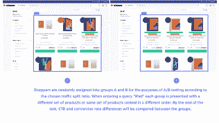

Plaisio 通过 A/B 测试和 AI 重新排名对其营销工作进行了微调。Algolia 的人工智能会根据用户点击的内容自动重新排列结果。通过 A/B 测试，您可以探索不同的策略，并使用实时流量分析它们的有效性。

ePrice 通过 A/B 测试和动态重新排名对其营销工作进行了微调。Algolia 的人工智能会根据用户点击的内容自动重新排列结果。通过 A/B 测试，您可以探索不同的策略，并使用实时流量分析它们的有效性。

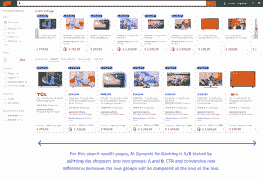

[](https://www.algolia.com/search-inspiration-library/?configure%5BhitsPerPage%5D=9&indices%5BPROD_algolia_com-inspiration-library_query_suggestions%5D%5Bconfigure%5D%5BhitsPerPage%5D=6&indices%5BPROD_algolia_com-inspiration-library_query_suggestions%5D%5BrefinementList%5D%5Bpage%5D=1&indices%5BPROD_algolia_com-inspiration-library_query_suggestions%5D%5Bpage%5D=1&page=1&refinementList%5Bindustry%5D=&refinementList%5BbizDevTools%5D%5B0%5D=A%2FB%20Testing&refinementList%5BuseCase%5D%5B0%5D=eCommerce&refinementList%5BimpactedPage%5D=&query=re-ranking)

## 结论

人工智能优化是电子商务商店成功销售战略的高级步骤。结合精心设计的相关性和用户个性化计划，人工智能优化通过注入行业特定的业务逻辑和为每个用户量身定制购物体验来促进销售和客户转化。