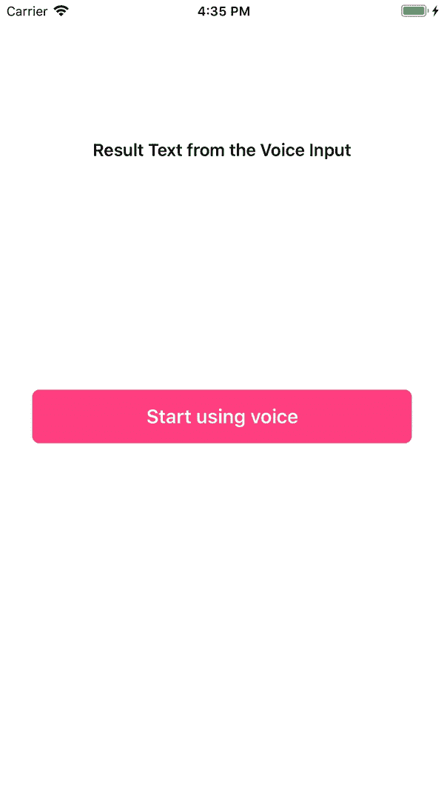

# 更好的移动语音搜索工具:Android 和 iOS 语音覆盖- Algolia 博客

> 原文：<https://www.algolia.com/blog/algolia/better-voice-search-tools-mobile-voiceoverlay-android-ios/>

过去一年，向 Algolia 咨询语音搜索问题的公司数量从涓涓细流变成了滔滔洪流。我们的客户和潜在客户有一些常见的搜索相关问题——组织数据、[配置相关性](https://www.algolia.com/doc/tutorials/getting-started/build-voice-search/#getting-started)——他们想知道如何最好地处理语音输入。为此，今天 Algolia 宣布了用于 iOS 和 Android 应用程序的*voice overlay*，这是一个用户界面组件，供开发人员接受语音输入以进行搜索和其他目的——无论他们是否使用 Algolia。

语音正成为一种必需品，尤其是在手机上。你可能听说过[到 2020 年](https://www.campaignlive.co.uk/article/just-say-it-future-search-voice-personal-digital-assistants/1392459)50%的搜索将通过语音进行，并且已经有 [71%的人宁愿使用语音搜索而不是键盘](https://www.pwc.com/us/en/advisory-services/publications/consumer-intelligence-series/pwc-voice-assistants.pdf)。用户会认为没有语音的移动应用不如有语音的有用。

然而，无论是为了搜索还是其他目的，在没有工具的情况下处理用户语音并不容易。应用程序需要处理权限的所有排列，倾听用户，在屏幕上显示文本，然后做一些事情。开发人员需要投入大量的工作将所有这些拼凑在一起。

VoiceOverlay 为开发人员提供了在移动应用程序中快速轻松地处理语音输入的工具。从我们的即时搜索库中获得灵感，VoiceOverlay 将这项任务的开发时间从几小时减少到几分钟。它处理整个流程，包括:

*   请求用户权限
*   收听音频
*   记录语音输入
*   从原生 iOS 和 Android 语音到文本检索文本

所有这些都包含在一个漂亮的可定制的 UX 中，它适合任何应用程序，在不同平台之间具有统一的体验。此外，应用程序不需要使用 Algolia 来使用 *VoiceOverlay* 。我们希望所有应用程序都支持语音，这是我们为实现这一目标所做的贡献。

在 [Android](https://github.com/algolia/voice-overlay-android) 和 [iOS](https://github.com/algolia/voice-overlay-ios/) 上查看 *VoiceOverlay* ，并[向我们发送您的反馈](https://twitter.com/home?status=Hey%20%40algolia,%20my%20thoughts%20on%20VoiceOverlay%3A%20)。对构建强大、相关的语音搜索感兴趣吗？看看 Algolia 的[语音搜索功能](https://www.algolia.com/solutions/voice-search)。