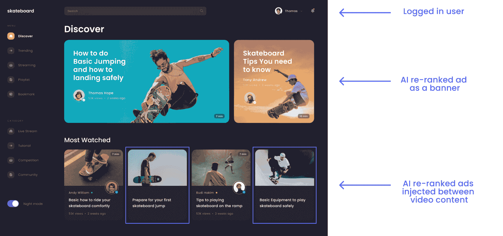
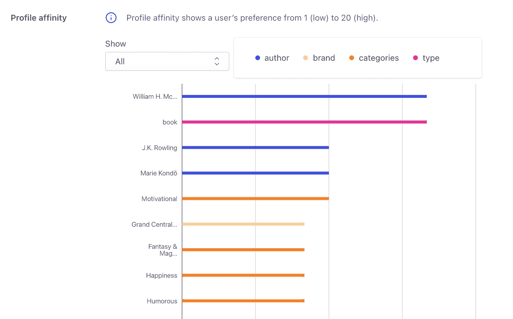

# 通过内容发现 AI  在媒体平台上增加广告

> 原文：<https://www.algolia.com/blog/ai/beyond-search-how-to-boost-advertising-and-improve-user-engagement-on-streaming-and-publishing-platforms-using-ai/>

对于出版商和视频流媒体平台来说，一种常见的推广内容营销策略模式是在结果之间注入原生广告或赞助内容。为了吸引用户，推广的内容监管需要与现有内容融为一体，而不是让用户觉得他们在看广告。更重要的是，我们需要确保顶部转换推广和相关内容推荐总是显示在更高的位置。让它更容易被用户看到将会带来更高的参与度。这就是人工智能的用武之地。

## 利用人工智能促进内容发现

在这篇博客中，我们将为媒体和视频流媒体公司提供一个创造性的解决方案，利用人工智能和机器学习功能来优化内容发现过程，并最大限度地提高注册用户和访客的促销内容和广告收入。

我们建议使用 Algolia AI 功能来优化内容的显示位置，并进一步吸引用户。

1.  在我们的 AI studio 中，我们提供了 [**动态重新排名**](https://www.algolia.com/products/ai-search/dynamic-reranking/) 功能，该功能利用“对人群的洞察”来提高编辑内容到更高位置的转化率。
2.  除此之外，您还可以利用我们的 [**个性化**](https://www.algolia.com/products/search-and-discovery/personalization/) 功能来重新安排常规结果，并提升参与度最高的内容登录用户。

我们希望实现的战略目标是，通过实施 Algolia 的内容发现工具，最大限度地提高用户对每个搜索结果和分类页面上促销内容的参与度。

## 解决方案实施:整合站点内容内顶级表演广告

媒体公司在广告参与和收入优化方面的成功解决方案集中于在网站的每个搜索结果和分类页面上的常规编辑或视频内容之间战略性地整合高性能内容。

我们以上面的视频流媒体网站为例。

从用户界面/UX 的角度来看，每次用户搜索或浏览媒体网站时，呈现给他们的结果将包括以下元素:

*   **促销横幅。** 搜索结果和分类页面顶部的动态页面横幅，展示与查询或分类页面类型最相关的广告
*   **常规内容。** 用户相关搜索和浏览结果
*   **推广内容。**

**对于访客，** 人工智能重新排序将始终在每个网站页面上激活。动态重新排名功能利用人工智能来发现用户在网站上的行为趋势，基于他们的搜索查询和被点击并导致转化的结果的位置。重新排名确保了流行和趋势广告将出现在搜索结果列表的顶部，而不是隐藏在底部，而离群结果、与用户不太相关的内容将被降级。

**对于注册用户，** 常规结果可以根据用户喜好进行个性化设置。否则，如果没有足够的高质量数据来有效地应用个性化，我们可以依靠自定义的排名指标，如流行度分数来显示趋势内容。

## 分步实施

我们建议在你的网站访问者浏览网站时，在每个搜索结果页面和类别页面激活人工智能重新排名和个性化。这样，网站用户的用户体验在任何时候都是统一和一致的。

**步骤 1–执行数据索引。** 创建 2 个独立的索引:一个索引用于推广内容，一个索引用于常规内容。

**步骤 2–配置关联策略。** 将业务指标数据，如内容流行度、客户偏好和行业细节应用到您的全球相关性战略中。将 [自定义排名](https://www.algolia.com/doc/guides/managing-results/must-do/custom-ranking/) 添加到常规索引将有助于确定内容将以何种顺序呈现给网站的访客自定义排名应适用于常规内容和推广内容索引。

**第三步——构建前端。** 规划布局定位常规内容和推广内容。决定每种内容之间的最佳间隔。例如，在搜索结果页面布局中，每隔 4 个位置放置一个推广内容。

**第四步——实现 Insights API** 对常规和推广内容的 [点击和转化事件](https://www.algolia.com/products/search-and-discovery/analytics/) 进行分析和跟踪。

*   *   根据您的业务逻辑或行业特性，定义要发送和跟踪的事件。例如，您可能希望将转换事件定义为用户在特定时间段内参与视频/内容片段，或者用户阅读了三分之二的页面。
    *   当用户登录时，确保发送用户令牌。

**第 5 步–在常规内容和推广内容索引上启用人工智能重新排序** 。重新排序算法将根据从您的网站用户行为和与网站内容项目的互动中收集的分析结果，动态地改变结果的顺序。人工智能重新排名应该在搜索引擎结果页面和网站的类别页面上激活。

https://www.algolia.com/doc/guides/algolia-ai/re-ranking/

**步骤 6–为登录用户定义人工智能重新排序和个性化之间的正确平衡** 。

*   确定一种策略，在切换到个性化订阅源之前，收集大量具有统计意义的事件。例如，在网站的前 5 分钟应用 AI 重新排名，然后切换到个性化。
*   决定个性化的助推因素，将常规的热门结果与个性化结果融合在一起，优化发现。对于每个用户简档，将基于用户的独特偏好为提升因素分配亲和力分数。例如，如果你的目标观众中的特定用户更喜欢定期观看纪录片，但很少观看浪漫喜剧，则纪录片在该用户的简档中会比浪漫喜剧具有更高的亲和力得分。基于用户的偏好，每个提升因子都有一个相似性分数。

*   在网站的前端启用个性化。建议在搜索结果和类别页面上激活个性化。

https://www . algolia . com/doc/guides/personalization/personalizing-results/

**第 7 步–测试您的人工智能重新排序和个性化策略** ，作为最后一步进行 [A/B 测试](https://www.algolia.com/products/search-and-discovery/ab-testing/) 并优化您的解决方案实施。

## 预期成功指标

媒体行业的一些 Algolia 客户使用了这种内容策略，目的是最大限度地提高网站上促销内容的参与度和收入，如广告、特色内容、编辑内容和其他促销项目。我们看到的结果包括:

*   由于智能广告解决方案的实施，平均 7 天后广告收入增加
*   提升内容点击量
*   为注册用户和访客优化广告和其他促销内容相关性，从而提高整体转化率和广告收入

了解有关为媒体公司优化内容发现的更多信息:

[如何优化你的流媒体服务的媒体发现，帮助观众找到有吸引力的标题](https://www.algolia.com/blog/ecommerce/how-to-optimize-your-streaming-services-media-discovery-to-help-viewers-find-appealing-titles/)