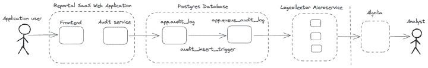

# 第 2 部分:使用 Algolia 从 PostgreSQL 进行商业智能数据索引-实现和结论- Algolia 博客

> 原文：<https://www.algolia.com/blog/engineering/bi-data-indexing-from-postgresql-to-algolia-2/>

我们邀请 Starschema 的朋友写一个结合使用 Algolia 和 PostgreSQL 的例子。请欣赏软件开发人员 Mátyás Budavári 的这一两部分系列！

如果您想跳回到第一部分，其中涵盖了用例以及提议的解决方案，[点击这里](https://algolia.com/blog/engineering/bi-data-indexing-from-postgresql-to-algolia-1)。

* * *

在本帖中，我们将介绍搜索索引解决方案的一个简化实现。

为了让我们的用户从外部位置访问我们的审计数据，我们需要将它发送到他们可以访问的地方。因此，我们将详细介绍如何实现这一点。

为了模拟匿名化的数据，我们将使用随机生成的数字 ID-s，我们将重点关注结构，并从示例中省略 JSON 数据类型。

你可以在 GitHub 上查看[的源代码](https://github.com/algolia-samples/algolia-postgres-db/tree/master/code)。你可以用免费的 Algolia 账户试试。关于安装步骤，请查看 GitHub 库根目录下的[自述文件](https://github.com/algolia-samples/algolia-postgres-db/blob/master/README.md)。

[](https://blog-api.algolia.com/wp-content/uploads/2022/10/indexing-bi-data-3.png)

## [](#implementation-details)实施细节

让我们详细研究一下我们的解决方案。我们的演示遵循一个简单的模式。

我们使用单个生产者定期创建新的审计日志行，并使用多个数据消费者读取这些新行。

为了简单起见，我们为服务创建了一个最小的示例。

*   [生产者](https://github.com/algolia-samples/algolia-postgres-db/tree/master/code/producer)将随机活动放入数据库
*   [消费者](https://github.com/algolia-samples/algolia-postgres-db/tree/master/code/consumer)读取队列并将数据上传到 Algolia

为了更容易阅读和抓住要点，我只使用了重要的外部库，并尽可能保持代码简单。

这个例子并没有反映我们实际的代码库，但是给了你一个如何以最小的开销实现它的想法。

## [T12<path fill-rule="evenodd" d="M4 9h1v1H4c-1.5 0-3-1.69-3-3.5S2.55 3 4 3h4c1.45 0 3 1.69 3 3.5 0 1.41-.91 2.72-2 3.25V8.59c.58-.45 1-1.27 1-2.09C10 5.22 8.98 4 8 4H4c-.98 0-2 1.22-2 2.5S3 9 4 9zm9-3h-1v1h1c1 0 2 1.22 2 2.5S13.98 12 13 12H9c-.98 0-2-1.22-2-2.5 0-.83.42-1.64 1-2.09V6.25c-1.09.53-2 1.84-2 3.25C6 11.31 7.55 13 9 13h4c1.45 0 3-1.69 3-3.5S14.5 6 13 6z">T14</path>](#getting-started)入门

让我们来看看您需要做些什么，如存储库 [README](https://github.com/algolia-samples/algolia-postgres-db/blob/master/README.md) 中所示。

所有组件和依赖关系都在`docker-compose.yml`文件中描述。

*   要按预期运行这个例子，您必须安装[Docker](https://docs.docker.com/get-docker/)。
*   您需要基于`.env.example`文件创建一个`.env`文件
*   您需要在[阿尔戈利亚](https://algolia.com/)注册，并在`.env`文件中设置您的凭证。
*   注意 docker-compose 文件使用了环境变量。只有从与`.env`文件所在的文件夹相同的文件夹中启动，它才能正常工作

该示例可以从以下内容开始:

```
docker-compose up --build 
```

启动后，应该会发生以下情况。

1.  PostgreSQL 容器启动
2.  PostgreSQL 容器用模拟数据初始化数据库
3.  PostgreSQL 容器进入健康阶段后，一个生产者和两个消费者启动
4.  应用程序等待并按照`DELAY_PRODUCER`和`DELAY_CONSUMER`环境变量中的设置定期执行任务。

## [](#component-details)组件详细信息

让我们看一下每个组件以及它们如何相互作用。

### [](#postgresql-database)PostgreSQL 数据库

我们运行 PostgreSQL 的[官方 docker 映像](https://hub.docker.com/_/postgres)。

首次启动时:

1.  创建一个数据库文件夹(或可选的卷),以便在两次运行之间保存数据库
2.  运行[docker-entry point-initdb . d](https://github.com/algolia-samples/algolia-postgres-db/tree/master/code/postgres/docker-entrypoint-initdb.d)中的 SQL-s 来初始化数据库。

### [](#init-scripts)初始化脚本

PostgreSQL docker 映像可以在第一次创建卷时将初始数据加载到数据库中。您可以在 PostgreSQL 映像的 DockerHub 页面的“*初始化脚本”*部分下的文档中找到更多关于它如何工作的一般信息。

init 脚本按字母顺序运行。第一组 sql 文件(`001_init_audit_log_table.sql`和`002_queue_table.sql`)创建应用程序使用的表。

1.  创建`app`模式。
2.  创建`app.audit_log`事实表
3.  创建`app.queue_audit_log`队列表

表准备好之后，`003_queue_trigger.sql`创建一个触发器来捕捉插入到`app.audit_log`表中的新数据，并将其复制到`app.queue_audit_log`队列中。

```
create or replace function audit_insert_trigger_fnc()
  returns trigger as $$
    begin
        insert into
            app.queue_audit_log (
             action
            ,user_id
            ,content_item_id
            ,create_date
            )
        values(
             new."action"
            ,new."user_id"
            ,new."content_item_id"
            ,new."create_date"
        );

        return new;
    end;
$$ language 'plpgsql';

create trigger audit_insert_trigger
  after insert on app.audit_log
  for each row
  execute procedure audit_insert_trigger_fnc(); 
```

当结构准备好并且触发器就位时，最后一个脚本(`004_generate_mock_data.sql`)将随机数据生成到事实表中。它的可配置部分被提取到变量中，因此我们可以看到它在不同数据量下的表现。随机数发生器有一个硬编码的 init 种子，所以它应该在多次重建中生成相同的数据。

```
-- set random seed for repeatable random data generation
SELECT setseed(0.8);
DO $$
    DECLARE
        -- configurable parameters for data generation
        nr_lines integer := 20;
        user_min integer := 10;
        user_max integer := 20;
        citm_min integer := 1500;
        citm_max integer := 2300;
        actn_min integer := 1;
        actn_max integer := 3;
    BEGIN
        with
            -- generate user_ids
            users as (
                select generate_series(user_min, user_max) as user_id
            )
            -- generate content_ids
           ,content as (
               select generate_series(citm_min, citm_max) as content_id
            )
            -- generate action_ids
           ,actions as (
               select generate_series(actn_min, actn_max) as action_id
            )
            -- get the cartesian product of the above in a random sort
           ,limited_data as (
               select
                 random() randomizer
                 ,*
               from users, content, actions
               order by randomizer
               limit nr_lines
            )
        insert
            into app.audit_log (
                action
                ,user_id
                ,content_item_id
            )
            select
                 action_id
                ,user_id
                ,content_id
            from limited_data
        ;
END $$
;

-- view data
-- select * from audit_log order by content_item_id, user_id, action; 
```

这个模拟数据生成脚本通过用`setseed`在代码开始处设置初始随机种子来使用受控的随机数据生成。我们为生成的每一行生成一个`random()`数，我们可以用它来避免添加相似的行。我们用每个值的可配置范围之间的`generate_series`来生成标识符。为了只选择给定数量的项目，我们用`limit`添加了结果集的上限。

为了更好地分离代码，不同的逻辑组件在它们自己的[公共表表达式](https://www.postgresql.org/docs/current/queries-with.html) aka 中定义。CTE 由`with`查询创建。在`limited_data` CTE 中，我们组合了不同数据类型的所有生成行，并在限制结果之前对它们进行洗牌。

PostgreSQL docker 官方映像的编写方式是，只有在数据库第一次启动时，数据库初始化脚本才会启动。如果您停止服务，然后重新启动它们，初始化将不会再次发生，但数据将会保留。

### [](#producer)制片人

文件夹`./producer`中的代码代表我们的应用程序。在我们的场景中，我们不想修改这段代码，而是通过 PostgreSQL 利用 Algolia 的强大功能。

*   启动时连接到数据库。
*   定期在事实表中生成一个新的随机日志行。
*   在这个应用程序的范围之外，插入触发器将把这个数据复制到队列中。

这是一个简单的应用程序。`main`功能是大部分动作发生的地方。`db`文件夹在`db.go`中包含一个 PostgreSQL 连接器，在`sql.go`中包含一个 insert 语句。

### [](#consumer)消费

`./consumer`文件夹下的消费者服务从数据库中读取最后插入的行，并将它们放入我们的 Algolia 索引中。

启动时连接到数据库，然后定期读取队列中的新数据，并在事务中执行以下操作:

1.  读取最后的`N`行，然后将其标记为已访问
2.  将选定的行上传到 Algolia
3.  从队列中清除已访问的行

我们假设如果必要的话，多个消费者将可用于调整重负载。我们不能依赖这些消费者一直在运行的事实。由于这个限制，我们不能利用 PostgreSQL 的[通知](https://www.postgresql.org/docs/current/sql-notify.html) / [监听](https://www.postgresql.org/docs/current/sql-listen.html)模式。我们使用一个队列表来代替。

这个概念的核心在于下面的 SQL 查询:

```
with get_lines as (
  select
      id
    , action
    , user_id
    , content_item_id
    , create_date
    , _visited
  from app.queue_audit_log
  where _visited = false
  order by create_date desc
  limit $1
  for update skip locked -- add concurrent consumers
)
update
  app.queue_audit_log new
set _visited = true
from get_lines old
where old.id = new.id
returning
    new.id
  , new.action
  , new.user_id
  , new.content_item_id
  , new.create_date
; 
```

让我们把这个查询的操作分成几个独立的步骤。所有这些步骤都在由 go 代码启动的事务中的一条指令中同时发生。

为了让多个消费者访问我们的队列表，我们需要添加`for update skip locked`。`for update`子句让引擎知道 select 子查询将用于更新它们。`skip locked`部分将忽略其他消费者可能已经锁定的线路。

> 锁定 SKIP 后，将跳过任何无法立即锁定的选定行。跳过锁定的行会提供不一致的数据视图，因此这不适合一般用途的工作，但可以用来避免多个使用者访问类似队列的表时发生锁争用。

*   `order by create_date desc`确保我们从队列中获得最新的可用行。
*   `limit $1`行确保我们只从队列中选择行的子集。
*   `returning`声明让我们获得每一行的数据。
*   在更新语句中，我们通过`where _visited = false`仅从当前未访问的行中设置`set _visited = true`。这是一种安全措施。理论上，我们永远不会有`_visited = true`以外的交易。这可以通过删除交易中的这些行来进一步简化。

## [](#usage)用法

有了 Algolia 中的数据，我们的分析团队可以编写自定义查询来搜索他们感兴趣的数据。

```
{
  "filters": "createDateTimestamp > 1655127131 AND userId=12 AND action=2"
} 
```

它搜索在`1655127131`(2022 年 6 月 13 日，星期一，下午 1:32:11)之后添加的带有`ID:2` by `user:12`的所有动作。epochconverter 是一个在时间戳和日期之间转换的便捷工具。

未来，我们计划根据分析团队的需求，使用自定义选择器来扩展我们的 web 界面。Algolia 有一个简单的方法来连接搜索查询和现成的前端组件。

## [](#conclusion)结论

这个简化的例子抓住了我们解决方案的精髓。我们能够实现接近 PostgreSQL 的目标，将数据消费者实现为独立的服务，并且不让任何日志行从我们的队列中溜走。

通过我们的实施，Algolia 帮助我们实现了我们的业务目标，让我们能够将我们的分析分发到数据库之外的外部位置，并显著改善了我们的洞察处理。

* * *

*我们希望您喜欢这篇来自 Mátyás 的深度文章，如果您正在寻找更多类似的内容，我们在 [Algolia 博客](https://www.algolia.com/blog/)上有更多的主题！如果你是 Algolia 的新手，你可以通过注册一个[免费等级账户](https://www.algolia.com/users/sign_up?utm_source=blog&utm_medium=main-blog&utm_campaign=devrel&utm_id=blog-algolia-and-postgres)来尝试一下。*