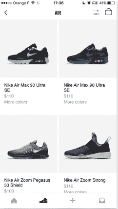
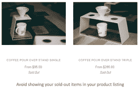
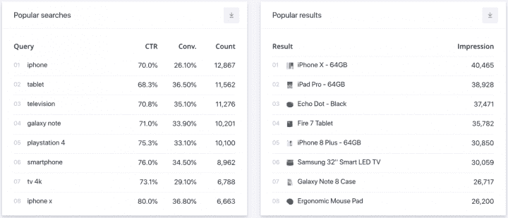
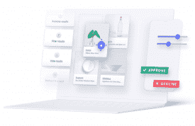

# 黑色星期五:如何微调你的网站搜索以获取最大利润

> 原文：<https://www.algolia.com/blog/ecommerce/black-friday-site-search/>

网络星期一的黑色星期五，以及包括 11 月和 12 月在内的整个假期，是电子商务的关键销售日。有多关键？据 [土坯](https://blog.adobe.com/en/publish/2022/01/12/adobe-us-consumers-spent-a-record-204-billion-online-this-holiday-season) 统计，2021 年假日季(11 月 1 日-12 月 31 日)，消费者消费 2045 亿美元，同比增长 8.6%。

2022 年的黑色星期五也是一个绝佳的机会。但对于企业来说，达到你想要的目标可能仍然具有挑战性。鉴于这个季节的短暂，以及两天的网上购物活动会对销售数字产生如此严重的影响，出现问题可能会导致巨大的收入损失。

黑色星期五的混乱可能而且确实发生在各种规模的品牌身上。即使是看似孤立的大型零售商，在面临巨大流量时也会遭遇在线中断。据 [数字商业 360](https://www.digitalcommerce360.com/2021/11/29/website-outages-slowdowns-hit-dozens-of-retailers-during-cyber-5/) 报道，2021 年，包括欧迪办公、沃尔玛在内的公司陷入困境。2020 年，是 Petsmart、惠普、Wayfair，还有很多其他公司。

就像其他任何一天一样，在今年的黑色星期五，你的网站可能会因为技术问题而面临风险，因为成千上万的购物者希望享受类似谷歌或亚马逊的体验。但是，与以往任何一天相比，未能满足用户期望的代价都可能是巨大的。

作为一个在线零售商，你如何在避开陷阱的同时充分利用黑色星期五和这个季节的剩余时间呢？以下是我们 2022 年关于在线搜索和发现功能的建议。

## 准备好你的电子商务系统

根据我们的 [在线商务趋势](https://www.algolia.com/dg/ecommerce-site-search-trends/index.html) 调查，在在线零售商中，65%的零售商在网站访问量激增时无法满足需求。

你准备好迎接成群激动的顾客光临你的网站了吗？你有没有把所有需要做的事情列一个清单，检查两遍？

现在就做好准备的一个原因是:你的竞争对手也在增加他们的假期消费，努力获取和留住顾客。所以，如果你没有为黑色星期五的混乱做好准备，他们会站在一旁试图接走你不满的顾客。

一个问题:网上购物的人(或者任何地方，看起来)都超级不耐烦。例如，以页面加载为例。一份 根据 [零售商网站表现报告(2021)](https://www.yottaa.com/resources/2021-rsr-report/) ，87%的网购者不会等待缓慢的网站加载。相反，在几秒钟的沮丧之后，他们会为了竞争对手的更友好的用户体验而放弃这个网站。这意味着网站网页的每一次延迟都可能会减少你的利润。

黑色星期五另一个能引起摩擦的元凶是支付系统问题。您知道搜索问题也会导致停机吗？

2020 年黑色星期五，Algolia 测量到与 2019 年事件相比，搜索流量增加了 66%。我们处理了超过 45 亿次搜索查询，峰值达到每分钟 720 万次请求，比 2019 年的最高峰值增长了 85%。

黑色星期五继续不负其疯狂销售日的美誉。因此，无论您是在处理自己的搜索基础设施，还是相信搜索提供商能做好，努力让您的系统为潜在的巨大负载增加做好准备都是值得的。

### **为你的(众多)移动购物者做好准备**

根据 [Adobe](https://blog.adobe.com/en/publish/2022/01/12/adobe-us-consumers-spent-a-record-204-billion-online-this-holiday-season) 的数据，2021 年假日季，手机用户占网上销售额的 43%，令人印象深刻。所以从登陆页面到支付，你的移动网站搜索体验不应该是事后的想法(或者彻头彻尾的灾难)。无论是在你的应用程序中还是在你的移动网站上，建立令人满意的、易于导航的移动体验意味着投入时间来测试每个小细节，比如你的移动电子商务搜索建议是如何显示的。在手机上，你不能像在台式电脑屏幕上那样简单地显示所有相关内容；你必须为小屏幕缩放它。

您如何为黑色星期五的移动购物者调整用户体验？

从了解他们通常如何浏览你的目录开始。然后利用这些信息，在小屏幕上创造出完美的简单体验。

例如，甚至在购物者开始点击他们的搜索请求之前，就有各种方式在手机屏幕上推荐热门搜索、类别和促销产品。对于人们可能喜欢先看后看的商品，比如鞋子或衣服，你可以用照片的形式展示搜索结果:

### **让你的库存保持最新**

节日期间的交易量和交易频率意味着您的产品数据库每天会有数百万次更新。您的系统需要通过一个大规模的、敏捷的系统来走在这些变化的前面。

想要通过指出库存有限来营造一种产品稀缺感？这当然很好，但你不会想展示那些不能在买家送礼时及时发货的产品。展示脱销商品还会浪费宝贵的屏幕空间，显示不太可能产生销售的商品。

无论您在哪里展示产品，无论是作为推荐，还是作为主页或搜索结果页面上的特色商品，都要记住这一点。

### **预见你的购物者的欲望**

你提供的产品是你最大的资产之一，所以要确保它们满足客户的需求。一种方法是搜索数据分析。

以下是一些流行搜索形式的搜索引擎查询数据示例:

你可以使用搜索分析来发现你的购物者在假期前搜索最多的商品，最重要的是，他们正在搜索但 *没有找到的商品。*

然后，您可以利用您发现的见解最终确定您的产品目录和折扣，设置热门搜索结果的显示方式，并有可能改进您的广告和 SEO 策略。

### **提前开始**

就在你为即将到来的几个月的假日购物季做准备时，你的购物者可能会通过比较价格、运输时间和其他因素来更早地搜索最划算的交易。人们无疑会在假期前访问你的网站。当他们回来时，确保他们开心，这样他们会在 11 月和 12 月回来。

### **利用自己的内容**

你和你的购物者都会产生关于你销售的产品的有价值的内容，包括顾客评论、博客帖子、使用指南、常见问题解答和社交媒体推广帖子。这些内容会极大地影响你的购物者的购买决定，并使你成为一个权威的、声誉良好的在线卖家。将你的内容显示在你的产品页面旁边，也显示在你的搜索结果中，这样人们就可以很容易地注意到它。

### **帮助购物者研究物品**

确切知道自己想要什么产品的购物者可能会进行特定的搜索，以了解你是否出售这些产品或类似商品。你可以让人们保存他们的搜索结果，然后在商品有货时收到提醒，从而引导这些商品搜索者在你的网站上寻找报价。那么他们就会有回来的动机(或者你会有一个合理的理由向他们询问即将上市的商品)。

## 大(Fri)日

### **积极主动地推销商品**

与实体店不同，你可以一键甚至自动重组你的店面。利用这种能力吧！

购物者寻找最好的交易，因此在搜索结果的排名中使用折扣率。通过将有限供应的产品排在第一位来制造一种稀缺的气氛。你有一个热门的报价，但仍想保持你的利润？首先为相关查询对该项目进行排名，然后在排名逻辑中添加您的折扣后利润。您可以调整的参数是无限的。重要的是根据对你的顾客(和你)重要的东西来配置搜索的排名逻辑。

### **预见到意想不到的**

当今年的黑色星期五结束时，你可能已经错过了一些潮流，并发现了一些你希望能更好地推广的热销商品。或者你的视力受损了。不管你有什么困难，为未来的成功做出重要的调整还不算太晚。

想一想英国零售商[Gymshark](https://www.algolia.com/blog/product/retail-innovations-peak-season/)的灵感，其网站在几年前的一个黑色星期五因流量激增而崩溃。后来，该公司改进了其电子商务基础设施，现在它是一家领先的运动服装零售商，取得了破纪录的假日销售业绩。

## 大写

### **分析你站点的性能**

通过网站搜索，你的购物者会告诉你他们想要什么，需要什么。利用宝贵的黑色星期五洞察力。人们在寻找什么是你没有提供的？他们的哪个搜索结果转换得最多？人们是如何浏览你的网店的？他们在寻找电视时，是否按特定品牌过滤了搜索结果？所有这类数据都可以帮助你改进你的产品和向顾客展示的方式。

### **把首次购物者变成回头客**

在节日期间，就像一年中的其他时间一样，你可以通过提供无与伦比的优惠和加大广告来获得新的购物者。如果你的顾客喜欢整体体验，他们很有可能会回来。根据许多 [行业研究](https://www.fastcompany.com/1669283/dollars-and-sense-the-business-case-for-investing-in-ui-design) 显示，在用户体验上每投入 1 美元，就会产生 2 到 100 美元的回报。因此，当事情平静下来时，反思一下哪些进展顺利，哪些失败了，并开始规划对用户体验的长期投资。

对于 2022 年的黑色星期五，要特别注意如何改进你的网站搜索功能。搜索体验已经远远超出了搜索框，包括了浏览和导航等高级搜索功能。关键的电子商务战略，如改善全渠道和增加个性化，正变得依赖于高级用户界面功能，如语音搜索和聊天机器人(了解 [更多](https://resources.algolia.com/ebooks/ebook-searchbeyondtheboxecommerce-retail) )。 *整体主题:寻找作品皈依者。*

黑色星期五没有放之四海而皆准的解决方案，但是当重要的日子到来时，实施一些好的建议可以让你的网站走得更远。

想要一些个性化建议？请求免费 [搜索审核](https://www.algolia.com/search-audit/) 。我们将查看您的网站，并为您提供如何在这个黑色星期五改进在线商店的建议。