# 使用 Algolia、Mapbox 和 Twilio 在 React 中构建商店定位器-第 1 部分

> 原文：<https://www.algolia.com/blog/engineering/building-a-store-locator-in-react-using-algolia-mapbox-and-twilio-part-1/>

这是我们关于构建商店定位器的 3 部分实时编码系列的第一篇文章。请务必查看 [构建商店定位器-第 2 部分](https://www.algolia.com/blog/engineering/building-a-store-locator-in-react-using-algolia-mapbox-and-twilio-part-2/) 和 [构建商店定位器-第 3 部分](https://www.algolia.com/blog/engineering/building-a-store-locator-in-react-using-algolia-mapbox-and-twilio-part-3/) 。

如今，电子商务购物者期望便利，希望现实世界和网络世界融合，允许他们通过任何渠道开展业务。这就是商店定位器的用途，这样用户就可以:

*   在线搜索产品，然后在店内购买
*   亲自浏览和比较产品，然后在线购买
*   在网上购物并购买产品，然后亲自提货
*   亲自退还之前购买的物品，而不是将它们寄回

尽管如此，我们发现太多的网站没有为用户提供一种优雅的方式来找到他们的“最近的商店”，无论是在线测试或购买，还是在线提货。

## 学习如何建立商店定位器

构建商店定位器可能看起来很复杂，因为它需要实施地理搜索、地址/兴趣点(POI)搜索，并在地图上显示结果。为了让每个人都尽可能容易地跟上，我们决定在三篇博客文章之后进行一系列的三次现场编码会议。在这些事件中，我们将使用:在 React 中创建一个响应式 *商店定位器*

*   的地理搜索功能；
*   [地图框](https://www.mapbox.com/use-cases/store-locator) 用于显示地图并搜索位置和兴趣点
*   [Twilio](https://www.twilio.com/sms) 用于在订单准备就绪后发送文本
*   [颖云](https://www.clever-cloud.com/) 为主持

一切都被包装使用 React v17、[React instant search](https://www.algolia.com/doc/guides/building-search-ui/what-is-instantsearch/react/)，以及[Autocomplete](https://github.com/algolia/autocomplete)UI 库，在很短的时间内构建现代化的搜索和发现体验。

本指南分为三个部分

*   第 1 部分:简介和数据索引
    *   简介
    *   创建必要的账户
    *   在 Algolia 中推送数据和索引
    *   脚手架工程
*   第 2 部分:使用 Algolia 和 Mapbox 实现地理搜索
*   第三部分:点击&收集逻辑实现使用 Twilio ( [注册七七届)](https://www.eventbrite.com/e/building-a-store-locator-in-react-using-algolia-mapbox-and-twilio-part-3-tickets-161195033685)

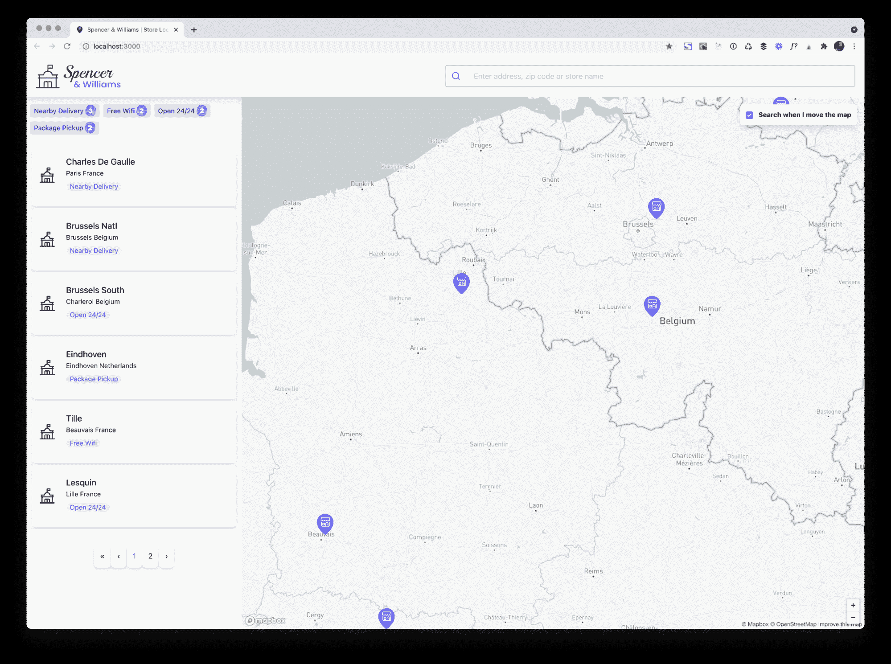

Preview of the finished application

## 为什么零售商应该关心提供一个具有 BOPIS 功能的商店定位器？

新型冠状病毒疫情疫情带来了许多挑战。随着大多数国家的宵禁和封锁，品牌和零售商不得不重新定义自己以及他们与客户互动的方式。

面临这些挑战的一个新兴趋势是 BOPIS，它是“在线购买，店内提货”的首字母缩写，也称为“点击收集”BOPIS 已经在苹果或宜家等网站上出现多年，已经成为消费者在线购买商品的重要方式，然后步行/骑自行车/开车到最近的商店取货。

用户在订购过程中选择最近的商店，以及他们想要提货、在线支付的时间，瞧！

以下是苹果和宜家的一些例子:

T3

<https://res.cloudinary.com/hilnmyskv/image/upload/v1626874013/blogposts/store_locator_2021_apple.webm>

 <https://res.cloudinary.com/hilnmyskv/image/upload/v1626874016/blogposts/store_locator_2021_ikea.mp4>

<https://res.cloudinary.com/hilnmyskv/image/upload/v1626874016/blogposts/store_locator_2021_ikea.webm> 

## 指南

在这篇博文中，我们将概述实时编码过程中的主要步骤。

[https://www.youtube.com/embed/KRzrHu_XVVY](https://www.youtube.com/embed/KRzrHu_XVVY)

视频

### 

### **1。创建必要的账户**

我们将使用 Algolia、Mapbox 和 Twilio 作为服务提供商。第一步，我们只需要创建 Algolia 和 Clever-cloud(我们的云提供商)账户。在接下来的课程中，我们将创建其他帐户。

 ****A .颖云**

聪明云是一个 IT 自动化平台。他们管理所有的操作方面，而你专注于编写和推进你的代码。它处理自动化任务，使您的应用程序永远不会停机:监控、备份、扩展、安全更新、蓝/绿部署、CI/CD 工具集成等等。

让我们在**clever-cloud.com**上创建我们的账户。

一旦我们填好个人信息，就可以开始了。我们点击 **个人空间** 和 **创建……一个全新的 app** 。我们选择 Node.js 运行时，因为我们将用 React 和 Typescript 编写我们的应用程序。

然后，我们选择我们的数据中心，添加我们的 SSH 密钥(推送时需要，如果您还没有链接您的 GitHub 帐户)，并让环境变量保持原样。我们不需要这个项目的插件，但正如你所见，他们支持大多数技术栈(Postgres，Mongo，Redis，Apache Pulsar，等等。

现在，我们可以创建一个 Algolia **账户了。**

**b . Algolia**

Algolia 为动态体验提供 API 平台，使组织能够预测意图并交付结果。由于 Algolia 中的 API 优先方法，开发人员和业务团队可以显示相关内容，以满足即时结果的需求。Algolia 让您轻松构建和优化体验，从而增强在线互动，提高转化率，并丰富客户的终身价值。

现在，我们前往[【Algolia.com】](https://www.algolia.com/users/sign_up)创建我们的自由账户，它允许高达。每月 10，000 次搜索请求。注册后，我们将创建应用程序并索引我们的数据:

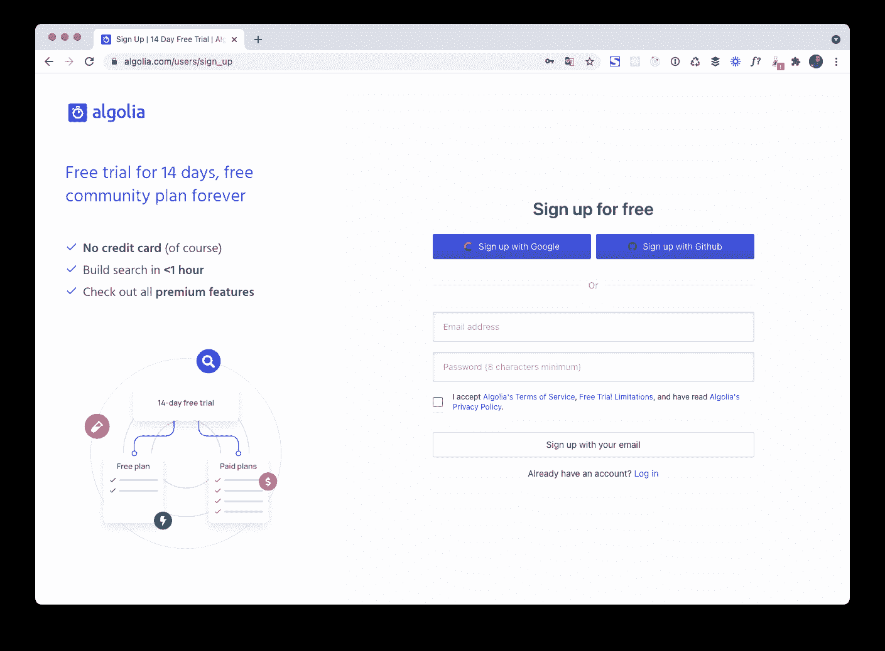

**C .其他服务**

 **记住，我们需要一个地图箱和一个 Twilio 账户。

您可以自己创建它们，或者等到我们需要时再创建。这取决于你。

### **2。在 Algolia 中推送数据和索引**

现在我们已经设置了我们的 Algolia 帐户，我们将通过 **索引我们希望在应用程序中显示的数据** 来启动该项目。我们已经在我们的 GitHub 存储库中准备了这些数据(https://GitHub . com/algolia-samples/store-locator-with-algolia-map box-twilio/tree/master/dataset)，其中包含一个巨大的 JSON 文件，包含所有斯潘塞和威廉的商店位置。

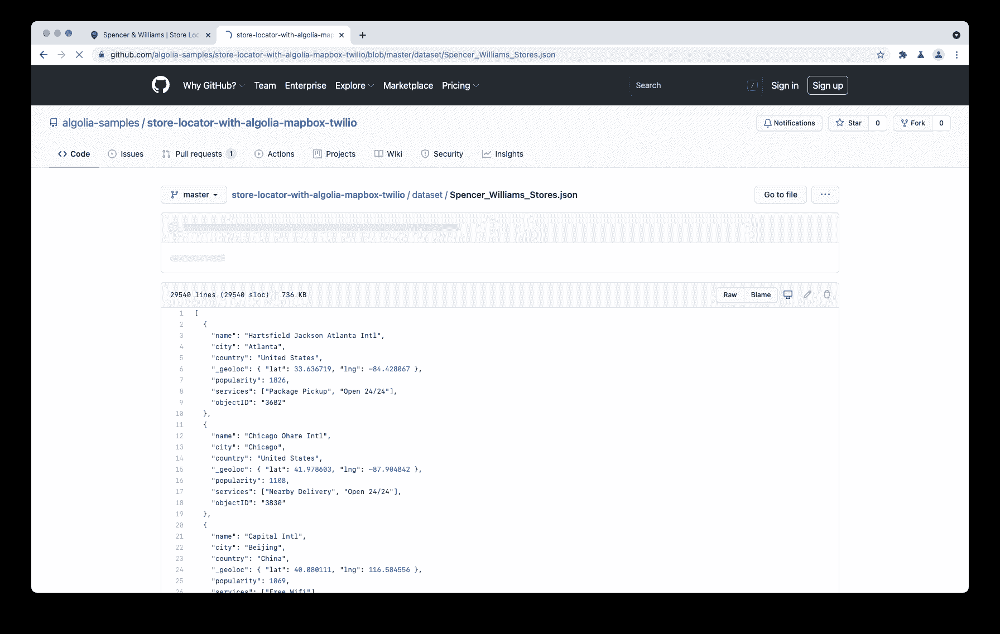

我们点击 **Raw** (在文件名的右边)，将文档保存到我们的桌面。我们只需要做一次。

然后我们去我们的 Algolia 账号，去 **索引>配置** 在侧边栏:

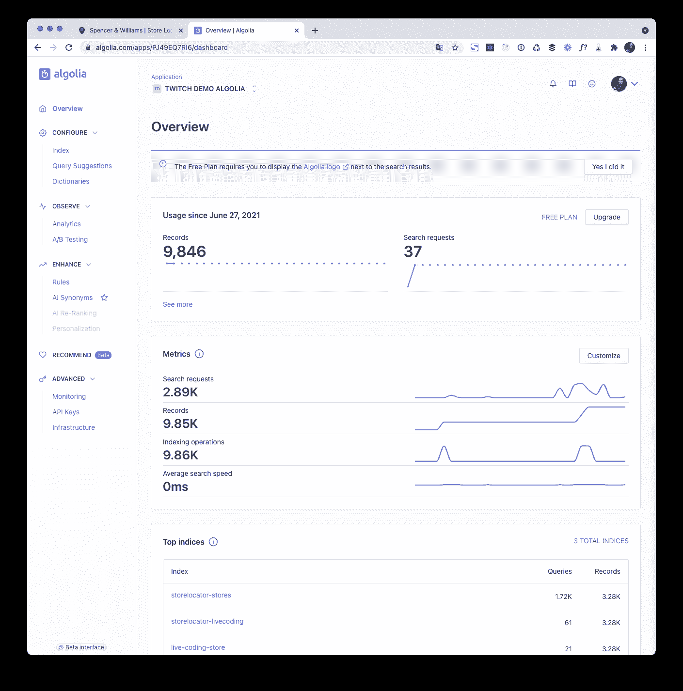

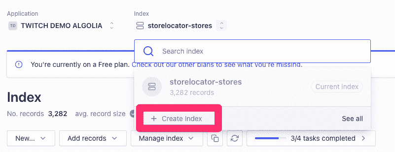

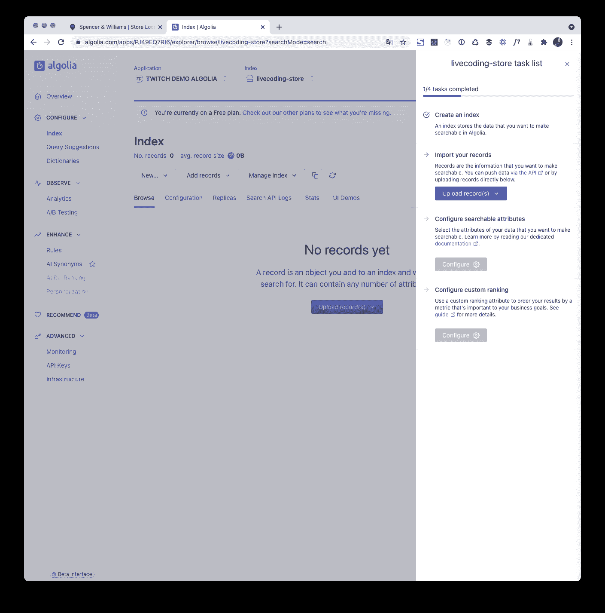

我们点击 **创建索引** 并将其命名为*livecoding-stores*。

创建完成后，屏幕右侧会出现一个侧边栏。我们单击上传记录，然后拖放从 **回购中获得的 JSON。**

创建索引很快——我们的 3000 家商店只需几秒钟就可以搜索到。 **漂亮整洁！**

索引我们的数据后，我们需要配置我们的索引来告诉引擎:

*   您希望使哪些 **属性可搜索** ，这样就不会在所有属性中进行搜索(默认行为)
*   将哪些业务相关属性用于自定义排名
*   添加哪些属性作为 **刻面**

在工具条上，我们点击 **配置** ，然后点击按钮‘添加可搜索属性’:

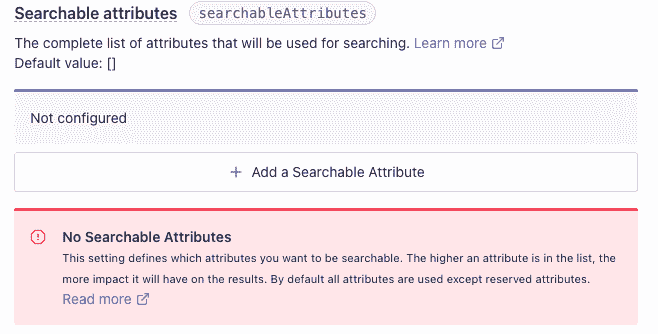

我们将添加“城市”、“国家”和“姓名”作为可搜索属性。

然后我们向下滚动选择 **过滤和刻面>刻面**

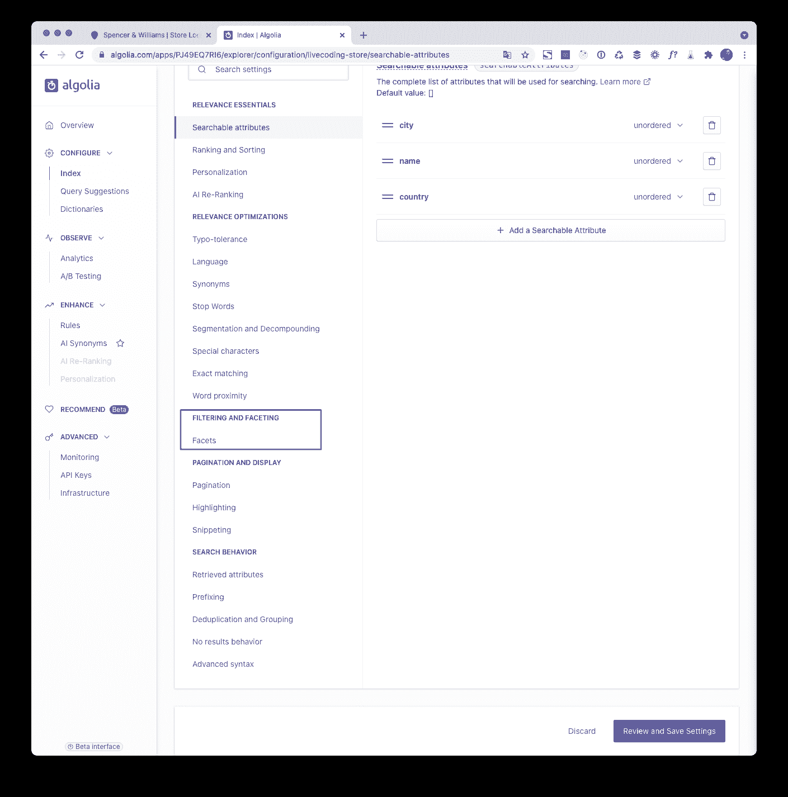

在这里，我们将添加“国家”和“服务”作为属性，并将这些属性声明为方面，然后我们单击 **查看并保存设置。**

Algolia 旨在返回最相关的结果，将文本相关性与业务相关性相结合。对于文本部分，我们已经配置了可搜索的属性，还有更多的属性，但已经足够了。对于业务相关性，每个人都需要提供一个属性来最好地反映每个被索引的记录的受欢迎程度:在我们的例子中，我们有一个名为“受欢迎程度”的属性，我们知道“值越高，记录越受欢迎”。- >为了对其进行配置，我们使用了名为“CustomRanking”的设置。

为了检查一切是否正常，我们转到屏幕顶部，点击 **浏览。** 我们点击小放大镜，输入“法国”。

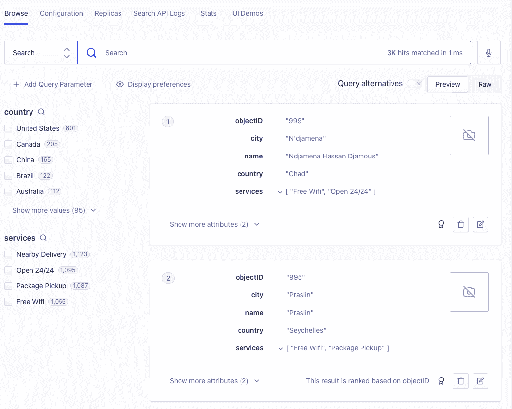

我们应该看到一些成果。 **现在我们准备开始编码了！**

**注意** :我们刚刚设置了开始使用的最低要求，但是请随意访问 [Algolia 文档](https://www.algolia.com/doc/guides/managing-results/relevance-overview/) 以了解更多关于配置索引和实现最佳相关性的最佳实践:

### 3。资助这个项目

> “开发者可以用文本编辑器改变世界”
> 杰夫·劳森，Twilio 首席执行官

对于这个项目，我们决定使用 React with Typescript 和 Tailwind CSS 来构建我们的应用程序。你可能已经熟悉 React，但可能不太熟悉**。**

 **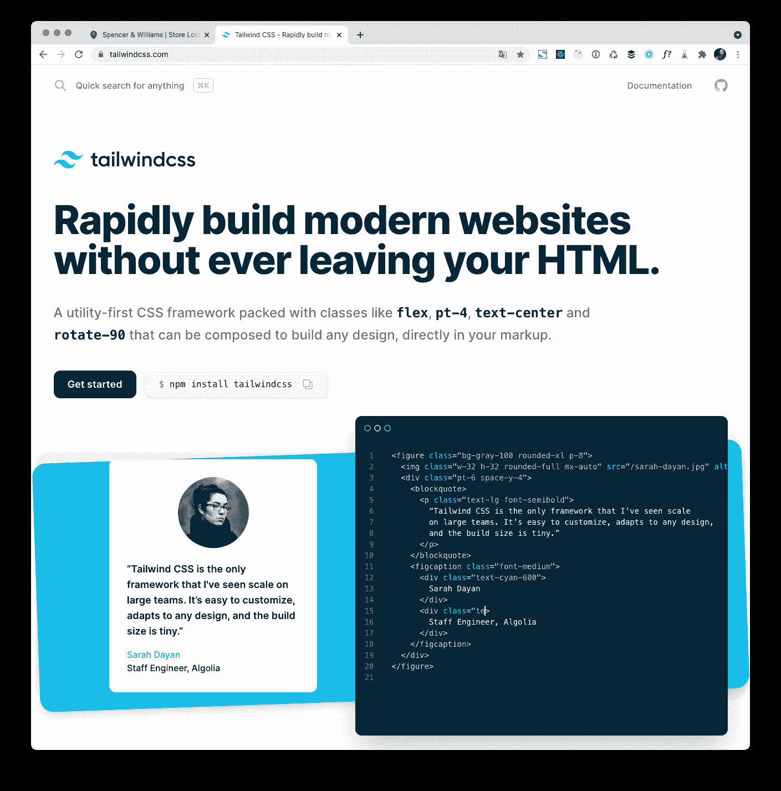

Tailwind 是一个现代的 UI 库，它提供了数百个 CSS 类，你可以在任何 UI 框架/库中使用。它帮助您构建一个复杂但连贯的 web UI，比 Bootstrap / jQuery 框架更灵活。

因此，我们打开一个终端，为我们的项目安装必要的基础。

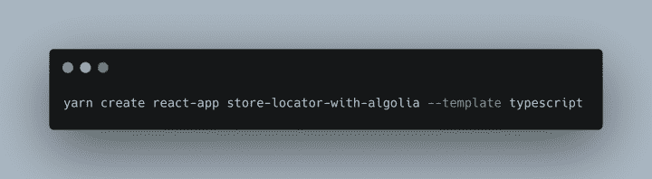

然后我们安装 Tailwind CSS 及其所需的依赖项。生产中不需要顺风，所以将其作为开发依赖项添加就足够了。

由于我们不能用 **create react app、** 更改 PostCSS 配置，我们需要使用 **CRACO** 工具覆盖它的配置(Create React App Configuration Override)。在使用 `yarn build` 脚本生成包之后，我们还将添加包 `serve` 用于服务生产包(见下文)。

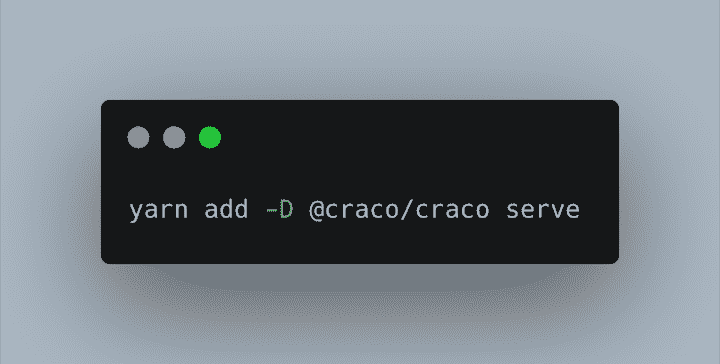

现在我们需要将 craco 命令添加到 `package.json` 文件中的“测试”、“构建”和“开发”脚本中。

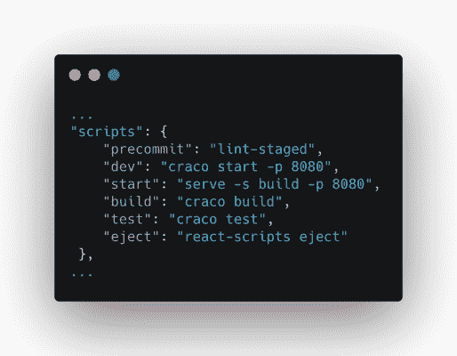

接下来，我们需要为 CRACO 创建一个配置文件。我们在项目的根目录下创建一个名为**craco . config . js**的文件，并将下面的代码片段添加到这个文件中:

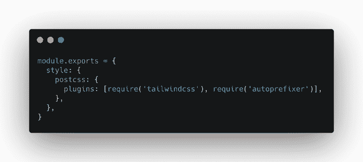

这允许我们使用 Tailwind CSS 和 autoprefixer 作为 PostCSS 插件。

现在我们需要配置顺风。运行这个命令:

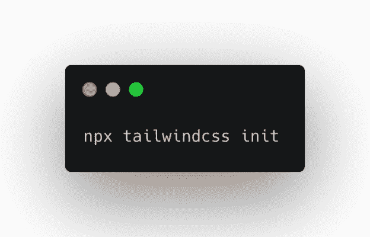

这将创建一个**tailwind . config . js**文件。从这里，我们只需要编辑第 2 行“purge”命令:

**`purge: ['./src/**/*.{js,jsx,ts,tsx}', './public/index.html']`**

**这是做什么的？**

Tailwind CSS 在开发模式下包含了数百个 CSS 类，让设计你的风格变得快速简单。这使得开发包在设计上很大。在生产中，您希望从 CSS 中减少任何未使用的类，以尽可能减小大小。Tailwind CSS 检查所有与 **`purge`** 选项中的模式匹配的文件，并从生产版本中删除任何未使用的 CSS 类。

最后，我们打开 IDE，编辑*index . CSS*将这 3 行添加到文件的顶部。

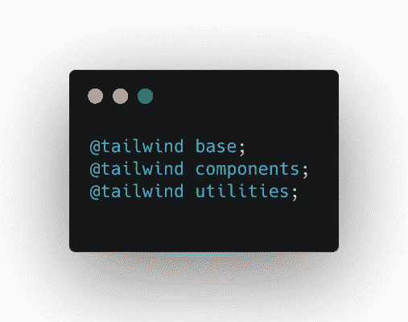

然后我们提交并推送我们的代码。我们准备好下一次直播了！

## 我们见过什么

在第 1 部分中，我们有:

*   了解我们将在这 3 次现场编码中共同构建的内容()。会话
*   创造了聪明的-云和阿尔戈利亚的账户
*   设置和配置我们的 Algolia 的索引
*   用 Create React App、CRACO 和 TailwindCSS 搭建我们的项目

[代码在 GitHub](https://github.com/algolia-samples/store-locator-with-algolia-mapbox-twilio) 的“live coding-part 1”分支中

## 下一步是什么

现在我们已经建立了项目，并使我们的商店数据集可以使用 Algolia 进行搜索，在下一节课中，我们将重点关注: 实施 Algolia 地理搜索，并使用 Mapbox GL 在地图上显示结果。[阅读第二部](https://www.algolia.com/blog/engineering/building-a-store-locator-in-react-using-algolia-mapbox-and-twilio-part-2/)******