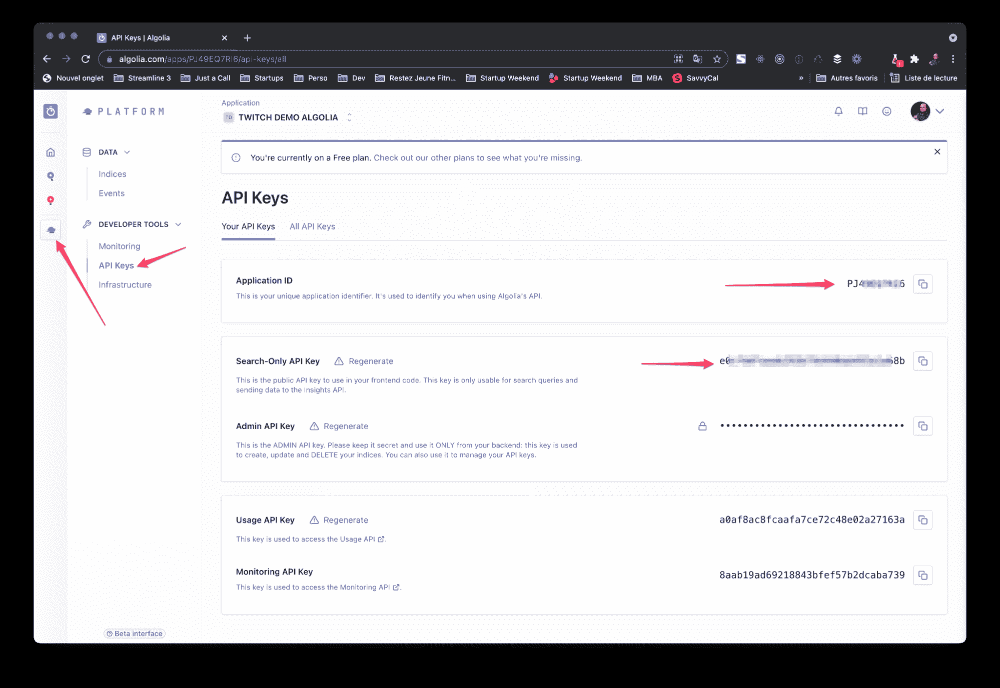
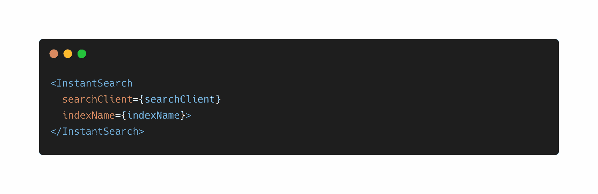
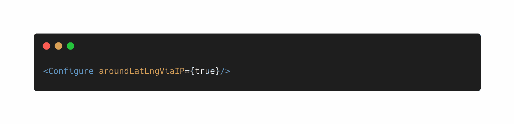
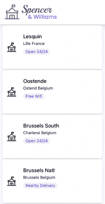
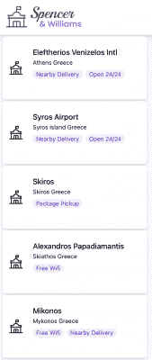
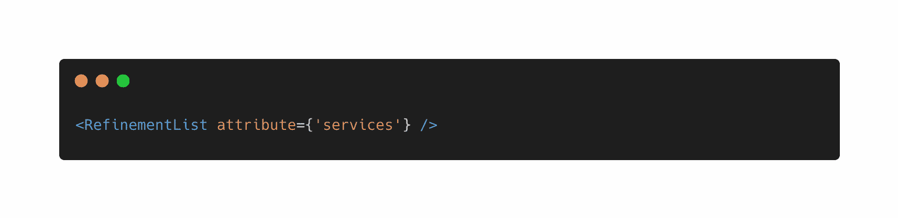
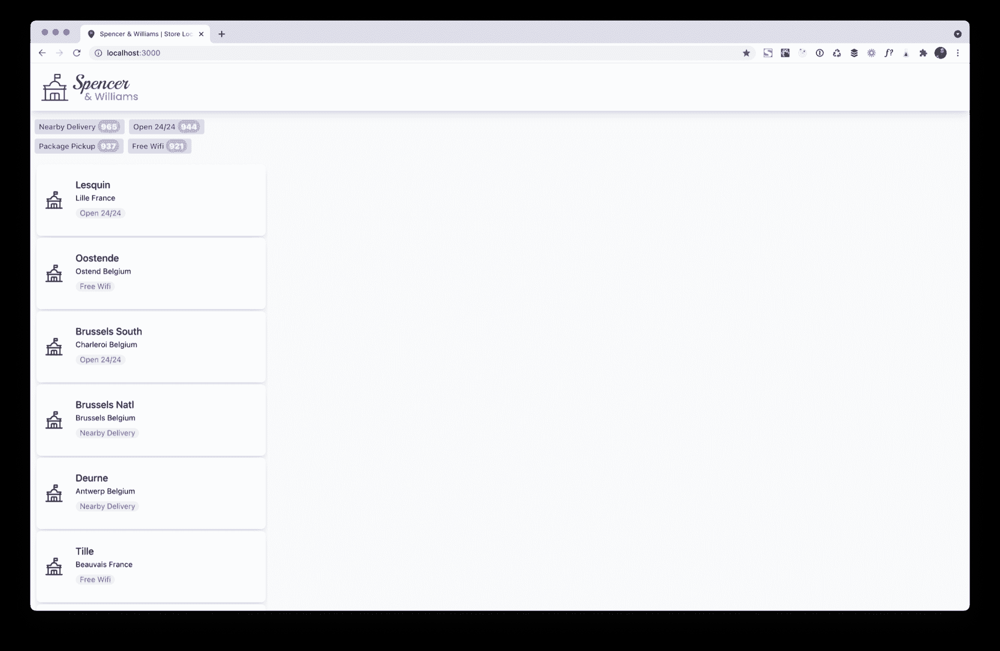
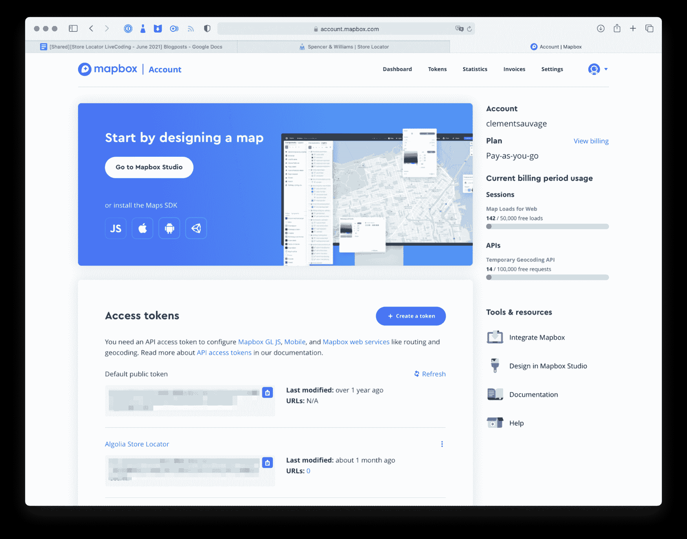
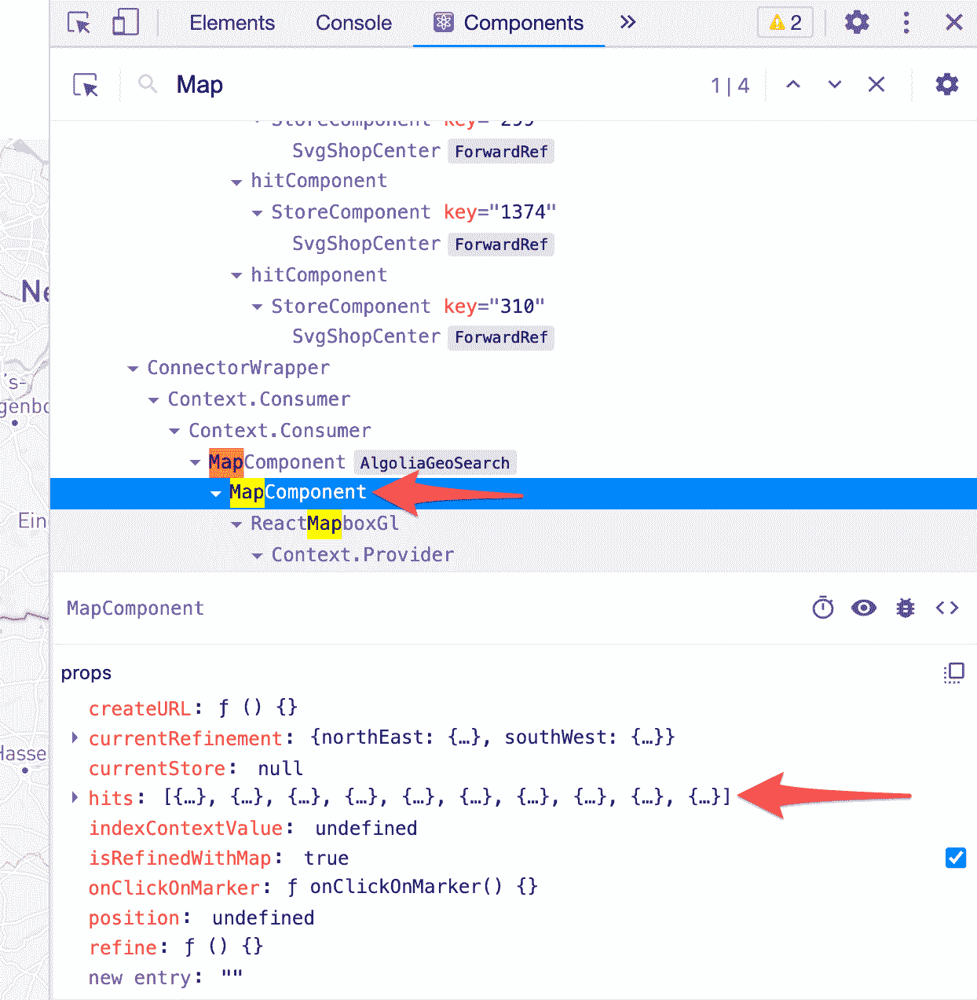
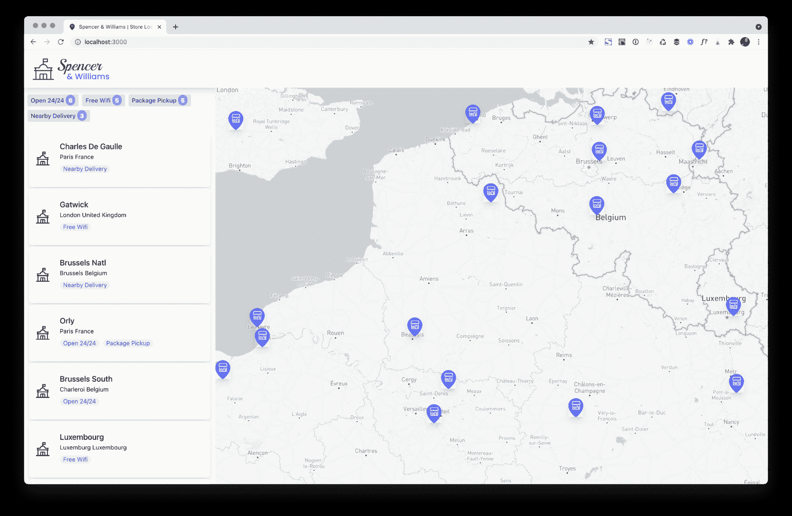

# 使用 Algolia、Mapbox 和 Twilio 在 React 中构建商店定位器——第 2 部分

> 原文：<https://www.algolia.com/blog/engineering/building-a-store-locator-in-react-using-algolia-mapbox-and-twilio-part-2/>

这是我们关于构建商店定位器的 3 部分实时编码系列的第二篇文章。请务必查看 [构建商店定位器-第 1 部分](https://www.algolia.com/blog/engineering/building-a-store-locator-in-react-using-algolia-mapbox-and-twilio-part-1/) 和 [构建商店定位器-第 3 部分](https://www.algolia.com/blog/engineering/building-a-store-locator-in-react-using-algolia-mapbox-and-twilio-part-3/) 。

如今，电子商务购物者期望便利，希望现实世界和网络世界融合，允许他们通过任何渠道开展业务。这就是商店定位器的用途，这样用户就可以:

*   在线搜索产品，然后在店内购买
*   亲自浏览和比较产品，然后在线购买
*   在线购物和购买产品，然后亲自提货
*   亲自退还之前购买的物品，而不是将它们寄回

尽管如此，我们观察到太多的网站没有为用户提供一种优雅的方式来找到他们的“最近的商店”，无论是在线测试或购买，还是在线购买。

构建商店定位器似乎很复杂，因为它需要实现地理搜索、地址/兴趣点(POI)搜索，并在地图上显示结果。为了让每个人都尽可能容易地跟上，我们决定在三篇博客文章之后进行一系列的三次现场编码会议。在这些事件中，我们决定在 React 中创建一个响应式*商店定位器，使用:*

*   [Algolia](https://www.algolia.com/) 的地理搜索功能；
*   [地图框](https://www.mapbox.com/use-cases/store-locator)用于显示地图和搜索位置和兴趣点
*   [Twilio](https://www.twilio.com/sms) 用于在订单准备就绪后发送文本
*   [颖云](https://www.clever-cloud.com/en/)主持

使用 React v17、 [React InstantSearch](https://www.algolia.com/doc/guides/building-search-ui/what-is-instantsearch/react/) 和 [Autocomplete](https://github.com/algolia/autocomplete) UI 库包装一切，在很短的时间内构建现代搜索和发现体验。

[https://www.youtube.com/embed/jyntg6hkKMs](https://www.youtube.com/embed/jyntg6hkKMs)

视频

注意:在第 1 部分中，我们创建了所有必需的帐户(Clever cloud 和 Algolia)，我们索引了数据，并配置了 Algolia 索引。[阅读第 1 部分](https://www.algolia.com/blog/engineering/building-a-store-locator-in-react-using-algolia-mapbox-and-twilio-part-1/)

# [](#adding-geo-search-capabilities)添加地理搜索功能

为了快速找到距离我们当前位置或给定地址输入最近的商店，我们将利用 [Algolia 地理搜索功能](https://www.algolia.com/doc/guides/building-search-ui/ui-and-ux-patterns/geo-search/react/)，以及 [React InstantSearch](https://www.algolia.com/doc/guides/building-search-ui/what-is-instantsearch/react/) ，在列表视图和地图视图上显示找到的商店(使用 Mapbox GL)。

注:你可以在项目的 [Github 资源库](https://github.com/algolia-samples/store-locator-with-algolia-mapbox-twilio/tree/session-2-adding-instant-search-start)中找到第 1 部分末尾获得的代码。

## [](#a-quick-overview-of-algolia%e2%80%99s-instantsearch)Algolia 的即时搜索快速概述

React InstantSearch 是 React 的一个开源、生产就绪的 UI 库(也有 VanillaJS、Vue、Angular、Swift 和 Kotlin 版本)，它允许您在前端应用程序中快速构建搜索界面。

它的目标是通过提供一个[完整的搜索生态系统](https://www.algolia.com/doc/guides/getting-started/how-algolia-works/#the-full-ecosystem)来帮助你尽可能顺利地实现令人敬畏的搜索体验。InstantSearch 通过提供称为“小部件”的前端 UI 组件解决了这一巨大目标的重要部分，您可以将这些组件组装到独特的搜索界面中，例如:

在我们的例子中，我们将利用一些现有的小部件，如[infini hits](https://www.algolia.com/doc/api-reference/widgets/infinite-hits/react/)和 [RefinementList](https://www.algolia.com/doc/api-reference/widgets/refinement-list/react/) ，我们将构建一个定制的小部件，以便在 Mapbox 支持的地图上显示结果。为此，我们将扩展默认的地理搜索小部件，它默认使用谷歌地图，但由于有了 [connectGeoSearch 连接器](https://www.algolia.com/doc/api-reference/widgets/geo-search/react/#connector)，它可以被扩展。

注意:默认情况下，React InstantSearch 与[服务器端渲染](https://www.algolia.com/doc/guides/building-search-ui/going-further/server-side-rendering/react/)兼容，并具有[完全路由能力](https://www.algolia.com/doc/guides/building-search-ui/going-further/routing-urls/react/)。

## [](#adding-react-instantsearch-to-our-app)向我们的应用添加 React InstantSearch

要将 InstantSearch 添加到我们的应用程序中，让我们安装所需的包。

```
yarn add algoliasearch react-instantsearch-dom
```

为了类型脚本兼容性和 IDE 支持，我们还将添加 **react-instantsearch** 类型

```
yarn add -D @types/react-instantsearch
```

对于本指南的这一部分，这就是我们需要的全部内容。

我们先从 Algolia 的仪表盘上抓取一些信息。

在 Algolia 仪表盘上，点击**平台**图标(侧栏中的最后一个图标)并选择 **API 密钥**以复制您的仅搜索 API 密钥和应用 ID。



现在，让我们创建一个名为`.local.env`的文件。我们将把环境变量存储在这个文件中。这些变量将在构建时注入到我们的应用程序中，所以不要忘记在创建这个文件后重启本地开发服务器。

将以下内容添加到`.local.env`文件中:

```
REACT_APP_ALGOLIA_APP_ID=”myAppId”
REACT_APP_ALGOLIA_API_KEY=”xxxxx”
REACT_APP_ALGOLIA_INDEX_NAME=”myIndiceName”

```

注意:如果环境变量对你来说是新的，有很多非常好的资源，比如:我的朋友张秀坤 Twilio 的首席开发人员布道者——写的《在 Node.js 中使用环境变量》,可以帮助你快速了解这个主题。另一个很好的例子集中在[在 Create React App 应用程序中添加自定义环境变量](https://create-react-app.dev/docs/adding-custom-environment-variables/)。

### [](#creating-the-algolia-client-instance)**创建 Algolia 客户端实例**

现在我们已经安装了所需的包，让我们将 React InstantSearch 添加到我们的应用程序中。第一步是在我们文件的顶部导入 InstantSearch。

```
import {
  InstantSearch,
} from 'react-instantsearch-dom';

```

然后，我们可以将即时搜索组件添加到代码中:



如您所见，它需要两个参数:

*   **`indexName`** 是您放入 Algolia 仪表盘的索引名称。
*   **`searchClient`** 是 AlgoliaSearch 的一个实例，Algolia Search API 的 JavaScript 客户端库，它将执行所有的请求。由于我们希望尽可能简单，我们将为这个实例添加一个单独的文件(此外，我们将在第三个视频中需要它，并且保持事物的分离在软件工程中总是一个好的实践)。

*src/lib/algolia client . ts*

```
import algoliaSearch from 'algoliasearch';

const indexName = process.env.REACT_APP_ALGOLIA_INDEX_NAME;
const searchClient = algoliaSearch( process.env.REACT_APP_ALGOLIA_APP_ID as string, process.env.REACT_APP_ALGOLIA_API_KEY as string );

export { indexName, searchClient };

```

现在我们有了我们的客户机，是时候在我们的 InstantSearch 实例中使用它了。

### [](#adding-our-first-widget-to-instantsearch)**将我们的第一个小部件添加到即时搜索**


我们将使用<hits>小部件来显示 Algolia 返回的结果。</hits>

`Hits`组件只接受一个属性:`hitComponent`，一个带有**项**作为参数的函数，它应该返回 JSX。这个 JSX 将在应用程序中呈现。

```
<Hits<Hit> hitComponent={
({ hit }) => (
      	<StoreComponent
           	key={hit.objectID}
                onClick={(hit) => handleClick(hit)}
                hit={hit}
                currentStore={currentStoreCoordinates}
            />
      )}/>

```

你可以返回任何你想要的 JSX，但是我们已经创建了自己的组件，它只不过是一个带有一点 CSS 的`div`。

让我们更深入地了解一下它的道具:

*   **键属性**用于帮助 React 识别它必须呈现的循环元素。，如果您对 React 不太熟悉，请查看关于[列表和键的文档——React](https://reactjs.org/docs/lists-and-keys.html#keys):
*   **onClick 属性**用于处理项目上的鼠标事件。；
*   点击道具用于填充组件。
*   最后， **currentStore 属性**用于让应用程序知道选择了哪个商店。通过比较两个 LngLat 坐标的比较位置，将 pin 更改为不同的颜色(在我们的例子中)会很有用。

*src/lib/compare position . ts*

```
export const comparePosition = (
  position1: [number, number],
  position2: [number, number] | null
): boolean => {
  return position2
    ? position1[0] === position2[0] && position1[1] === position2[1]
    : false;
};

```

现在我们已经创建了这个组件，我们应该会在我们的应用程序旁边看到一个漂亮的斯潘塞商店列表！

 <https://res.cloudinary.com/hilnmyskv/image/upload/v1626774743/blogposts/store_locator_2021_list_preview.mp4>

<https://res.cloudinary.com/hilnmyskv/image/upload/v1626774743/blogposts/store_locator_2021_list_preview.webm> 

但事实是:它并不真正可用。当然，它做到了我们要求的(按受欢迎程度排序，但由于我住在法国北部(靠近里尔和比利时——美味的巧克力和上好的啤酒)，我绝对不关心亚特兰大的商店。

因此，让我们添加地理搜索功能，这样它就可以显示我周围最受欢迎的商店！

### [](#adding-geo-search)**添加地理搜索**

默认情况下，Algolia 提供了执行地理搜索的可能性，无需传递任何纬度/经度，但仍会返回最近的命中结果。怎么会？它依赖于你用来调用 Algolia API 的 IP 地址。注意:对于欧盟的人，从 2021 年 7 月起，IP 地址不被视为 PII(个人身份信息，法语中“Donnée à caractère personnelle”的 DCP ),因为它不精确定位用户，这意味着不需要警告用户您正在使用它来告诉 InstantSearch 我们想要使用“aroundLatLngViaIP ”,我们使用配置组件

注意:<配置/ >组件可以接受任何[搜索参数](https://www.algolia.com/doc/api-reference/widgets/configure/react/)。我们将在下一集看到更多。

现在，您会看到列表显示了您所在位置附近的商店。最简单的实验方法是通过 VPN。

| 

与我的常规连接(🇫🇷)

 | 

用 VPN 连接到一个希腊服务器(🇬🇷)(太阳来了🎵)

 |

现在我们有了附近商店的列表，让我们添加一个漂亮的**细化列表**来过滤服务类型。

与 **Hits** 小部件不同， **RefinementList** 组件只有一个属性，用于传递我们想要使用的方面**属性**的名称，这是我们在第 1 部分的[中的 Algolia 仪表盘中配置的。](https://www.algolia.com/blog/engineering/building-a-store-locator-in-react-using-algolia-mapbox-and-twilio-part-1/)



### [](#styling-of-the-refinementlist)**细化列表的样式**

Algolia 在一个单独的包中提供了一个默认主题。要使用它，您需要添加 **instantsearch.css** 样式表，但是在我们的示例中，我想使用***@ apply****指令与您一起探索一个定制的 **Tailwindcss** 主题，该指令允许您使用 TailwindCSS 的预定义类名来设计任何 CSS 选择器的样式，如下所示:*

```
.ais-RefinementList ul {
  @apply flex font-normal text-sm flex-wrap gap-2 my-4;
}

.ais-RefinementList ul li {
  @apply rounded bg-purple-200 px-2 py-1;
}

.ais-RefinementList ul input {
  display: none;
}

.ais-RefinementList-labelText {
  @apply font-medium text-purple-900;
}

.ais-RefinementList-count {
  @apply font-black text-white p-1 px-1.5 bg-purple-400 rounded-full;
}

.ais-RefinementList-item--selected {
  @apply border-2 border-purple-800;
}

.aa-Panel mark {
  color: #5468ff;
  background: none;
}

```

一旦添加了这些样式，细化列表小部件应该大致如下所示:

 <https://res.cloudinary.com/hilnmyskv/image/upload/v1626861899/blogposts/store_locator_2021_refinementlist.mp4>

<https://res.cloudinary.com/hilnmyskv/image/upload/v1626861899/blogposts/store_locator_2021_refinementlist.webm> 

# [](#displaying-stores-on-a-map-using-mapbox)使用地图框在地图上显示商店

如果你已经完成了，这个应用程序在这个阶段应该是这样的:



一个页眉，一个侧边的列表，和空白的空间。现在是时候用一张漂亮的地图来填满这个空间了！

## [](#choosing-the-right-map-provider)选择合适的地图提供商

有几十个地图提供商，其中一些非常有名:

*   谷歌地图，
*   苹果计划(从去年开始有一个网络框架)
*   地图框(我们将使用的那个)
*   (由诺基亚和戴姆勒领导的财团——梅赛德斯-奔驰、斯玛特、克莱斯勒……)
*   JawgMaps
*   和传单(开源)

默认情况下，Algolia 的 React InstantSearch 库内置了一个用于谷歌地图的 w[id get](https://www.algolia.com/doc/api-reference/widgets/geo-search/react/)。不过，为了向您展示如何集成任何其他地图提供商，我们将使用[Mapbox.com](https://www.mapbox.com/use-cases/store-locator)构建我们新的地理搜索小部件，因为它们提供强大的 React 和 TypeScript 支持以及全球地图覆盖。

在我们的环境中，Mapbox 有一个巨大的领域优势:一个我们将在本系列的第三集中使用的非常完善的 API，加上他们使用开源堆栈的事实:

*   渲染引擎的传单. js
*   OpenStreetMap (OSM)获取数据
*   用于设计的卡通

所以从 Mapbox 切换到另一个提供商应该不会很痛苦。



在创建了你的地图箱账户后，你应该会看到类似的东西。复制您的`Default Public Token`，并将其复制到您的 **.local.env** 文件中:

`REACT_APP_MAPBOX_TOKEN=pk.your_token_here`

现在，让我们通过在终端中键入来安装 Mapbox 包装器

`yarn add react-mapbox-gl mapbox-gl`

接下来，我们在**组件**下创建一个 **MapComponent** 目录，并添加一个 **MapComponent.tsx** 文件。

导入所需的包，并搭建类组件:

```
import React, { Component } from 'react';
import ReactMapboxGl, { ZoomControl, Marker } from 'react-mapbox-gl';
import { Map } from 'mapbox-gl';

interface IMapState {
  lat: number;
  lng: number;
  zoom: number;
}

interface IMapProps {}

// Required to init the map
const ReactMap = ReactMapboxGl({
  accessToken: process.env.REACT_APP_MAPBOX_TOKEN as string,
});

class MapComponent extends Component<IMapProps, IMapState> {
  map: any;

  state = {
    lat: 30.5,
    lng: 50.5,
    zoom: 9,
  };

  render() {
    return (
      <div className={'h-full w-full relative'}>
        <div className={'h-full w-full'}>
          <ReactMap
            ref={(e) => {
              this.map = e.state.map;
            }}
            {/* This is the style, we’ll use the light one but you can try street-v10 */}
            style="mapbox://styles/mapbox/light-v10"
            containerStyle={{
              height: '100%',
              width: '100%',
              position: 'relative',
              display: 'block',
           }}
          >
            <>
           	//This adds a little +/- control to zoom in / out
      <ZoomControl position={'bottom-right'} />
            </>
          </ReactMap>
        </div>
      </div>
    );
  }
}

export default MapComponent;

```

由于 react-mapbox-gl，我们刚刚添加了一个全尺寸地图。

通过在 **App.tsx** 中注入您新创建的组件，您应该会看到类似这样的内容，所以现在是添加标记的时候了！

呃…不！那就太简单了。要做到这一点，您需要将它添加到您的 craco.config.js 文件中，该文件是我们上周创建的，用于处理 PostCSS 插件。

```
styles:{
//...postCSS stuff here
},
babel: {
    loaderOptions: {
      ignore: ['./node_modules/mapbox-gl/dist/mapbox-gl.js'],
    },
  },

```

npm 上的 **mapbox-gl** 库已经被传输，所以我们需要告诉 babel(我们的传输程序)到**而不是**trans file map box-GL . js .

现在我们显示地图，我们需要添加它的“动态”行为。

## [](#creating-a-customwidget-with-connectgeosearch)**使用 connectGeoSearch 创建自定义小部件**

现在是时候将地图连接到 React InstantSearch 实例了。为此，我们将利用 connectGeoSearch，这是 React InstantSearch 中公开的一个高阶组件。

让我们导入所需的插件:

`import { connectGeoSearch } from 'react-instantsearch-dom';`

`import type { GeoSearchProvided } from 'react-instantsearch-core';`

第一个导入库本身，第二个导入 TypeScript 和 IntelliSense 所需的类型。

首先，我们将稍微更新一下我们的 MapComponent 类声明:

`class MapComponent extends Component<**GeoSearchProvided & IMapProps**, IMapState>`

我们将稍微改变导出组件的方式:

`export default connectGeoSearch(MapComponent)`；

在这之后，我们的地图渲染不会有任何变化**但是**如果我们打开 React DevTools 并搜索我们的地图组件，就会有一些变化…



我们看到我们的 MapComponent 现在有一个包含所有 Algolia 索引记录的属性。现在，我们可以专注于在地图上显示那些标记。

让我们在状态接口中添加一个标记数组`marker: []`，在填充每个商店的坐标之前，我们将其初始化为一个空数组..

为了在从 Algolia 接收到新的 JSON 响应时更新显示的标记，我们将使用 React 的生命周期方法 **`componentWillReceiveProps`** ，其中我们将添加与向地图添加标记相关的逻辑。

```
componentWillReceiveProps(nextProps){
// Let’s grab hits from nextProps and let’s compare if the two are not empty and differents from those already in props. 	 
    const { hits } = nextProps;
    if (hits.length && hits !== this.props.hits) {

	// If so let’s grab coordinates from the hit and store them into an temp array
      const markers: [number, number][] = hits.map(
        ({ _geoloc }: { _geoloc: { lat: number; lng: number } }) => {
          return [_geoloc.lng, _geoloc.lat];
        }
      );

// Finally let’s store this in our component state, and update the map accordingly (by centering it to the first marker) We’ll check this method in a minute, you can comment it for now.
      this.setState({ markers }, () => {
        //this.centerMapOnCoordinates(this.state.markers[0]);
      });
    }
}

```

为了在地图上显示标记，让我们在 MapComponent 目录中创建一个<storemarker>组件。这一个有 1 个属性—**is selected**——如果商店被选中就改变标记。这是一个非常简单的组件，所以我将在这里包括它。</storemarker>

```
import React from "react";
import { ReactComponent as MarkerPin } from '../../marker.svg';
import { ReactComponent as MarkerPinSelected } from '../../marker-selected.svg';

const StoreMarker: React.FC<{isSelected: boolean}> = ({isSelected}) => {
  return isSelected ? <MarkerPinSelected className={'shadow-lg cursor-pointer'}/> : <MarkerPin className={'shadow-lg cursor-pointer'}/>;
}

export default StoreMarker

```

现在，让我们通过将组件包装在 MapboxGL <marker>组件中，为组件增加一层额外的复杂性。它将负责向地图添加标记。它只需要一个道具(对于我们的例子来说，但还有一堆可用的):**坐标:**</marker>

```
…
import {Marker} from "react-mapbox-gl";

const StoreMarker: React.FC<{isSelected: boolean, coordinates: [number, number]}> = ({isSelected, coordinates}) => {
  return <Marker coordinates={coordinates}>
    {isSelected ? <MarkerPinSelected className={'shadow-lg cursor-pointer'}/> : <MarkerPin className={'shadow-lg cursor-pointer'}/>}
  </Marker>
}

```

现在，在 MapComponent 中，让我们“映射”我们的标记以在地图上显示它们！

```
MapComponent/MapComponent.tsx
<>
  {this.state.markers.map((position) => {
  return (
<StoreMarker isSelected={false} coordinates={position}/>
);
  })}
 <ZoomControl position={'bottom-right'} />
</>

```



我们现在应该有标记渲染在我们的地图上。

现在是时候“提炼”这个，并在给定的标记上将地图居中。但是在仔细观察 **`centerMapOnCoordinates`** 之前，让我们添加另一个生命周期方法来避免无关的渲染。在这里，我们只是检查两个命中数组是否不同，并在相反的情况下阻止渲染。

```
shouldComponentUpdate(nextProps: Readonly<GeoSearchProvided>): boolean {
    return nextProps.hits !== this.props.hits;
}

```

接下来我们来看 **`centerMapOnCoordinates`** 。这可能是本周部分中最复杂的代码。

注意:如果您想了解关于不同步骤的更多信息，请不要犹豫观看本文顶部的 livecoding。

所以让我们分开来看:

如果调用是由地图上的用户动作触发的，我们使用 isUserInterraction 状态布尔来避免进入地图。

如果不是，我们暂时将其设置为 true，并将地图集中在第一个标记上(根据我们的配置，这是视口中具有最高人气属性的商店)。

然后，我们调用钩子提供的 refine 方法，该方法允许我们基于地图边界请求 Algolia 的数据:这里是东北和西南(右上和左下)。

```
centerMapOnCoordinates(coordinates: [number, number]) {
    if (!this.state.isUserInteraction) {
      const { refine } = this.props;
      this.setState({ isUserInteraction: true }, () => {
        this.map.state.map.flyTo({
          essential: false,
          center: [coordinates[0], coordinates[1]],
          zoom: 7,
        });

        refine({
          northEast: this.map.state.map.getBounds().getNorthEast(),
          southWest: this.map.state.map.getBounds().getSouthWest(),
        });
      });
    }
  }

```


## [](#add-%e2%80%9crefresh-as-the-map-moves%e2%80%9d-option-%c2%a0)**添加“随着地图移动而刷新”选项。**

当我们移动地图时，这个地图组件中需要的最后一个方法将用于细化地图标记！这是一个不言自明的方法。我们已经使用了之前在它的主体中调用的所有方法。

```
onMapInteraction(map: Map) {
    if (this.state.userInteractionEnabled) {
      const { refine } = this.props;

      refine({
        northEast: map.getBounds().getNorthEast(),
        southWest: map.getBounds().getSouthWest(),
      });
    }
  }

```

这里唯一的新参数是 **`userInteractionEnabled`** 布尔值，它根据我们接下来要添加的复选框而变化！

为了处理这个问题，并使我们的代码尽可能清晰，让我们在 MapComponent/目录中创建一个新的组件。我们将再次称它为 **SearchAsMoving** 以保持我们的组件简单和愚蠢(KISS 方法论)。这是一个简单的 div，带有一个文本和一个`input type=”checkbox”`

```
interface ISearchAsMoving {
  checked: boolean,
  onChange: (checked: boolean) => void
}

const SearchAsMoving: React.FC<ISearchAsMoving> = ({checked, onChange}) => {
  return (
    <div>
      <input
        defaultChecked={checked}
        type={'checkbox'}
        onChange={(e) =>
          onChange(e.target.checked)
        }
      />
      Search when I move the map
    </div>
  )
}

export default SearchAsMoving

```

我们向这个方法传递两个属性，默认的检查状态(checked)和当我们改变复选框的状态时我们想要触发的方法。

我们现在可以将它添加到我们的地图中，在<reactmap>组件下，我们会很好的！</reactmap>

```
<SearchAsMoving 
    checked={this.state.userInteractionEnabled}   onChange={(userInteractionEnabled) => this.setState({userInteractionEnabled})}/>

```

完成后，让我们将 **`onMapInteraction`** 添加到地图中，让我们结束吧！

```
<ReactMap
            ref={(e) => { this.map = e?.state.map; }}
            style={...}
            containerStyle={{...}}
            onMoveEnd={this.onMapInteraction}
>...

```

 <https://res.cloudinary.com/hilnmyskv/image/upload/v1626774992/blogposts/store_locator_2021_map_preview.mp4>

<https://res.cloudinary.com/hilnmyskv/image/upload/v1626774992/blogposts/store_locator_2021_map_preview.webm> 

## [](#let%e2%80%99s-wrap-up)让我们总结一下吧！

基于上周的工作:

*   我们首先使用<instantsearch>和<hits>包装器将数据添加到边列表中</hits></instantsearch>
*   我们已经用<configure>组件改进了这个列表，并且我们传递了‘aroundLatLngViaIP’以便得到我们周围的结果。</configure>
*   我们已经使用 Mapbox 创建了一个地图
*   我们已经使用 connectGeoSearch() HOC 将其连接到 React InstantSearch 实例。
*   最后，我们添加了一个搜索，因为我移动地图复选框，以改善我们的 UX。

我们将在第 3 部分看到

*   如何添加允许搜索位置的自动完成功能
*   如何使用 Twilio 在商店有产品时发送文本消息

注:今天会话的代码在 [Github 库](https://github.com/algolia-samples/store-locator-with-algolia-mapbox-twilio/tree/session-2-adding-instant-search-end)中。*