# 使用 Algolia、Mapbox 和 Twilio 在 React 中构建商店定位器——第 3 部分

> 原文：<https://www.algolia.com/blog/engineering/building-a-store-locator-in-react-using-algolia-mapbox-and-twilio-part-3/>

本文完成了构建商店定位器的 3 部分系列。请务必查看 [构建商店定位器-第 1 部分](https://www.algolia.com/blog/engineering/building-a-store-locator-in-react-using-algolia-mapbox-and-twilio-part-1/) 和 [构建商店定位器-第 2 部分](https://www.algolia.com/blog/engineering/building-a-store-locator-in-react-using-algolia-mapbox-and-twilio-part-2/) 。

如今，电子商务购物者期望便利，希望现实世界和网络世界融合，允许他们通过任何渠道开展业务。这就是商店定位器的用途，这样用户就可以:

*   在线搜索产品，然后在店内购买
*   亲自浏览和比较产品，然后在线购买
*   在网上购物并购买产品，然后亲自提货
*   亲自退还之前购买的物品，而不是将它们寄回

尽管如此，我们发现太多的网站没有为用户提供一种优雅的方式来找到他们的“最近的商店”，无论是测试、线下购买还是在线购买。

构建商店定位器似乎很复杂，因为它需要实施地理搜索、地址/兴趣点(POI)搜索，并在地图上显示结果。为了让每个人尽可能容易地理解，我们将在 React 中创建一个商店定位器，分三次现场编码会议，并附有三篇博文，使用:

*   [阿哥利亚](https://www.algolia.com/)，因其 的地缘搜索能力
*   [地图框](https://www.mapbox.com/use-cases/store-locator/)，，用于显示地图和搜索地点和兴趣点
*   [Twilio，](https://www.twilio.com/sms/) 用于在订单准备就绪后发送文本
*   [【颖云】](https://www.clever-cloud.com/)为主持

## 到目前为止我们所看到的

[在第 1 部分](https://www.algolia.com/blog/engineering/building-a-store-locator-in-react-using-algolia-mapbox-and-twilio-part-1/) 中，我们创建了所有必需的帐户，搭建了 React 项目，并在 Algolia 索引中用我们的商店索引数据集，然后通过配置其文本和业务相关性来结束。

[在第 2 部分](https://www.algolia.com/blog/engineering/building-a-store-locator-in-react-using-algolia-mapbox-and-twilio-part-2/) 中，我们在应用程序中添加了地理搜索功能，使用 Algolia，React InstantSearch 和 Mapbox，在连接到 Algolia 的 [InstantSearch](https://www.algolia.com/doc/guides/building-search-ui/what-is-instantsearch/js/) 的地图上显示结果，这要归功于[connectGeoSearch](https://www.algolia.com/doc/api-reference/widgets/geo-search/js/%23connector)高阶组件。我们还增加了“移动地图时搜索”选项，类似于你在 Airbnb 或 GetAround 上可以找到的选项。

### [](#todays-focus)今日关注

[https://www.youtube.com/embed/rKFMPYDwOn4](https://www.youtube.com/embed/rKFMPYDwOn4)

视频

为了完成这个系列，我们要做以下事情:

*   使用[Algolia Autocomplete](https://github.com/algolia/autocomplete/)和 [Mapbox 地理编码 API](https://docs.mapbox.com/api/search/geocoding/) ，添加一个自动完成下拉菜单，允许用户查找城市周围最近的商店，同时查找商店本身
*   添加短信提醒功能，通知用户产品是否可以提货，类似于宜家在线购买、店内提货(BOPIS)功能

代码可以在项目的 Github 库中找到:

## 添加自动完成功能

### 自动完成体验

在任何网站或应用程序中，自动完成都是用户旅程中至关重要的一部分，因为它能有效地引导用户。您的用户不必知道他们要查找的确切术语——他们可以键入几个字母，自动完成菜单会显示可用的搜索选项，随时可供选择。

它可能在电子商务平台、搜索引擎或地图上，在那里你不再需要知道完整的地址。

 <https://res.cloudinary.com/hilnmyskv/image/upload/v1632761602/blogposts/store_locator_2021_autocomplete-is-everywhere.mp4>

<https://res.cloudinary.com/hilnmyskv/image/upload/v1632761602/blogposts/store_locator_2021_autocomplete-is-everywhere.webm> 

### [](#what-is-algolia-autocomplete)什么是 Algolia 自动完成？

[Algolia Autocomplete](https://www.algolia.com/doc/ui-libraries/autocomplete/introduction/what-is-autocomplete/)是一个免费开源的 JavaScript 库。我们最近对它进行了彻底的重构，以交付最佳的开发人员体验，重点是用自动完成 UX 模式创建流畅的搜索体验。

通过设计，它提供了一种在多个来源中进行搜索的简单方法，这些来源可以是 Algolia 索引或外部 API。构建联合搜索体验从未如此简单。

今天，我们将为自动完成插件创建并添加两个源代码，这样你就可以在自己的代码库中重用它们:

*   第一个数据源的目标是 Algolia 索引中的商店，因此用户可以根据商店的名称或城市来搜索商店
*   第二个来源以 Mapbox 地理编码 API 为目标，因此用户可以在世界各地搜索任何可用的城市或兴趣点

在我们的项目中，我们使用自动完成来搜索位置和商店。如上所述，它可以以许多其他方式使用，例如，通过[Algolia DocSearch](https://docsearch.algolia.com/)项目增强文档网站上的搜索体验，您可以在 [TailwindCSS](https://tailwindcss.com/docs&sa=D&source=editors) 、 [React](https://reactjs.org/docs/getting-started.html) 、或 [Twilio](https://www.twilio.com/docs) 等网站上找到该项目。

### 安装 AutocompleteJS

我们先安装需要的包:

```
$ yarn add @algolia/autocomplete-js @algolia/autocomplete-theme-classic

```

让我们也安装一下`@algolia/autocomplete-plugin-query-suggestions`，因为我们一会儿就要用到它。

现在，让我们创建一个`<Autocomplete/>`组件。

在这里，我们不会深入细节，但是你可以在文档中找到关于这个组件的所有信息。

这里你唯一应该注意的是展开操作符……`**props**`，它将允许我们在组件初始化上展开更多的道具。

#### **组件/自动完成/Autocomplete.tsx**

```
import React, { createElement, Fragment, useEffect, useRef } from 'react';
import { autocomplete, AutocompleteOptions } from '@algolia/autocomplete-js';
import { render } from 'react-dom';

type Optional<TObject, TKeys extends keyof TObject> = Partial<
  Pick<TObject, TKeys>
  > &
  Omit<TObject, TKeys>;

function Autocomplete = any>(
  props: Optional<
    AutocompleteOptions,
    'container' | 'renderer' | 'render'
  >
  ) {
  const containerRef = useRef(null);

  useEffect(() => {
      if (!containerRef.current) {
        return undefined;
      }

    const search = autocomplete({
          container: containerRef.current!,
          renderer: { createElement, Fragment },
          render({ children }, root) {
            //@ts-ignore
            render(children, root);
          },
          ...props,
        });

    return () => {
          search.destroy();
        };
      }, []);

  return <div className={'w-full'} ref={containerRef} />;
}

export default Autocomplete;

```

现在，让我们把它作为一个孩子添加到我们的`Header`组件中。

首先，让我们更新我们的`header`组件，让它处理子组件。

#### **Components/Header/Header . tsx**

```
const Header: React.FC = ({ children }) => {
return (
  <header className={“...''}>
    <Logo className={'w-auto h-16'} />
    <div className={'sm:w-full md:w-1/2'}>{children}</div>
  </header>
  );
};

```

然后，让我们将刚刚创建的`<Autocomplete/>`组件添加到我们的`**App.tsx file**`中的这个头部

#### **组件/App/App.tsx**

```
…
<div className="App flex flex-col w-screen h-screen mx-auto bg-gray-50">
  <Header>
    {<Autocomplete
      initialState={{
        query: searchState.query,
      }}
      placeholder={'Enter address, zip code or store name'}
      openOnFocus={true}
      onStateChange={onSubmit}
      onSubmit={onSubmit}
      onReset={onReset}
      plugins={plugins}
    />}
  </Header>

  <div
    className={
      'sm:flex md:hidden w-full uppercase text-xl font-sans font-bold text-bold gap-4'
    }
  >
…

```

自动完成组件接受这些属性:

*   搜索输入的`placeholder`文本
*   如果搜索字段被聚焦，`openOnFocus={true}`将打开内容面板。
*   每当 autocomplete 中的内容发生变化时，就会触发`onStateChange={onSubmit}`
*   当您按下“enter”键或选择一个结果时，会触发`onSubmit={onSubmit}`
*   点击输入中的 x 按钮时会触发`onReset={onReset}`

这些方法负责更新状态:

```
// Handle search results updates
const onSubmit = useCallback(({ state }) => {
  setSearchState((searchState) => ({
    ...searchState,
    query: state.query,
  }));
  }, []);

// Click on the little cross on autocomplete field
const onReset = useCallback(() => {
  setSearchState((searchState) => ({
    ...searchState,
    query: '',
  }));
}, []);

```

The[use callback](https://reactjs.org/docs/hooks-reference.html%23usecallback)hook返回一个 [内存化的](https://en.wikipedia.org/wiki/Memoization&sa=D&source=editors) 版本的回调，只有当其中一个依赖关系发生变化时，该版本才会发生变化。这有助于防止不必要的渲染。

### 添加 createquerysuggestionplugin

现在我们已经设置好了场景，是时候用数据填充自动完成组件了。您可以使用插件从许多来源获取数据:比如您自己的数据库、第三方 API 和 Algolia。Algolia 为一些数据源提供了 [官方插件](https://www.algolia.com/doc/ui-libraries/autocomplete/api-reference/autocomplete-js/) ，例如，一个 Algolia 索引。

对于我们的应用程序，我们将创建两个插件:

*   `createSuggestionsPlugin`
*   `mapboxGeocodingPlugin`

我们在 `src/` 下新建一个文件夹，命名为 `AutocompletePlugins` 。

我们将创建一个名为`createSuggestionsPlugin`的函数，它将是 Algolia 在`@algolia/autocomplete-plugin-query-suggestions`包中提供的`createQuerySuggestionsPlugin`的包装器。这样，我们可以扩展和丰富默认插件的行为，以便在我们的 Algolia 商店索引中进行搜索。

```
const createSuggestionsPlugin = (
  searchClient: SearchClient,
  indexName: string,
  onSelectHandler: (query: string) => void,
  onClick: (item: any) => void,
  HitComponent: React.ComponentType
  ) => {
  return createQuerySuggestionsPlugin({
    searchClient,
    indexName,
    transformSource({ source }) {
      return {
        ...source,
        sourceId: 'AlgoliaStores',
        onSelect(params) {
          onSelectHandler(params.item.query);
        },
        templates: {
          item({ item, components }: { item: any; components: any }) {
            return <HitComponent item={item} onClick={onClick} components={components} />;
          },
        },
      };
    },
  });
  };

export { createSuggestionsPlugin };

```

我们的函数取:

*   一个 AlgoliaSearch 客户端(我们在[博客文章 2](https://www.algolia.com/blog/engineering/building-a-store-locator-in-react-using-algolia-mapbox-and-twilio-part-2/) 中创建的)
*   一个索引名(相同)
*   一个 `HitComponent` ，它与我们在第 2 部分中用来渲染侧边栏中每个点击的组件是同一个组件
*   一个 `onClick` 处理程序，用来映射当用户点击`HitComponent`时哪个函数被调用
*   、、负责更新搜索输入的状态。

搜索客户端和索引名称在方法初始化中调用，其他的在插件的 `transformSource` 函数中使用，该函数负责在从我们的远程源(这里是 Algolia API)检索到数据后转换数据。

现在，让我们将这个插件添加到我们的`Autocomplete`实例中，并检查一切是否如预期的那样工作。

```
// Memoize plugins to then leverage useCallback hooks
const plugins = useMemo(() => {
  const querySuggestionPlugin = createSuggestionsPlugin(
    searchClient,
    indexName as string,
    (query) => {
      setSearchState((searchState) => ({
        ...searchState,
        query: query,
      }));
    },
    (item) => console.log(item),
    SuggestionComponent
  );

  return [querySuggestionPlugin];
}, []);

```

如果我们刷新浏览器，当我们在搜索输入中键入时，我们应该会看到商店名称，这意味着我们的插件功能齐全！

## 创建我们自己的插件，用地图框添加兴趣点搜索

除了通过名称或城市名称搜索来找到特定的商店，用户还应该能够搜索给定的位置，然后找到该位置周围的所有商店。

最好的方法是地理编码服务。这里，我们将使用地图框位置 API 。来自最终用户的每个新搜索都会触发对此 API 的新请求，返回位置名称及其纬度和经度信息。一旦用户选择了一个结果，我们可以使用 lat/long 属性来触发针对 Algolia API 的地理搜索，并检索该位置周围的商店。

要创建你的自定义插件，你需要 [实现一个给定的接口](https://www.algolia.com/doc/ui-libraries/autocomplete/core-concepts/plugins/%23building-your-own-plugin) ..

在我们的例子中，为了减少对 Mapbox API 的 API 调用次数，我们使用了一种去抖动策略:

*   避免在每次击键时都发送 API 调用，但只在经过一段时间间隔后才发送，在我们的例子中是 300 毫秒。
*   基于一个。首先，它将超时设置为作为参数传递的值。如果在超时结束前再次调用该函数，那么它将清除该函数，并以相同的持续时间再次设置它。

### 让我们构建 Mapbox API 请求

在创建插件之前，我们想创建一段负责调用 Mapbox API 的代码。

```
const mapboxURL = `https://api.mapbox.com/geocoding/v5/mapbox.places/${encodeURIComponent(
    query
  )}.json`;
  const requestParams = {
    ...options,
    types: options.types,
    country: options.country,
    access_token: process.env.REACT_APP_MAPBOX_TOKEN,
  };

  const endpoint = [
    mapboxURL,
    qs.stringify(requestParams, { arrayFormat: 'comma' }),
  ].join('?');

```

注意:您可以在 Mapbox docs 中找到请求的所有可用参数。

#### 将结果作为源插件传递给 Autocomplete

现在，我们需要将这个函数连接到我们的自动完成功能。这个想法是将结果传递给由`Autocomplete`等待的响应，并将其封装在一个函数中以便重用。

```
const createMapboxGeocodingPlugin = (
  options: IMapboxRequestParameters,
  HitComponent: React.ComponentType < { item: IMapboxFeature; onClick: (item: IMapboxFeature) => void;
  } > ,
  onClick: (result: IMapboxFeature) => void
) => {
  return {
    getSources({
      query
    }: {
      query: string
    }) {
      const mapboxURL = `https://api.mapbox.com/geocoding/v5/mapbox.places/${encodeURIComponent(
        query
      )}.json`;
      const requestParams = {
        ...options,
        types: options.types,
        country: options.country,
        access_token: process.env.REACT_APP_MAPBOX_TOKEN,
      };

      const endpoint = [
        mapboxURL,
        qs.stringify(requestParams, {
          arrayFormat: 'comma'
        }),
      ].join('?');

      return debouncedFetch(endpoint)
        .then((response: any) => response.json())
        .then((data: IMapboxGeocodingResponse) => {
          return [{
            sourceId: 'mapboxPlugin',
            getItems() {
              return data.features;
            },
            templates: {
              header() {
                return 'Mapbox Places results'
              },
              item({
                item
              }: {
                item: IMapboxFeature
              }) {
                return ( &
                  lt; HitComponent item = {
                    item
                  }
                  onClick = {
                    (item: IMapboxFeature) => onClick(item)
                  }
                  />
                );
              },
              noResults() {
                return 'No results.';
              },
            },
          }, ];
        });
    },
  };
};

```

这段代码将新插件添加到我们的`Autocomplete`实例中。

和以前一样，我们现在想将插件添加到我们的 Autocomplete 实例中。

```
const plugins = useMemo(() => {
  const mapboxGeocodingPlugin = createMapboxGeocodingPlugin({
      fuzzyMatch: true,
      autocomplete: true,
      types: ['country', 'place', 'poi'],
      country: ['FR', 'BE', 'GB', 'DE', 'CH', 'IT', 'ES'],
      access_token: process.env.REACT_APP_MAPBOX_TOKEN!,
    },
    MapboxAddressComponent,
    (item) => {
      setCurrentStoreCoordinates([item.geometry.coordinates[0], item.geometry.coordinates[1]])
    }
  );

  const querySuggestionPlugin = createSuggestionsPlugin(
    searchClient,
    indexName as string,
    (query) => {
      setSearchState((searchState) => ({
        ...searchState,
        query: query,
      }));
    },
    (item) => setCurrentStoreCoordinates([item._geoloc.lng, item._geoloc.lat]),
    SuggestionComponent
  );

  return [mapboxGeocodingPlugin, querySuggestionPlugin];
}, []);

```

注意:在我们的实现中，我们将结果限制在几个国家和几类地方，所以 MapBox API 返回最相关的结果。您可以根据需要调整这些变量。

```
types: ['country', 'place', 'poi'],
country: ['FR', 'BE', 'GB', 'DE', 'CH', 'IT', 'ES'],

```

一旦完成，我们现在可以检查我们的应用程序，看看地图框结果是否已经添加到我们的自动完成。让我们在搜索栏中键入“Marsel ”,看看我们是否能找到位于马赛-普罗旺斯机场外的商店…

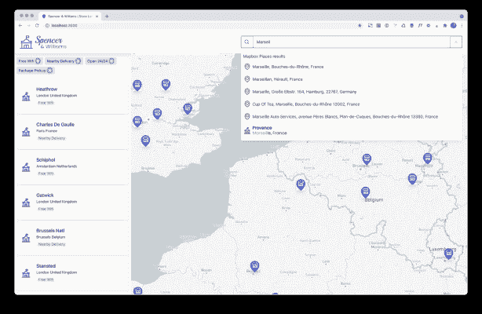

而且它似乎正在工作！万岁！

### 将点击的信息传递给我们的即时搜索实例

既然用户可以在 Autocomplete 下拉列表中选择一个结果，我们希望将信息传递给 InstantSearch 实例，这样我们就可以:

*   显示所选商店位置及其详细信息
*   使用所选位置的纬度和经度运行 Algolia 地理搜索，检索并显示离该位置最近的商店

因为我们将使用地理位置坐标，这个方法对两个插件都有效。

### **创建存储当前坐标的位置**

为了在自动完成中存储所选的地点/商店，让我们创建一个状态变量来存储这些数据，我们称之为`currentStoreCoordinates`

```
const [currentStoreCoordinates, setCurrentStoreCoordinates] = useState< [number, number] | null >(null);

```

#### **创建处理程序**

接下来，让我们创建一个方法，它根据我们单击的元素更新这个存储。从`createSuggestionsPlugin`返回的条目将有一个带有 `lat` 和 `lng` 键的`_geoloc`对象，它们本身来自存储在 Algolia 索引中的记录。

由`createMapboxGeocodingPlugin`返回的项目将有一个几何对象，带有一个  坐标  数组。

首先，让我们创建一个方法来处理对建议的点击:

```
const handleClickOnSuggestion = (hit: Hit) => {
  const { lat, lng } = hit._geoloc;
  const coordinates: [number, number] = [lng, lat];
  setCurrentStoreCoordinates(coordinates);
  setCurrentStoreName(hit.name)
  setIsOpen(true)
};

```

将它作为`onClick`处理程序添加到`querySuggestionPlugin`实例中。

现在，让我们更新地图框插件的`onClick`处理程序:

```
(item) => setCurrentStoreCoordinates([item.geometry.coordinates[0], item.geometry.coordinates[1]])

```

#### **将纬度和经度传递给即时搜索和我们的组件**

在第 2 部分，我们配置了我们的`<InstantSearch/>`包装器:

```
<Configure aroundLatLngViaIP={true} />

```

现在，我们将利用`aroundLatLng`属性来触发基于纬度和经度参数的地理搜索。

```
&lft;Configure
    aroundLatLngViaIP={!currentStoreCoordinates?.length}
    aroundLatLng={!!currentStoreCoordinates?.length ? '' : currentStoreCoordinates?.join(',')} />

```

这一次，我们将 `aroundLatLngViaIP` 设置为真或假，这取决于 ``currentStoreCoordinates`` 的状态。如果`currentStoreCoordinates`为空，我们将 `aroundLatLngViaIP` 设置为 true 并基于用户的 IP 地址执行地理搜索，否则我们将坐标作为字符串传递给 `aroundLatLng` 以使用这些坐标执行地理搜索！仅此而已！

现在，让我们将 `currentStore={currentStoreCoordinates}` 添加到我们的`StoreComponent`中，并添加到地图中以突出显示所选的商店。

至此，我们已经完成了自动完成部分！我们现在有一个全功能的商店定位器，它允许用户找到商店:

*   他们当前的位置附近，由于他们的 IP 地址和从页面加载
*   基于当前的`viewport`，每次地图移动或放大或缩小时都会更新
*   通过自动完成功能使用关键字搜索，根据商店名称或城市名称搜索商店
*   通过自动完成功能使用关键字搜索，搜索一个地点名称并查找附近的所有商店

## [](#adding-the-twilio-sms-experience)添加 Twilio 短信体验

### 什么是 Twilio？

Twilio 是领先的 CPaaS(通信平台即服务)公司，由 Jeff Lawson 于 2008 年在旧金山创立。像 Deliveroo、优步、亚马逊 GetAround 这样的公司都是客户，所以你很可能在不知情的情况下使用了 Twilio 的服务。

他们为许多通信渠道提供服务，从短信、语音通话和推送通知，一直到完全可配置的企业呼叫中心。他们还通过收购 SendGrid 和 Segment 扩展到电子邮件和客户分析领域。

在这个项目中，我们将使用 SMS，原因有三:

*   BOPIS 功能(在线购买，店内提货)通过短信接收店铺位置
*   缺货通知，因此只要产品有货，您就会收到一条短信
*   营销通知

### 创建您的帐户

让我们创建自己的账户，并获取账户 SID 和认证令牌。


到[Twilio.com](https://www.twilio.com/)点击[报名](https://www.twilio.com/try-twilio)。输入创建免费 Twilio 帐户所需的信息。

一旦你登录，你将登陆“控制台”，在那里你会找到两条关键信息:你的 Twilio 账户 SID 和 Auth Token。

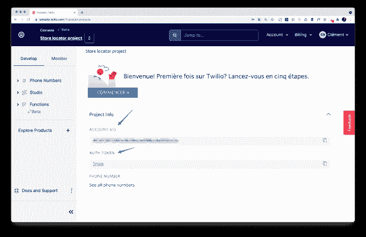

我们将使用他们的无服务器功能( **功能** )，而不是我们自己的后端。如果有一天你需要从你的服务器发送 API 请求到 Twilio，你知道在哪里可以找到它！

### 获得您的第一个电话号码并创建您的第一个短信请求

要发送短信(尤其是在美国和加拿大)，您需要购买一个专用电话号码，对于其他国家，您可以在 Twilio 网站上查看 [Twilio 的监管指南](https://www.twilio.com/guidelines/regulatory)

如果您想在法国发送手机短信，可以跳过这一步，因为购买一个法国电话号码很麻烦。这不是 Twilio 的错，而是 ARCEP *(* *)规则的后果。* 你可以去“创建你的第一个短信服务”。对于法国，我们将使用阿尔法发送器。，它将您的品牌标识为发送者—这是法国法律的要求。

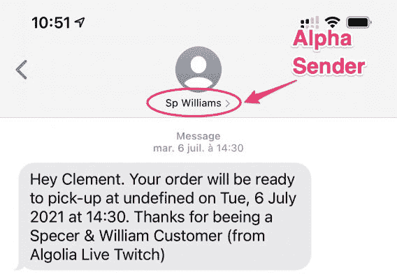

如需购买电话号码，请前往左侧栏，进入 **电话号码>管理>购买电话号码**

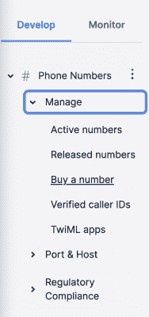

接下来，选择您想要购买电话号码的国家，然后点击购买。

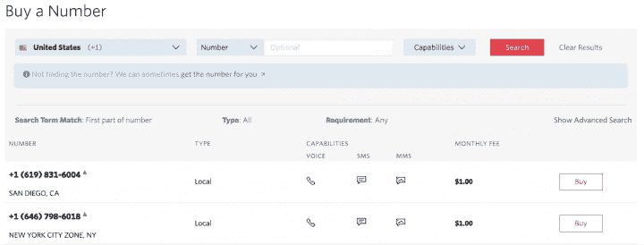

确认后，您现在自豪地拥有了一个新的电话号码！

### 创建您的第一个信息服务

设置新的电话号码(如果您在法国，则为 Alpha 发送者)后，在搜索栏中输入“信息服务”，然后输入“信息服务”(您可以体验另一种自动完成功能)。

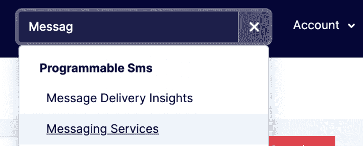

*   从建议列表中选择 **创建消息服务**
*   将您的新消息服务命名为，例如， **存储定位器** 并选择 **通知我的用户 。**
*   接下来，点击 **添加发件人** ，然后点击 **阿尔法发件人** ，输入您的企业名称。
*   如果您购买了电话号码，您可以从列表中选择您的电话号码。

最后，您的消息服务应该类似于下面的截图

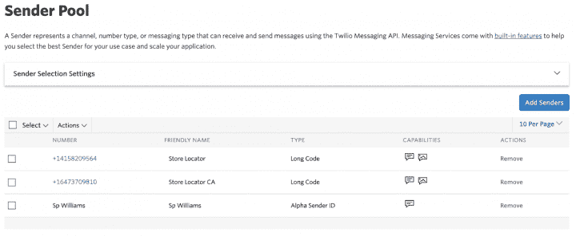

现在，进入 **属性** ，复制你的消息服务 SID。

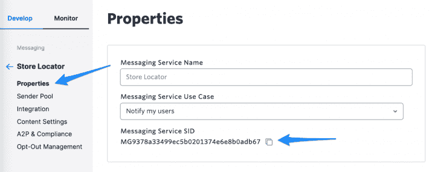

### 创建发送短信的功能

使用消息 SID，导航到功能(您可以搜索它或在 **浏览产品 >开发人员工具>功能** ) 下找到它)。

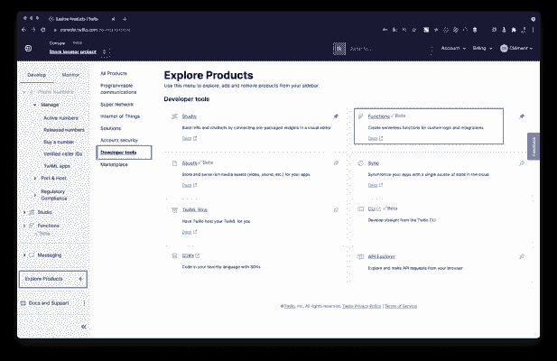

再次创建一个服务，给它命名，点击 **下一个** 。浏览器中将打开一个 IDE。

点击 **+添加 >** **新建功能** 创建一个新功能，命名为“下单”。将的可见性设置为“public ”,因为我们需要在 Twilio 之外调用它。

现在，转到 **依赖项** 并添加 `date-fns` 包来处理日期。


在模块字段中，键入 `date-fns` ，然后单击添加。

现在，让我们添加负责发送消息的代码:

```
// Let's require date-fns functions, we'll use them to manipulate dates.
const parse = require('date-fns/parse');
const format = require('date-fns/format');
exports.handler = async function(context, event, callback) {

  // Let's fix CORS, this is required because we are calling this function from outside the twil.io domain
  const response = new Twilio.Response();
  response.appendHeader('Access-Control-Allow-Origin', 'https://localhost:3000'); // Change this by you domain
  response.appendHeader('Access-Control-Allow-Methods', 'GET, OPTIONS, PUT, POST, DELETE');
  response.appendHeader('Access-Control-Allow-Headers', 'Content-Type');

  // Now we're grabbing data from the request payload
  const {
    store,
    customer,
    time,
    phoneNumber
  } = event;

  // We're using format to display a nice date in the SMS
  const formattedDate = format(parse(time, 'dd-MM-yyyy::HH:mm', new Date()), "eee, d LLLL yyyy 'at' kk:mm");

  // Let's write the message
  const message = `Hey ${customer}. Your order will be ready to pick-up at ${store} on ${formattedDate}. Thanks for beeing a Spencer & William Customer`;

  // Time to hit the send button !
  const client = context.getTwilioClient();
  await client.messages.create({
    body: message,
    messagingServiceSid: 'MG9378a33499ec5b0201374e6e8b0adb67',
    to: phoneNumber
  })

  // Don't forget the callback otherwise you'd raise an error as the function will keep running
  return callback(null, response)

};

```

仅此而已！点击 **保存****部署所有** ，大概需要 2 分钟左右，你的函数名旁边会出现一个绿色的复选标记。现在可以从外部使用我们的 Twilio 凭证调用 Twilio API 来使用这个函数。

注意:y 你可以使用一个 API explorer 来测试它，比如 Postman 或者 Paw.cloud(在 macOS 上)

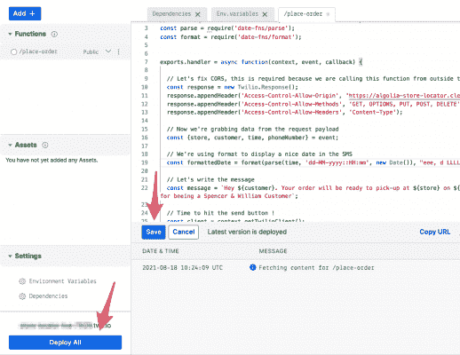

### 从你的代码中调用下单函数

您将在组件/ 目录中找到表单组件。当您从列表或地图上选择商店时，它会出现在屏幕上。

它有三个字段:客户名称、提货日期和电话号码。现在，我们需要在单击“Place Order”按钮时执行请求。

我们将使用 axios 来执行请求，但您也可以使用自己喜欢的库。

```
yarn add axios

```

让我们填充 `sendRequest()` 方法:

```
async sendRequest() {

  const {
    customer,
    time,
    phoneNumber,
    phoneCountry
  } = this.state
  const {
    store
  } = this.props

  this.setState({
    isLoading: true
  });
  await axios.post(process.env.REACT_APP_TWILIO_FUNCTION_URL as string, {
    store,
    customer,
    time,
    phoneNumber: parsePhoneNumber(phoneNumber, phoneCountry).number
  });
  this.setState({
    isLoading: false
  });
}

```

仅此而已，你的应用程序现在将向你的客户发送短信。这是我们为这个应用程序编写的最后几行代码，现在是时候将它部署到智能云上了！

## 在智能云上部署您的应用

最后一步，我们将把商店定位器部署到 [智能云](%22https://www.clever-cloud.com/en) 托管平台，这样你就可以向你的朋友和同事展示你新开发的应用。

转到您的智能云仪表盘，点击 **+创建 / 一个应用**

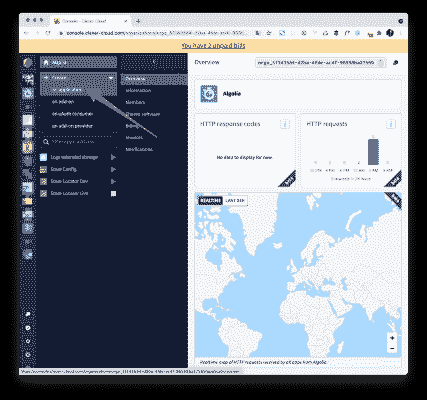

选择 **创建新应用 :**

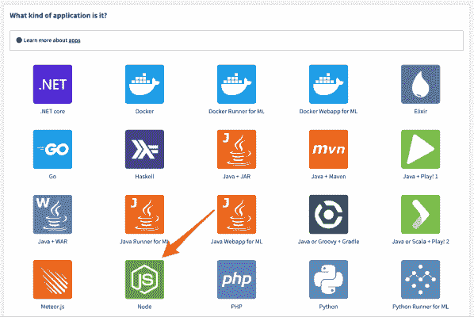

选择应用类型: **节点** 。点击 **继续下一步**

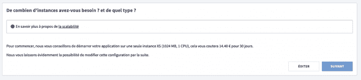

为您的应用命名，并选择您的数据中心。

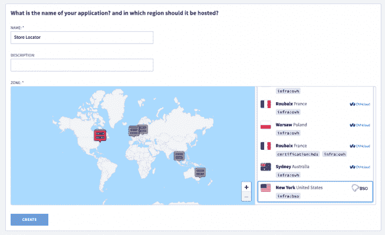

最后，选择 **配置提供者** 。这将替换我们的 .local.env 文件，并在构建时在我们的应用程序中注入变量。然后点击 **下一个** 并给你的配置提供者起一个名字。

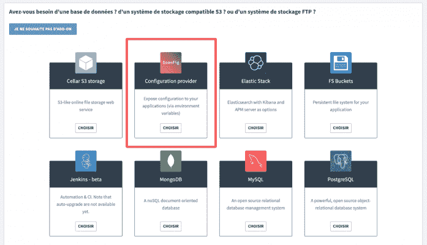

在下一个屏幕上，点击 **专家** 并复制/粘贴您的`.local.env`文件。

将这两行添加到环境变量中，以使用 yarn 并在安装完依赖项后构建项目:

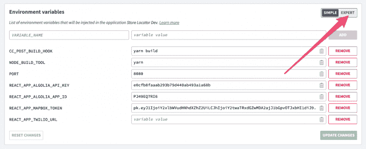

```
CC_POST_BUILD_HOOK="yarn build"
NODE_BUILD_TOOL="yarn"

```

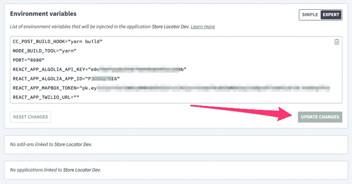

点击绿色按钮两次，点击左侧菜单中的节点机。按照屏幕上方的步骤，将 Clever 的 git URL 添加到您的项目中，并推送它！使用 *“域名”下的网址，3 到 4 分钟后就可以使用了。*

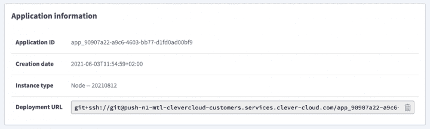

## 包装

总结一下我们本周的成就:

*   我们增加了一个自动完成下拉菜单，补充了现有的应用程序体验，允许用户按名称或位置名称搜索商店，这样他们就可以找到该位置附近最近的商店。
*   我们增加了 Twilio 支持，可以向客户发送短信。
*   我们已经在智能云上部署了我们的应用。🎊

这就是我们关于使用 Algolia、Mapbox 和 Twilio 构建商店定位器的系列报道。但是你还可以添加更多的功能:

*   利用商店定位器提供 BOPIS 特色
*   使用 Twilio SendGrid 发送电子邮件而不是短信
*   使用 Twilio 段跟踪和更新点击次数最多的商店
*   使用 Stripe APIs 添加支付选项

我希望你喜欢这个系列！套用一位我非常钦佩的首席执行官兼开发人员的话:我迫不及待地想看看你会开发什么。