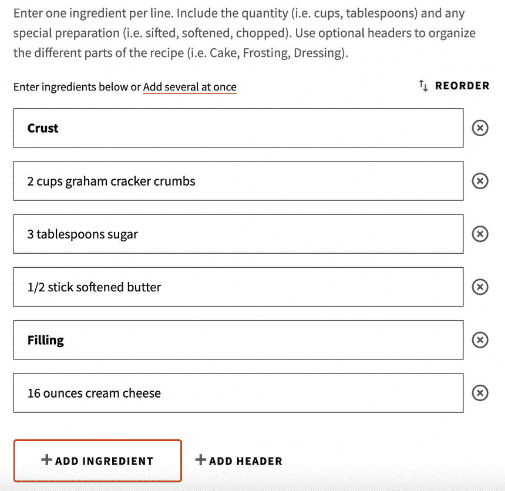

# 为所有人建立一个开源索引

> 原文：<https://www.algolia.com/blog/engineering/building-an-open-source-index-for-all/>

在阿尔戈利亚，我们本质上是一群业余爱好者。我们不仅仅是为财富 500 强建造，我们也是为修补者建造。这就是为什么我们在 DocSearch 这样的工具上投入了如此多的精力——我们喜欢任何在像 [Astro](https://docs.astro.build/en/getting-started/) 、[家庭助手](https://www.home-assistant.io/docs/)和 [SASS](https://sass-lang.com/documentation/) 这样的工具背后有回报、开源软件思维的人，就像 [React](https://reactjs.org/docs/getting-started.html) 、 [Twilio](https://www.twilio.com/docs) 和 [Discord](https://discord.com/developers/docs/intro) 一样。

我们一直在酝酿一个想法，特别是关于回馈发现驱动的开发人员，他们从 Algolia 开始就一直在试验:开放索引。互联网上已经存在许多开放数据集，但它们的质量并不为人所知。即使是高质量的也不总是我们需要的形式，而且没有什么激励让制作者来帮助我们，因为他们通常不会因为维护他们的数据集而得到报酬。这似乎是我们在 Algolia 要解决的完美问题，所以我们中的一些人一直在努力设计我们的第一个开放式指数。让我们在本文中浏览一下这个过程；它是相当概念性的，所以对于那些自己艰难地完成偶尔复杂的[索引创建](https://www.algolia.com/doc/guides/sending-and-managing-data/prepare-your-data/)过程的人来说，它仍然是一个有用的指南。

不过，在我们开始之前，我们需要谈一谈可组合性。

## 可组合性——小事情的大词

可组合性是一个系统的各个部分在独立和不同组合中有用程度的主观度量。

以一首歌为例，制作人不仅要考虑歌手是否唱得好，吉他是否走调，或者鼓手是否合拍，还要考虑这些曲目配合得如何。在歌曲的不同点，这些曲目的不同组合将同时播放，因此它们需要独立工作，并在不同的环境中工作。我们的指数也是如此。

当您为公司创建一个应用程序时，不太可能只有一个应用程序一次性使用给定记录的所有数据—大型应用程序通常会为不同的页面和视图请求数十种不同的数据组合。但对于我们的索引来说，这种影响更加突出:我们不知道哪些数据将被谁使用，所以我们需要确保所有这些数据都是高质量的，彼此独立，但也可以很容易地组合成高质量的超级结构，就像音乐制作人希望每张唱片独立工作，同时也能在任何配置下整齐地融入整个轨道一样。

让我们试着做一个食谱，特别是厨师约翰在 Allrecipes 上提供的这道看起来很美味的[希腊柠檬鸡肉和土豆食谱。让我们看看是否可以从 Allrecipes 的食谱模型开始，然后将其改进为更加具体和可组合的。就目前的情况来看，配方模型似乎具有这样的结构:](https://www.allrecipes.com/recipe/242352/greek-lemon-chicken-and-potatoes/)

*   `title`(字符串)
*   `description`(字符串)
*   `times`(物体阵列)
    *   `name`(一对预定义选项的字符串)
    *   `number`(数字)
    *   `unit`(一对预定义选项的字符串)
*   `ingredients`(对象数组)
    *   `amount`(数字)
    *   `unit`(一对预定义选项的字符串)
    *   `ingredient_name`(字符串)
    *   `is_header`(布尔型)
*   `directions`(对象数组)
    *   `step_content`(字符串)
    *   `is_header`(布尔型)
*   `notes`(对象数组)
    *   `title`(字符串)
    *   `note`(字符串)
*   `servings`(数字)
*   `yield`(字符串)
*   `public`(布尔型)
*   `media`(字符串数组，验证为 URL)
*   `author`(字符串)

这已经是相当全面了！他们可以用它做很多事情，比如计算完成一份食谱需要的总时间，营养信息，以及不同份量的配料量。不过，我们可能会提出一些建议:

1.  Allrecipes 使用配料行在列表中的配料之间创建一种标题。我们选择的食谱没有使用这个功能(*它看起来不像许多人做的*，但是你可以设想这样一种情况，你在指导读者如何先制作两个独立的项目，然后再将它们组合起来(*像馅饼或芝士蛋糕的外皮和馅料*)。这绝对是一个有用的特性，更多的食谱作者应该利用它，但是没有在食谱的结构中将其形式化，而是选择使用配料行作为“标题”，只是在视觉上而不是从根本上区分配料组，这感觉有点奇怪。我可能会建议创建一个名为`ingredient_groups`的高级数组，其中至少包含一个带有`title`(即标题文本)的对象和一个名为`ingredients`的数组。只有当需要描述多个组时，才会显示该标题，并且该内部数组将包含该标题下特定部分的所有成分。然后我们可以去掉那个讨厌的`is_header`布尔值，否则他们需要将部分标题渲染得与其他成分不同。同样的变化也适用于说明书，说明书同样使用标题线来划分章节。
2.  说到配料，Allrecipes 实际上并不要求提交者将配料分成数量、单位和项目名称——他们只是要求你输入一个简单的字符串，就像这样:我怀疑他们在内部将它存储为三部分，因为他们用数字和单位进行数学计算(你可以让它将 4 份食谱转换为 3 份，这通常需要改变单位)。所以这已经是可组合的了，但是我们可以做得更好。如果我们分别要求所有这三个组件，我们可以用它做一些有趣的事情。例如，我们可以有一个可接受成分的列表(如果他们的成分在我们的数据库中不存在，用户可以添加)，让用户选择成分，而不是以字符串的形式输入。在生产环境中，我们的数据库中会有这些成分，这里只通过 UUID 引用。每种配料都将在它们自己的数据库记录中存储几个表单选项——例如，我将“黄油”称为一种配料，而“冷冻的”、“软化的”、“融化的”、“切片的”和“切块的”作为一种“黄油”配料的可选表单。配料也可以有其偏好的单位类别(面粉应该总是按重量或干体积来测量，但决不能按长度来测量)，这可以可选地是定制的(像“黄油棒”)或者甚至是空的(你不需要一个特殊的“土豆”单位)。然后，这个特定配方中的配料表单将存储在我们的配方索引中的配料对象中，旁边是一个与这个特定配料的可用单位相匹配的单位字符串和一个经过验证的配料数值。我们可能会在将来完全发布这个系统(如果你在数据库或 CMS 公司，你知道在哪里可以找到我们),但是现在，我们只是将这些信息放在一个 JSON 对象中，这个对象表示索引中食谱中使用的所有配料。现在对我们来说，这将是更多的手工工作，但是每个使用索引的人都不必担心启动他们自己的数据库实例。

这是我们新的`recipes`指数形状:

*   `title`(字符串)
*   `description`(字符串)
*   `times`(对象数组)
    *   `name`(一对预定义选项的字符串)
    *   `number`(数字)
    *   `unit`(一对预定义选项的字符串)
*   `ingredient_groups`(对象数组)
    *   `title`(字符串)
    *   `ingredients`(对象数组)
        *   `ingredient` (UUID，匹配`ingredients` JSON 中的一种成分)
        *   `forms`(字符串数组，匹配成分的`forms`)
        *   `amount`(数量)
        *   `unit`(字符串，匹配该成分的`unit_categories`之一)
*   `direction_groups`(对象数组)
    *   `title`(字符串)
    *   `directions`(字符串数组)
*   `notes`(对象数组)
    *   `title`(字符串)
    *   `note`(字符串)
*   `servings`(数字)
*   `yield`(字符串)
*   `public`(布尔型)
*   `media`(字符串数组，验证为 URL)
*   `author`(字符串)

然后是我们的新成分 JSON ，其中每个记录都与这个形状匹配:

*   `uuid` (UUID)
*   `name`(字符串)
*   `plural_name`(字符串)
*   `unit_categories`(字符串数组)
*   `custom_unit`(字符串数组，除非`unit_category`包含“自定义”，否则不存在)
*   `forms`(字符串数组)

单元列表是一个足够合理的对象，也可以作为 JSON 保存在内存中，所以[这里有一个小的实用 JavaScript 程序来跟踪这些单元并在它们之间轻松转换](https://github.com/jadenguitarman/cooking-units/blob/main/units.js)，它是由我的同事 Jaden 编写的。

[这是我们要上传到 Algolia](https://github.com/jadenguitarman/cooking-units/blob/main/recipes.json) 的食谱 JSON。为了获得最佳结果，你通常会希望只存储你将在 Algolia 中搜索的内容，然后将其余内容存储在一个快速数据库中，如 [Fauna](https://fauna.com) ，但是因为这是一个测试数据集，我们将所有内容都进行了搜索，这就是为什么 JSON 对于一个食谱来说如此之大。如果你想把你的个人食谱添加到这个数据集中，我们很乐意把它们包括进来！只需在这里为每个食谱填写谷歌表单，我们会筛选并手动添加最好的。

您一直在等待的部分:由于这个索引是开放的并且在不断增长，所以在加载生产就绪数据之前，对您来说试验 Algolia 和测试您自己的集成将是非常有用的！如果你想试一试，以下是凭证:

> *只读公钥:*ea 2f 27 cfed 9 ddeed 93 f 7532424 a 64480
> 
> *申请 ID:* OKF83BFQS4
> 
> *索引名称:*食谱

我们很高兴看到你用什么来填充这个数据集(同样， [Google 表单在这里](https://forms.gle/5NpnCs963qw3JN2x9)可用)！我们将利用我们团队中数百名 Algolia 开发者的配方来改进它。如果你对数据集本身做了一些有趣的事情，一定要在 [Twitter](https://twitter.com/algolia) 上给我们喊一声！