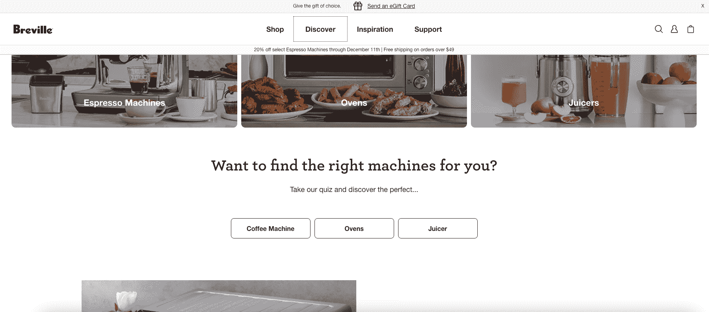
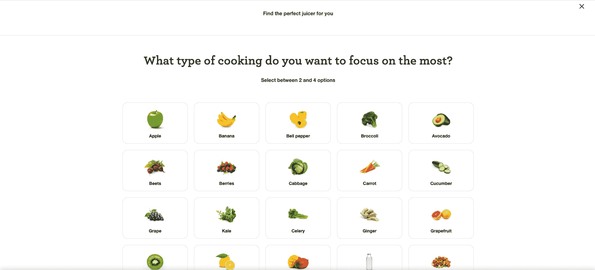
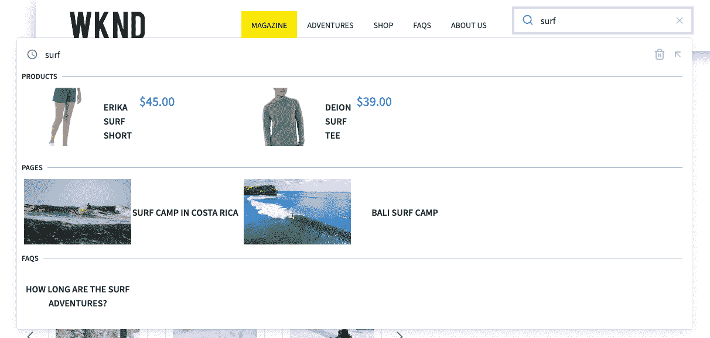
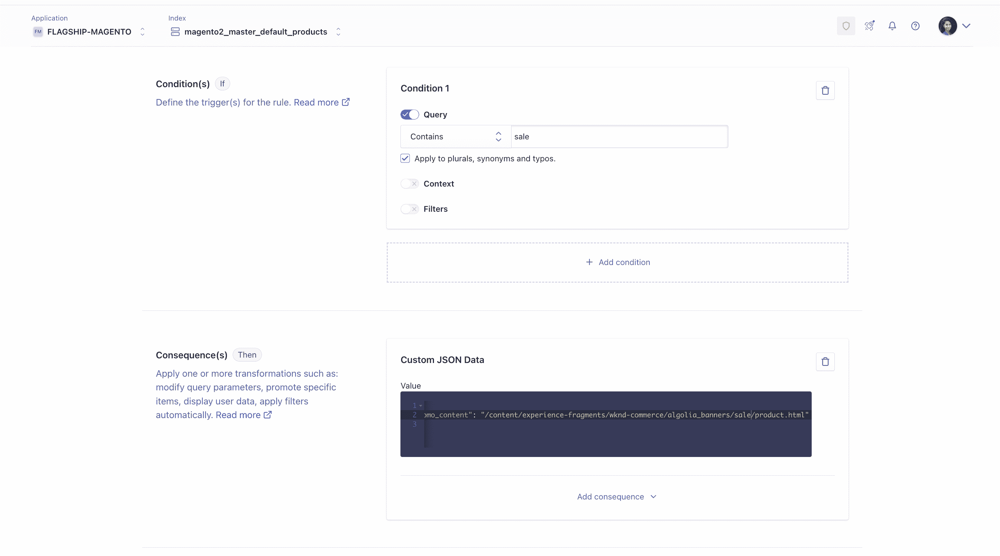
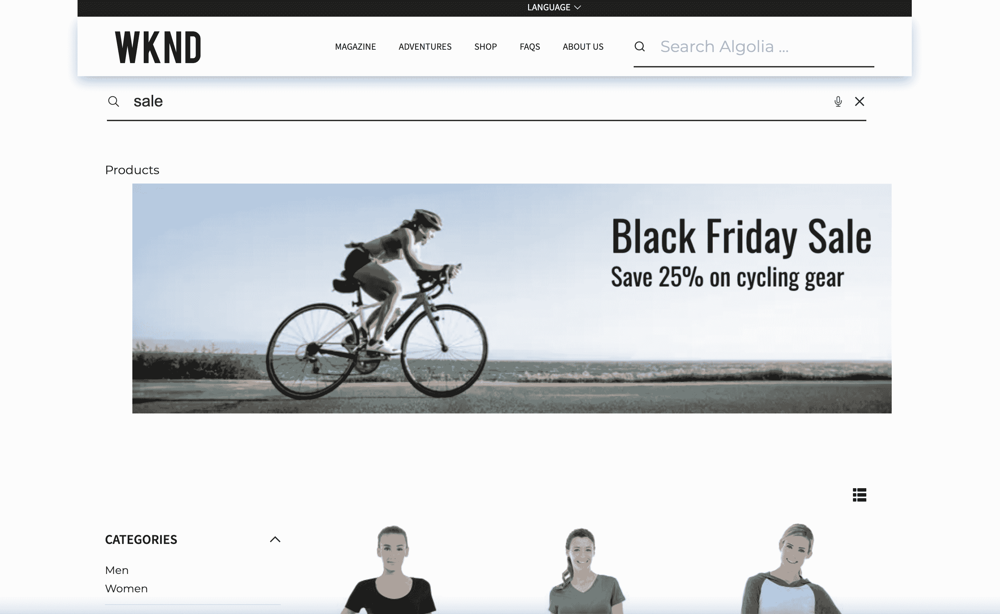
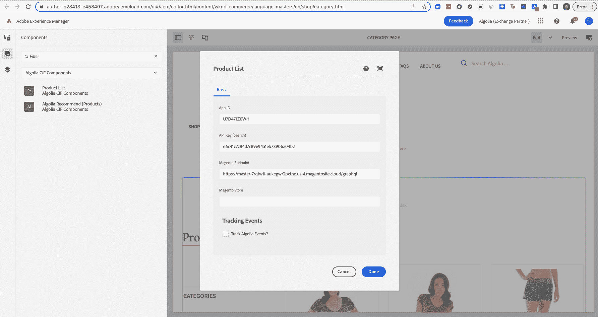
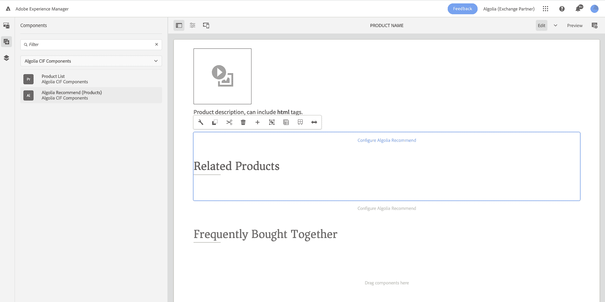
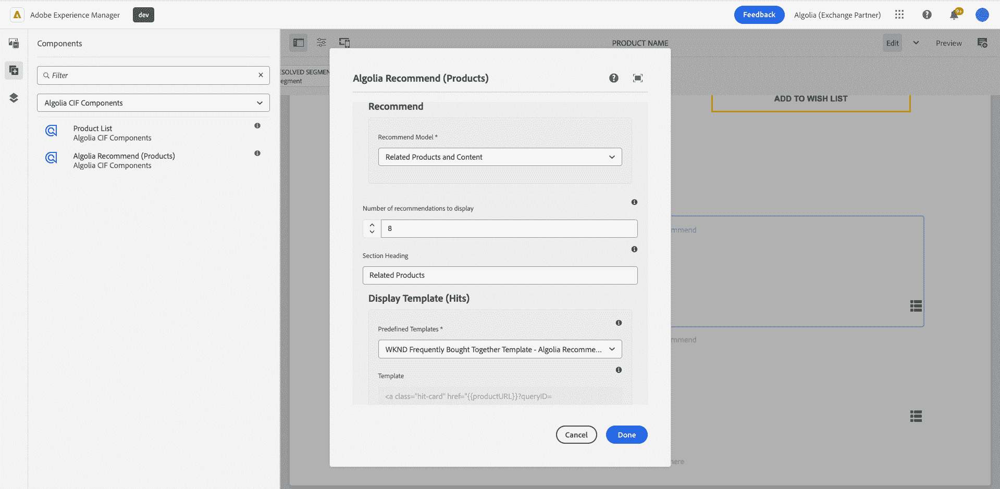

# 构建身临其境的购物体验:通过 Adobe Experience Manager 和任何商务平台使用 Algolia 搜索

> 原文：<https://www.algolia.com/blog/ecommerce/building-immersive-shopping-experiences-with-algolia-aem-commerce/>

将 Algolia 添加到 AEM 商务体验中，使零售商能够充分利用他们的内容，丰富购买体验，并在向购物者展示产品时更加个性化，从而为他们的在线商店带来更高的转化率和收入。

在这篇博客中，我们将讨论为什么搜索和发现对购物体验如此重要，以及如何以最快的速度实现这一点。

### 打造沉浸式购物体验

最好的在线零售商努力创造身临其境的购物体验使用内容和丰富的资产来补充他们试图销售的产品。我们所说的身临其境是什么意思？

*   漂亮的登陆页面
*   引导顾客在购买过程中导航
*   向顾客介绍产品的信息
*   具有动态方面的联合随键入搜索结果
*   个性化推荐
*   动态横幅&情境化促销
*   通过对话获得更多关于购物者意向的信息

许多领先的零售商选择使用像 Adobe Experience Manager 这样的 CMS 作为前端来创建这些身临其境的体验。通过 AEM，零售商可以构建网站，管理他们的全球网站，并引入资产来丰富商业体验。

布雷维尔是一个很好的在线零售商的例子，它将内容和产品结合起来，创造了身临其境的体验。作为体验的一部分，他们对搜索和发现进行了深思熟虑，甚至通过互动问答创造了引导销售体验，帮助购物者更好地了解他们的偏好，并发现他们最有可能喜欢的布雷维尔产品。

访问他们的引导体验 [这里](https://www.breville.com/us/en/home/index.html) 亲自去看看，说不定还能找到你的完美咖啡机☕️或榨汁机🍎！

Breville’s eCommerce site

Breville quiz to find the perfect juicer

### 

### Algolia、Adobe Experience Manager 和 CIF

**搜索和发现是创建沉浸式电子商务体验的关键部分** ，这就是 Algolia 和 Adobe 合作在 Adobe Experience Manager 上提供搜索的原因。Algolia 的搜索引擎允许零售商在他们的网站上提供闪电般的快速搜索。出版商获得了工具，可以根据相关性、业务指标和机器学习模型的洞察力来控制内容&产品。通过 Algolia A/B 测试，他们可以进行实验并衡量改进，以了解更好的搜索能力如何影响他们的底线。最终，Algolia 将科学与艺术相结合，帮助在 AEM 上创造更多引人入胜的体验。

Adobe Experience Manager 提供了一个商业集成框架，称为 [**商业集成框架**](https://experienceleague.adobe.com/docs/experience-manager-cloud-service/content/content-and-commerce/integrations/third-party.html?lang=en) **(CIF)** 以加速 AEM 上店面的开发。通过安装和配置 CIF，作者可以轻松地将产品和类别数据从 Adobe Commerce 或任何第三方电子商务平台引入 AEM，并构建核心的前端商店体验。Algolia 更进一步，提供了一种在零售商的电子商务数据和 AEM 的丰富内容中构建搜索和发现体验的方式。

Algolia 提供跨商业和内容联盟的 AEM 组件，包括:

*   带自动完成功能的全局搜索
*   联合搜索&使用即时搜索浏览
*   内容推荐
*   产品推荐(可利用 CIF 引用产品 id)
*   类别页面(可以利用 CIF 引用类别 id)

AEM’s WKND demo with Algolia search

### 

### **如何入门**

强大的搜索和发现改变了游戏规则，零售商希望尽快启动并运行它，这样他们就可以开始试验、迭代和衡量结果。在这里，我们分享在 Adobe Experience Manager 中将搜索添加到电子商务体验中的 4 个步骤——以最快的方式实现价值。

**1。索引网站上应该可以发现的所有产品和内容**

零售商可能会选择一些不同的来源，包括 PIM、电子商务引擎、他们的常见问题服务平台以及他们管理内容的 CMS。Algolia 提供了许多 API 客户端来索引和保持信息与这些系统的同步。对于少数热门平台如[Adobe Commerce](https://marketplace.magento.com/algolia-algoliasearch-magento-2.html)[Adobe Experience Manager](https://www.algolia.com/blog/product/ingesting-data-from-adobe-experience-manager-aem-for-search-discovery/)[sales force Commerce Cloud](https://www.algolia.com/search-solutions/salesforce-commerce-cloud/)[Commerce tools](https://www.algolia.com/developers/code-exchange/backend-tools/integrate-commercetools-with-algolia/)[Shopify](https://www.algolia.com/search-solutions/shopify/)我们

**2。使用元数据、业务排名标准和 AI** **配置搜索和发现**

 **配置逻辑发生在 Algolia 仪表板中的 **智能地对类别页面、搜索结果进行排名，并提供正确的推荐** 。许多用户会在仪表板中运行实验和 A/B 测试，以查看哪些杠杆可以带来最高的转化率。最终，这里的目标是匹配购物者的意图，并通过更好的搜索和发现来增加收入。

在这里，零售商可以管理如下内容:

*   相关性调谐
*   自定义排名
*   动态重新排名
*   个性化
*   商品销售
*   查询规则
*   同义词
*   A/B 测试
*   分析学
*   还有更多……

例如，零售商可以添加一个横幅，每当购物者搜索“销售”一词时就会出现。他们会在 Algolia 创建一个“如果这个，那么那个”规则，并绘制一个横幅。该横幅可以在 Adobe Experience Manager 中创建为片段，并使用发布 URL 进行引用。

Algolia query rule

Banner powered by Algolia query rule

**3。将 Algolia 添加到前端**

在 Adobe Experience Manager 中构建 UI 可以使用两种方法:(1)使用在 Javascript、React、Vue 等中可用的 Algolia 的 [UI 库](https://www.algolia.com/doc/api-reference/widgets/js/) ，或者(2)使用 Algolia 的 [AEM UI 组件加速器](https://www.algolia.com/blog/product/algolia-powered-search-components-on-adobe-experience-manager/) 。要创建联合搜索，只需将每个索引添加到 Algolia 组件中，使用 Algolia 中定义的索引名称。在全球搜索栏中，零售商可以为产品添加一个索引，为文章添加另一个索引，从而创建丰富的商务+内容体验。

对于使用商务集成框架的用户，我们提供 Algolia CIF 组件选项，可轻松连接到 Adobe Commerce endpoint(或另一个商务引擎)，并根据通过 CIF 定义的类别 id 和产品 id 动态生成类别页面和产品详细信息页面。然后，这些分类页面可以使用 Algolia 中设置的逻辑和人工智能显示所有产品。

AEM author dialogue for Algolia category page

产品详情页面可包含由 Algolia 提供的推荐。与产品详细信息页面一样，这些页面将根据购物者正在查看的产品动态呈现推荐。这些推荐可以从产品索引中提取，甚至可以作为相关内容从另一个索引中共享。

Algolia component for recommended products on PDP

Recommended ‘Related Products’ configuration

**4。跟踪分析和机器学习的结果**

我们的事件可以通过 AEM 组件进行跟踪。通过组件，选择“跟踪 Algolia 事件”框，将出现第二个选项卡来配置“点击”或“转换”事件。另一种选择是通过类似[Adobe Launch](https://www.algolia.com/blog/product/leveraging-adobe-launch-events-in-algolia-for-personalization/)的标签管理器发送 Algolia 事件。跟踪结果将使 Algolia 引擎变得更加智能，了解如何为给定用户个性化结果，提供产品推荐，并根据人群动态地重新排列项目。

Click and conversion events tracking through the Recommend AEM component

这些部分将搜索连接到您的商务平台和内容管理系统，并创建丰富的购物体验，引导购物者，展示最相关的商品，并最终推动更多的转化。

### **想了解更多或了解如何尝试 Algolia？**

请致电[adobe-algolia-solutions@algolia.com](mailto:adobe-algolia-solutions@algolia.com)联系我们，获取我们的 AEM 加速器以及如何开始将 Algolia 构建到您的 AEM 解决方案和商务集成框架中的指导！我们很高兴与您讨论最佳实践、权衡，并了解什么最适合您！

查看我们“Adobe x Algolia 集成”系列的其余部分，包括我们的最后一部分:[Adobe Experience Manager 上的 Algolia Powered 搜索组件](https://www.algolia.com/blog/product/algolia-powered-search-components-on-adobe-experience-manager/) 。**