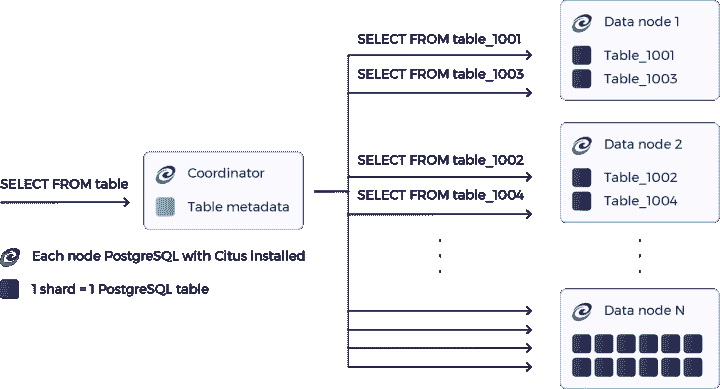
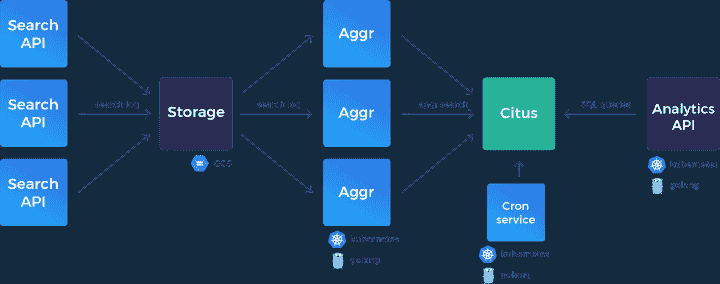

# 大规模构建实时分析 API

> 原文：<https://www.algolia.com/blog/engineering/building-real-time-analytics-apis/>

我们最近重新设计了我们的分析 API，以便为我们的客户提供每天数十亿次搜索查询的近实时分析。我们是这样做的。

## [](#redsigning-our-analytics-system-from-the-ground-up)我们的分析系统从一开始就是红色的

我们的第一个分析系统是从一个小项目开始的。它由一批批压缩日志文件组成，这些文件从我们所有的搜索服务器发送到一个中央存储服务，然后被推送到一个 Elasticsearch 集群，我们从那里提供分析查询。

自然，这个系统有其局限性。首先，我们需要为新的点击分析功能铺平道路，我们希望利用一个更加关系化的模型。在 Elasticsearch 中，文档是独立的，这样做太麻烦了。

其次，由于要跨许多节点处理数百亿条记录，管理这样的集群变成了一项全职工作。

我们的搜索分析为我们的客户提供了关于他们的搜索如何被使用的见解。这些见解很容易变大。从搜索数量或独立用户数量等概述，到诸如“用户最感兴趣的类别是什么？”等可操作的业务洞察，不一而足或者“哪些查询没有返回结果？”。所有这些都可以在特定的时间范围内完成，在某些情况下，时间范围可能非常大。

以下是我们在从头开始重建我们的分析时所做的技术选择的解释，以及我们使用的一些设计原则的概述。

## [](#choosing-the-datastore-for-analytics)选择用于分析的数据存储

我们需要满足的最高要求是:

*   每天处理数十亿个事件的接收、存储和删除。
*   对于大多数查询，无论请求的时间范围如何，都可以在几秒钟内返回结果。
*   与我们一起扩展。我们的规模每年都在翻倍，因此所选的解决方案应该能够轻松地跟上这种增长。理想的情况是增加更多的机器。

我们首先评估了像[红移](https://aws.amazon.com/redshift/)、[大查询](https://cloud.google.com/bigquery/)和[点击之家](https://clickhouse.yandex/)这样的强国。虽然它们对于数据仓库来说肯定是很好的选择，但是我们发现它们对于实时分析工作流来说还不够好。

在我们的例子中，重点是执行亚秒级分析查询，而不是长时间运行的分析。

然而，在非常大的数据集上实现亚秒级的聚合性能对于红移来说是极其昂贵的，对于 BigQuery 来说是不可能的。

此外，我们发现 BigQuery 的另一个问题是定价取决于使用情况，而不是存储。因此，我们不认为支持公共 API 是一个安全的选择。

对于 ClickHouse，我们很想尝试一下，但最终发现托管、维护和微调它需要大量额外的工程开销。

最后，我们的搜索将我们带到了 [Citus Data](https://www.citusdata.com/) 及其针对 PostgreSQL 的 Citus 扩展，这使得通过跨多个节点分布表和查询来无缝扩展 Postgres 成为可能。

Citus Data 还提供了几个扩展[非常适合实时分析，如](https://www.citusdata.com/blog/2017/12/27/real-time-analytics-dashboards-with-citus/) [HLL](https://www.citusdata.com/blog/2017/04/04/distributed_count_distinct_with_postgresql/) (HyperLogLog)和 [TopN](https://www.citusdata.com/blog/2018/03/27/topn-for-your-postgres-database/) 。前者是一种快速近似非重复计数的算法，后者的作用类似于一个堆，它允许在 JSONB 字段中按照频率对顶部的项目进行排序。

如果我们选择这个解决方案，我们可以将客户的数据分布在许多节点上，利用搭配，并预先计算指标。额外的好处是，我们仍然可以从运行最新 Postgres 实例的关系数据库中获益。



做出数据存储决策后，下面是我们分析解决方案的其余部分在实践中的工作方式。

## [](#creating-near-real-time-analytics)创造近乎实时的分析

然而，实现亚秒级分析查询并不是现成的。我们通过跨分片分布数据和使用汇总方法来实现这一点。

为此，我们必须执行以下步骤:

*   将原始事件纳入系统。
*   定期将事件汇总到专用汇总表中。
*   查询汇总表并以毫秒为单位获得结果。

### [](#ingestion)摄取

我们利用 Postgres [COPY](https://www.postgresql.org/docs/10/static/sql-copy.html) 命令将批处理事件插入 Citus。正如我们将在下面看到的，我们从不直接查询原始数据，所以这些表可以保持非常简单的模式。

由于没有大量的索引需要更新，插入操作的性能相当可观。Citus [宣称每秒钟可以接收 700 万行数据](https://www.citusdata.com/blog/2016/06/15/copy-postgresql-distributed-tables)(也就是每天 600 亿行！)和我们自己的基准测试显示了类似的趋势。

我们按客户分发我们的数据。单个客户的数据存储在同一个碎片上，因此我们可以利用搭配优势。以单个客户应用为目标的请求将只需要以单个 Postgres 实例为目标。

### [](#rollup)汇总

我们不提供来自原始事件的指标。在某些情况下，如果您希望获得亚秒级的响应时间，即使是单个客户的数据集也会变得太大而无法即时处理。

[根据经验法则](https://www.citusdata.com/blog/2017/09/29/what-performance-can-you-expect-from-postgres/)，使用 PostgreSQL，每个内核每秒可以聚合 100 万行。

我们改用卷式桌子。汇总表保存给定时间范围内预先计算的指标。

正如我们在简介中看到的，我们经常需要返回 tops 和 distinct count。由于上面提到的 TOPN 和 HLL 扩展，这变得很容易。

下面是一个简化的汇总函数，涵盖了几个用例:

此函数将在给定时间范围内收到的所有查询聚合到 5 分钟的桶中，并计算它们的计数，即用户的唯一数量(使用 HLL)，并保留排名靠前的查询及其各自的计数(使用 TOPN)。

该功能将在所有节点上同时执行。

对于我们的分析解决方案，我们有几个级别的汇总。我们每 5 分钟汇总一次事件，并进一步按天汇总。我们这样做有几个原因:

*   这意味着 API 返回的指标会频繁更新。大约每隔 5 分钟，数据就会刷新一次，因此客户不必等待很长时间，他们的查询就会反映在控制面板中。
*   为了进一步压缩我们的数据集，我们保留了每日总量。这意味着在某些时候粒度会降低到一天的级别，但这对我们来说是可以接受的。我们甚至可以考虑在某个时间点之后按月滚动我们的数据集，这将允许我们以更粗的粒度为代价继续提供接近无限的保留。反之亦然，增加中间每小时汇总也是将来的一个选项。
*   因为我们预计算 top，所以我们不能一整天都向它们追加查询。这样做会产生非常不正确的顶部。相反，我们在一天中建立了许多顶部，我们通过 EOD 将它们合并在一起。我们仍然在做 top 中的 top，但是考虑到它们的细粒度和我们一次合并它们的事实，最终，我们只看到了与更详尽(和计算更密集)的方法相比的最小差异。


这种方法的结果是，一旦数据被卷起，我们就可以删除它。我们不需要在 Citus 中保存太字节的原始事件来提供指标，并且由于 Citus 能够跨节点并行删除，删除数据变得很容易。

### [](#analytics-queries)分析查询

API 的目标是汇总表，而不是原始表。如果我们比较原始表和汇总表中的行数，我们会看到平均压缩率从 50，000 到 150 不等(当然，这取决于为聚合选择的维度)。

这就是这种方法如此有效的原因。因为最终我们的指标是每天预先计算的，所以我们很容易理解为什么我们在几乎任何时间范围内都能在毫秒内得到结果:查询时扫描的数据量是微不足道的。

例如，要获得一个给定客户在过去一周的查询计数，快速的索引扫描是获取位于相同实例上的 7 行，后跟一个 sum。

为了获得上个月的前 1000 个搜索，我们获取 30 行，去掉前几个条目，并进一步将它们聚合成最终的前 1000 个。

下面是几个简化的示例查询来演示:

要获取查询计数，请执行以下操作:

因为我们的指标在合并到每日汇总之前首先存在于 5 分钟汇总表中，所以我们查询这两个表并在查询时联合它们的结果。

为了获得不同的用户计数，我们利用了 HLL 类型，它可以计算几个 HLL 字段的交集。

```
SELECT hll_cardinality(sum(user_count))::bigint FROM ... WHERE ...
```

最后但同样重要的是，下面是获取前 10 个查询的方式:

```
SELECT (topn(topn_union_agg(top_queries), 10)).* FROM ... WHERE ...
```

我们所有的分析查询都遵循这种模式，在查询时只执行最少的聚合逻辑。

## [](#the-big-picture)大局

让我们后退一步，看看整个系统:



在实际将查询插入 Citus 之前，我们首先将击键聚合到查询中。我们的大多数客户都实现了即时搜索。使用 InstantSearch，您可以在键入时获得结果。这是一个很好的用户体验，它会为给定的搜索生成许多 API 请求。例如，搜索“Algolia”可能会产生多达 7 个查询(A、Al、Alg…等)。说到分析，我们只想提供关于完整查询的见解(有人搜索过 Algolia 一次)，而不是中间的击键。

为了确保这一点，我们有一个管道来处理我们的日志，将击键序列聚合到搜索中，然后直接推送到 Citus。

我们使用 Go 作为我们选择的语言来重建这个管道。我们在 Algolia 一直有一个微服务方法，在过去的一年里，我们开始在 Go 中构建我们的大多数服务(除了我们的[搜索引擎](https://www.algolia.com/blog/engineering/inside-the-algolia-engine-part-1-indexing-vs-search/))，到目前为止，在性能和生产率方面都非常满意。

为了完成这幅图，我们依靠 GKE 上的 Kubernetes 进行编排，依靠 Google Pub/Sub 进行跨服务的通信。

## [](#conclusion)结论

由于 Citus 和基于汇总的方法，我们的分析每天处理数千个客户的数十亿次搜索，这个数字还在快速增长。到目前为止，我们对该系统的性能和可伸缩性非常满意，并期待着在它的基础上构建更多的产品。

了解我们如何将 AWS 上的 [Citus 迁移到 Azure 上的 Citus](https://www.algolia.com/blog/engineering/migrating-citus-on-aws-to-citus-on-azure-our-playbook-and-testing-strategies/)而不影响我们的用户或代码库。