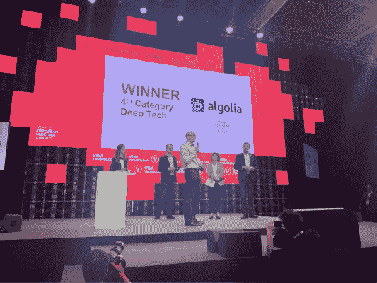
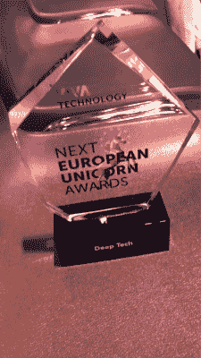
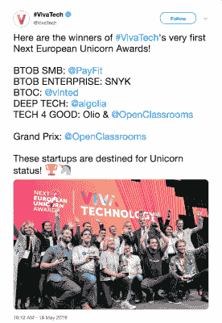

# 在 VivaTech 2019 \n 上庆祝整个欧洲的创新

> 原文：<https://www.algolia.com/blog/algolia/celebrating-innovation-across-europe-at-vivatech-2019/>

住在巴黎时，风投公司经常问我欧洲的投资环境有多吸引人，尤其是巴黎。

2012 年 Algolia 成立时，美国风投对巴黎的印象相当负面。我听到了关于法国工作文化的所有典型的定型观念和误解——从每周 35 小时的工作到夏天的长假期。虽然这种刻板印象与历史有一定的相关性，但我不得不多次解释，法国人其实工作很努力！

时间快进到 2019 年，欧洲和巴黎的生态系统已经发生了巨大变化，变得既有活力，又对投资者和公司都具有吸引力。近年来，许多总部位于巴黎的科技公司，包括 Criteo、Deezer 和 Dailymotion，已经成长为全球舞台上的重要参与者。Algolia 目前为全球 6，500 家公司所使用，随着我们最近向 APAC 和日本的扩张[，我们在每个主要地区都设有办事处。](https://www.algolia.com/blog/announcing-expansion-japan/)

相比 2012 年，现在我从风投和美国初创公司那里听到的关于如何在巴黎开设办事处的问题越来越多，而在欧洲其他城市中这种情况更甚。仅在过去一年，巴黎就有超过 35 亿美元的风投投资和超过 300 笔与总部位于巴黎的科技公司的交易，巴黎是最活跃、最有吸引力的科技生态系统之一。

最近，我参加了在本月早些时候举行的为期三天的“T4”2019 VivaTech 大会，与最有前途的初创企业和明日的颠覆者共聚一堂，探讨全球范围内的变革思路，就清楚地表明了这一点。正如其口号所言，VivaTech 是“全世界初创企业和领导者欢庆创新的聚会”。

自从 2016 年 Viva Technology 的第一次活动以来，我一直在关注它，并且对这一活动在科技界的重要性印象深刻。VivaTech 2019 的数字说明了一切，超过 120，000 人参加了，其中包括超过 13，000 家最具创新性的初创企业。我还对前来巴黎参加 VivaTech 2019 的世界各地领导人和 3300 名投资者的国际形象着迷。

作为活动的一部分，VivaTech 主办了首届[下一届欧洲独角兽奖](https://twitter.com/VivaTech/status/1129072077208772611)。Algolia 很荣幸成为深度技术类的获奖者，我也很荣幸代表我们全球的所有员工接受这个奖项。任何时候你得到行业的认可，这都是一个伟大的里程碑，提醒我们自 2012 年开始以来已经走了多远。

这些奖项让我们受宠若惊。它为我们提供了一个视角，让我们了解我们已经走了多远，我们是如何走到这一步的，我们为谁服务，以及我们还希望如何继续创新、发展并为客户的成功做出贡献。随着我们的快速增长(去年增长了 90%以上)，这给了我们一个认可、庆祝和感谢 300 多名员工和全球 6，500 名客户的机会，是他们让我们取得了今天的成就。谢谢大家！

建立和扩大一家科技公司是一项艰苦的工作，需要激情、创新和毅力。正是这样的时刻进一步证实了我们走在正确的道路上，并激发了我们加快努力的愿望。如果你受到创新的启发，有动力，有合作精神，并想加入我们，我们希望收到你的来信，我鼓励你看看我们的[职业页面](https://www.algolia.com/careers/)上的空缺职位。

祝贺其他获奖者，包括同样获得大奖的[pay fit](https://payfit.com/en)(B2B SMB)[Snyk](https://snyk.io/)(B2B 企业)[Vinted](https://www.vinted.fr/)(B2C)[Olio](https://olioex.com/)&[open classrooms](https://openclassrooms.com/en)(Tech 4 Good)。随着我们继续在世界上留下我们的印记，并成为一个现代和持久的创新中心，为所有欧洲初创企业的更多成功干杯。

