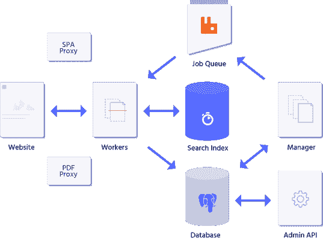
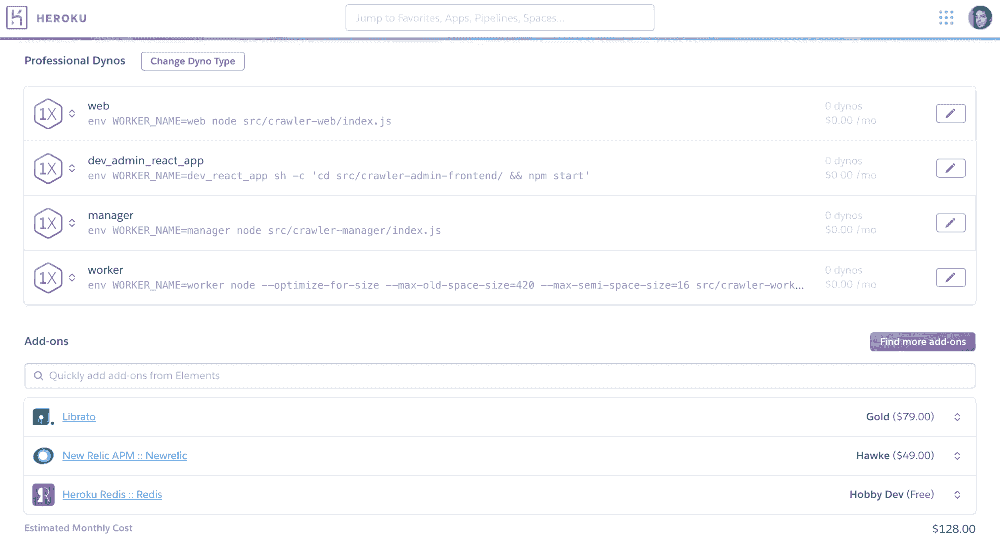
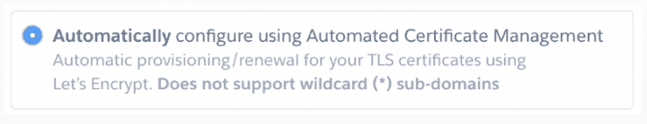

# 从 Heroku 到 Google Kubernetes 引擎的挑战性迁移

> 原文：<https://www.algolia.com/blog/engineering/challenging-migration-heroku-google-kubernetes-engine/>

对于一个仅由开发人员组成的团队来说，Heroku 的简单性使我们很容易将原型投入生产。然而，随着我们产品的成熟和客户期望的增长，我们需要对我们的基础设施有更强的健壮性和细粒度的控制。我们知道 Kubernetes 是我们的正确选择。然而，迁移并不是一项简单的任务。

这是背景故事。大约一年前，我们决定为 Algolia 开发一个网络爬虫原型。如你所知，Algolia 的用户通过使用 Algolia 的搜索 API，将他们的数据上传到一个可搜索的索引，从而使他们的内容可被搜索。一些潜在客户问我们是否可以通过抓取他们网站的内容，自动填充他们的搜索索引。对此，我们很快在 Node.js 中搭建了一个网络爬虫原型，并部署到 Heroku 上。

我们没有失望:添加数据库服务器或 RabbitMQ 之类的服务只需点击一下鼠标。我们所要做的就是`git push`部署新版本，然后我们的原型就投入生产了。

几个月后，我们的网络爬虫在 Algolia 的客户中流行起来，许多其他人也开始表达对它的需求。

然而，爬虫需要很多组件——一些在后台运行，另一些按需运行；此外，一些客户需要定制组件。随着产品变得越来越复杂，我们向基础设施同事寻求帮助。

这种复杂性的一个很好的例子是 IP 白名单。我们的一个客户希望我们从一个固定的 IP 地址开始爬行，这样他们就可以将该 IP 列入白名单进行高速爬行，而不会受到他们的负载平衡器的限制。只有两个工程师在开发爬虫，所以我们让其他同事用固定的 IP 地址建立一个 HTTP 代理。然而，随着客户数量的增长，越来越多的人开始提出同样的要求，我们的基础架构团队告诉我们，是时候让我们自己来解决这个问题了。

因此，我们决定迁移到一个云平台，该平台将对我们的基础设施提供更多的控制，并最终允许我们以编程方式设置和拆除代理。这就是我们如何决定是时候**从 Heroku 迁移到谷歌 Kubernetes 引擎(GKE)** 了。作为第一步，我们希望让我们的爬虫在 GKE 集群上工作，尽可能少地修改代码。只有这样，我们才能使它在生产中更加健壮和可维护。

这远不像我们最初想的那样简单。

在本文中，我们描述了我们的爬虫的架构，并解释了我们如何让它在 GKE 上运行，分享了我们在迁移时解决的三个挑战。然后，我们总结了迁移带来的一些经验教训和好处。

## 设置事物

在我们深入兔子洞之前，让我们对网络爬虫做一个概述——它的架构，底层服务，以及我们如何让它在本地和生产中工作。

爬虫本身是一组三个组件:

*   工人负责获取网页，从其 HTML 内容中提取信息，并将这些信息存储到 Algolia 索引中；
*   管理器负责将待爬行的 URL、与每个客户相关联的规则和约束(例如，速率限制)以及他们可能已经请求的任何配置更新分派给工作器；
*   web 服务器负责处理寻址到爬虫的 API 请求(例如，从 Algolia 仪表板)并服务于其自己的管理和监视仪表板。

这些组件位于几个服务之上:

*   RabbitMQ 队列，保存要爬网的 URL 列表；
*   一个 PostgreSQL 数据库，保存爬虫的状态，如客户配置、URL 列表和外部数据，以提高搜索记录的相关性；
*   一个 Redis 存储，保存我们仪表板的用户会话；
*   Tika 服务器，作为代理从 PDF 文件和其他类型的非 HTML 文档中提取内容；
*   和一个 Rendertron 服务器，它充当代理，从需要执行 JavaScript 代码以在 DOM 中呈现内容的单页面应用程序中提取内容。

为了在开发爬虫时本地运行所有这些组件和服务，我们设置了一个`docker-compose`文件，为它们指定 Docker 映像和参数。在 Heroku 上，我们为每个服务激活了附加组件，并编写了一个`Procfile`来指定应该执行什么命令来启动每个组件。然后，通过简单地执行`git push heroku master`，我们确保了组件的最新版本会自动上传并在我们的 [Heroku dynos](https://www.heroku.com/dynos) 中启动。轻而易举。

Kubernetes 是一个可以根据开发者定义的[服务](https://kubernetes.io/docs/concepts/services-networking/service/)和[部署](https://kubernetes.io/docs/concepts/workloads/controllers/deployment/)来分派 [pods](https://kubernetes.io/docs/concepts/workloads/pods/pod/) 的系统。我们的第一个目标是让我们的组件和服务以与我们现有的`docker-compose.yaml`文件相同的方式运行。我们只需要将文件转换成 Kubernetes 格式，并找到正确的命令来启动它们。

在花了几个小时试图用 kompose 做这件事之后，没有太大的成功，我们决定寻求帮助。一位同事以三种方式帮助了我们:在 GKE 上建立一个集群，为我们提供了用于部署和服务的 Kubernetes 定义文件的示例，并建议我们使用由 Google 管理的服务(即 PubSub 和 CloudSQL)，而不是将我们自己的 RabbitMQ 和 PostgreSQL docker 容器作为 pods 运行。这都是很好的建议，但是太快了。为了更好地理解 Kubernetes 的工作方式，并对它更有信心，我们决定一次解决一个问题:首先，通过镜像我们的`docker-compose`定义，让我们的服务在容器中运行，只有到那时，才考虑用谷歌管理的服务来取代它们。

因此，我们开始为每个服务编写 Kubernetes 定义文件。

## 实现——让我们先让 Kubernetes 运行起来

我们这样定义它们:

总结一下:

*   部署是对可以部署、在给定数量的实例上运行和停止的软件的描述；
*   服务是可以处理来自系统其他部分的请求的部署。

例如，要在 Kubernetes 上运行 RabbitMQ，我们需要:

*   通过指定运行 RabbitMQ 服务器的 Docker 映像来定义部署；
*   并定义一个公开两个端口的服务:一个用于 AMQP 查询，一个可选端口用于管理 UI。

除了需要被定义为服务的 web 服务器之外，我们以与部署相同的方式定义了我们的爬虫组件。因为这些组件不是 DockerHub 上的公共 Docker 映像，所以我们还必须编写一个 Docker 文件来从我们的源代码生成一个映像，将该映像上传到我们的 Google Registry，然后从我们的三个部署中引用它的标识符。为此，我们必须学习如何使用 gcloud 和 kubectl 命令行界面(CLI)工具。

在 YAML 文件中定义了我们的部署和服务之后，我们需要它们相互连接。例如，我们的三个爬虫组件期望环境变量包含它需要连接的所有服务的 URL。在 Heroku 中，我们有一个所有 dynos 共享的全局环境变量列表。我们可以从 Heroku 仪表板或通过他们的 CLI 编辑它们。也就是说，我们的大多数插件(例如托管 PostgreSQL 数据库)会自动设置环境变量来提供对其数据的直接访问，因此我们不需要做太多工作。

在 Kubernetes 世界中，环境变量是在部署级别设置的。这意味着每个部署文件都应该包含必要的环境变量的值。此外，考虑到 Kubernetes 可以随时动态终止和重启不同节点(例如，集群的物理机器)上的部署，它们的 IP 地址和端口可以改变。因此，我们不能为组件的环境变量提供硬编码的值。

幸运的是，我们了解到 Kubernetes 为所有服务动态生成集群范围的环境变量，格式为`<SERVICE-NAME>_SERVICE_HOST`和`<SERVICE-NAME>_SERVICE_PORT`。我们还发现，通过使用以下 YAML 语法，可以将环境变量的值注入到其他变量中:

像密码这样的机密环境变量需要不同的过程。为此，我们使用了 Kubernetes [秘密](https://kubernetes.io/docs/concepts/configuration/secret/)。

秘密是可以保存机密值的 Kubernetes 实体。建议将它们用于存储密码、证书和任何其他类型的私人信息:这些值永远不会以纯文本形式添加到 YAML 文件中，访问它们需要特殊权限。

要存储为环境变量，还必须在需要的部署的 YAML 文件中声明机密。然而，它们的结构与环境变量不同:我们需要挂载一个[卷](https://kubernetes.io/docs/concepts/storage/volumes/)来加载秘密，然后将它们的值作为环境变量导入。

我们后来了解到，使用 ConfigMaps 可以在几个部署之间共享环境变量。这些是 Kubernetes 实体，可以保存几个命名值，并作为环境变量导入到部署中。

使用 [ConfigMaps](https://cloud.google.com/kubernetes-engine/docs/concepts/configmap) 阻止了我们复制配置，但是我们找不到任何方法来包含秘密，或者任何其他实体，这将在配置映射中包装其他环境变量的值(例如，使用`$()`语法，如上所示)。因此，我们最终将 ConfigMaps 用于不变的配置值，将 Secrets 用于密码和密钥，将 inline 环境变量定义用于依赖于其他环境变量的环境变量。
此外，由于我们希望我们的 YAML 文件在不同的域名上提供两个不同的集群(例如，生产和暂存)，我们最终使用 [sed](https://www.gnu.org/software/sed/manual/sed.html) 将其中一些转换为模板并编写一个脚本，将它们转换为最终的 YAML 文件。我们非常确定有一个更标准的方法来实现这一点，但考虑到我们能够在这一迁移上花费的时间，这种方法对我们来说是一个很好的妥协。

那时，我们已经编写了 10 个 YAML 文件和 5 个 bash 脚本来定义我们的组件和服务。我们终于准备好供应我们的 GKE 集群，并看到他们运行。上传我们的 YAML 文件并让它们在我们的集群上运行的命令是:`kubectl apply -f .`。

为了举例说明我们编写的脚本，下面列出了在部署可能包含数据库迁移的更新后，我们为重启所有组件而运行的命令:

没那么快。一位同事警告我们，为了使我们的仪表板可以从互联网上访问，我们必须定义一个[入口](https://kubernetes.io/docs/concepts/services-networking/ingress/)资源来将我们的“web”服务连接到 Google 的 HTTP 负载平衡器。

他举了一个例子，结果是这样的:

几分钟后，我们的仪表盘终于启动了！

遗憾的是，在允许 HTTPS 访问该端点之前，我们无法使用单点登录系统登录。让我们深入研究一下。

## 有线 SSL 证书

在 Heroku 世界中，启用 HTTPS/SSL 是小菜一碟。你所要做的就是点击一个按钮。

Heroku 会使用 Let's Encrypt 自动生成一个免费的 SSL 证书，回复 ACME 挑战，并每 3 个月自动重复该过程以在我们不知情的情况下更新证书。刚刚成功了。

我们希望 Google 也能提供一个简单的方法来在我们的 GKE 集群上设置它。再想想！GKE 的文档明确指出，虽然可以通过 kubectl 或 Google Cloud Console 将 SSL 证书与 Google 的负载平衡器关联起来，但它们没有提供生成证书的方法。

我们使用 Google 来寻找解决方案，我们发现有几个项目承诺为您的 GKE 集群生成和更新一个 SSL 证书，并且会自动将它关联到我们的负载平衡器。不幸的是，它们都包含了免责声明，如“不要在生产中使用”或“我们目前不提供关于 API 稳定性的强有力的保证”。因此，我们决定，在 Google 提供一种可靠的方法来自动完成这项工作之前，我们将手动生成一个 Let's Encrypt 证书，然后将其附加到我们的负载平衡器上。唯一的问题是，我们需要记住每隔几个月做一次。

我们的爬虫在那时是完全功能性的。迁移前唯一剩下的问题是 PostgreSQL 数据库中的数据可能会丢失，因为它仍然从 Docker 容器中运行，没有持久卷，也没有任何备份例程。

***免责声明**:自从我们迁移以来，[其他解决方案](https://github.com/ahmetb/gke-letsencrypt)让这个过程变得更加容易。我们还没试过。*

## 插入托管数据库

数据是一件严肃的事情。我们的客户依赖于我们，因此他们的数据应该随时可用，无论规模如何都能响应，没有泄漏，并且在发生事故时能够快速恢复。这些都是信任托管数据库服务，而不是从 Kubernetes 可以随时终止的 Docker 容器中运行数据库的绝佳理由。

作为谷歌云生态系统的一部分，CloudSQL 产品最近将他们的托管 PostgreSQL 服务宣传为“生产就绪”，所以这对我们来说是显而易见的:我们应该将我们的爬虫插入到该服务中。我们的同事告诉我们，我们必须集成一个所谓的 [CloudSQL 代理](https://cloud.google.com/sql/docs/mysql/sql-proxy)来连接到 CloudSQL 管理的 PostgreSQL 服务器。

为此，我们遵循了谷歌提供的教程。除了用 CloudSQL 代理服务替换 PostgreSQL 服务之外，我们还必须:

*   创建数据库用户；
*   将用户密码安全地存储为 Kubernetes 秘密；
*   创建一个服务帐户，从我们的组件访问 CloudSQL 实例；
*   在所有需要连接到数据库的部署中，将秘密作为动态环境变量加载。

尽管我们得到了帮助，但要将它集成到我们的系统中并不容易。Google 提供的教程解释了如何以“sidecar”的方式运行代理，这意味着 CloudSQL 代理将与应用程序本身运行在同一个 Pod 上，从而可以轻松连接到该代理。

在我们的系统中，我们有三个独立的组件需要访问同一个数据库，我们觉得给每个组件附加一个独立的 CloudSQL 代理会有些过头，而且更难维护。因此，我们必须花时间更好地理解如何配置部署。除此之外，有时有必要从集群外部访问我们的生产数据库(例如，出于调试目的从我们的开发笔记本电脑访问)。由于所有数据库连接都必须通过 CloudSQL 代理，我们有两个选择:

*   通过在我们的生产集群中运行的 CloudSQL 代理进行连接；
*   或者设置一个本地 CloudSQL 代理，每个开发人员有一个专用的服务帐户。

出于安全原因，我们选择了第二种解决方案。在下载了与我们为每个人创建的服务帐户相关联的 JSON 密钥之后，下面是我们如何能够在我们的笔记本电脑上运行 CloudSQL 代理:

如果您决定遵循这条路线，**请确保您没有将与您的服务帐户相关联的 JSON 密钥保存在您的笔记本电脑上**。我们建议使用像 Vault 这样的系统来更安全地存储这些密钥，或者甚至在每次连接时生成一个新的短期密钥。

***免责声明**:现在可以直接从 GKE 访问 CloudSQL 数据库了。我们还没试过这个。*

## 结论

迁移需要时间，尽管我们采取了一些捷径，例如首先镜像我们系统的 docker 容器以达到 iso 功能阶段，然后用托管解决方案替换我们的数据库容器。最后，我们很高兴采取了循序渐进的方法。它让我们更好地了解 Kubernetes 如何工作，并掌握我们用来维护 GKE 集群的工具。它还防止我们不得不一次处理一个以上的问题，鉴于 GKE 的复杂性以及在这个生态系统中解决问题的无数方式，这可能成为沮丧和消极情绪的主要来源。

我们花了几周时间让我们的爬虫在 GKE 上可持续运行，并最终关闭了我们的 Heroku dynos 和附加组件。虽然迁移比我们预期的更加繁琐和不简单——尽管我们得到了拥有 Kubernetes 和谷歌云产品经验的同事的帮助——但最终，我们对它带来的东西感到满意。例如:

*   现在，我们对每个组件的硬件要求及其独立行为有了更好的理解。迁移到 Kubernetes 使它们在动态基础设施上更加健壮(例如，可以随时关闭和重新分配不同 IP 地址的节点)。
*   我们目前正在探索如何自动水平扩展我们“工作人员”部署的副本数量，并且比我们在 Heroku 上所能做到的更有效。
*   我们相信，我们能够根据客户的需求，在我们的集群上以编程方式设置静态 IP 代理服务器。

好消息是，Google Kubernetes 引擎最近的发展已经解决了我们的一些困难，使这个过程变得更加容易。

顺便说一下，我们将于 3 月 7 日在巴黎办公室与一些谷歌专家组织一次关于 Kubernetes 的活动。如果那时你在欧洲，[请随意注册](https://kubernetes-search-party.eventbrite.com/?aff=blog)！

*作者感谢 Rémy-Christophe Schermesser、Sarah Dayan、Peter Villani、Angélique Fey 和 Tiphaine Gillet 对本文的贡献。以及所有帮忙校对的同事。❤️*