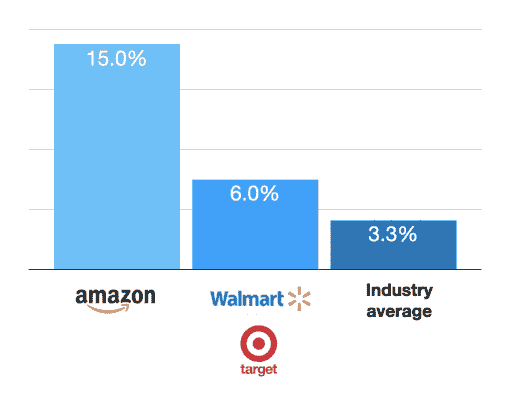

# 比较最佳电子商务搜索解决方案| Algolia

> 原文：<https://www.algolia.com/blog/ecommerce/comparing-the-best-ecommerce-search-solutions/>

电子商务 [网站搜索](https://www.algolia.com/blog/product/the-ultimate-guide-to-site-search/) 有助于提升访客体验，建立客户忠诚度，提高现场转化率。根据一项 [研究](https://www.gorillagroup.com/trending/power-optimizing-site-search/) ，使用搜索的访问者创造了所有电子商务网站收入的 30-60%左右。

尽管改进现场搜索有潜在的影响，但只有 15%的公司拥有专门用于优化现场搜索的资源。

## 亚马逊的利润和电子商务搜索的重要性

全行业的现场转换率徘徊在 3%左右，但 Amazon.com 的转换率是行业平均水平的五倍(对于 Prime 会员来说甚至更高)。在这个世界上最大的市场上，搜索对于寻找任何东西都是至关重要的，因此自然亚马逊 20 年来在搜索工程上投入了大量资金；今天，超过 1500 人在亚马逊网站搜索上工作。

无论你是市场、零售商还是直接与亚马逊竞争的品牌，都有一个好消息:你不需要雇佣成千上万的搜索工程师。今天现成的电子商务搜索引擎技术可以帮你一把，而不会让你倾家荡产。

接下来，我们将讨论两件事:网站搜索的关键要素和帮助你建立良好搜索体验的工具种类。

## 现代电子商务栈

2021 年，约 [50%的零售商](https://www.digitalcommerce360.com/2021/02/18/the-retailer-speaks-2021-performance-and-conversion-retailer-survey-results/) 表示，他们计划花更多时间开发自己的网站搜索能力。

更新的搜索解决方案可以取代你的电子商务软件自带的默认搜索引擎，或者允许你在一个无头商务架构中定制搜索。搜索引擎可以很容易地插入以下关键后端应用程序的高度相互依赖的技术栈:

*   **电子商务平台/ CMS**
*   **PIM**
*   **标签**标签:一个产品标签解决方案丰富了 medata，使搜索更加准确
*   **库存** :管理你的库存的 ERP 系统
*   **CRM** :在所有接触点和互动中存储客户信息的中心位置
*   **支付** :在线支付处理解决方案

为了提高效率，搜索需要在构成你的电子商务业务的不同系统中运行。它需要能够搜索您的产品目录，检查您的库存缺货项目，利用客户关系管理的访问者特征，并显示更新的价格信息。另外，它需要在几毫秒内完成所有这些事情。

## 电子商务搜索的挑战

成功的电子商务搜索需要多方面的方法。下面，我概述了零售商面临的一些关键问题，以及目前广泛可用的解决方案。

正如 [Baymard Research 指出的](https://baymard.com/blog/ecommerce-search-query-types) ，即使是世界上许多最大的零售商和品牌也没有解决一些更基本的搜索挑战，如拼写检查。成功搜索还需要许多其他基本和高级功能。

## 你的电子商务网站搜索需要的 8 种能力

虽然电子商务网站搜索解决方案拥有许多功能，但以下八项基本功能是你的网站绝对不能缺少的:

### 1。相关性

首先，解决方案必须向用户提供 [上下文相关的](https://blog.algolia.com/how-algolia-tackled-the-relevance-problem-of-search-engines/) 搜索结果，这样他们就可以轻松找到他们要搜索的内容。因此，电子商务搜索引擎必须能够分解复杂的语义和语法，处理同义词和 [拼写错误](https://www.algolia.com/doc/guides/managing-results/optimize-search-results/typo-tolerance/) ，并智能地对结果进行排序。它还必须使您能够根据业务需求、优先级和销售数量、利润等指标对结果进行排序。

更新的 [语义搜索](https://www.algolia.com/blog/product/semantic-search-how-it-works-who-its-for/) 解决方案由 [向量](https://www.algolia.com/blog/ai/vectors-vs-hashes/) (一种机器学习)提供更加强大的查询处理。通过结合向量搜索和关键字搜索算法(我们称之为混合搜索)，零售商可以获得开箱即用的令人难以置信的结果。

### 2。速度

谷歌和亚马逊都进行了研究，表明即使 100 毫秒的滞后也会对搜索收入产生负面影响。如果网站搜索没有及时地将相关结果返回给客户，那么这些结果就是无用的。今天的互联网用户习惯了快速的结果。速度慢的网站让用户沮丧，驱使他们去竞争对手的网站。电子商务搜索引擎应该优化计算复杂性并减少网络延迟。

为了获得最佳速度和可用性，最好:

*   将自动建议(也称为自动完成)添加到搜索栏，以便在用户键入查询时显示结果，并自动修复输入错误
*   提供带有产品图片的即时搜索
*   当用户选择不同的[过滤器和切面](https://www.sajari.com/blog/the-difference-between-filters-and-facets)时，动态刷新结果

### 3。可靠性和可扩展性

电子商务网站需要很高的正常运行时间，以确保不同时区的用户可以在一天中的任何时候购物。同样，最好的电子商务搜索解决方案必须高度可用，索引必须是最新的。系统必须能够 [扩展](https://stories.algolia.com/how-algolia-reduces-latency-for-21b-searches-per-month-3959dc926f0) 来处理不断增长的目录大小、用户数量和内容类型。

### 4。与主要电子商务平台的整合

为了避免大量的定制开发工作，网站搜索系统必须能够轻松地与电子商务平台集成，如 Shopify、Magneto、BigCommerce、Salesforce Commerce Cloud 和 WooCommerce。理想情况下，集成应该是一个简单的插件形式，这样营销人员或企业主可以轻松调整排名因素，并根据需要维护系统。

### 5。分析

大多数企业和电子商务网站运行谷歌分析进行网站优化，它们包含的关于你的网上商店的数据非常 *有价值* ，但并不总是 *有帮助* 。 网站搜索解决方案附带的搜索分析可以根据转化率和错失的机会，为您的目录确定具体的搜索词和改进查询。

电子商务运营商必须能够跟踪转换指标，如不返回结果、不导致销售或其他重要行为的关键字。一个站点搜索系统应该让非技术用户容易 [监控和分析站点搜索数据](https://blog.algolia.com/internal-site-search-analysis/) 。

### 6。个性化

除了显示用户查询的相关结果，网站搜索系统还应该提供与特定用户查询相关的结果。例如，如果一个服装品牌的客户只购买女装，那么可以合理地假设她将来会对女装感兴趣，并且可以优先搜索结果以首先显示这些商品。个性化可以增加客户对品牌的信任，并为交叉销售和追加销售创造机会。

### 7。实验和测试

体验上的小变化会对转化率产生很大影响。因此，一个站点搜索系统应该允许 [A/B 测试](https://www.algolia.com/doc/guides/ab-testing/what-is-ab-testing/) ，这样你就可以在向所有搜索者发布之前测试出变化和改进。系统还应该确保测试随机分配给用户，以避免引入任何其他可能给测试增加统计噪声的偏差。

### 8。内置销售工具

[商品销售](https://blog.algolia.com/personalized-merchandising-e-commerce/) 工具允许电子商务企业策划和推广特定的产品或产品类别。这可以通过在搜索结果中显示某些促销产品，以及通过用不同的 UI 组件强调促销来实现。网站搜索系统应该允许配置搜索规则，以方便地运行这些类型的促销活动。

## 对比顶级电子商务搜索部署选项

这八种能力构成了一个成功的网站搜索解决方案的基础。现在让我们来看看三个主要的供应商群体，以及他们能给电子商务网站带来的好处。

## 现成的解决方案

许多主要的第三方平台都提供现成的电子商务网站搜索。他们可以直接集成到电子商务平台，如 Shopify 和 Magento，只需最少的技术专业知识或配置，提供用户期望的一般功能，而无需大量的开发开销。提供商包括 Cludo、Site Search 360、AddSearch、HawkSearch 等。

### 现成解决方案的优点

**易于部署:** 开箱即用解决方案的最大优势是快速、易于设置，并且易于插入电子商务平台，只需最少的前期配置或定制。

**用户友好的仪表板和分析:** 这些工具通常提供有用的仪表板，用于分析常见的搜索查询，以帮助电子商务运营商调整他们的产品供应，以适应用户的口味。通过专门针对电子商务用例定制体验，这些仪表板立即变得相关，并且不需要定制配置。

### 现成解决方案的缺点

**有限的可定制性:** 即插即用的解决方案是通用的，不针对特定的业务案例。提供者对用例做了许多假设，这些假设限制了灵活性和可以内置到系统中的个性化数量，从而为客户提供更多上下文相关的内容。定制商店的搜索用户界面可能会很困难，这使得它很难适应您的品牌。

**有限的搜索功能:** 举例来说，如果你想索引 [其他类型的内容](https://blog.algolia.com/what-is-federated-search/)——比如博客帖子、视频和常见问题——那么你可能会遇到专门为索引产品和产品类别而构建的现成解决方案的问题。处理其他类型的内容超出了这些产品的范围。

搜索是一个黑匣子:现成的解决方案实际上是黑匣子，很难说明为什么搜索会以某种方式排序，或者它们是如何处理复杂的搜索查询的。对于需要能够定制和调整搜索结果以提供更准确结果的特定领域行业来说，这尤其是一个问题。

### 电子商务解决方案

一些现成的产品，如 Klevu、SearchSpring 和 Nextopia，宣称自己是专门针对电子商务的。

虽然这可能意味着搜索工具可以支持额外的 UX，用于按类别或推荐产品过滤搜索，但这并不总是意味着它最适合您的使用案例。

这些电子商务专用工具有时缺乏顶级电子商务网站推动转化所需的关键个性化功能和营销工具。这极大地限制了推广合作伙伴产品、推出新产品线或引导用户购买高利润商品的能力。任何大型电子商务公司都知道，这些是品牌长期发展的重要工具。

## 搜索即服务

[搜索即服务](https://blog.algolia.com/what-is-search-as-a-service/) 产品为在线商店提供快速部署，同时为不同的使用案例和定制提供更大的灵活性。这些产品处理索引和技术维护的所有复杂性，使运营商能够专注于微调他们的结果，并为客户提供丰富的相关搜索体验。[Algolia](https://www.algolia.com/)是搜索即服务解决方案的一个例子。

### 【搜索即服务解决方案的利弊】

**多渠道用户体验:** 搜索即服务产品通常会提供出色的多渠道用户体验。这不仅包括桌面和移动，还包括移动应用、语音搜索，甚至店内。随着搜索成为客户导航和探索体验的核心，这可能是非常有价值和成本效益的。

**可能的重要定制:** 这些产品中的大多数都允许对用户界面和搜索相关性进行重要定制。例如，自定义排名和同义词可以让电子商务运营商将搜索结果调整为更加特定的领域，并向用户提供上下文相关的结果。此外，不同的内容类型可以集成到搜索结果中，以允许用户浏览整个网站，而不仅仅是产品。

### 搜索即服务解决方案的弊端

**需要一些技术能力:** 实现搜索即服务确实需要一些技术能力来实现和定制。然而，实现它们通常不需要任何搜索经验。相反，开发人员只需要知道如何集成 SDK 或 API，并进行一些简单的编程来配置和嵌入前端组件。

**持续成本:** 由于这些是托管产品，它们需要持续的订阅费来支付基础设施和使用成本。这项费用还包括持续创新和发布新功能的成本。虽然搜索即服务工具的费用可能高于现成的工具，但电子商务网站可以获得规模效益:与自己构建和维护工具相比，搜索即服务通常可以以更低的拥有成本提供最先进的功能和增强功能。

## 开源解决方案

创建网站搜索最灵活的方式是使用开源工具，如 ElasticSearch 和 Solr。这些工具是非常可定制的，并且通常有强大的开发人员社区来帮助解决开发中的技术问题。

### 开源解决方案的利弊

**终极灵活性和控制:** 开源搜索解决方案的主要优势是可以灵活地编写任何用例。有了足够的开发人员知识，可以定制和调整工具，使搜索与最终用户非常相关。

**初始托管和基础设施:** 此外，可以优化托管以降低持续成本。例如，在测试和开发系统时，搜索集群可以运行在一台小型虚拟机上，这将比托管搜索解决方案的订阅费用更便宜。但是，请注意，以经济高效的方式扩展这些系统需要丰富的技术经验，因为它们是复杂的分布式系统，有许多会影响可用性的故障模式。

### 开源方案的弊端

**技术专长和诀窍:** 利用开源技术开发搜索系统的主要问题是，开发人员不仅需要从零开始构建系统，还需要大量的经验和时间来持续维护和操作系统。具有这种专业水平的开发团队是昂贵的，并且必须努力适当地扩展系统以确保高水平的可靠性和可用性。

**功能必须从零开始构建:** 开源解决方案中没有任何 UX 工具或其他解决方案的后端功能(如销售或个性化),因此这些功能也必须构建和维护。这不仅成本高昂，而且需要不断开发，以确保系统的每个组件都符合行业标准。

**正在进行的开发:** 开源解决方案缺乏好的方法去迭代和实验。每当一个业务用户想要尝试一个新的特性或者甚至做一个小的改变，他们将不得不与开发团队一起工作来确定项目的范围，并且可能需要等待特性被开发、测试和部署。这可能会严重拖累经济增长。

## 寻找你的电子商务网站搜索伙伴

丰富的搜索栏体验对于任何电子商务企业的成功都是至关重要的。Algolia 提供了所有必要的工具，以快速和成本效益实施成功的电子商务网站的网站搜索。看看 Algolia 如何通过一个 [个性化演示](https://www.algolia.com/demorequest/) 帮助您的电子商务网站成长。