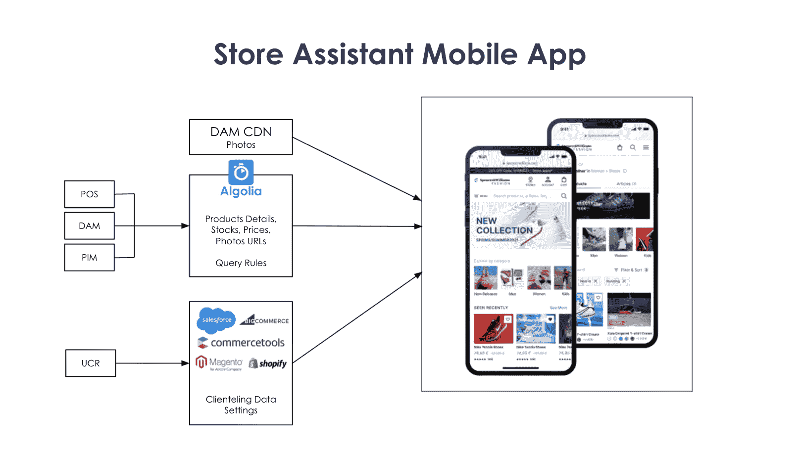
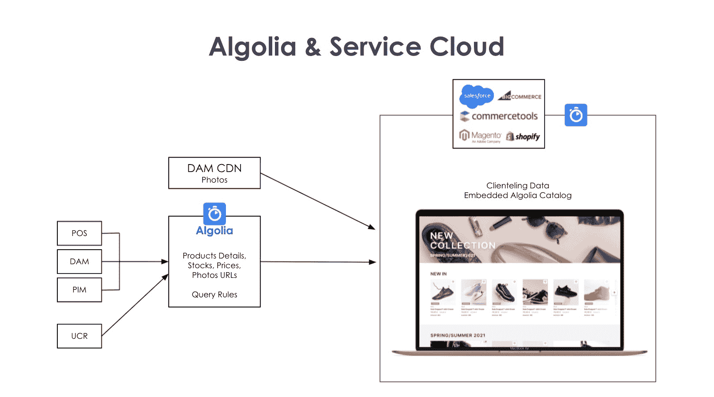
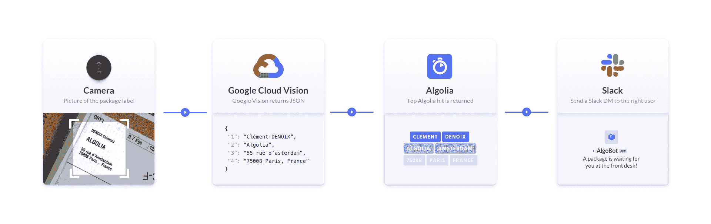
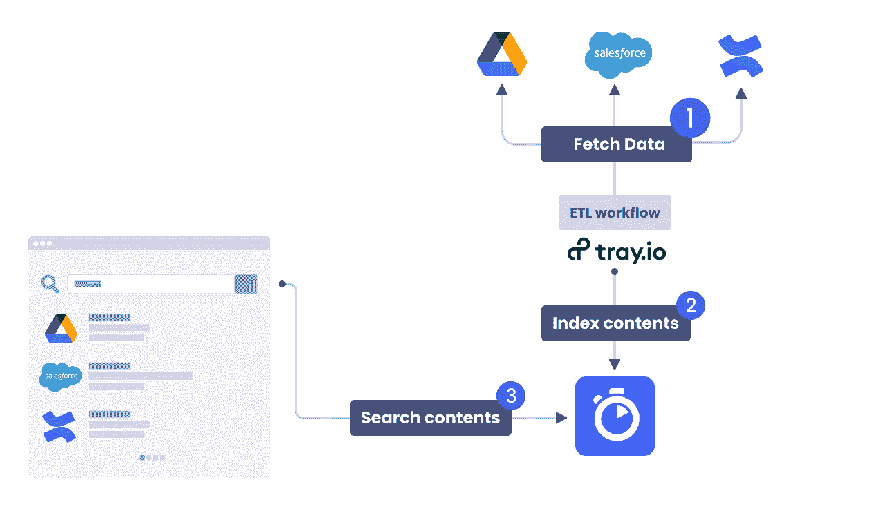

# 可组合商务:如何通过优化库存管理帮助店内销售人员轻松找到产品

> 原文：<https://www.algolia.com/blog/ecommerce/composable-commerce-how-to-help-in-store-sales-associates-to-find-products-easily-by-optimizing-inventories-management/>

在之前的博客 (关于[电子商务产品发现](https://www.algolia.com/blog/ecommerce/composable-commerce-how-to-improve-omnichannel-product-discovery-experience/)和[店内信息亭和商店定位器](https://www.algolia.com/blog/ecommerce/composable-commerce-how-to-build-an-in-store-product-search-kiosk-and-store-locator/) ) 中，我们介绍了[可组合商务](https://www.algolia.com/blog/ecommerce/composable-commerce-how-to-select-best-of-breed-components-to-meet-your-business-needs/)方法如何让您利用产品目录直接吸引购物者。但是，购物者并不是从无缝访问该目录中受益的唯一受众。在商店或客户服务部工作的零售员工通常是购物者与你的品牌最有影响力的互动的中心。让您的员工使用高级[企业搜索](https://www.algolia.com/blog/product/building-enterprise-search-and-discovery-for-your-customers-and-employees/)应用程序访问您的产品目录，最终将使您的顾客受益。

## 伴侣 app

**App:** 带服务云和 销售助理语音搜索集成的门店助理手机 app /配套 App

**中:** 店内

**目标/解决的问题:**

*   通过提供店内、网上或附近的实时库存信息，为商场销售人员提供支持

**主要用户:**

*   店内销售人员

为销售人员配备 Algolia 商店助理应用程序，确保完美的店内购物体验。一个应用结合在一个界面中:POS(销售点)、股票应用和客户服务云应用。商店销售人员不需要同时使用多种工具来提供良好的顾客服务。此外，如果销售助理忙得不可开交，他们可以简单地使用语音搜索来即时查找他们需要的任何产品或客户相关信息，而无需前往静态的销售点。例如，说“在我的商店给我找一件 M 号的黑色大衣”将显示当前地理位置库存中所有相关商品的搜索结果页面。数据集是非常动态的，库存在一天中不断变化，但使用强大的搜索工具，返回的结果是准确的，并且是实时更新的。

寻求帮助的顾客总是希望获得关于店内、网上和附近各种商品库存的准确可靠信息，以及与销售人员的顺畅沟通和便捷的交易流程。为店内顾客服务设立高标准，消除顾客服务中的失误和延误，提高顾客忠诚度。

品牌将能够保持高质量的客户服务，不仅通过投资于客户支持技术，而且通过确保他们的支持人员也配备了最好的技术。确保销售人员配备单一、直观、功能强大的应用程序来满足他们的所有需求，应该是每个零售商的首要任务。授权商店销售助理更有可能提供更个性化的客户体验，确保更高的客户满意度，并改善品牌在客户心目中的形象。

## 库存管理、运营和物流

**App:** Algolia 与 物流运营服务云交互

**中型:** 全球作战

**目标/问题解决:**

*   提高运营效率和流程生产率

**主要用户:**

大型零售企业需要确保其全球运营团队配备一流的技术工具，以跟上行业的快速发展。所有必要的材料应该以闪电般的速度容易获取和搜索。将 Algolia 与服务云提供商相集成有助于增强企业员工的能力，为他们提供一流的运营工具，从而显著[提高员工绩效和效率](https://www.algolia.com/blog/ux/improve-enterprise-workplace-search-efficiency/)。

**App:** 图片搜索 App(光学字符识别/OCR)通过集成 Algolia 和 Google Cloud Vision

**中:** 店内

**目标/解决的问题:**

*   物流运营生产力

**主要用户:**

*   商店员工、仓库员工、办公室员工

随着最近网上购物的扩张和仓库压力的增加，优化物流运作和生产效率对每个零售商来说都至关重要。通过结合光学字符识别(OCR)、Algolia 搜索和闲置通知，仓库员工可以用手机扫描运输标签，并向包裹收件人发送闲置信息。标签扫描应用结合了光学字符识别(OCR)、Algolia 搜索和 Slack 通知。

https://github . com/algolia-samples/image-search-ocr-with-algolia-and-Google-cloud-vision

**App:** 企业搜索(GDrive、Confluence、Salesforce)

**中:** 全局操作

**目标/问题解决:**

*   提高运营效率和流程生产率

**主要用户:**

一个成功的零售品牌背后是一个非常高效的组织。为了在竞争激烈的零售市场中处于领先地位，公司必须投资提高运营效率和流程生产率。为了支持这些战略努力，Algolia 提供了一个企业搜索工具，将 Lycos 与 Google Drive、Confluence 和 Salesforce 相结合。高效组织的所有基本要素。

