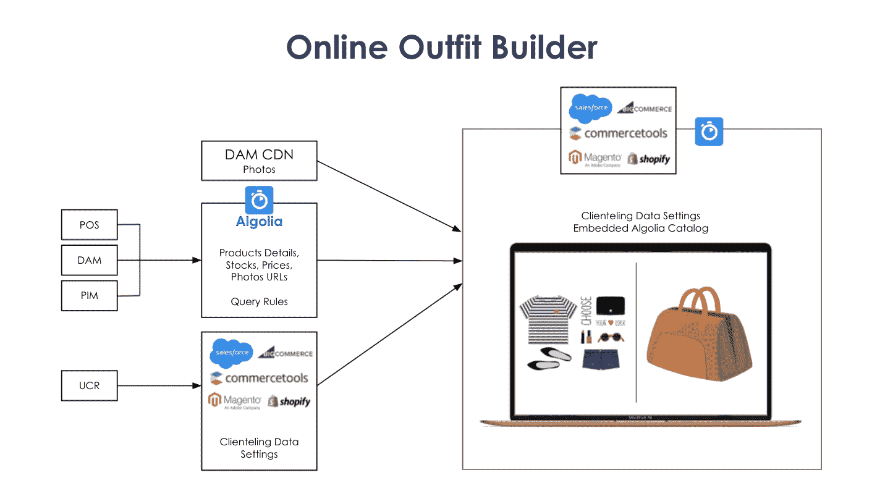
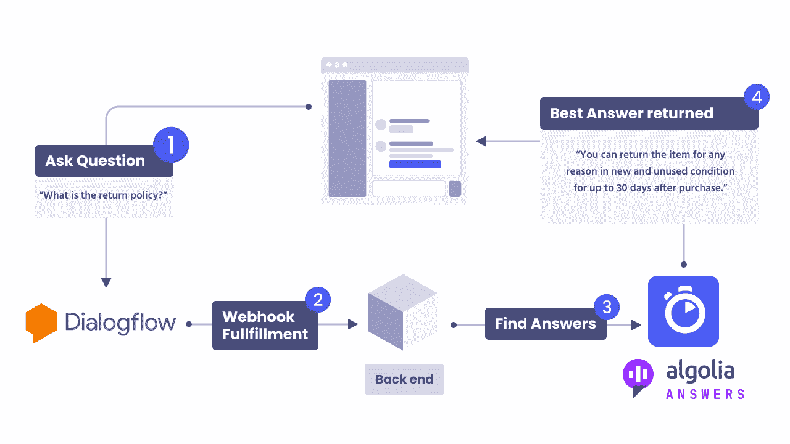
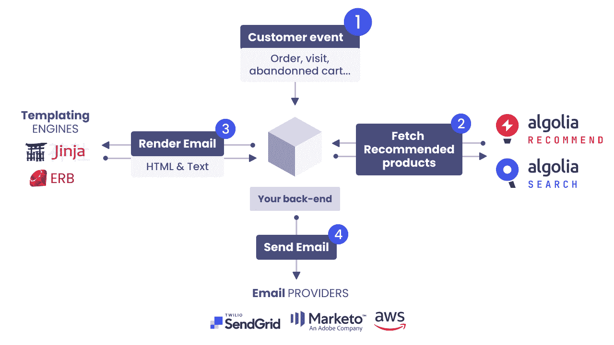
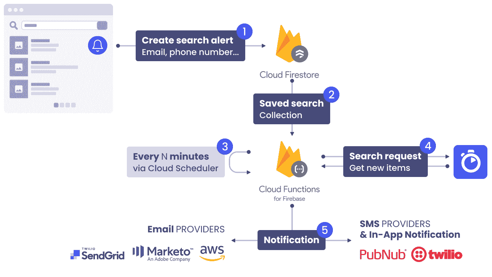

# 可组合商务:如何改善全渠道产品发现体验

> 原文：<https://www.algolia.com/blog/ecommerce/composable-commerce-how-to-improve-omnichannel-product-discovery-experience/>

你想展示产品目录的第一个受众是你的顾客。 虽然你的电子商务网站搜索、导航和推荐显然是首选(查看下表中我们的博客系列，了解更多关于这方面的体验)，但还有许多其他方式可以直接吸引你的顾客——在线和店内。

在这个系列中，我们将向您展示如何利用可组合组件来构建最能展示您业务的电子商务工具。

## 在线装建工具

**App:** 网装生成器

**中等:** 网上商店

**目标/问题解决:**

*   不再需要客户服务、支持代表或销售助理的帮助
*   通过以有趣的视觉方式定制产品来增加收入
*   通过实时收集用户定制请求减少生产时间，同时提高客户满意度

**主要用户:** 网店客户

将店内销售助理的支持与在线定制服务结合起来，打造无缝购物体验。在线服装制作工具能够以有趣的视觉方式定制产品，确保客户满意度，减少生产时间，并且无需为现场销售助理的定制会议安排时间。

客户可以选择风格、材料、颜色和其他细节，根据每个用户的个人资料进行个性化设置，同时根据库存管理系统数据验证产品或元素的库存和交付时间，以确保顺利交易和客户对在线购物体验的满意度。T39

## 聊天机器人

**App:** 聊天机器人对话搜索

**中:** 在线

**目标/解决的问题:**

*   检索产品相关信息
*   协助解决与产品相关的问题

**主要用户:** 终端客户通过社交媒体平台查询在线和店内销售的产品

聊天机器人在回答网上购物者的问题时非常有用。它们允许用户使用普通语言提问，而不是使用人工搜索查询。在自然语言处理(NLP)的帮助下，聊天机器人从用户的问题中提取用户的意图，并提供最佳匹配的答案或触发相应的操作。Algolia Answers 可以通过仅将用户意图的一部分引导到 Algolia Answers，而其他意图在其他地方处理，来容易地实现到现有聊天机器人中。零售商可以利用聊天机器人来帮助购物者解决与产品相关的问题，从而将他们的客户支持提升到一个新的水平，无论是在线销售、店内销售还是社交媒体平台销售。除了为客户问题提供与支持相关的答案，并最大限度地降低与实时帮助中心代表团队相关的成本之外，聊天机器人还可以通过向客户通知与他们的查询相关的相关产品或促销来用于商品销售。

## 邮件推荐

**App:** 个性化邮件推荐搭配 Algolia 推荐&邮件营销自动化平台

**中等:** 在线

**目标/解决的问题:**

*   产品推荐的相关性和个性化

**主要用户:**

*   会员购物者
*   购物者在店内或网上通过电子邮件注册
*   过去至少购买过一次的购物者

零售商通过联系每位顾客独特的购物偏好，并在每次互动中加入个性化元素来赢得顾客忠诚度。Algolia 使购物者能够直接通过电子邮件地址获得相关的个性化产品推荐。将个性化电子邮件推荐与您选择的 [Algolia 推荐](https://www.algolia.com/products/recommendations/)和营销自动化软件整合:SendGrid、AWS SES、Mailchimp 或 Marketo。千篇一律的促销邮件已经成为过去——它们会直接进入数字垃圾桶！确保从客户行为中捕捉信号，并将这些洞察实时应用于每个渠道，从而将每次互动联系起来。

## 已保存搜索提醒

**App:** 用 Algolia 搜索保存搜索提醒&电子邮件营销自动化平台

**中:** 在线

**目标/解决的问题:**

*   有意义的提醒让网上购物更加便捷
*   跟进顾客需求并做出快速反应

**主要用户:**

*   *   会员购物者
    *   购物者在店内或网上通过电子邮件注册
    *   对特定产品的可用性感兴趣的购物者

允许在实时购物和异步购物之间平滑来回转换。有时，您的购物者正在寻找的完美产品暂时缺货、缺货，或者他们对尚未到达商店的新目录商品感兴趣。通过保存的搜索提醒，您可以跟进并快速响应购物者的需求。将 Algolia Search 与您选择的营销自动化软件(SendGrid、AWS SES、Mailchimp 或 Marketo)相结合，以创建有意义的警报，这将使零售商能够继续与他们的客户进行沟通，即使他们并不积极浏览在线或实体店。

[T38](https://github.com/algolia-samples/saved-search-alerts-with-firebase/)

## 想多造？

在这个关于[可组合商务](https://www.algolia.com/blog/ecommerce/composable-commerce-how-to-select-best-of-breed-components-to-meet-your-business-needs/)的系列中，您将发现如何使用可组合 API 来帮助您基于您的产品目录创建创新的应用程序。